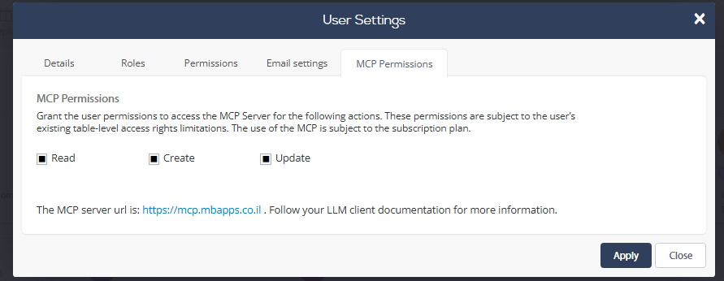
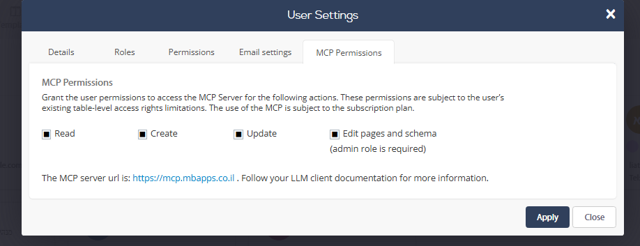

# בחירת דרך החיבור והרשאות הגישה

| | App ID וטוקן API | OAuth — כניסה עם משתמש |
|---|---|---|
| היקף הגישה | גישה מלאה לבסיס הנתונים ולכלי ה-API של המערכת המחוברת | גישה בהתאם להרשאות המשתמש והתפקיד שלו |
| הגדרה למשתמש | אין צורך בהפעלת MCP Permissions למשתמש עבור מסלול הטוקן | מנהל המערכת צריך לאפשר את סוגי הפעולות עבור המשתמש במסך MCP Permissions |
| כלים מתקדמים | אין צורך בשלב הפתיחה הנוסף שמתואר עבור OAuth | אינם פתוחים במלואם כברירת מחדל. יש לבקש מ-MyBusiness לפתוח אותם לאדמין |

## OAuth: שני שלבי הרשאה נפרדים

**1. הפעלת סוגי הפעולות למשתמש בממשק האדמין**

פתחו **הגדרות → הגדרות משתמש / User Settings → המשתמש הרצוי → MCP Permissions**. סמנו את סוגי הפעולות שאתם מאפשרים למשתמש:

- **Read** — קריאה.
- **Create** — יצירה.
- **Update** — עדכון.

לחצו **Apply** לשמירה. הרשאות אלו כפופות להרשאות המשתמש הקיימות ברמת הטבלאות; הן אינן מעניקות גישה מעבר להרשאותיו. השימוש ב-MCP כפוף גם למסלול המנוי.

**2. בקשת פתיחה של הכלים המתקדמים מ-MyBusiness**

ב-OAuth אין גישה מלאה לכל הכלים כברירת מחדל, גם לאחר התחברות מוצלחת. כדי לקבל את הכלים המתקדמים לאדמין יש לפנות ל-MyBusiness ולבקש פתיחה. לאחר הפתיחה, מנהל המערכת יכול לאפשר למשתמש המתאים גם **Edit pages and schema** — עריכת דפים וסכמה. אפשרות זו דורשת **תפקיד Admin**. סמנו אותה ולחצו **Apply**.

לכן התחברות מוצלחת ב-OAuth אינה אומרת שכל הכלים פתוחים. אם פעולות מתקדמות חסרות, בדקו את פתיחת היכולת מצד MyBusiness, את תפקיד Admin ואת הסימון במסך ההרשאות.

## App ID וטוקן API

מסלול זה מעניק **גישה מלאה למערכת המחוברת**, ואינו מוגבל לפי הרשאות משתמש OAuth. שלבי הרשאת המשתמש ופתיחת הכלים המתקדמים מצד MyBusiness המתוארים לעיל אינם נדרשים במסלול הטוקן. יש להתייחס לטוקן כסוד בעל הרשאות מלאות; ניתן לבטלו במסך API Keys במערכת.
