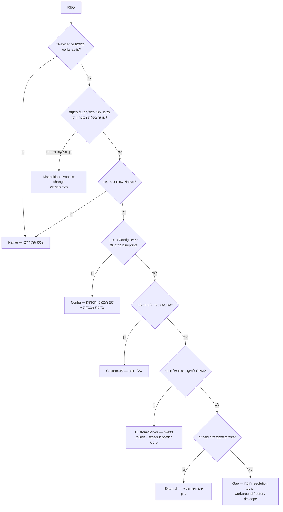

# Classification Playbook — decision tree, factors, worked examples

## 1. The decision tree (per requirement)

## 2. The limitation-check protocol (before finalizing any Config)

Open `../../myb-p-kb/references/80-capability-matrix/02-known-limitations.md` and test the sketch against the relevant family. The recurring deal-changers:
- trigger chains ≤3 levels; one-time-flag idempotency; scheduled `shcedulerHours` (0 rejected; positive=before)
- full-replace writers (Set-Form-Rules / Set-Table-Permissions / Edit-Table-View / Edit-Page-CSS-JS) — affects maintainability of trigger-dense designs
- aggregate `groupby` must be String; Get-Data 5/2000 caps; REST batch 50
- no native dedupe/merge; web2lead always inserts; web2table needs `phone` and won't update existing Accounts
- new users/roles/tables start with zero permissions; row-level permissions are UI-only
- imports fire triggers by default (suppression = Create-Many skipTriggers only)
- MyCollege automations / multi-state attendance are per-customer custom; TimeSheet UI claims need live verification

If the sketch trips a limitation — either adjust the sketch (often a blueprint exists) or move a rung down honestly.

## 3. Decision factors for stepping down the ladder (write one line citing ≥1)

1. **Build + maintain cost** over 3 years, not build alone (every custom artifact is a future support ticket).
2. **Usability/performance impact** of the workaround vs the custom build.
3. **Redundancy vs roadmap** — is the platform about to ship this? (expiring-ticket check; if "in QA" — Defer with revisit date beats building).
4. **Connected-process impact** — use the discovery process maps: does the change ripple into other flows?
5. **Supportability** — does the customization push the customer off the standard docs/guides?

## 4. Worked examples (the canonical eight)

| REQ (HE) | Class | Sketch | Why not cheaper |
|---|---|---|---|
| ליד מהאתר נכנס אוטומטית | Config | web2lead endpoint + field mapping | native intake exists; mapping is config |
| מייל ברוכים הבאים בעסקה | Config | trigger on Sales, SaleStatus=עסקה, action email + one-time flag | — |
| סטטוסים שונים לכל סוג פנייה | Config | cascading dropdowns (Define Parent) | form rules can't filter options — known gap |
| זמן תקן לטיפול לפי שעות עבודה | Config (blueprint L) | SLA blueprint: tables+triggers+widget+reports | native SLA engine unreliable — blueprint is the proven path |
| חישוב עמלות מדורג | Custom-Server | server fn on sale close; trigger-invoked | cross-record math beyond trigger actions |
| סנכרון ל-Power BI | External | webhook (http action) → Make/Zapier scenario | external system owns the far side |
| "שכל נציג יראה רק את שלו" | Config | hierarchy operators in views + CLP; row-level via UI advanced permissions | note UI-only step in plan |
| עריכת Word בתוך המערכת | Gap | workaround: quote-template PDF או עריכה חיצונית | no in-product editor; record resolution |

## 5. Effort & owner quick rules

- Effort from the anchors doc; between two classes take the higher; blueprints inherit their listed class (SLA=L, import=M–L, portal=L–XL phased).
- Custom-Server: never estimate alone — flag `dev-consult`, attach the REQ + sketch; integration-test time is additional.
- Process-change disposition: effort S (training/doc note) but verify the customer's agreement is recorded — an unagreed process change resurfaces as a "bug" at UAT.

## 6. Traceability discipline

Every workbook row keeps: REQ-ID (from discovery, never renumber), matrix/blueprint citation, and — after the spec stage — the TRS item IDs that implement it. A requirement with no citation, or a citation with no requirement, fails review. This is what makes the pipeline auditable end-to-end (goal → REQ → class → spec item → work package → AC → UAT).
