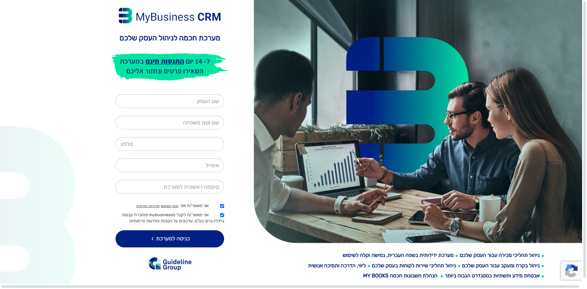
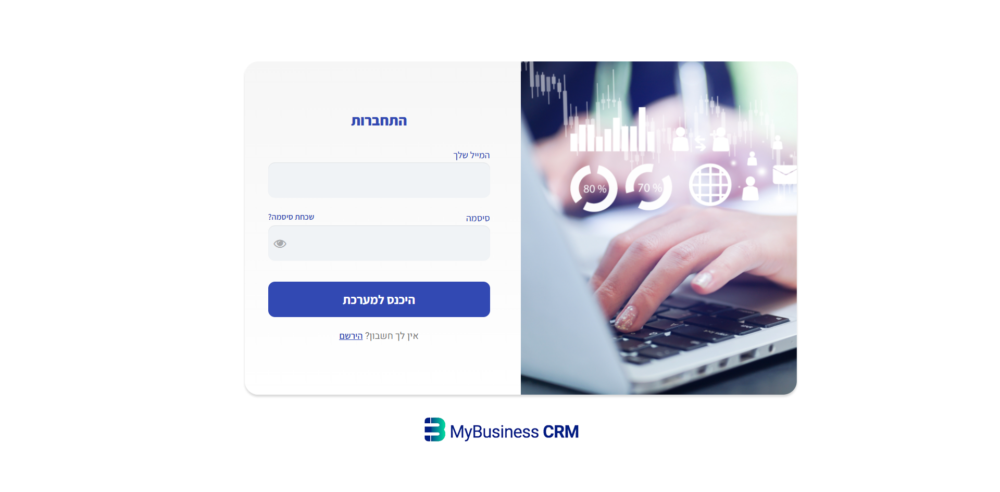
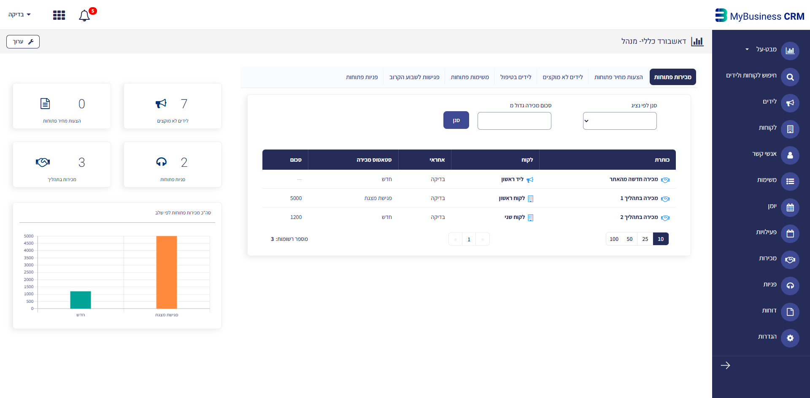
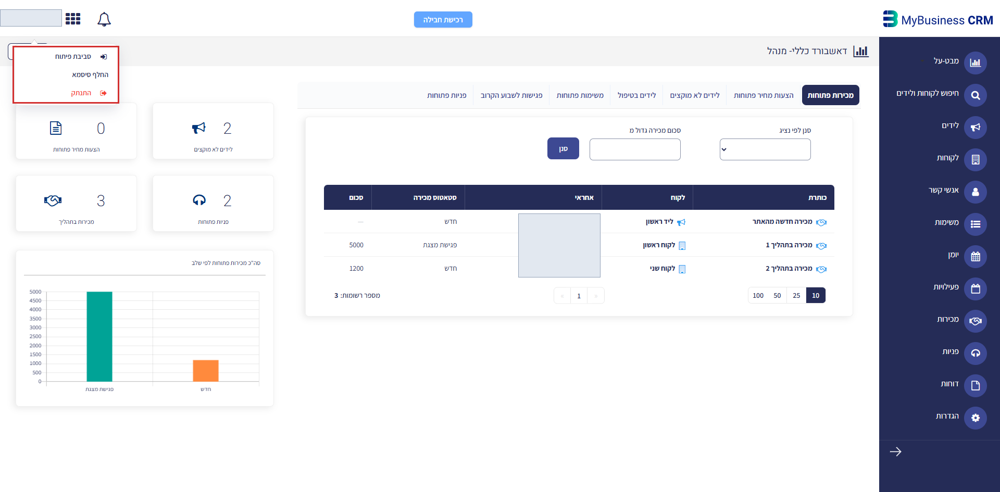
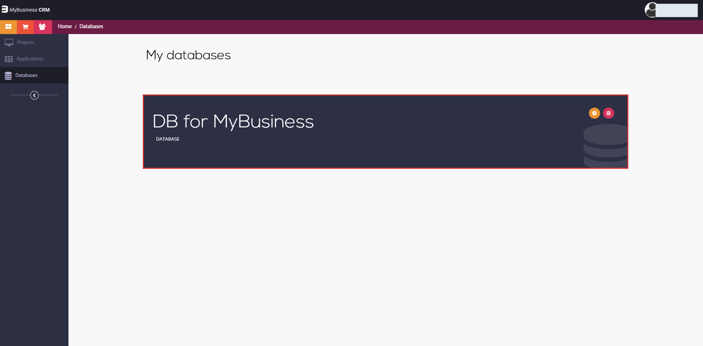

# 1. Open an account and log in for the first time

Read this when the user has no MyBusiness system yet, or has one but has never signed in.

## 1.1 Open a system (14-day trial)

1. Go to <https://sub.mybusiness.co.il/landingreg/>.
2. Fill in the form — business name, contact name, phone, email, and an initial password. The email becomes
   the first (administrator) user of the system, so use a mailbox that person can actually open.
3. Accept the terms and press **כניסה למערכת**. The system is provisioned automatically and you are taken
   into it.

What you get: a full CRM (leads, accounts, sales, cases, tasks) plus the modules your plan includes — billing
and quotes, campaigns, WhatsApp, courses, timesheets. See
`../../myb-p-kb/references/00-overview/01-product-overview.md` for what each module does.

## 1.2 The two environments — this trips up everyone once

| Environment | Address | What it is | Who uses it |
|---|---|---|---|
| **The CRM itself** (runtime) | `https://<your-subdomain>.mbapps.co.il/apps/<module>/<page>` | the working system: records, pages, day-to-day use | everyone |
| **The builder / admin** | <https://sub.mybusiness.co.il/login/> → development environment | database, fields, pages, triggers, security, **and the Settings screen holding the Application Id and API keys** | administrators and implementers |

Both are reached with the same user account; the builder additionally requires that the user be an
administrator. Full map: `../../myb-p-kb/references/00-overview/04-environments-and-access.md`.

## 1.3 First login

Returning later, or signing in as a user someone else created for you: open
<https://sub.mybusiness.co.il/login/> and enter your email and password. Password policy: at least 8
characters, one lowercase, one uppercase, one digit.

Login is case-sensitive on the email address. If a correct-looking address is rejected, try the exact casing
used when the user was created.

## 1.4 Reaching the development environment

From inside the CRM, click the **arrow next to your user name** (top-left corner) and choose
**סביבת פיתוח / Development environment**. It opens in a new tab.

The first screen lists your databases; opening one gives you the tabs `Users`, `Roles`, `Tables`, `Workflows`,
`Triggers`, `Templates`, `Security`, `Integrations`, `Settings`.

You need this environment for two things: the Application Id and the API key that connect your AI client
(guide 3), and granting a user MCP permissions if you use the sign-in mode (guide 2).

## 1.5 Next

- **Connecting your AI client → `03-connect-with-application-credentials.md`** (the main path)
- Installing outside Claude Code → `05-other-ai-clients.md`
- The per-user sign-in mode → `02-connect-with-user-login.md`
