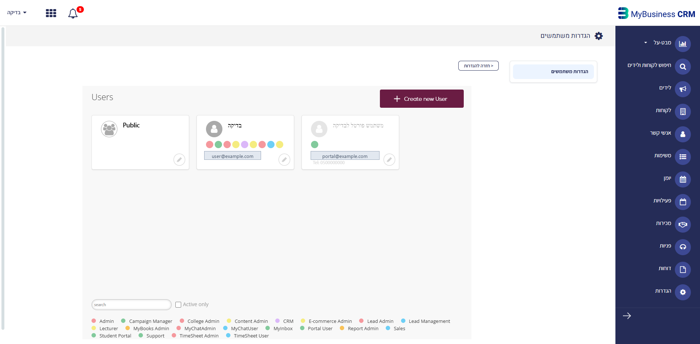
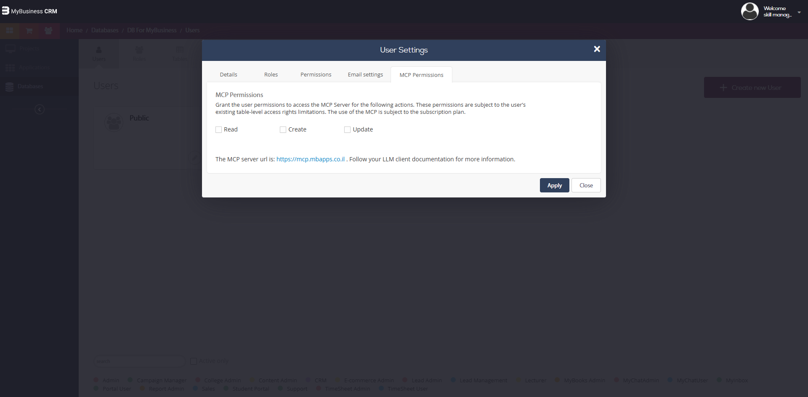
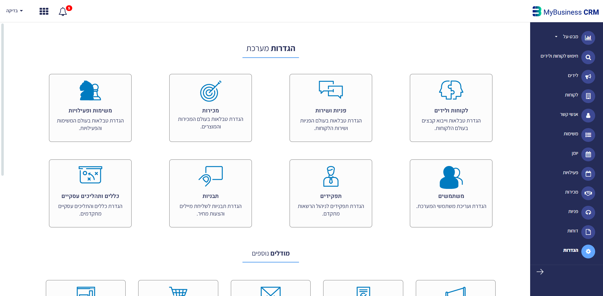
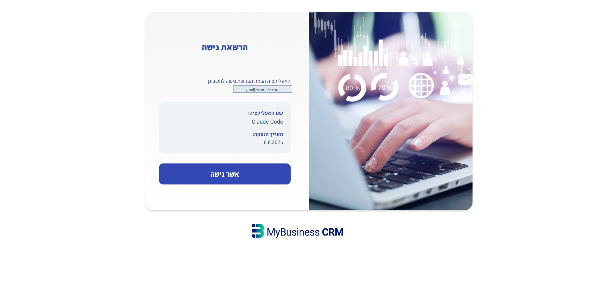

# 2. The per-user sign-in mode

The AI client sends you to the MyBusiness login page, you sign in, and the connection then acts **as you**:
your role, your tables, your records. Nothing is copied anywhere, no key exists to leak, and revoking access
is a matter of removing the user's MCP permission. It is the better security model of the two — when your
client can use it.

> ⚠️ **Availability.** This mode works in **browser-hosted** clients (the claude.ai connector, the ChatGPT
> connector). It does **not** work in desktop/CLI clients such as Claude Code, whose sign-in callback is a
> local address the platform currently rejects — see §2.3. There, use
> `03-connect-with-application-credentials.md`.

Two parts: an administrator grants the user MCP access once (2.1), then each user connects their own client (2.2).

## 2.1 Grant the user MCP permissions (administrator, once per user)

**By default no user has MCP access.** Until this is done, the sign-in succeeds and every tool call fails.

1. Open the builder environment and go to **Settings → user settings**.
2. Pick the user.
3. Open the **MCP Permissions** tab.
4. Enable what that user may do through AI: **Read** (query data and schema), **Create** (add records),
   **Update** (change records).
5. Click **apply**.

**MCP permissions never widen a user's access.** They sit on top of the role: a user who cannot see invoices in
the CRM cannot see them through AI either, whatever is ticked here — the screen says so itself. Grant Read
first; add Create/Update when the person actually needs the AI to write. MCP use also depends on the
subscription plan, so if the tab is present but access still fails for everyone, that is the thing to check.

The same tab is reachable from inside the CRM: **הגדרות → משתמשים** opens the identical user-settings screen.

## 2.2 Connect the client

In a browser-hosted client, add a custom connector (claude.ai: *Manage connectors → Add custom connector*;
ChatGPT: developer-mode connector), give it the address `https://mcp.mbapps.co.il/`, and press connect. You must
already be signed in to your CRM in the same browser — **that session is what binds the connection to your
database**, since the server address is identical for every customer.

You are then shown an approval screen naming the application asking for access. Approving it completes the
connection.

## 2.3 Availability note

Desktop and CLI clients complete this flow through a local callback address. That address is currently rejected
before it reaches the server, so in those clients the sign-in cannot finish yet — see the known limitation in
`../../myb-p-kb/references/40-integrations-api/02-mcp-tools-catalog.md` §0.4. Browser-hosted clients are
unaffected. Try it first; if the browser tab ends on a `403`, switch to
`03-connect-with-application-credentials.md` and keep the credentials connection until sign-in opens.

## 2.4 Prove it

Call `Get-Current-User`. In this mode it returns **the user you signed in as** — not `Master`. That single line
is your proof that you are connected in the permission-aware mode and to the right system. Then `Get-Schema`
and confirm the table names with the user.

## 2.5 Turning it off

- Revoke a person's AI access: clear their MCP Permissions and apply. Effective immediately for new calls.
- Disconnect one client: `/mcp` → the server → disconnect / log out.
