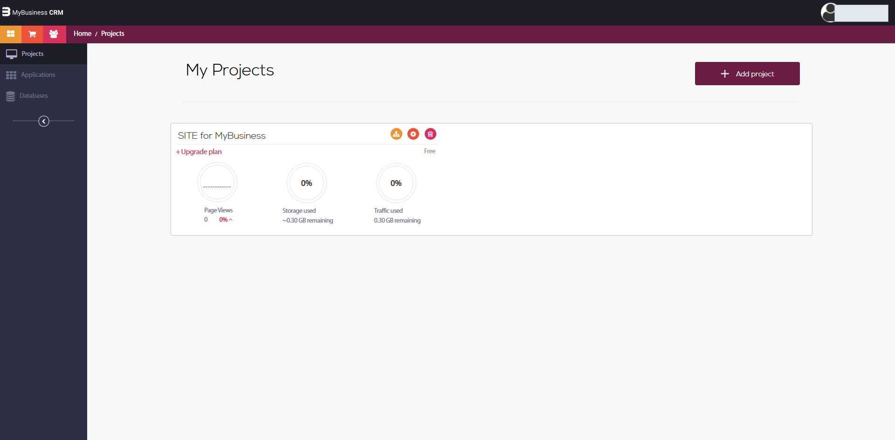
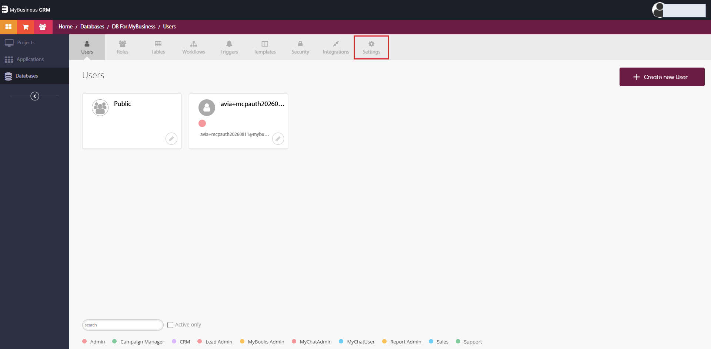
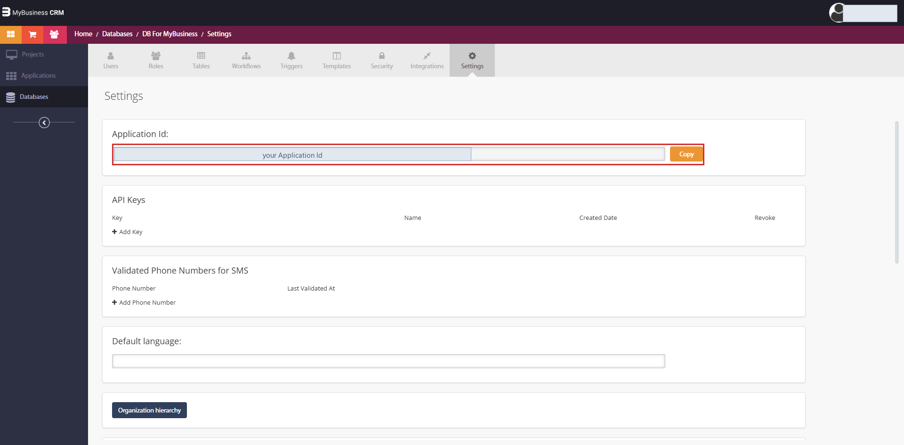
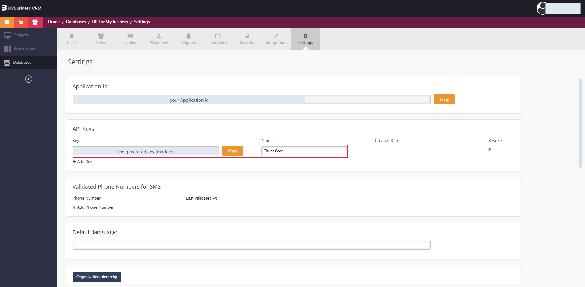
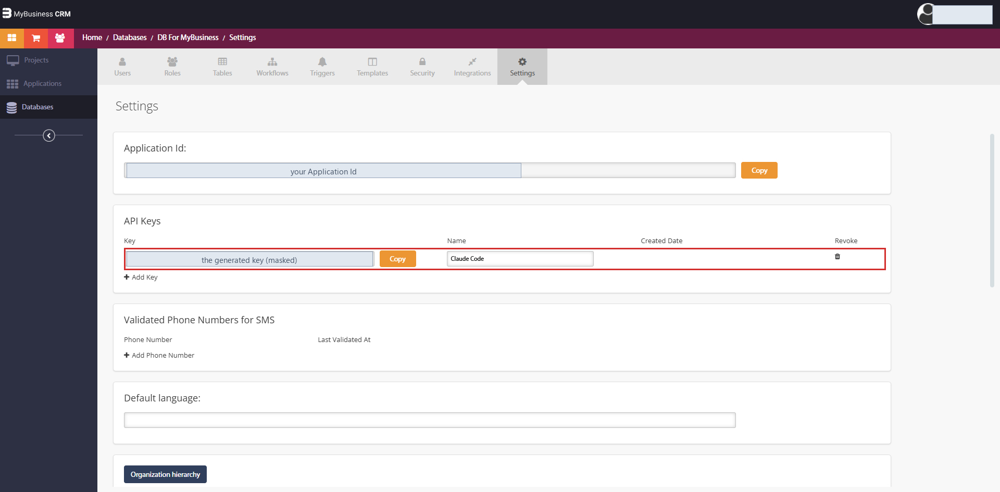
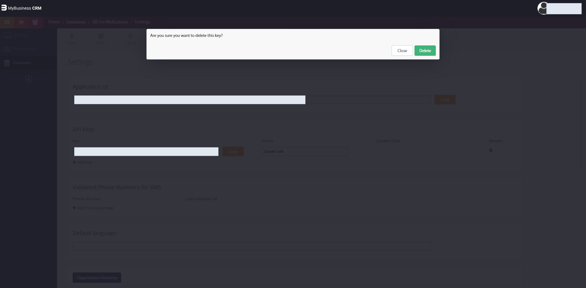

# 3. Connect with application credentials — Application Id + API key

Two values from one screen, both of which you generate yourself. No support ticket, no browser sign-in — which
makes this the connection to use for Claude Code and any other desktop/CLI client today.

> **What the key is.** It grants **full access to that database** — every table, every record, regardless of
> roles and permissions — and actions performed with it are recorded as `Master` rather than as a person.
> Treat it exactly like a password. Its advantage over a shared master credential is that it is **yours to
> revoke**: one click on that row withdraws it immediately, without touching anything else.

## 3.1 Open the development environment

From inside your CRM, click the **arrow next to your user name** (top-left corner) and choose
**סביבת פיתוח / Development environment**. It opens in a new tab.




## 3.2 Open your database

In the left sidebar choose **Databases**, then click your database — normally **DB for MyBusiness** — in the
middle of the page.


It opens on the `Users` tab, with the rest of the tabs across the top: `Roles`, `Tables`, `Workflows`,
`Triggers`, `Templates`, `Security`, `Integrations`, `Settings`.



## 3.3 Copy the Application Id

Open the **Settings** tab — the rightmost one. The first card is **Application Id**; press **Copy**.



The Application Id identifies the database. It is not a secret on its own — the key is the secret half.

## 3.4 Generate an API key

Below it is the **API Keys** table (`Key`, `Name`, `Created Date`, `Revoke`).

1. Press **+ Add Key** — a key appears immediately.
2. Press **Save** at the bottom of the Settings section. **This step is what persists the key**; without it the
   key is not stored.
3. Reload the screen: the row now shows a **Created Date**. Copy the key.





> ⚠️ **The `Name` field is not saved.** Type a name and it comes back empty after Save, while the key and the
> date persist. Nothing breaks, but don't rely on names to tell keys apart — write down which key went where.

To withdraw a key, press the bin icon in the **Revoke** column and confirm. Revocation is immediate: the next
request with that key is rejected.



## 3.5 Give the two values to the plugin

The plugin already carries the MCP server; it only needs these two values. In Claude Code:

```
/plugin configure mybusiness-implementor@mybusiness
```

Paste the **Application Id** and the **API key**, then:

```
/reload-plugins
```

MCP configuration is not picked up hot — without the reload (or a restart) the server keeps the old values.

From the command line, the same values can be passed at install time:

```
claude plugin install mybusiness-implementor@mybusiness \
  --config application_id=YOUR_APPLICATION_ID \
  --config api_key=YOUR_API_KEY
```

The key field is marked sensitive: it goes to the operating system's credential store, not to a settings file.

### If you prefer the connection to live with a project

Skip the plugin configuration, switch the plugin's server off in `/mcp`, and register your own:

```
claude mcp add --transport http MyBusiness https://mcp.mbapps.co.il/ \
  --header "X-Parse-Application-Id: YOUR_APPLICATION_ID" \
  --header "X-Parse-API-Key: YOUR_API_KEY"
```

Or, for a client that reads a config file, the whole contract is four lines:

```json
{
  "mcpServers": {
    "MyBusiness": {
      "type": "http",
      "url": "https://mcp.mbapps.co.il/",
      "headers": {
        "X-Parse-Application-Id": "YOUR_APPLICATION_ID",
        "X-Parse-API-Key": "YOUR_API_KEY"
      }
    }
  }
}
```

**With `--scope project` the values land in a `.mcp.json` inside the repository. Do not commit a key.**

## 3.6 Prove it

Call `Get-Current-User`: in this mode it answers `Master` (or `User name not found`) — the signature of a
credentials connection, and your reminder that no permission model is protecting the data. Then `Get-Schema`
and read a few table names back to the user to confirm you reached the intended database. Nothing else in this
mode will tell you that you did not.

## 3.7 Housekeeping

- One key per client or purpose; revoke on exit, on suspicion, and on a schedule.
- Never paste a key into chat, a ticket, an email, or a repository.
- Working on someone else's system? Have **them** generate the key and revoke it when the work is done.
- The header name matters: the MCP server accepts the key as **`X-Parse-API-Key`**. Sent as
  `X-Parse-Master-Key` it is treated as a wrong credential — see the troubleshooting guide.
