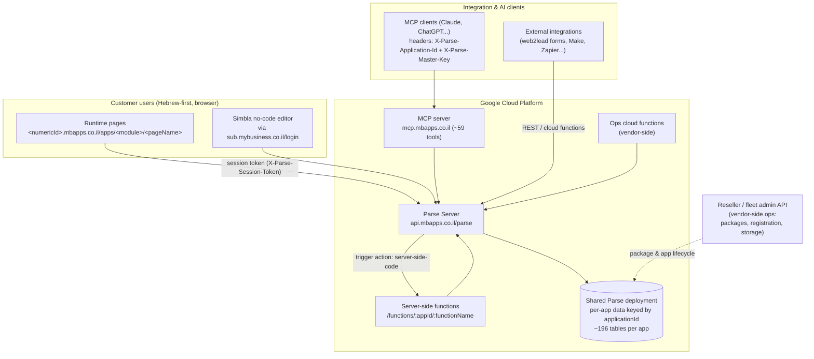
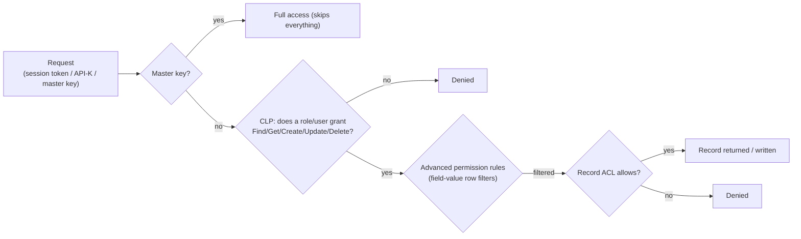

# Platform Architecture

> **Purpose:** Canonical description of the MyBusiness CRM platform stack — Simbla builder, Parse Server backend, MCP server, the per-customer application model, the runtime page model, and the auth/permission model — so a developer or AI agent who has never seen the product can reason about it.
> **Last updated:** 2026-06-10 · **Status:** draft

---

## 1. Stack at a glance

MyBusiness CRM is an Israeli, Hebrew-first CRM **product** built as a white-label on top of **Simbla**, a no-code website/database/CRM builder whose backend is **Parse Server**. MyBusiness runs its own Simbla/Parse deployment (separate from Simbla's own SaaS at `apps.simbla.com/parse`) on Google Cloud Platform. Inside the server-side codebase the Parse JS SDK is even aliased `Simbla` — the previous name of the platform.

| Layer | Component | Endpoint / location |
|---|---|---|
| Runtime UI (customer-facing) | Generated app pages, Hebrew RTL | `https://<numericId>.mbapps.co.il/apps/<module>/<pageName>` |
| Builder / login portal | Simbla no-code editor + CRM shell | `https://sub.mybusiness.co.il/login/` |
| Backend API | Parse Server (custom fork) | `https://api.mbapps.co.il/parse/` |
| Server-side functions | Node functions hosted in the Parse Server backend | `POST /functions/:appId/:functionName` |
| AI access | MCP server (~59 tools), HTTP transport | `https://mcp.mbapps.co.il/` |
| Ops cloud functions | Hosted Google Cloud Functions (vendor-side ops) | (vendor-side) |
| Data store | A single shared Parse deployment; per-app data keyed by `applicationId` | — |
| Storage engine | MongoDB ⚠️ UNVERIFIED (inferred: Parse Server's standard store; menu items and package/purchase records use MongoDB ObjectId-format `_id`) | — |
| Files | Parse file storage | `https://api.mbapps.co.il/parse/files/<APP_ID>/<FILE_NAME>` (MCP resource URI `file-storage:///api.mbapps.co.il/parse/files/APP_ID/FILE_NAME/TABLE_NAME/OBJECT_ID/PROPERTY_NAME`) |

Scale facts (per-app): ~196 tables, ~2,592 fields, ~766 pointer relationships; central table is לקוחות (Accounts), referenced by 46+ tables; most complex is מכירות (Sales) with 133 fields / 57 pointers (verified against a production schema).

## 2. Architecture diagram



## 3. The application model (multi-tenancy)

Every customer gets a dedicated **application** ("app") — the unit of tenancy, licensing, and credentials:

| Property | Description | Example (demo environment) |
|---|---|---|
| `applicationId` | ~40-char hex ID prefixed `aaaaaaa…`; sent as `X-Parse-Application-Id` on every API/MCP call | `<applicationId>` |
| Master key | Per-app secret; `X-Parse-Master-Key` bypasses all permissions (never stored in docs) | — |
| Numeric subdomain | Public runtime host `<numericId>.mbapps.co.il` | `<your-app>.mbapps.co.il` |
| Owner user email | The account-owner identity used for registration and lifecycle | `owner@example.com` |
| Packages | 1+ license purchases (Enterprise/Business/…) with seat counts and validity | see [04-environments-and-access.md](04-environments-and-access.md) |

- All apps share the same Parse deployment and API endpoint; isolation is by `applicationId` + per-app keys, not by separate servers. ⚠️ UNVERIFIED whether each app maps to a separate physical database inside that deployment.
- Apps are provisioned and cloned account-to-account through a vendor-side ops layer (not the Parse API).

### URL structure: `apps/<module>/<pageName>`

The runtime app is a tree of pages grouped by module path (Usage-Guide: "the important pages live under paths starting with `apps/mybusiness/`"):

| Module | URL path | Hebrew name | Approx. pages (demo) |
|---|---|---|---|
| CRM Core | `apps/mybusiness/` | ניהול לקוחות | ~70 |
| MyBooks | `apps/mybooks/` | הנהלת חשבונות | ~75 |
| MyCampaigns | `apps/mycampaigns/` | קמפיינים | ~18 |
| MyChat | `apps/mychat/` | צ'אט | ~20 |
| MyCollege | `apps/mycollege/` | מכללה | ~30 |
| TimeSheet | `apps/timesheet/` | שעון נוכחות | ~14 |
| MyInbox | `apps/myinbox/` | דואר נכנס | 2 |

(page counts from the product knowledge base; standalone landing pages/forms/surveys also exist outside `apps/`). Module-level documentation: [../10-modules/](../10-modules/).

## 4. Runtime page model

The **MCP `Usage-Guide` tool output is the canonical source** for this section (retrieved live 2026-06-10).

### 4.1 Page types

| Type | Behavior |
|---|---|
| Regular page | Self-contained HTML content |
| **masterPage** | Layout shell containing a `div` with class `_dynamicContentArea` — a placeholder for child-page content |
| Page **with `masterPageId`** | Its content is an object whose keys are the IDs of `_dynamicContentArea` elements in the master; at runtime the child content is merged into the master's `_dynamicContentArea` by key/ID |

Since the May 2026 redesign there are two main CRM masters — `CRMmaster` (page id suffix `a965`) and `MasterTicket` (`a957`) — and every regular page inherits one of them; a single `unified-master.css` deployed to both styles the whole product, and every page `<body>` carries a stable `page-slug-<name>` class for scoping.

Mobile-specific pages exist but "most of our users do not use mobile pages" (Usage-Guide).

### 4.2 List pages vs form pages

The plural/singular naming convention separates the two page roles (Usage-Guide):

- **Table-view (list) page** — shows all records of an entity, e.g. `apps/mybusiness/accounts`. Built with table-view elements (`simbla-table` / data-table); created via MCP `Create-Table-View-Page`.
- **Form page** — view/edit a single record, e.g. `apps/mybusiness/account`. Created via `Create-Form-Page`, then fields are added with `Edit-Page`. Creation order matters: create the form page first so the list page can link to it.

### 4.3 Form binding and grid

- The form's `data-simbla-class` attribute names the DB table the form reads/writes (Usage-Guide). UI label ↔ schema mapping: tables and fields are named in **English**; each field can carry a **Hebrew translation** shown in the UI, and a field must exist in the table schema before it can be added to a page.
- Inside a form page the layout grid is: rows = `div.rDivider`, columns = `div.sDivider`. **Each field must sit in its own column**; typical rows hold 2–3 columns. To add several fields on a new row: add one field to a new row first, then look up the generated row ID and add the rest (Usage-Guide).
- Related-records tables can be embedded on a form page via `Add-Table-View-to-Form-Page` (the MCP tool reference).

### 4.4 Conditions & dynamic values (shared platform conventions)

Used in table-view filters, form rules, triggers, and reports (Usage-Guide):

```json
// Condition object - format A
{"field": "SaleStatusId", "equesition": "equalTo", "value": "zrP1MSVBoq", "visibleVal": "הושלמה"}
// Condition object - format B (compact)
{"F": "fieldName", "C": "conditionType", "T": "valueType", "V": "value", "P": "pointerTarget"}
```

- Comparison types: `equalTo, greaterThan, lessThan, greaterThanOrEqualTo, lessThanOrEqualTo, notEqualTo, containedIn, notContainedIn, exists, notExist, startsWith, endsWith, contains`. (Note the canonical misspelling `equesition`.)
- Pointer values are `objectId`s; pointers to `_User` accept the special value `"currentUser"`.
- Date values accept relative keywords: `"year ago", "beginning of this year", "30 days period", "beginning of this month", "today", "end of this month", "end of next month", "end of this year", "year ahead"`, a `YYYY-MM-DD` string, or a signed day-offset number.
- Mustache-style dynamic text is supported in tool/trigger parameters: `Hi {{{Name}}}`, dot-notation through pointers `{{{AccountId.Name}}}`, and date formatting `{{{SaleDate.format(date,he-IL,Asia/Jerusalem)}}}` (types: `date`, `timehm`, `datetime`).

Full customization mechanics (triggers, form rules, table views): [../30-customization/](../30-customization/).

## 5. Identity, auth & permissions

The auth model is stock Parse Server with Simbla's role/permission UI on top.

### 5.1 Principals & credentials

| Credential | Header / flow | Scope | Source |
|---|---|---|---|
| User session token | `POST /parse/login` (username+password) → `sessionToken`; then `X-Parse-Session-Token` on each request | Whatever the user's roles/ACLs allow | Simbla the auth reference; the API reference |
| API key ("API-K") | Generated in database → Settings tab → "add key" | "Full privileges to anyone that holds the API-K" | Simbla the auth reference |
| Master key | `X-Parse-Master-Key` header (legacy fallback: HTTP Basic auth, appId as username) | **Bypasses all ACLs/CLPs** — server-to-server only | ParseDocs 17-usersecurity.md |
| MCP connection | HTTP MCP server with `X-Parse-Application-Id` + `X-Parse-Master-Key` headers | Master-level; `Get-Current-User` then returns the pseudo-user `{"objectId":"Master","username":"Master",...}` (observed live) | Playground `.mcp.json`; live Get-Current-User |

- Users live in the `_User` class (unique `username` and `email`, password encrypted; ParseDocs 05-users). Registered site users land in `_User` automatically (Simbla users.md). Portal customers are flagged `isPortalUser` (the support reference).
- Sessions live in `_Session`: one per user-installation pair, auto-created on login, deleted on logout; no Cloud Code triggers can be attached to the Session class (ParseDocs 06-sessions).
- Password policy: minimum 8 chars with at least 1 lowercase, 1 uppercase, 1 digit (the project reference).

### 5.2 Authorization layers (evaluated together)

1. **Roles (`_Role`)** — named groups of users *and other roles* (hierarchy: a role inherits the permissions of roles that contain it) (ParseDocs 07-roles). A typical app ships ~13–17 roles (Admin, Sales, Support, MyBooks Admin, MyChatAdmin, College Admin, …) plus customer-defined ones — the live playground shows 17 including custom roles like Managers ("מנהלי צוותים"), Field Agents ("נציגי שדה"), Finance (live `Get-Roles`). Referenced in permission JSON as `role:RoleName` (the MCP tool reference).
2. **Class-Level Permissions (CLP / הרשאות טבלה)** — per table × per role/user: `Find, Get, Create, Update, Delete` (Simbla rolesandpermissions.md) plus `addField` (MCP `Set-Table-Permissions`). **New users, roles — and tables created via MCP — start with NO permissions** (Simbla docs warns `Create-Table` leaves CLP empty, so fields appear blank in forms until `Set-Table-Permissions` is run).
3. **Advanced permissions (הרשאות מתקדמות)** — row-level rules conditioned on field values, e.g. "each salesperson sees only their own orders", "only certain roles see VIP customers", "users update only records they created" (Simbla how-to-create-advanced-permissions.md).
4. **Per-record ACL** — standard Parse `ACL` JSON on every object: `{"<userId>":{"read":true,"write":true},"*":{"read":true}}` (ParseDocs 17-usersecurity.md).



## 6. Client-side customization hooks (JS / CSS)

- **Per-page custom CSS and JS**: every page can carry custom CSS/JS, managed via the MCP tool `Edit-Page-CSS-JS` (the MCP tool reference) or the editor; pages also reference attached css/js **code files** in page settings.
- **Product-wide CSS**: since May 2026 a single `unified-master.css` (~7,500 lines, nested CSS) is attached to the two master pages and inherited everywhere. Page-scoped rules target the stable `body.page-slug-<name>` class (page-id hashes are NOT portable across customers). Deploys update the file in place via `Upload-Public-File` with `codeFile:true` + saved `_id` (`cacheControl:'no-cache'`) so the URL never changes (the design-system reference). RTL is the default — use direction-aware properties (`margin-inline-end`).
- **Form Rules (חוקי טופס)** — declarative client-side behavior per form page, no JS needed. Actions (Usage-Guide): `readonly`, `required`, `hidden`, `fixed-value`, `dynamic-value` (copy from another field, dot-notation through pointers e.g. `BrandId.Name`), `formula-value`, `show-message`, `value-from-url`. Checkbox fixed values are `"checkbox"`/`"uncheckbox"`; `_User` pointers accept `"currentUser"`. ⚠️ `Set-Form-Rules` REPLACES the entire rule set — use `Edit-Form-Rules` for single changes (the MCP tool reference).
- **Native no-JS conventions** worth knowing before writing custom JS: multi-select fields via the `array_<purpose>_Pointer_<TargetTable>` field-name pattern, and cascading parent/child dropdowns via "Define Parent" / `subclassDepend` (myb-p-multi-select-field and myb-p-parent-child-fields skills).

## 7. Server-side functions (one paragraph)

Server-side business logic lives in standalone Node functions hosted **inside the Parse Server backend** and invoked as `POST /functions/:appId/:functionName`; each function exports `exports.function = async (req, res)` and receives `req.body.applicationId` and `req.body.masterKey` injected by the server, initializing the Parse JS SDK (`const Simbla = require("parse/node")`) against `https://api.mbapps.co.il/parse` with master-key privileges. Functions are stored in the database and version-tracked in the platform's server-side codebase; they are fired from trigger actions of type `server-side-code`, from external webhooks (e.g. `web2lead`/`web2table` lead capture), or called directly over HTTP, and cover telephony CDR pulls, Hebrew invoicing documents, SLA management, email/IMAP sync, and per-customer custom logic. Full catalog, signatures and deployment workflow: [../40-integrations-api/04-cloud-functions.md](../40-integrations-api/04-cloud-functions.md).

## 8. Observability & system tables

| Table | Role | Source |
|---|---|---|
| `_Timeline` (ציר זמן) | Audit log of all table changes; query a record's history by `objectIdValue` + `objectClass` (74 fields) | Usage-Guide; the schema reference |
| `_syslogTriggers` | Trigger execution log — first stop when a trigger "didn't fire" | the support reference |
| `_syslogEvents` | Event/delivery log (email, WhatsApp errors) | the support reference |
| `_syslogSMS` | SMS delivery log | the support reference |
| `_Notification` (התראות) | In-app notifications | the schema reference |
| `_Workflow` / `_WorkflowLogs` | Visual workflow designer executions | the schema reference |
| `_DynamicQueries` (דוחות) | Stored report definitions | the support reference |

## Limitations & gotchas

- **Master-key-everywhere culture**: MCP and integrations run with the per-app master key, which bypasses all CLP/ACL — treat every credential file as production-secret. Keys must never be committed or written into docs.
- **MasterPage merging**: a child page's content is keyed to the master's `_dynamicContentArea` IDs — editing page HTML blindly breaks the merge; always read the page with `Get-Page-Content` first.
- **Grid discipline**: one field per `sDivider` column; adding multiple fields to a new row requires creating the row with one field, then re-reading the page to learn the new row ID (Usage-Guide).
- **`Set-Form-Rules` replaces ALL rules**; `Set-Terminology-Dictionary` and `Set-Menu-Items` behave similarly as full-replace operations — prefer the `Edit-*` variants.
- **Trigger chains max 3 levels deep**; `Get-Data` default limit 5 / max 2000; Aggregate `groupby` must be a String-type field; menu items need MongoDB-format IDs (the project reference).
- **New tables/users/roles start permissionless** — the #1 cause of "field shows blank" / "user sees nothing" tickets.
- **Single shared deployment**: apps run on one shared Parse deployment — platform-wide incidents affect all tenants at once. ⚠️ Physical isolation per app UNVERIFIED.
- **CSS cascade traps** for customizers: a universal modal rule repaints all `.modal-body` descendants navy/Assistant (breaks FontAwesome glyphs), inline `!important` can't be overridden by CSS, RTL flips margins — mind the cascade before styling.
- **Storage engine (MongoDB) and exact GCP topology are inferred**, not confirmed by an authoritative source. ⚠️ UNVERIFIED.
