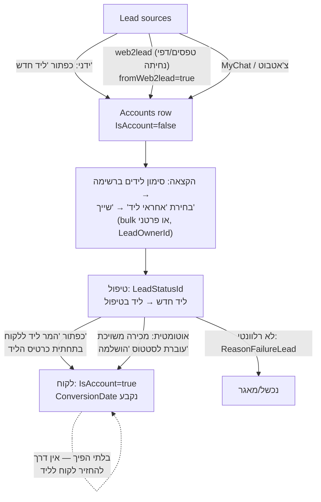
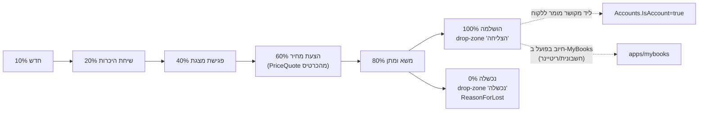
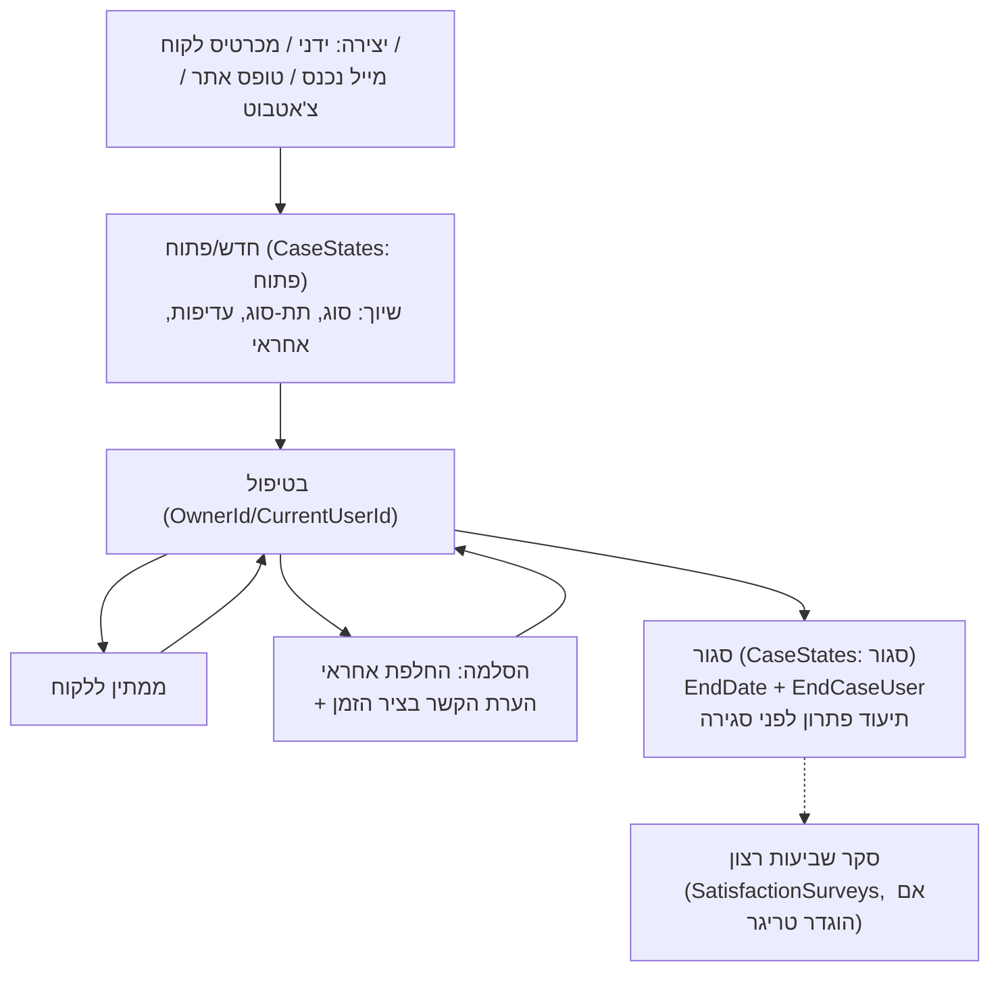
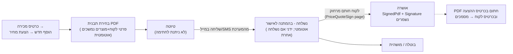

# CRM Core Module — apps/mybusiness

> **Purpose:** Deep reference for the core CRM app (לקוחות/לידים, אנשי קשר, מכירות, פניות, משימות, פעילויות, יומן) — entities, real page paths, navigation, core flows, settings, and cross-module touchpoints — so an implementer who has never seen the product can run discovery (אפיון) and write executable specs.
> **Last updated:** 2026-06-10 · **Status:** draft

## 1. What this module is

`apps/mybusiness/` is the core CRM application on the Simbla platform. All other modules (MyBooks, MyCampaigns, MyChat, MyCollege, TimeSheet) are separate apps that share the **same Parse database** — the central table is `Accounts`, referenced by 38+ tables (schema_summary.md "Referenced By" list).

- **Runtime URL pattern:** `https://<numericId>.mbapps.co.il/apps/mybusiness/<pageName>` (e.g., `/apps/mybusiness/Accounts`).
- **UI layout** (WP guide 5524): a fixed **top bar** (notifications bell, app switcher between installed modules, user menu with password change / dev-environment entry / logout) and a **right side menu** (RTL) navigating the modules. Every list module follows the same pattern: central **table**, **search form (שאילתא)** above it, and a **"new record" button** that opens a form sliding in from the left.
- **Record card pattern** (WP guide 5559): every card is split in two — **right side** = all fields grouped under section headers, **left side** = ציר הזמן (Timeline) showing the full history of linked records (sales, tasks, activities, notes, emails) with filter, pin (הצמד), inline navigation to linked cards, and an **"הוסף חדש"** button to create linked records / send email directly from the card.

### Terminology is customer-configurable

Entity display names are renamed per customer via the terminology dictionary (MCP `Get-Terminology-Dictionary` / `Set-Terminology-Dictionary`, `Replace-Terms`). On the Playground demo the dictionary maps מכירה→פרויקט, מכירות→פרויקטים, so its menu shows "פרויקטים" and "משתתפים". **DB table names never change** — only labels. This doc uses the product-default Hebrew terms.

| Default term | DB table | Playground rename (example) |
|---|---|---|
| לקוחות | Accounts | משתתפים |
| מכירות | Sales | פרויקטים |
| פניות / קריאות שירות | Cases | קריאות שירות |
| לידים | Accounts (`IsAccount=false`) | לידים |

## 2. Entity map

Core entities (entity → Hebrew UI name → DB table → purpose). Field counts from `tables_by_domain.json` (live demo DB, 196 tables).

| Entity | Hebrew | DB table | Fields/Pointers | Purpose |
|---|---|---|---|---|
| Account / Lead | לקוח / ליד | `Accounts` | 91 / 33 | Central customer & lead record (one table for both; `IsAccount` boolean separates) |
| Account relation | קשרי לקוחות | `AccountRelation` | 9 / 4 | Account↔account links (`AccountIdMain` / `AccountIdConnected`) |
| Contact | איש קשר | `Contacts` | 30 / 8 | Person linked to an account (`AccountId`) or standalone |
| Sale / Deal | מכירה | `Sales` | 133 / 57 | Opportunity tracked through pipeline; most complex table in the product |
| Sale line item | פריט/מוצר במכירה | `SaleRows` | 15 / 6 | Product rows under a sale (`SaleId`, `ProductId`, Quantity, PricePerUnit, Total) |
| Case / Ticket | פנייה / קריאת שירות | `Cases` | 34 / 16 | Service request; linked to a single account |
| Task | משימה | `Tasks` | 51 / 20 | Action item with due date + owner; **not** on the calendar |
| Activity | פעילות | `Activities` | 42 / 19 | Calendar event with exact start/end time, location, participants |
| Note | הערה | `Notes` | 17 / 10 | Internal note attachable to Account/Contact/Sale/Case/Task/Activity |
| File | קובץ | `Files` | 19 / 7 | File attachments (account, contact, email, conversation) |
| Case attachment | קובץ פנייה | `CaseFile` | 10 / 4 | Files attached to cases specifically |
| Price quote | הצעת מחיר | `PriceQuotes` | 17 / 6 | Quote generated from a sale, remote-signable (see §6.4) |
| Product | פריט/מוצר | `Products` | 42 / 9 | Catalog shared with MyBooks (Price, CatalogNumber, Inventory, Category) |
| Timeline entry | ציר זמן | `_Timeline` | 74 / 24 | System-generated history rows shown on every card |

**Lookup/status tables** (each is editable in הגדרות → ערכי מערכת; all have a `Name` field):

| Domain | Tables |
|---|---|
| Accounts/Leads | `AccountTypes`, `AccountStatuses` (+`StateId`→`AccountStatusesStates`), `LeadStatuses` (+`StateId`→`AccountStatusesStates`), `LeadSubStatuses`, `LeadSource`, `SourceLead`, `Brands`, `ReasonFailure` |
| Sales | `SaleStatuses` (Name + **Probability** number), `SaleType`, `PaymentStatus`, `SubscriberStatus`, `BillingPeriod` |
| Cases | `CaseTypes`, `CaseSubTypes` (child of CaseTypes via `TypeId` — cascading dropdown), `CaseStatuses` (+`StateId`→`CaseStates` פתוח/סגור), `CasePriorities` (Name + Color), `AppealSource`, `SLASettings`, `CasesSlaProcess` |
| Tasks | `TaskTypes`, `TaskStatuses`, `TaskPriorities`, `TaskAanswers` |
| Activities | `ActivityTypes`, `ActivityStatuses`, `ActivityAdditionalAccounts` (participants/attendance per activity) |
| Misc | `NoteTypes`, `ContactType`, `ProductCategories`, `PriceType`, `CityList`, `Area`, `Gender`, `YesOrNo`, … (44 lookup tables total) |

See [../20-data-model/](../20-data-model/) for the full schema reference.

## 3. Key entities in depth

### 3.1 לקוחות / לידים (Accounts) — one table, two lifecycles

A **lead is an Accounts row with `IsAccount=false`**; a customer has `IsAccount=true`. Key field groups (schema_summary.md):

| Group | Fields |
|---|---|
| Identity | `Name`, `F_name`, `L_name`, `Email`, `PhoneNumber`, `CallPhon`, `CompanyId` (ח.פ/ת.ז), `ExternalId`, `Website`, `Industry`, `NumberOfEmployees` |
| Address | `Address`, `City`→CityList, `CityText`, `State`, `Country`, `PostalCode`, `Area`→Area |
| Classification | `TypeId`→AccountTypes, `StatusId`→AccountStatuses, `BrandId`→Brands, `IsAccount` (Boolean) |
| Lead-specific | `LeadStatusId`→LeadStatuses, `LeadSubStatuses`, `LeadSourceId`→LeadSource, `SourceLead`→SourceLead, `LeadOwnerId`→_User, `ConversionDate`, `LeadConversionDate`, `ReasonFailureLead`→ReasonFailure, `fromWeb2lead` (Boolean — set by the web2lead capture endpoint) |
| Ownership | `OwnerId`→_User (account owner), `LeadOwnerId`→_User (lead owner) |
| Comms opt-out | `dontSendWhatsApp` (Boolean) |
| Portal | `StudentPortal`→_User, `StudentPortalConnected` (customer-portal login user) |

Live demo default values (`Get-Data`):

- **LeadStatuses:** ליד חדש, ליד בטיפול, ליד כפול, ליד תקול, נכשל/מאגר — each mapped via `StateId` to a shared `AccountStatusesStates` state.
- **AccountStatuses:** ליד, פעיל, לקוח, נכשל/מאגר (defaults; the playground added custom ones: מאושר, ממתין לחתימה, בתהליך בדיקה, ארכיון, מושעה). Note: live rows carry `AccountTypeId` + `array_types_Pointer_AccountTypes` — the native **parent/child mechanism** that filters which statuses are offered per account type (multi-select array-of-pointers naming convention `array_<x>_Pointer_<Table>`; see [../30-customization/](../30-customization/)).

**Duplicate-check practice** (skill file): before creating, query Accounts by `Email`/`PhoneNumber`/`CompanyId`.

### 3.2 אנשי קשר (Contacts)

Persons under a business account or standalone (WP 5567). Created from the Contacts page ("איש קשר חדש") or from the bottom of an account card (auto-linked via `AccountId`); both views stay in sync. Fields: `FirstName`, `LastName`, `Name`, `Email`, `PhoneNumber`, `CellPhone`, `Position`, `ContactType`→ContactType, `AccountId`→Accounts, `OwnerId`, `Internal` (Boolean), `StartWorkDate`/`EndWorkDate`, `File`. Contacts are referenced by Sales, Cases, Tasks, Activities, Notes, SMS, Emails, Conversations (`ContactId`).

### 3.3 מכירות (Sales) + pipeline

Core commercial fields: `Name`, `Total`, `TotalBeforeDiscount`, `Discount`/`DiscountValue`/`DiscountType`, `Probability`, `ClosingDate`, `NextStepDate` (תאריך התקשרות הבאה), `AccountId`, `ContactId`, `OwnerId`, `SaleStatusId`→SaleStatuses, `SaleType`→SaleType, `ReasonForLost` (free text) / `ReasonFailure` (pointer).

**Default pipeline stages** (live `Get-Data` on SaleStatuses, ordered by probability):

| Stage (Name) | Probability % | Meaning |
|---|---|---|
| חדש | 10 | Newly created deal |
| שיחת היכרות | 20 | Intro call done |
| פגישת מצגת | 40 | Presentation meeting |
| הצעת מחיר | 60 | Quote sent |
| משא ומתן | 80 | Negotiation |
| הושלמה | 100 | Won (closes the deal; **triggers lead→customer conversion**, WP 5563) |
| נכשלה | 0 | Lost |

**Pipeline (kanban) UX** (WP 5240, guide_managing_sales): default view; one column per *active* stage, each card shows deal name, amount, linked account, next-contact date. Card edge color: **green** = next contact in future, **orange** = today, **red** = overdue. Column header shows total amount in stage + expected revenue (sum × stage probability). Drag a card between columns to change stage; drag to the **הצליחה / נכשלה** drop zones at the bottom of the screen to close. Table view (כפתור "טבלה") offers query/filter by stage, owner, account, dates, amounts. To release a deal from הצליחה/נכשלה — change the status inside the card.

**Per-stage audit timestamps:** the Sales table carries paired fields written when a deal enters a stage: `IntroductoryCallStatusUpdate(+Name)`, `StatusUpdatePresentation(+Name)`, `QuotationStatusUpdate(+Name)`, `NegotiationStatusUpdate(+Name)`, `StatusUpdateCompleted(+Name)`, `FailedUpdateStatus(+Name)`, `IncorrectStatusUpdate(+Name)` — Date + pointer to the _User who moved it. ⚠️ UNVERIFIED whether populated by built-in platform logic or by per-customer triggers (the demo pattern matches the `myb-p-timestamp-field` trigger recipe).

**Line items** (WP 5240): table of פריטים/מוצרים at the bottom of the sale card (`SaleRows`). Picking a product pulls it from the `Products` catalog (managed in הגדרות → ערכי מערכת → פריטים/מוצרים). When a sale has rows, `Total` is **auto-computed from rows and not directly editable**; with no rows the amount is free-entry.

The Sales table also carries many vertical-specific custom fields on the demo (delivery, installers, subscription, course pointers) — evidence that implementers extend Sales heavily per customer; treat anything beyond the core groups above as customer-specific.

### 3.4 פניות (Cases)

Each case belongs to **one account** (WP 5579). Fields: `Name` (subject), `Description`, `Comment`, `CaseNum`/`CaseNum_Auto` (AutoIncrement — never set manually), `AccountId`, `ContactId`, `SaleId`, `ProductId`, `TaskId`, `CaseTypeId`→CaseTypes, `SubTypeId`→CaseSubTypes (filtered by parent type), `StatusId`→CaseStatuses, `PriorityId`→CasePriorities (has display `Color`), `AppealSource` (phone/email/web…), `OwnerId`, `CurrentUserId`, `EndCaseUser`, `Date` (open), `EndDate` (close), `JiraNumber`, `Technician`.

Live defaults: **CaseStatuses** = פתוח, בטיפול, סגור; each maps via `StateId` to **CaseStates** = פתוח / סגור (the open/closed super-state used by SLA and dashboards). **CasePriorities** = גבוהה (#e25a41), בינוני (#ebdc6f), נמוך (#36c05e) — editable incl. color via Settings → עדיפות פניות quick-edit (WP 5579).

Case intake channels (guide_cases_service): manual (פנייה חדשה), from the account card (auto-linked), inbound email (requires email connection), web form (web2table/web2case), chatbot/WhatsApp (MyChat — page `CaseWhatsAppConversation` embeds the WhatsApp conversation in a case). SLA: `SLASettings` (CaseTypeId/CaseSubTypeId/CaseStatusId + `SLAHours`/`SLADays`) and `CasesSlaProcess` per-status tracking + pages `System-SLA-Settings`, `System-SLA-BusinessHours` — full mechanism in the `myb-p-sla-configuration` skill (see [../30-customization/](../30-customization/)).

### 3.5 משימות (Tasks) vs פעילויות (Activities)

The product draws a hard line (WP 5582):

- **משימה (Task)** — has a due date (`DueDate`/`Date`) and owner but **no exact time slot; does not appear in the calendar**. Example: "send a quote by Thursday". Status live defaults: פתוחה, בתהליך, בוצעה, בוטלה. Priority via `TaskPriorities`. Links: `AccountId`, `ContactId`, `SaleId`, `CaseId`, `ActivityId`, plus `WhatId`→Accounts. Reminders: `ReminderDateTime` + "הזכר לי" checkbox → popup notification with dismiss/snooze (נדנוד).
- **פעילות (Activity)** — calendar event with `StartTime`/`EndTime`, `Location`/`MeetingLocation`, participants (`Users`/`UserNames` arrays + `ActivityAdditionalAccounts` for external/account participants incl. `Presence` attendance), `TypeId`→ActivityTypes (live defaults: שיחת טלפון, פגישה, פגישת זום, שיחת ועידה), `StatusId`→ActivityStatuses, links to `AccountId`/`ContactId`/`SaleId`/`CaseId`/`TaskId`, plus `Summary`, `FollowupActions`, `ResponsibleFurtherOperations`.

**Calendar (יומן)** (WP 5582, guide_calendar_activities): daily/weekly/monthly views; view several users' calendars side-by-side ("+משתמש", one color per user); **double-click** an empty slot to create an activity (short card), single click an event → menu (open full card / short card / delete); drag event body to move, drag bottom edge to resize; **sync with Google Calendar or Office 365** (buttons under the calendar; two-way sync); **send meeting invite by email** to external participants from the activity card — requires the user's personal SMTP to be configured.

### 3.6 The 360° card (כרטיס לקוח)

Account card aggregates, via Timeline + related-record tables, everything pointing at the account: Contacts, Sales, Cases, Tasks, Activities, Notes, Emails, SMS, Files, PriceQuotes, Conversations (WhatsApp/chat), AccountRelation (related accounts), MyBooks accounting documents (מסמכים tab incl. "מסמכים מהצעות מחיר", WP 5570), `_Timeline` system history. Timeline actions (WP 5559): filter by record type (incl. show field-update history), pin important entries, jump to linked card, and "הוסף חדש" → new sale / task / note / activity / send email / price quote.

## 4. Page map — actual paths (live `Get-Site-Pages`)

URL = `https://<numericId>.mbapps.co.il/apps/mybusiness/<pageName>`. Type legend: **L**=list/table, **F**=form/card, **D**=dashboard, **S**=settings, **M**=master layout, **X**=function page.

### 4.1 Working pages

| Path | Type | Purpose |
|---|---|---|
| `apps/mybusiness/Accounts` | L | לקוחות list |
| `apps/mybusiness/Account` | F | Account card (360°) |
| `apps/mybusiness/Leads` | L | לידים list (Accounts where IsAccount=false) with bulk owner assignment |
| `apps/mybusiness/AccountsAndLeads` | L | "חיפוש לקוחות ולידים" — unified search |
| `apps/mybusiness/Contacts` / `Contact` | L / F | אנשי קשר |
| `apps/mybusiness/Pipeline` | L | Sales kanban (default sales view) |
| `apps/mybusiness/Sales` / `Sale` | L / F | Sales table view / sale card |
| `apps/mybusiness/SaleRows` | L | "מוצרים במכירות" — all line items across sales |
| `apps/mybusiness/Cases` / `Case` | L / F | פניות list / case card |
| `apps/mybusiness/CaseWhatsAppConversation` | F | Case card with embedded WhatsApp conversation |
| `apps/mybusiness/Tasks` / `Task` | L / F | משימות |
| `apps/mybusiness/Activities` / `Activity` | L / F | פעילויות |
| `apps/mybusiness/Calendar` | L | יומן (calendar views) |
| `apps/mybusiness/Note` | F | Note card |
| `apps/mybusiness/Timeline` | X | Timeline component page |
| `apps/mybusiness/PriceQuote` / `PriceQuoteSign` | F / X | Quote card / public remote-signature page |
| `apps/mybusiness/Email` / `SMS` | X | Compose/send email / SMS |
| `apps/mybusiness/Conversation` | F | Chat conversation view |
| `apps/mybusiness/Reports` / `Reports-counter` / `QueryPageTemplate` | L | Reports hub (_DynamicQueries), counters, query page template |
| `apps/mybusiness/SwitchBoard` | X | PBX/telephony integration screen |
| `apps/mybusiness/GoogleCalendar` | X | Google Calendar sync page |
| `apps/mybusiness/login`, `login_2fa`, `login_request_password_reset` | X | Auth pages |
| `apps/mybusiness/PortalLogin` / `PortalOrders` | X / L | Customer-portal login / orders (uses `PortalMaster`) |

### 4.2 Dashboards (all type D)

`DashboardSales` (מבט-על, the menu home), `DashboardLeads`, `DashboardSalesManager`, `DashboardSalesRep`, `DashboardCaseManager`, `DashboardCaseRep`, `DashboardGenManager`, `DashboardGenRep`, `Mobile-DashboardSales`. Sales dashboard content (guide_managing_sales): KPI counters (total revenue, open deals), sales-by-month chart, sales-by-user bars, sales-by-stage pie, open-tasks table.

### 4.3 Settings pages (type S) — see §7

### 4.4 Masters & mobile

Masters: `CRMmaster` (main), `NewMaster`, `MasterTicket`, `PortalMaster`, mobile masters `Mobile-CRMmaster`, `Mobile-MasterTicket`. Mobile mirrors: `Mobile-Accounts/Account/Leads/Contacts/Contact/Cases/Case/Sales/Sale/Tasks/Task/Activity/Calendar/DashboardSales/login`. Install pages for other modules: `install-mybooks`, `install-mycampaigns`, `install-mycommerce`, `install-myinbox`. Misc/system: `export-to-hashavshevet`, `System-credit`, `NewPage`, `PlaygroundTables` (demo-only), `_old_*`/`_test_*`/`_v2_*` (demo experiments — ignore).

## 5. Navigation tree (live `Get-Menus` + `Get-Menu-Items`)

**CRM-Menu** (id `69bfd6ca45604bc0d35675bb`, origin `5a2ceaae377ac4001aeb0025`) — Playground order; default-product titles in (); demo-custom items marked •:

| # | Menu item | → Page |
|---|---|---|
| 0 | מבט-על (+ sub: דאשבורד מכירות/לידים/כללי/קריאות שירות, מנהל/נציג ×4) | DashboardSales (+ 7 dashboard children) |
| 1 | חיפוש משתתפים ולידים (לקוחות ולידים) | AccountsAndLeads |
| 2 | לידים | Leads |
| 3 | משתתפים (לקוחות) | Accounts |
| 4 | אנשי קשר | Contacts |
| 5 | משימות | Tasks |
| 6 | יומן | Calendar |
| 7 | פעילויות | Activities |
| 8 | פרויקטים (מכירות) | Pipeline |
| 9 | מוצרים בפרויקטים (מוצרים במכירות) • / ספקים • | SaleRows / Suppliers |
| 10 | קריאות שירות (פניות) | Cases |
| 11 | דוחות | Reports |
| 12 | הגדרות | settings |
| 13 | מרכז הדרכה (external link) | mybusiness.co.il/supportVideoSearch |
| 20+ | • demo additions: שותפים עסקיים, דשבורד שותפים/ספקים, משחק | custom pages |

**Sales/Pipeline menu** (origin `5a2ceaae377ac4001aeb0030`): פייפליין → `Pipeline` (order 0), טבלה → `Sales` (order 1) — the two-view switcher inside the sales module.

Menus are per-app (`marketApp` id); other menus on the site: Dashboard Menu, Portal Menu, Mobile-main, and 10 settings-section menus (settings-accounts, settings-cases, settings-sales, settings-activity-tasks, settings-roles, settings-users, settings-templates, setting-triggers, ExtraServices, Settings).

## 6. Core flows

### 6.1 Lead intake → qualification → conversion (WP 5563)

### 6.2 Sale lifecycle through the pipeline (WP 5240)

Stage moves: drag on Pipeline, click a stage on the graphical status bar at the top of the sale card, or edit `SaleStatusId`. Each stage entry stamps its audit Date+User pair (§3.3).

### 6.3 Case lifecycle (guide_cases_service)

All case communications (calls, emails, internal notes) are logged as activities/notes **from inside the case card** so the timeline forms the complete service file.

### 6.4 Price quote (הצעת מחיר) flow (WP 5570)

Statuses (PriceQuoteStatuses): טיוטה, נשלחה - בהמתנה לאישור, אושרה, בוטלה, מושהית. Templates: הגדרות → תבניות → תבניות PDF (`PDFTemplate.HTML`, `{{...}}` dynamic values from לקוח/מכירה/שורות מכירה; per-template עם/בלי מע"מ).

### 6.5 Task & activity management

Daily loop (guides task_management + calendar_activities): create tasks/activities **from the relevant card** (auto-link) → morning review of Tasks list (overdue highlighted red) and Calendar → execute, set בוצעה → after every customer interaction log an activity and create the next follow-up task. Reminder popups with snooze fire from `ReminderDateTime` on both entities.

## 7. Settings pages

**Settings menu** (origin `5a560d0c949d48001af421c8`, page `apps/mybusiness/settings` as hub):

| Settings item | Page | Edits table |
|---|---|---|
| ערכי מערכת → שלבי מכירה | `System-Tables-Sale-Statuses` | SaleStatuses (Name+Probability) |
| → סוגי פניות / תתי-סוג | `System-Tables-Cases-Types` / `System-Tables-Cases-Sub-Types` | CaseTypes / CaseSubTypes |
| → סטטוסי פניות / עדיפות פניות | `System-Tables-Case-Statuses` / `System-Tables-Cases-Priorities` | CaseStatuses / CasePriorities |
| → סוגי לקוחות / סטטוסי לקוחות / מותגי לקוח | `System-Tables-Account-Types` / `System-Tables-Account-Statuses` / `System-Tables-Brands` | AccountTypes / AccountStatuses / Brands |
| → סטטוסי לידים (+מקור ליד) | `System-Tables-Lead-Statuses`, `System-Tables-Account-LeadSource` | LeadStatuses, LeadSource |
| → סוגי/עדיפות/סטטוסי משימות | `System-Tables-Task-Types` / `-Task-Priorities` / `-Task-Statuses` | TaskTypes/TaskPriorities/TaskStatuses |
| → סוגי/סטטוסי פעילות | `System-Tables-Activity-Types` / `-Activity-Statuses` | ActivityTypes/ActivityStatuses |
| → פריטים/מוצרים (+קטגוריות) | `System-Tables-Products`, `System-Tables-ProductCategories` | Products, ProductCategories |
| משתמשים | `System-Users` | _User (+packages) |
| פרופילים | `System-Roles` | Roles/permissions |
| תבניות → תבניות אימייל / תבניות PDF | `System-Email-Templates` / `System-Pdf-Templates` | EmailTemplate / PDFTemplate |
| שירותים נוספים → הודעות SMS | `System-SMS`, `System-sms-Templates` | SMS credit & templates |

Additional settings pages not in this menu (admin/deep): `System-triggers` (automations UI), `System-Tables` (table/schema editor — the "dev environment"), `System-SLA-Settings`, `System-SLA-BusinessHours`, `System-Lead-Upload` / `System-Account-Upload` (bulk import), `System-hours-in`/`System-hours-out` (working-hours), `System-credit`.

## 8. Cross-module touchpoints

| Touchpoint | Mechanism | Evidence |
|---|---|---|
| MyBooks (billing) | Same `Accounts` + `Products`; account card shows accounting docs; install page `install-mybooks`; top-bar app switcher | WP 5524; Get-Site-Pages; [02-mybooks.md](02-mybooks.md) |
| MyCampaigns | Leads/groups feed campaigns (דיוור Email/SMS/WhatsApp); `Campaigns`, `CampaignSentLog` tables; `install-mycampaigns` | WP 5595 (שליחת דיוור) |
| MyChat | `ConversationId` pointers on Accounts/Sales/Cases; `Conversation` + `CaseWhatsAppConversation` pages; chatbot→lead/case intake | schema_summary.md; guide_cases_service |
| MyCollege | `Sales.CourseId`/`CourseCategoryId`, `Activities.LecturerId/ClassId/FacilityId`, `CourseEnrollment.SaleId` | schema_summary.md |
| MyInbox / Email | `Emails` table (`AccountId`/`CaseId`/`SaleId`), per-user SMTP for sending from cards | WP 5582/5498 |
| Telephony (PBX) | `SwitchBoard` page, `CallRecords` table | Get-Site-Pages; schema |
| Google/Office365 Calendar | `GoogleCalendar` page; two-way activity sync | WP 5582 |
| Accounting export | `export-to-hashavshevet` page (Hashavshevet ERP export) | Get-Site-Pages |
| Customer portal | `PortalLogin`/`PortalMaster`/`PortalOrders`, `Accounts.StudentPortal` user link | Get-Site-Pages; schema |

## 9. Implementation notes (for אפיון)

- Statuses, types, priorities, pipeline stages, lead sources are **all data rows, not code** — fit-gap on process states is pure configuration (הגדרות → ערכי מערכת).
- Entity renaming (terminology dictionary), per-type status filtering (parent/child arrays), custom fields, page layout, triggers, and form rules are the five standard customization axes — see [../30-customization/](../30-customization/).
- Mobile pages exist for every core entity, but are separate pages — custom fields added to desktop cards do **not** automatically appear on `Mobile-*` pages.
- Leads have no table of their own; any report/automation must filter `Accounts` on `IsAccount`/`LeadStatusId`.

## Limitations & gotchas

- **Lead conversion is irreversible** — "לאחר שליד הפך ללקוח לא ניתן להחזירו להיות ליד" (WP 5563). Auto-conversion fires when a linked sale reaches "הושלמה".
- **Sales total lock:** once a sale has SaleRows, `Total` is computed from rows and cannot be edited directly (WP 5240).
- **Pipeline shows only active stages**; closing requires the drag-to-הצליחה/נכשלה zones, and releasing a closed deal requires editing the status field inside the card (WP 5240).
- **Quote signature is blocked while status = טיוטה**; sending outside the system requires manually setting "נשלחה - בהמתנה לאישור" (WP 5570).
- **Meeting invites by email require per-user SMTP** (WP 5582 → guide 5498).
- **`CaseNum`/`CaseNum_Auto` are AutoIncrement** — system-managed, never write them (skill file).
- **Tasks never appear in the calendar** — recurring confusion; only Activities do (WP 5582).
- **Status lookups resolve by objectId, not name** — automations/API must first resolve the lookup row (e.g., SaleStatuses where Name="הושלמה") and write a Pointer (skill files).
- **Demo-environment noise:** Playground pages prefixed `_old_`/`_test_`/`_v2_`, custom Affiliates/Suppliers pages, and renamed terminology (מכירות→פרויקטים) are NOT product defaults.
- **Duplicate-looking fields exist** (`LeadSourceId` vs `SourceLead`, `ConversionDate` vs `LeadConversionDate`, `City` vs `CityId` vs `CityText`, Activities `StatusId` vs `Status`) — verify per customer which one the page actually binds before building reports. ⚠️ UNVERIFIED which is canonical in each pair.
- **Per-stage audit timestamp fields on Sales** may be trigger-populated rather than platform-native. ⚠️ UNVERIFIED.
