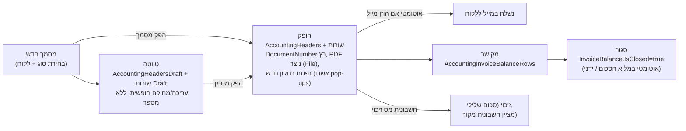
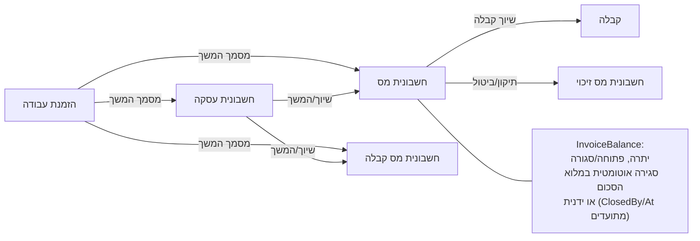
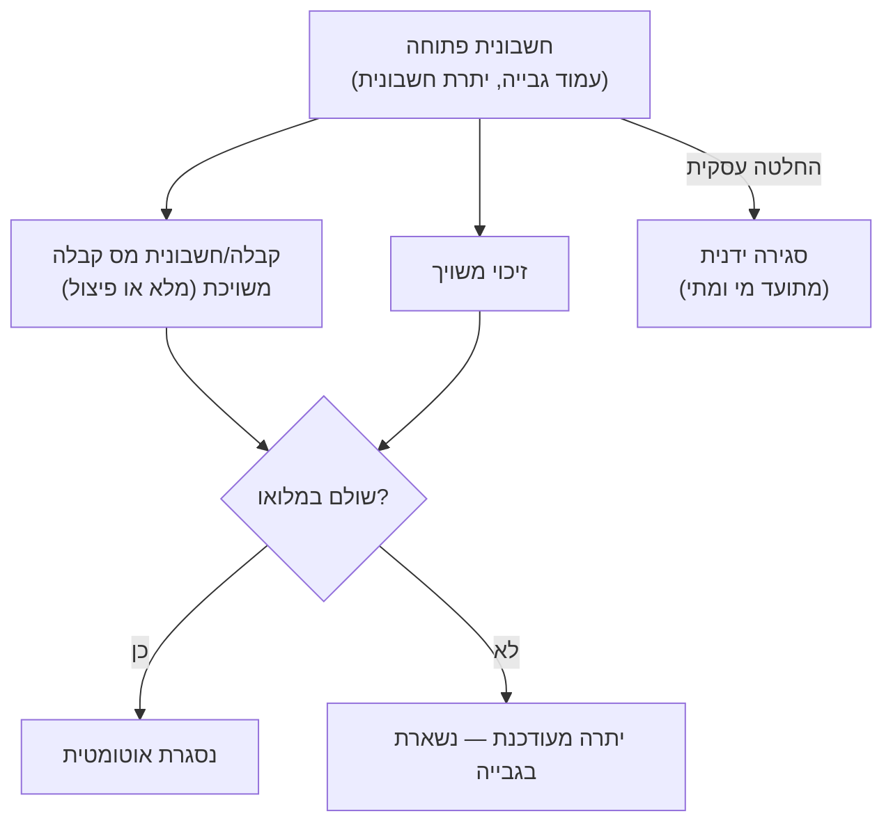
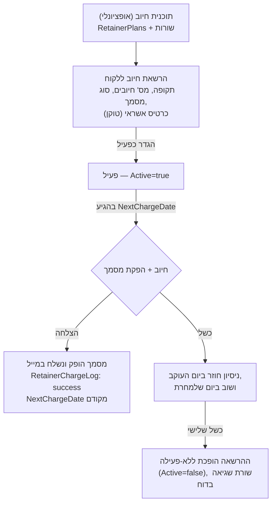

# MyBooks Module — apps/mybooks (Billing & Israeli Accounting)

> **Purpose:** Deep reference for the MyBooks billing module — document types and lifecycle, linked documents, collection (גבייה), payments & clearing, payment pages, retainers, inventory, reports, Israeli tax compliance (מבנה אחיד, חשבונית ישראל), settings, and its relation to CRM Core — for implementers running pre-implementation discovery.
> **Last updated:** 2026-06-10 · **Status:** draft

## 1. What this module is

`apps/mybooks/` is the invoicing/receipts/billing app. It runs on the **same Parse database** as CRM Core — same `Accounts` (לקוחות) and `Products` (מוצרים) tables — and is reached from the CRM via the top-bar app switcher or installed via `apps/mybusiness/install-mybooks`. It is also sold standalone as **mybooks.co.il** ("מקבוצת קו-מנחה"), and is **registered accounting software with the Israeli Tax Authority** (אישור רישום תוכנה במס הכנסה — PDF linked from every mybooks.co.il guide footer).

- **Runtime URL pattern:** `https://<numericId>.mbapps.co.il/apps/mybooks/<pageName>`.
- **Navigation** (guide ניווט-ותפריטים + live menu "Menu-15"): side menu — מבט על, לקוחות, מסמכי הנהח"ש, גבייה, חיוב ריטיינר, דפי תשלום, דוחות (הכנסות/תקבולים/קבלת דחויים), הגדרות, שיווק, עזרה. Same list-page pattern as the CRM: table + query form (שאילתא) + add button; blue links open record cards.

## 2. Entity map (DB tables)

| Entity | Hebrew | DB table | Fields/Ptrs | Purpose |
|---|---|---|---|---|
| Document type | סוג מסמך | `AccountingDocsType` | 13/2 | The 7 document types + last-number counter (`NumLast`), default header/notes per type (Heb/En) |
| Produced document (header) | מסמך שהופק | `AccountingHeaders` | 40/5 | Final, numbered, immutable document. `DocTypeId`, `AccountId`, `DocumentNumber`, totals/VAT, `File` (PDF), `TemplateId`, allocation-number fields (§9) |
| Draft document | טיוטה | `AccountingHeadersDraft` | 38/4 | Editable pre-production version (`Language`, totals, `DocTypeId`, `AccountId`) |
| Invoice line | שורת מסמך | `AccountingInvoiceLines` (+`...Draft`) | 15/5 | Product rows: `HeaderId`, `ProductId`, Quantity, Price, `CurrencyId`/Rate, RowTotal |
| Receipt/payment line | שורת תקבול | `AccountingReceiptLines` (+`...Draft`) | 29/7 | Payment rows: `PaymentRowType`→PaymentType (מזומן/צ'ק/אשראי/העברה/PayPal), cheque/bank/credit-card fields, `ClearingBool`, `NumberOfPayments`, `IsChequeOpen` |
| Invoice balance | יתרת חשבונית | `AccountingInvoiceBalance` | 15/5 | Open/closed state per invoice: `Balance`, `IsClosed`, `ClosedAt/By`, `DueDate` |
| Balance allocation row | שיוך תקבול | `AccountingInvoiceBalanceRows` | 10/5 | Links receipt/credit-invoice amounts to invoices (`InvoiceId`, `RecieptId`, `CreditInvoiceId`, `Sum`) |
| Business settings | הגדרות עסק | `AccountingSettings` | 42/4 | Company identity (Heb+En), logos, VAT %, currency, rounding, SMTP for doc mail, inventory settings, `MultiTerminals` |
| Retainer | הוראת חיוב / ריטיינר | `Retainers` | 38/8 | Recurring billing authorization: period, `ChargesLimit/Count`, `NextChargeDate`, `DocTypeId`, card token (`AccountTokenId`), `Active` |
| Retainer plan | תוכנית חיוב | `RetainerPlans` + `RetainerRows` | 8/2, 15/6 | Reusable product-bundle "packages" and per-retainer rows |
| Retainer charge log | דוח חיובים | `RetainerChargeLog` | 17/7 | Per-charge result: `ChargeStatus`, `ChargeError`, produced `DocumentId`/Number |
| Payment page/button | דף/כפתור תשלום | `PaymentBtns` + `PaymentBtnsRows` | 20/2, 13/4 | Hosted payment page definition: fixed products, min/max quantity, VAT, link + embeddable HTML |
| Payment log | לוג סליקה | `PaymentsLog` | 21/4 | Raw clearing transactions (status, terminal, error) |
| Clearing terminal | מסוף סליקה | `CreditClearingTerminal` | 9/2 | Terminal config (supports multiple terminals) |
| Inventory movement | תנועת מלאי | `InventoryLog` | 13/3 | `ActionType` (count/in/out), amounts before/after, `ProductId`, notes |
| Auto-charge | חיוב אוטומטי | `AutoChargeRules` + `AutoChargeLogs` | 14/2, 12/5 | Rules engine for automatic charges/reminders ⚠️ UNVERIFIED — no guide found, inferred from schema |
| Lookups | — | `Currencies`, `Banks`, `PaymentType`, `CreditCardTypes`, `CompanyType`, `BillingPeriod` | — | Currency (Heb/En names), bank list, payment & card types |
| Product | מוצר | `Products` | 42/9 | **Shared with CRM Core** (`Inventory`, `CatalogNumber`, `Price`, `NotPhysical`) |
| Customer | לקוח | `Accounts` | 91/33 | **Shared with CRM Core** |

## 3. Document types (סוגי מסמכים) — verified list

Live `Get-Data` on `AccountingDocsType` (7 types, each with its own number sequence via `NumLast`):

| Hebrew name | NameEn | Number range starts | Purpose (guide סוגי-מסמכים) |
|---|---|---|---|
| חשבונית מס | Invoice | 10001+ | Tax invoice — payment demand for goods/services; product rows, discount (₪/%), VAT and אגורות-rounding toggles per document |
| קבלה | Receipt | 20001+ | Issued **immediately upon receiving payment**; payment rows: מזומן, צ'ק, PayPal, העברה בנקאית, כרטיס אשראי (manual record or live clearing), plus ניכוי מס במקור row |
| חשבונית מס קבלה | Invoice Receipt | 30001+ | Combined invoice+receipt in one document; invoice total must equal receipts total |
| חשבונית מס זיכוי | CreditInvoice | 40001+ | Credit note — cancels/corrects a prior invoice; must cite original invoice number + reason; amount auto-negative |
| חשבונית עסקה | Proforma Invoice | 50001+ | Payment demand without tax event (service businesses); body like a tax invoice |
| הזמנת עבודה | Work Order | 60001+ | Work/service order detailing scope and required payment |
| תעודת משלוח | Delivery Note | 70001+ | Goods shipment note with products & quantities; not needed if a tax invoice covers the delivery |

**Not document types:** הצעת מחיר (price quote) lives in CRM Core (`PriceQuotes`, see [01-crm-core.md](01-crm-core.md) §6.4); ריטיינר is a recurring *charging mechanism* that produces one of the four billable types (§7).

**Withholding tax (ניכוי מס במקור):** on קבלה / חשבונית מס קבלה, add a receipt row of type "ניכוי מס במקור" for the withheld amount alongside the actual payment rows.

## 4. Document lifecycle: טיוטה → הופק → מקושר/סגור

Creation (guide יצירת-מסמך-חדש): from עמוד מסמכים → add button → pick type → document card opens with three zones:

1. **ראש המסמך:** document date, language (HE default / EN — content defaults per language come from settings), and customer linkage — one of: **בחר לקוח קיים** (pulls from Accounts), **צור לקוח חדש** (creates an Accounts row on production), **הפק ללא לקוח** (data printed on the document only, not saved as a customer).
2. **גוף המסמך:** product/payment rows per the type (§3).
3. **תחתית:** free-text notes printed on the document + actions **שמור טיוטא** / **הפק מסמך**.

- **Drafts** (guide טיוטות): listed under לשונית "טיוטות" on the Documents page; filter by type/date; editable, re-savable, producible, or deletable.
- **Produced documents** (guide מסמכים-שהופקו): לשונית "מסמכים"; view PDF, resend by email (defaults to the customer's email, overridable), export the table to Excel. Produced documents are not edited — corrections go through חשבונית מס זיכוי.
- **Numbering** (guide הגדרות-מסמכים): last document number per type is editable **upward only** — "לא ניתן להוריד אותו נמוך יותר ממספר המסמך האחרון שהופק".

## 5. Linked documents (מסמכים מקושרים) & continuation chain

Two linking mechanisms (guides מסמכים-מקושרים, שיוך-מסמך-לחשבונית-מס, WP 5805, הפקת-מסמך-מתוך-הזמנת-עבודה):

1. **Link at production time:** when producing a קבלה/זיכוי for a customer **who has open invoices**, a window pops up listing all open invoices — allocate the document's amount to one invoice or split across several (writes `AccountingInvoiceBalanceRows`). Same for חשבונית מס / חשבונית מס קבלה against open **חשבוניות עסקה**.
2. **Produce continuation directly from a document:** every document row has a **"פעולות נוספות"** button → open the מסמכים מקושרים card (shows invoice balance, linked children, open/closed status, manual "סגור יתרת חשבונית") or produce the follow-up document pre-linked.

The same continuation actions are available from the **account card's documents area** and from the **גבייה** page.

## 6. Billing & collection (גבייה) and payments

### 6.1 Collection page (guide גבייה; page `ReportCollection`)

Shows **all open invoices** (חשבוניות מס + חשבוניות עסקה) with an "יתרת חשבונית" column (remaining balance after any linked receipts/credits); filter by document type. From here: view linked documents, close an invoice manually (button "סגור יתרת חשבונית" — closer + date recorded), or produce a linked follow-up document; an invoice paid in full closes automatically.

Related pages: `PostDatedCheques` (קבלת דחויים — post-dated cheques report; `IsChequeOpen` on receipt lines), `InvoiceBalance`, `pay-open-invoice` (online payment of an open invoice ⚠️ UNVERIFIED flow — inferred from page name).

### 6.2 Payment methods & credit clearing (guide סליקת-אשראי, סוגי-מסמכים)

- Receipt rows support מזומן / צ'ק (bank+branch+account+cheque number) / העברה בנקאית / PayPal / כרטיס אשראי / ניכוי מס במקור.
- Credit card: record a manual charge **or run live clearing** (`ClearingBool`). Cards can be saved per customer — "מספר כרטיס האשראי אינו נשמר במערכת במלואו" (tokenized; only last digits kept, PCI-compliant per guide הגדרות-ריטיינר) — and reused from the saved-cards list on the document header.
- **Clearing providers:** **Upay** — free account, self-service signup from הגדרות → הגדרות סליקה; **Pelecard** — paid (540 ₪/שנה per guide, dated) via support; page `SettingPelecard`. `AccountingSettings.MultiTerminals` + `CreditClearingTerminal` allow several terminals.

### 6.3 Payment pages / buttons (דף \ כפתור תשלום)

Guide כפתור-תשלום; pages `PaymentsBtns` (list), `payment-btn-page` (public page), `successpage`. A hosted web payment page with **fixed products** (unlike a dynamic store): define title/paragraph/footer, product rows with price and min/max quantity, VAT/rounding. Prerequisites: clearing configured + logo uploaded. After saving you get a **shareable link** ("לינק לעמוד תשלום") and **embeddable HTML** ("כפתור תשלום – HTML") for any website. Orders count tracked (`PaymentBtns.OrdersCount`); a payment-page sale can also start a retainer (`PaymentBtns.RetainerPeriod`). ⚠️ UNVERIFIED which document is auto-produced after a successful payment (expected חשבונית מס קבלה; not stated in the guide read).

## 7. Retainers (ריטיינר / הוראות חיוב) — recurring billing

Guide הגדרות-ריטיינר; pages `Retainers` (חיוב ריטיינר list), `Retainer` (card), `RetainerPlans`, `update-retainer-token`. Three tabs: רשימת הרשאות חיוב, הגדרת תוכניות, דוח חיובים.

Capabilities: periodic auto-production of **חשבונית מס / חשבונית עסקה / חשבונית מס קבלה / קבלה**; auto credit-card charge (הוראת קבע) for the receipt-bearing types; period חודשי/דו-חודשי/רבעוני/חצי-שנתי/שנתי; fixed **plans** (reusable product bundles) or per-customer ad-hoc rows; auto-email of the produced document; charges & errors report.

Retainer definition fields (guide): לקוח, אימייל, תקופת החזרה, ID חיצוני, מספר חיובים (`ChargesLimit`), תאריך חיוב הבא (`NextChargeDate` — first charge date, then auto-advanced), הערה פנימית, plan-or-manual rows, document type, discount (%/₪, not for קבלה), VAT, rounding, notes-on-document, credit card (validated via "בדוק כרטיס אשראי"; stored as token, ⚠️ full PAN/CVV not stored), and **"הגדר ריטיינר כפעיל"** — unchecked = draft, no charges run.

Charge history: per-retainer header shows last-charge fields; דוח חיובים tab lists every charge with status + links to the produced documents (`RetainerChargeLog.DocumentId`). Customer card-token renewal via `update-retainer-token` page.

## 8. Inventory (ניהול מלאי)

Guides ניהול-מלאי, ניהול-מלאי-מוצר, הגדרות-ניהול-מלאי; pages `ManageInventory`, `ManageInventoryProduct`, `InventorySettings`. Opt-in module under הגדרות.

- **Stock list:** all products with current stock (`Products.Inventory`); per-product page shows the full movement table (`InventoryLog`: date, type, amount, before/after, notes).
- **Manual movements:** ספירת מלאי (count/set), הכנסת מלאי (in), הוצאת מלאי/זיכוי (out); movement date cannot precede the product's latest movement.
- **Document-driven movements** (`InventorySettings` page): choose which document types affect stock. **Decrement:** חשבונית מס, חשבונית מס קבלה, הזמנת עבודה, חשבונית עסקה, תעודת משלוח. **Increment:** חשבונית מס זיכוי. All auto-logged.
- **Minimum stock alert** (`AccountingSettings.InventoryMin`): producing a document that would breach minimum pops an alert with current quantity — once per product, at document-creation time.

## 9. Israeli compliance

| Aspect | Mechanism | Source |
|---|---|---|
| Registered software | אישור רישום תוכנה במס הכנסה (official PDF) | mybooks.co.il footer (all guides) |
| מבנה אחיד (uniform format) | הגדרות → ייצוא קבצים במבנה אחיד → ZIP with `BKMVDATA.TXT` + `INI.TXT` per date range, for רשות המסים / accountant | guide ייצוא-קבצים-במבנה-אחיד; page `ExportUniformFiles` |
| חשבונית ישראל (allocation numbers, מספרי הקצאה) | From 01/01/2025 invoices > 20,000 ₪ before VAT require an allocation number from the Tax Authority. Setup: הגדרות → התחברות לרשות המיסים (OAuth-style login). On production above threshold the request is auto-checked; the allocation number prints above the notes. Below threshold — optional manual checkbox. **No-VAT documents cannot get allocation numbers.** Applies to חשבונית מס, חשבונית מס זיכוי, חשבונית מס קבלה. Retroactive allocation via "הפק מספר הקצאה" button in the documents table. If the authority refuses: choose ביטול חשבונית (auto counter-document; for חשבונית מס קבלה you must also refund the payment), המשך הפקה ללא הקצאה (prints "אין לנכות מס תשומות בגין חשבונית זו"; retro possible later), or בקשה לשימוע | WP 6788; AccountingHeaders fields `confirmation_number`, `TaxId`, `Approve`, `IsCancellation`, `OriginalInvoiceId`, `emergencyFlag`, `State`, `JobId` |
| Credit-note discipline | זיכוי must reference original invoice number + reason; negative amount enforced | guide סוגי-מסמכים |
| Withholding tax | ניכוי מס במקור rows on receipts | guide סוגי-מסמכים |
| VAT | Default VAT % + currency + rounding in הגדרות פרטי עסק; per-document override toggles | guides הגדרות-פרטי-עסק, סוגי-מסמכים |
| Immutable numbering | Per-type sequence, editable upward only | guide הגדרות-מסמכים |
| External ERP | `ExportToHashavshevet` page (export to חשבשבת) ⚠️ UNVERIFIED flow — page exists, no guide read | Get-Site-Pages |

## 10. Dispatch of documents

- **Email** (guide שליחת-מסמך-במייל): enter/confirm an email at creation → document is auto-sent on production (default = customer-card email, overridable per document). Resend any produced document from the documents list (envelope icon). Sender is the system address by default; `AccountingSettings` holds SMTP fields (SmtpServer/Port/Ssl/UserName/SenderEmail/SenderName) for branded sending. `SendMeDocByMail` = copy to self.
- **Bulk marketing (שיווק):** menu item שיווק → `ConnectToMycampaigns` — mass דיוור (Email/SMS/WhatsApp) is handled by **MyCampaigns**, not MyBooks (WP guide 5595).

## 11. Reports

| Report | Page | Content |
|---|---|---|
| דוחות הכנסות — מפורט | `ReportIncomeDetailed` | Invoices (incl. חשבונית מס קבלה) by date range, open each PDF |
| — מפורט לפי מוצרים | `ReportIncomeDetailedByProduct` | By date range + product name |
| — סיכומי לפי מוצרים | `ReportIncomeSumUpByProduct` | Pie/diagram per product (**before VAT & discounts**) |
| — סיכומי לפי חודשים | `ReportIncomeSumUpByMonth` | Monthly graph (**after VAT & discounts**) |
| דוחות תקבולים — מפורט | `ReportReceiptDetailed` | Receipts (incl. חשבונית מס קבלה) by date range |
| — מפורט לפי סוג תשלום | `ReportReceiptDetailedByPaymentType` | By payment type (מזומן/אשראי/…) |
| — סיכומי לפי סוג תשלום | `ReportReceiptSumUpByPaymantType` (sic — real page name typo) | Diagram per payment type |
| — סיכומי לפי חודשים | `ReportReceiptSumUpByMonth` | Monthly receipts graph |
| גבייה | `ReportCollection` (old: `ReportCollectionOld`) | Open invoices + balances (§6.1) |
| קבלת דחויים | `PostDatedCheques` | Post-dated cheques due |
| דוח חיובים (ריטיינר) | tab in `Retainers` | Charge successes/failures + document links |

Detailed tables sort by column click and export to Excel.

## 12. Page map — actual paths (live `Get-Site-Pages`, apps/mybooks/*)

| Path | Type | Purpose |
|---|---|---|
| `apps/mybooks/Dashboard` | D | מבט על |
| `apps/mybooks/Accounts` / `Account` | L / F | לקוחות list / customer card (+docs area, produce-from-card) |
| `apps/mybooks/acc_dashboard` | D | Accountant dashboard (מנהלי חשבונות) ⚠️ UNVERIFIED purpose |
| `apps/mybooks/Documents` | L | מסמכי הנהח"ש — produced + drafts tabs |
| `apps/mybooks/InvoiceDraft` / `InvoiceRecieptDraft` / `RecieptDraft` | F | Draft editors (invoice / invoice-receipt / receipt; note "Reciept" typo is the real page name) |
| `apps/mybooks/ConnectedDocs`, `ConnectedInvoices`, `ConnectedCreditInvoices`, `ConnectedCheques`, `ConnectedToProformaInvoice` | X | Linked-documents cards per relation type |
| `apps/mybooks/ConnectedSale`, `ConnectedSaleToRetainer` | X | Linking CRM Sales to documents / retainers ⚠️ UNVERIFIED flow — page names only |
| `apps/mybooks/InvoiceBalance` | L | Invoice balances |
| `apps/mybooks/ReportCollection`, `PostDatedCheques`, `ReportIncome*` ×4, `ReportReceipt*` ×4 | L | Reports (§11) |
| `apps/mybooks/Retainers` / `Retainer` / `RetainerPlans` / `update-retainer-token` | L / F / S / X | Retainer module (§7) |
| `apps/mybooks/PaymentsBtns` / `payment-btn-page` / `pay-open-invoice` / `successpage` | L / X / X / X | Payment pages (§6.3) |
| `apps/mybooks/SettingsMybooks` (+`SettingsMybooksFirst`) | S | Settings hub (first-run variant) |
| `apps/mybooks/SettingCompany` | S | הגדרות פרטי עסק: identity Heb/En, logos, address, currency, VAT %, rounding |
| `apps/mybooks/OtherSettings` | S | הגדרות מסמכים: per-type default header/notes (Heb/En), last document number ⚠️ page-name↔guide mapping inferred |
| `apps/mybooks/SettingsTemplates` | S | תבניות — document color theme + preview |
| `apps/mybooks/SettingProducts` | S | הגדרות מוצרים — product catalog CRUD + query by name/catalog number |
| `apps/mybooks/SettingPelecard` | S | Clearing setup (Upay/Pelecard) |
| `apps/mybooks/InventorySettings`, `ManageInventory`, `ManageInventoryProduct` | S / L / F | Inventory (§8) |
| `apps/mybooks/ExportUniformFiles`, `ExportToHashavshevet` | X | מבנה אחיד export / Hashavshevet export |
| `apps/mybooks/SettingPersonal` (+`First`), `ManageProfile` | S | Personal/user settings |
| `apps/mybooks/extendPlan`, `upgradePlan`, `WelcomeToMybooks`, `taxdes` | X | Plan upgrade / onboarding / tax-description ⚠️ UNVERIFIED |
| Masters: `AppMaster`, `DocMaster`, `TicketMaster` + `Mobile-*` set | M | Layouts; full mobile mirror exists (Mobile-Documents, Mobile-AddDoc, Mobile-InvoiceDraft, …) |

**Main menu (Menu-15, live Get-Menu-Items):** מבט על → Dashboard · לקוחות → Accounts · מסמכי הנהח"ש → Documents · גבייה → ReportCollection · חיוב ריטיינר → Retainers · דפי תשלום → PaymentsBtns · דוחות → {דוחות הכנסות → ReportIncomeSumUpByMonth, דוחות תקבולים → ReportReceiptDetailed, קבלת דחויים → PostDatedCheques} · הגדרות → SettingsMybooks · עזרה → mybooks.co.il/supportnew · שיווק → ConnectToMycampaigns.

## 13. Relation to CRM Core (Sales/Accounts)

- **Shared customers:** MyBooks לקוחות **are** CRM `Accounts` rows; a customer created during document production ("צור לקוח חדש") appears in the CRM. The CRM account card surfaces accounting documents (מסמכים area) and allows producing follow-up documents from there (guides שיוך-מסמך-*, הפקת-מסמך-מתוך-הזמנת-עבודה: "באופן דומה... באיזור המסמכים שבתוך כרטיס לקוח").
- **Shared products:** one `Products` catalog feeds CRM SaleRows, MyBooks document lines, retainer rows, and payment-button rows (schema: Products referenced by SaleRows, AccountingInvoiceLines, RetainerRows, PaymentBtnsRows, InventoryLog).
- **Sale → billing:** a won sale (הושלמה) is billed in MyBooks; pages `ConnectedSale` / `ConnectedSaleToRetainer` indicate native sale↔document/retainer linkage, and `Sales` carries `PaymentStatus`, `BillingPeriod`, `SubscriberStatus`, `CanceledRetainer`, `NextAnnualPayment` fields. ⚠️ UNVERIFIED — exact UI flow for converting a Sale's rows into an invoice was not found in the guides read; verify per environment.
- **CRM-side accounting exports:** `apps/mybusiness/export-to-hashavshevet` mirrors the MyBooks Hashavshevet export.

## 14. Configuration points (implementation checklist)

1. פרטי עסק (`SettingCompany`): legal name Heb+En, ח.פ (`CompanyId`), address Heb/En, logos Heb/En (also used by payment pages), currency, VAT %, rounding.
2. הגדרות מסמכים: per-type default header + notes (Heb/En), starting document numbers (migration-critical — set to continue the previous software's sequences; upward-only).
3. תבניות: document color theme.
4. מוצרים: catalog with catalog numbers (shared with CRM).
5. סליקה: Upay (free, instant) or Pelecard (paid via support); terminals.
6. רשות המסים: connect for allocation numbers (חשבונית ישראל) if invoices can exceed the threshold.
7. ריטיינר: plans, then per-customer authorizations; activate explicitly.
8. מלאי (optional): which doc types move stock + minimum-stock threshold.
9. Email dispatch: SMTP/sender identity; auto-send preference; self-copy.
10. דפי תשלום: per-product hosted pages + embed HTML.

## Limitations & gotchas

- **Produced documents are immutable** — no edit after הפקה; fix via חשבונית מס זיכוי citing the original number. Drafts are the only editable stage.
- **Document numbers move upward only** and cannot go below the last produced number — get opening numbers right on day one of a migration.
- **חשבונית מס קבלה requires invoice total = receipts total** in the same document.
- **Pop-up blocker:** first-ever document production opens the PDF in a new window — the browser must be allowed to open pop-ups (guide הפקת-מסמך).
- **Retainer charge retry policy:** failed charge retries next day and the day after; **third failure deactivates the retainer** — collections staff must watch דוח חיובים for "לא פעיל" rows.
- **Retainer is inert until "הגדר ריטיינר כפעיל" is checked** — a fully configured but unchecked authorization never charges.
- **Allocation numbers:** impossible for no-VAT documents; the Tax Authority may refuse (suspected irregular invoice) — the chosen fallback (cancel / produce without allocation with "אין לנכות מס תשומות" printed / hearing request) has accounting consequences; for חשבונית מס קבלה cancellation you must also refund the customer the way they paid (WP 6788). Threshold changes by year (25,000 ₪ in 2024 → 20,000 ₪ from 2025) — verify current law.
- **Income summary reports mix VAT bases:** סיכומי-לפי-מוצרים shows amounts **before** VAT/discounts while סיכומי-לפי-חודשים is **after** — don't reconcile one against the other (guide דוחות-הכנסות).
- **Minimum-stock alert fires once per product** at document creation — it is informational, not blocking.
- **Inventory movement dates can't precede the product's latest movement** — backdated corrections need a count (ספירת מלאי).
- **"הפק ללא לקוח" documents** save no customer record — they will not appear in any per-customer history.
- **Page-name typos are real:** `InvoiceRecieptDraft`, `RecieptDraft`, `ReportReceiptSumUpByPaymantType` — use exact strings in deep links/automation.
- **Per-document language** (HE/EN) selects the matching logo/address/notes set — incomplete English settings produce half-translated documents.
- ⚠️ UNVERIFIED items to confirm per environment: auto-document type after payment-page purchase; `pay-open-invoice` end-customer flow; `ConnectedSale`/`ConnectedSaleToRetainer` UI; `AutoChargeRules` feature status; `acc_dashboard`/`taxdes` purpose; current Pelecard pricing.
