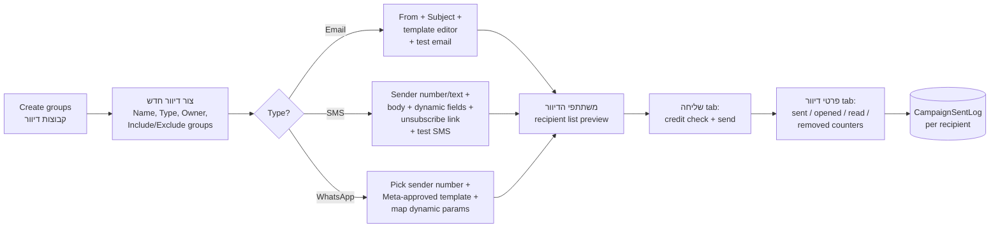
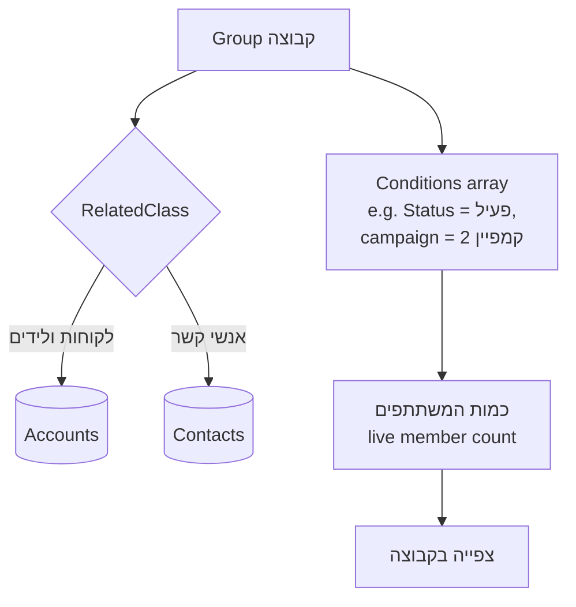
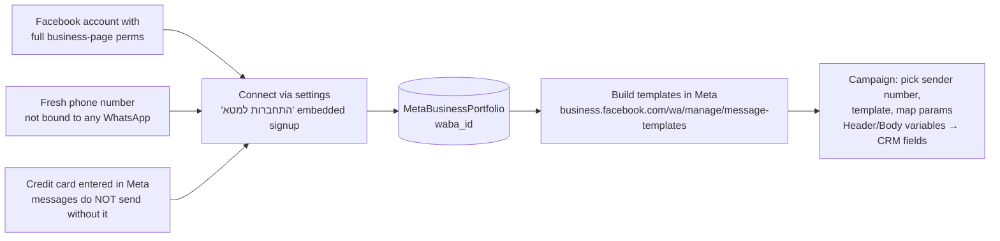

# MyCampaigns — Bulk Messaging Module (דיוורים)

> **Purpose:** Reference for the MyCampaigns module (apps/mycampaigns/): email/SMS/WhatsApp bulk campaigns, distribution groups, landing pages, unsubscribe handling, analytics, and the SMTP/Meta dependencies.
> **Last updated:** 2026-06-10 · **Status:** draft

## 1. What the module does

MyCampaigns (Hebrew UI: "דיוורים" / "MyCampains" in older guides) sends bulk messages from the CRM to a defined audience over **three channels**: Email (דוא"ל), SMS, and WhatsApp (guide 7131). Audiences are dynamic **distribution groups** (קבוצות דיוור) built as saved filters over CRM data. The module also hosts a **landing-page builder** whose forms create Leads directly in the CRM, and a credit/billing view for message costs.

It is installed as a separate market app (install page: `apps/mybusiness/install-mycampaigns`) and runs under the URL path `apps/mycampaigns/<pageName>`.

## 2. Entity table

| Entity | Hebrew UI name | DB table | Purpose |
|---|---|---|---|
| Campaign | דיוור | `Campaigns` (24 fields) | One bulk send: type (Email/SMS/WhatsApp), content per type, audience, schedule, counters |
| Campaign status | סטטוס דיוור | `CampaignStatuses` | Lookup; demo values: `לא נשלח` (not sent), `נשלח` (sent) — verified via Get-Data |
| Campaign send status | — | `CampaignSentStatuses` | Lookup pointed to by `Campaigns.CampaignSentStatus` |
| Per-recipient send log | — | `CampaignSentLog` (22 fields) | One row per recipient: delivered/opened/clicked/failed/unsubscribed + timestamps |
| Distribution group | קבוצת דיוור / קבוצות | `Groups` | Saved audience: `RelatedClass` (String — Accounts or Contacts) + `Conditions` (Array of filter conditions) |
| Landing page | דף נחיתה | `LandingPages` | Registry row per published page: `PageId`, `WebsitePageName`, `OriginalPageId`, `OriginalName` (content lives in the page builder, not in this table) |
| Email template | תבנית מייל | `EmailTemplate` | `Name`, `HTML` (HTML/XML), `UserId` pointer — shared with manual emails and chatbot emails |
| SMS template | תבנית SMS | `SmsTemplates` | `Name`, `Template` (HTML/XML) |
| Subscriber status | — | `SubscriberStatus` | Lookup (Name only). ⚠️ UNVERIFIED how it is wired to Accounts; unsubscribe state is also tracked per-send in `CampaignSentLog.unsubscribed` |
| Meta business portfolio | — | `MetaBusinessPortfolio` | `Name`, `waba_id` — the connected WhatsApp Business Account; shared with MyChat `Channels` |
| Send logs (system) | — | `_syslogCampaignEmails`, `_syslogCampaignSMS`, `_syslogCampaignWA` | Low-level per-channel send logs (System/Internal domain) |

### 2.1 `Campaigns` key fields (from tables_catalog.json)

| Field | Type | Notes |
|---|---|---|
| `Name` | String | Campaign name |
| `Type` | String | Email / SMS / WhatsApp |
| `OwnerId` | Pointer→`_User` | "אחראי הדיוור" |
| `IncludeGroups` / `ExcludeGroups` | Array | Audience = included groups minus excluded groups (guide 5595: "אילו קבוצות ייכללו... ואילו לא ייכללו למקרה שיש חיתוך ביניהן") |
| `Groups` | Object | ⚠️ UNVERIFIED legacy/aggregate field alongside Include/Exclude arrays |
| `EmailSender` / `EmailSubject` / `EmailContent` | HTML/XML, String, HTML/XML | Email channel: "מאת", "נושא", body built in the template editor |
| `SMSSender` / `SMSContent` | String / HTML/XML | SMS channel: sender number-or-text + message body |
| `WASender` / `WATemplate` / `WATemplateParams` | String / String / Object | WhatsApp channel: sending number, Meta-approved template name, dynamic-parameter mapping |
| `DeliveryTime` | Date | Scheduled send time |
| `NumOfRecipients` | Number | Snapshot counter |
| `CampaignStatus` / `CampaignSentStatus` | Pointers | Lifecycle statuses |

### 2.2 `CampaignSentLog` (per-recipient analytics)

`Type`, `AccountId`→Accounts, `CampaignId`→Campaigns, `Status`, `Destination` (address/phone), and Boolean+Date pairs: `delivered/deliveredAt`, `opened/openedAt`, `clicked/clickedAt`, `failed/failedAt`, `unsubscribed`, plus `Error` and raw `data`. This is the table to query for campaign-result reports and for proving delivery to a specific customer.

## 3. Page map (live, Get-Site-Pages)

| Page (`apps/mycampaigns/...`) | Role |
|---|---|
| `AppMaster`, `TicketMaster` | Master pages (list-pages master + record-card master) |
| `Dashboard` | מבט-על: totals per channel by date range, credit balance, price list, recent campaigns tables (guide 7131) |
| `CampaignDashboard` | Per-campaign statistics view |
| `Campaigns` | דיוורים: campaign list + "צור דיוור חדש"; campaign editor tabs: הגדרת דיוור → תוכן (per channel) → משתתפי הדיוור → שליחה/פרטי דיוור |
| `Groups`, `GroupView` | קבוצות: group list, create/edit (name, base class, conditions, member count), member view ("צפייה בקבוצה") |
| `Accounts`, `Leads` | לקוחות / לידים list views inside the campaigns app |
| `EmailTemplates` | Email template gallery + drag-drop editor (guide 5602) |
| `LandingPages` | Landing-page template gallery + editor (guide 5616) |
| `WhatsAppTemplates` | תבניות לווטסאפ: list of Meta-approved templates usable in campaigns |
| `DomainSettings` | Sending-domain settings ⚠️ UNVERIFIED details (page not opened) |
| `settings` | הגדרות incl. "התחברות למטא" button for the WhatsApp account (guide 7135) |
| `unsubscribe-page` | Public page reached from the unsubscribe link in emails/SMS |
| `ComingSoon`, `Login` | Placeholder + app login |

**Menu** (live Get-Menu-Items, menu "Menu-4"): מבט-על → לידים → לקוחות → קבוצות → דיוורים → דפי נחיתה → תבניות לווטסאפ → הגדרות.

## 4. Core flows

### 4.1 Campaign lifecycle

### 4.2 Distribution group resolution (guide 5820)

Practical filters documented in guide 5820: leads-only group = condition `IsAccount` is empty; date-based group = condition on `createdAt`. Membership is evaluated dynamically — the member count updates as CRM data changes.

### 4.3 WhatsApp campaign dependency chain (guides 7135, 5595)

## 5. Configuration points

| Area | Where | Notes |
|---|---|---|
| SMTP per user | CRM הגדרות → משתמשים → Edit → Email settings (guide 5498) | Server/User/Password/Port/SSL + Sender Email/Name; Gmail requires 2FA + app password (port 465 SSL); Office365 `outlook.office365.com` port 587 no SSL; "Check the SMTP connection" test button. **Email campaigns and manual emails depend on a working SMTP account.** `Get-SMTP-Accounts` (MCP) lists them — returns `[]` on the demo, so email sends there will fail until configured. |
| WhatsApp account | apps/mycampaigns/settings → התחברות למטא | Meta embedded-signup; multiple numbers per WABA allowed; each number can be a separate channel (sales vs support) |
| WhatsApp templates | Meta Business Manager (external) + `WhatsAppTemplates` page | Free-text WhatsApp campaigns are impossible — templates only |
| SMS credit | CRM הגדרות → שירותים נוספים → רכישת קרדיט SMS ודיוור (guide 5591) | SMS = 2 agorot per 68 characters; overage messages/emails = 2 agorot each (guide 7131: e.g. 10,000 messages ≈ 200 ₪ credit) |
| SMS sender per user | פרטי המשתמש (user record) | The number/text shown as SMS sender for manual sends |
| Email templates | `EmailTemplates` page | Recommended workflow: start from a ready template or `blank template`; RTL must be set per element; spacing via separator elements (Outlook compatibility), links on Link/Link Block/Button elements (guide 5602) |
| Landing pages | `LandingPages` page, Edit/Preview/Pro modes | Publish returns a public URL; "התבניות שלי" tab manages existing pages |
| Unsubscribe link | Default in SMS template; re-insertable button | Clicking removes the recipient from future sends; `unsubscribe-page` renders the confirmation |

## 6. Landing pages → Leads (guide 5616)

The landing-page form posts straight into the CRM as a **Lead** (Accounts with `IsAccount` empty). Form fields must use **fixed names**:

| Field name | Meaning |
|---|---|
| `Name` | שם |
| `F_name` | שם פרטי |
| `F_name` | שם משפחה — ⚠️ the source guide lists `F_name` twice (documentation bug; last-name key likely `L_name`, UNVERIFIED) |
| `Email` | אימייל |
| `PhoneNumber` | טלפון |
| `Address` | כתובת |
| `Comment` | הערה |

Editor has a basic mode (drag pre-made blocks, edit text/image/background) and a **Pro** mode (grid layout, element duplication, padding control) for experienced builders.

## 7. Campaign analytics (guide 5595)

After send, the שליחה tab becomes פרטי דיוור:

| Channel | Metrics shown |
|---|---|
| Email | sent count, opened count, removed (unsubscribed) addresses |
| WhatsApp | sent count, read count |
| SMS | sent count, removed phone numbers |

Row-level evidence lives in `CampaignSentLog`; channel syslogs `_syslogCampaignEmails/SMS/WA` hold low-level results. Dashboard (מבט-על) aggregates by date range and shows credit/price info.

## 8. Cross-module touchpoints

| Module | Touchpoint |
|---|---|
| CRM Core | Groups draw from `Accounts`/`Contacts`; landing-page forms create Leads; manual SMS/Email/WhatsApp from the customer card share templates and credit |
| MyChat | Same Meta WABA / `MetaBusinessPortfolio`; a WhatsApp campaign send and MyChat conversations use the same connected numbers. ⚠️ A WhatsApp account cannot be connected to MyChat *and* another system/device simultaneously (guides 7135/7542) |
| MyBooks | Page `apps/mybooks/ConnectToMycampaigns` exists (live page list) — billing-side hook to campaign credit ⚠️ UNVERIFIED behavior |
| Triggers | Trigger actions can send Email/SMS/WhatsApp one-to-one (see `30-customization/06-triggers-and-automations.md`) — distinct from bulk campaigns but uses the same SMTP/credit/template plumbing |

Related docs: [04-mychat.md](04-mychat.md) (channels, templates, Identity gotcha) · [../20-data-model/01-data-model-overview.md](../20-data-model/01-data-model-overview.md).

## 9. Real-world issue themes (JIRA grep)

- "לינק הסרת מרשימת תפוצה בקמפיין - לא עובד" — unsubscribe link breakage (MYBC).
- "תקלה גורפת - בניית דפי נחיתה במייקמפיין לא עובד" — landing-page builder outages (MYBC).
- "דיוורים לא נשלחים לכולם", "לא ניתן לשלוח דיוור" (multiple customers) — partial/blocked sends, usually credit or SMTP/Meta config.
- "מייקמפיינס - יצירת קבוצת דיוור מאקסל" — Excel-import-to-group is a requested workflow (groups are filter-based, not static lists).
- "קבוצת טוב - דיוורים לפי מכירות", "הוספת מכירות למיי קמפיין" — recurring demand to build groups on **Sales** criteria; `Groups.RelatedClass` covers Accounts/Contacts only (gap).
- "פרמהבסט - תצוגת נתונים ריקה בדשבורד קמפיין" — empty campaign-dashboard data.

## Limitations & gotchas

1. **Groups are dynamic filters, not snapshots** — membership is whatever matches `Conditions` at send time; there is no static list import (Excel import requests appear in JIRA as feature work).
2. **Group base classes are Accounts or Contacts only** — campaigns "by Sales" require modeling the criterion onto the Account (custom field/trigger).
3. **WhatsApp campaigns are template-only**; templates are built and approved in Meta's console, not in the CRM. Until business verification in Meta, the account is limited (~250 conversations/day per guide 7135).
4. **No credit card in Meta = WhatsApp messages silently don't send** (guide 7135 warning).
5. **Email sending depends on per-user SMTP**; demo environment has zero SMTP accounts (`Get-SMTP-Accounts` → `[]`). Gmail needs an app password; Office365 needs port 587 without SSL flag.
6. **SMS cost discipline**: 2 agorot per 68 characters — long Hebrew messages multiply cost; credit must exist before send.
7. **Landing-page form field names are fixed** (`Name`, `F_name`, `Email`, `PhoneNumber`, `Address`, `Comment`); renaming a field silently breaks lead capture. The official guide itself lists `F_name` for both first and last name — verify the last-name key on a live form before promising it.
8. **The unsubscribe SMS link ships in the default template** — deleting it during editing removes opt-out (legal exposure); it can be re-added with the dedicated button.
9. **Campaign WhatsApp and MyChat share the connected number** — disconnecting/reconnecting the WABA for one affects the other.
10. `LandingPages` table stores only page registry metadata; the actual page content lives in the site-builder page (`PageId`), so backups/migrations must copy pages, not just table rows.
