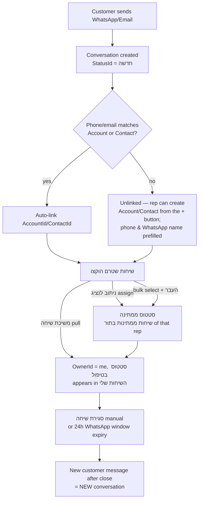
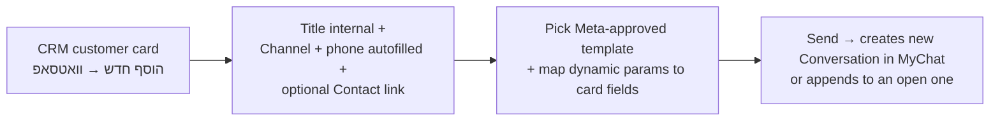
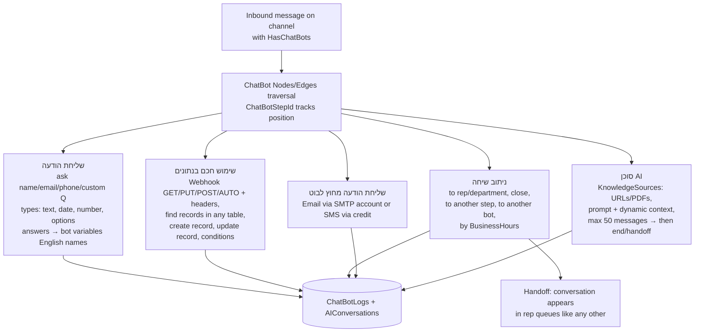

# MyChat — Multi-Channel Conversations Module

> **Purpose:** Reference for MyChat (apps/mychat/): WhatsApp + Email conversations, the Channels table (incl. the critical `Identity` gotcha), chatbots, conversation assignment/permissions, and templates.
> **Last updated:** 2026-06-10 · **Status:** draft

## 1. What the module does

MyChat is the omnichannel conversation hub: incoming and outgoing **WhatsApp** and **Email** conversations in one queue-based UI, with rep assignment, statuses, per-channel permissions, quick responses, and **chatbots** (including an AI agent) that run on WhatsApp channels before/instead of a human rep (guides 7542, 8094). Conversations link to CRM records (לקוח, איש קשר, מכירה, פנייה) and surface on the customer card.

## 2. Entity table

| Entity | Hebrew UI name | DB table | Purpose |
|---|---|---|---|
| Channel | ערוץ | `Channels` (17 fields) | A connected WhatsApp number or email box. Key fields: `Name`, **`Identity`** (the WhatsApp phone identity / address used for sending), `Key`, `TypeId`→ChannelTypes, `WaBaId`, `DefaultResponse` (auto-reply), `HasChatBots`, `DefaultOwnerId`→_User, `DefaultRole`, `MetaBusinessPortfolioId`, `UsersAssignmentId` |
| Channel type | — | `ChannelTypes` | Lookup; demo values (live): `WhatsApp`, `Email` |
| Conversation | שיחה | `Conversations` (29 fields) | One thread: `ChannelId`, `Identity` (counterpart address), `ContactName`, `Number` (AutoIncrement), `OwnerId` (assigned rep), `StatusId`/`StateId`, `Pinned`, `ClosedAt`, `LastMessageAt`, `UnreadCount`, `HasMedia`, `Department`, `Title`; CRM links: `AccountId`, `ContactId`, `SaleId`, `CaseId`, `TaskId`; bot links: `ChatBotId`, `UsedChatBotId`, `ChatBotStepId` |
| Message | הודעה | `ConversationMessages` (16 fields) | `ConversationId`, `UserId`, `Direction`, `Message` (HTML), `File` (PrivateFile), `Data`, `failed/failedAt/errors`, `IsErrorRead` |
| Conversation status | סטטוס שיחה | `ConversationStatuses` | Configurable; defaults (live + guide 7542): `חדשה`, `ממתינה`, `בטיפול`, `סגורה`; each points to a `StateId` |
| Conversation state | — | `ConversationStates` | Underlying state machine behind statuses (open/closed semantics) ⚠️ exact values UNVERIFIED on demo |
| Rep status | סטטוס נציג | `UserStatuses` | Availability of reps; defaults (live): `מחובר` (green, state=true), `בהפסקה` (orange), `נא לא להפריע` (red), `לא מחובר` (grey) |
| Assignment group | — | `UsersAssignments` | `Name`, `Users` (Array), `ActiveStatuses` (Array), `LastAssignmentUserId` — referenced by `Channels.UsersAssignmentId`. Round-robin rotation over `Users` in array order, `LastAssignmentUserId` as cursor — **verified** on the CRM consumer of the same table (see [30/06 §13](../30-customization/06-triggers-and-automations.md)). ⚠️ The MyChat-specific binding (per-channel assignment on inbound conversations) is still UNVERIFIED |
| Chatbot | צ'אטבוט | `ChatBots` (14 fields) | `Name`, `Active`, `ChannelId`, `Conditions`, **`Nodes` + `Edges`** (the flow graph), `DefaultMessages`, `ExecutionCount` |
| Chatbot log | — | `ChatBotLogs` | Per-conversation bot run: `ConversationId`, `ChatBotId`, `Logs` (Array), `Data`, `AIQueryCount` |
| AI conversation | — | `AIConversations` | `ConversationId`, `system` (Array), `messages` (Array) — AI-agent transcript |
| Knowledge source | מקור מידע | `KnowledgeSources` + `KnowledgeSourceTypes` + `KnowledgeSourceFiles` | AI-agent grounding: `Url` or uploaded PDF files (`File` PrivateFile), `Status`, `Active` |
| Business hours | שעות פעילות / לוח זמנים | `BusinessHours` | `Name`, `WeeklyHours` (Array), `SpecialDates` (Array), `ConsiderIsraeliHolidays` (Boolean); used by chatbot routing-by-hours; same table used by the Cases SLA mechanism |
| Quick response | — | `MessagesToCustomer` | Canned replies (`Name` only in schema; content storage ⚠️ UNVERIFIED) — surfaced on page `quick-responses` |
| Meta portfolio | — | `MetaBusinessPortfolio` | `Name`, `waba_id` — connected WhatsApp Business Account |

## 3. ⚠️ CRITICAL gotcha — WhatsApp identity = `Channels.Identity`, NOT `objectId`

When sending WhatsApp programmatically (MCP `Send-WhatsApp-Message`, triggers, API), the **channel is addressed by the `Identity` field of the `Channels` row** (the WhatsApp phone identity), **not** by the row's Parse `objectId`. This is codified as Critical Technical Rule #2 in the project `CLAUDE.md` ("WhatsApp Identity — Use `Identity` field from Channels table, NOT `objectId`") and matches the schema: `Channels.Identity : String` exists precisely for this. `Conversations.Identity` similarly holds the counterpart's address (customer phone / email), used for matching inbound messages to threads. Passing an objectId where Identity is expected fails silently or errors — check `errors-log` page / `ConversationMessages.errors`.

## 4. Page map (live, Get-Site-Pages)

| Page (`apps/mychat/...`) | Role |
|---|---|
| `Master Page` | App master |
| `dashboard` | מבט על |
| `conversations` | The conversation workspace; menu filters: `?filter=myconv` (השיחות שלי), `?filter=waiting` (שיחות ממתינות בתור), `?filter=unassign` (שיחות שטרם הוקצו), `?filter=all` (כל השיחות) |
| `conversations-table` | עריכה גורפת — bulk table edit of conversations (menu-visible to Admin/MyChatAdmin only) |
| `channels` | Channel list (WhatsApp numbers + email boxes) |
| `chatbots` | Chatbot builder (map of nodes, create from scratch/template/clone) |
| `quick-responses` | Canned replies |
| `errors-log` | Send/receive error log |
| `settings` | Settings hub (menu item visible to roles `Admin`, `MyChatAdmin`) |
| `settings-whatsapp` | WhatsApp channel setup (Meta embedded signup) |
| `email-settings`, `settings-imap`, `gmail-oauth` | Email channel setup: SMTP+IMAP form, Office365 token button, Gmail OAuth |
| `settings-accounts` | Email accounts list ("שייך לערוץ" to bind a mailbox to a channel) |
| `settings-users`, `settings-users-statuses`, `settings-users-assignment` | Rep management, rep status lookup, assignment groups |
| `settings-conv-statuses` | Conversation status lookup |
| `settings-profiles` | Per-profile channel permissions |
| `package-status` | Module package/quota status |
| `Account`, `Accounts` | Customer card/list inside the chat app |
| `login` | App login |

**Menu** (live): מבט על → השיחות שלי → שיחות ממתינות בתור → שיחות שטרם הוקצו → כל השיחות (child: עריכה גורפת) → לקוחות → הגדרות.

## 5. Core flows

### 5.1 Inbound conversation lifecycle (guides 7569, 7570, 7594)

### 5.2 Outbound (business-initiated) WhatsApp (guides 7570, 8305)

Business-initiated messages **must** use approved templates; free text is only possible inside an open 24-hour customer-service window.

### 5.3 Chatbot execution (guides 7792, 7799, 7822, 7824, 7828, 7880)

Bot-created records: pick target table (e.g., Accounts, Cases, Sales), map fields to fixed values or collected variables, optionally store the new record's id as a variable (e.g., `NewCaseId`). Found-record sets can be presented to the customer as numbered options/buttons.

## 6. Configuration points

| Area | Where | Notes |
|---|---|---|
| WhatsApp channel | settings → הגדרת ערוצי וואטסאפ (guide 7542) | Requires: Facebook account with full business-page + portfolio permissions; a phone number with **no existing WhatsApp registration** (must receive SMS/voice code); a credit card in Meta. Multiple numbers per WABA → multiple channels (e.g., sales vs support) |
| Email channel | settings → הגדרת ערוצי דוא"ל | Reuse mailboxes already connected via MyInbox ("שייך לערוץ") or create new: username, password (Gmail: app password), User binding, defaults Gmail/Office365 auto-fill SMTP/IMAP server+port+SSL; Office365 needs `Get 365 Token`; test buttons for SMTP and IMAP |
| Channel edit | pencil icon on channel row | Rename channel; set `DefaultResponse` auto-reply for first inbound message |
| Channel permissions | gear icon per channel (guide 7557) | Per profile or per user: (1) ללא הרשאות, (2) פניות שלו בלבד, (3) פניות שלו ולא משוייכות, (4) כל הפניות. **Default before configuring: everyone sees everything** |
| Rep statuses | settings → הגדרת סטטוסים לנציגים | Name, active flag, color (colored dot next to rep in assignment lists) |
| Conversation statuses | settings → הגדרת סטטוס לשיחות | Editable list on top of the 4 defaults |
| Business hours | settings → שעות פעילות (guide 7962) | Multiple named schedules (per department), per-day ranges or "מחלקה סגורה כל היום"; consumed by bot routing-by-hours |
| Assignment groups | `settings-users-assignment` page; `UsersAssignments` table | Users array + active-statuses filter + LastAssignmentUserId; bound per channel via `Channels.UsersAssignmentId`. Same table as the CRM User-Assignments engine ([30/06 §13](../30-customization/06-triggers-and-automations.md)) — **never delete or repurpose rows another consumer created**. ⚠️ MyChat-specific auto-assignment semantics still UNVERIFIED |
| Chatbots | `chatbots` page | Create from scratch / from template (lead, sales, service templates) / clone existing; per-channel binding; activate via `Active` |
| AI knowledge sources | settings or inside bot step (guide 7880) | URL sources or PDF uploads; reusable across bots; AI conversations capped at 50 messages |

## 7. Conversation ↔ CRM linking (guides 7594, 7604, 7743)

- Right pane of every conversation: link/create **לקוח** (Account), **איש קשר** (Contact); middle: create **מכירה** (Sale) / **פנייה** (Case) prefilled and auto-linked; bottom: magnet icon links the conversation to an *existing* Sale/Case of the linked Account.
- Auto-link on inbound: exact phone match → Account; same for Contacts (Contact list filtered by chosen Account).
- Customer card (CRM): tab ריכוז האירועים → MyChat table shows all linked conversations; clicking opens the full thread and, if still within the window, allows replying from the card (page `apps/mybusiness/CaseWhatsAppConversation` serves the Case-side equivalent).
- Chatbot conversations appear in MyChat and on the customer card exactly like human conversations; unidentified bot leads can auto-create Lead records (guide 7743).

## 8. Cross-module touchpoints

| Module | Touchpoint |
|---|---|
| CRM Core | Conversations pointer-link to Accounts/Contacts/Sales/Cases/Tasks; card "הוסף חדש → וואטסאפ"; Emails table rows can carry `ConversationId` |
| MyCampaigns | Same Meta WABA (`MetaBusinessPortfolio`); templates built in Meta serve both bulk campaigns and 1:1 sends; ⚠️ one WhatsApp account cannot be connected to two systems at once |
| MyInbox | Email boxes connected in MyInbox are offered for channel binding ("שייך לערוץ", guide 7542); `Emails.ConversationId` ties mail to threads — see [07-myinbox-and-misc.md](07-myinbox-and-misc.md) |
| Cases SLA | `BusinessHours` table is shared by chatbot hour-routing and the SLA mechanism (see `myb-p-sla-configuration` skill) — renaming/deleting schedules affects both |
| MCP/API | Read tools: `Get-Data` on all chat tables, `Get-WhatsApp-Template-Params`; write tools (not used here): `Send-WhatsApp-Message` — requires the **Channel `Identity`** (section 3) |

## 9. Operational notes

- **24-hour rule:** a WhatsApp conversation "expires" 24h after the last message; after that only the customer can revive it; the business must start a new templated conversation (guide 7570).
- Notifications: assigned rep gets an on-screen toast (bottom-left) for new messages in their conversations.
- Message composer: bold/italic/strikethrough, alignment, emoji, file attach (paperclip), newline = Ctrl+Enter.
- Demo environment state: `ConversationStatuses`/`ChannelTypes`/`UserStatuses` seeded; `Channels` empty, `Conversations` count = 1, no SMTP accounts — a fresh install needs full channel setup before anything works.

## Limitations & gotchas

1. **`Identity` vs `objectId`** (section 3) — the #1 integration mistake; applies to `Send-WhatsApp-Message` and any code touching Channels.
2. **Template-only business-initiated WhatsApp** + 24-hour service window; closed conversation ⇒ next inbound opens a *new* conversation (history is split across threads by design).
3. **One WhatsApp number = one system**: connecting the number elsewhere (including the WhatsApp mobile app) breaks the MyChat connection; the number must be virgin at setup.
4. **Meta-side requirements** are external failure points: credit card missing in Meta ⇒ sends fail; unverified business ⇒ conversation cap (~250/day).
5. **Permissions default is wide-open** (everyone sees/edits all conversations) until per-channel permissions are configured — flag during implementation for privacy-sensitive customers.
6. **Settings menu only visible to `Admin`/`MyChatAdmin` roles** (live menu visibility) — a customer admin without the role will swear settings "don't exist".
7. Auto-linking is exact-match on phone/email; numbers stored in differing formats (e.g., `05X` vs `+9725X`) won't link — normalize phone fields during data import. ⚠️ exact normalization rules UNVERIFIED.
8. Chatbot variables must be **English-named**; Hebrew variable names are explicitly discouraged in guide 7799 and may break dynamic-text interpolation.
9. AI agent: hard cap 50 messages per conversation; answers are grounded only in the configured KnowledgeSources; AI usage is metered (`ChatBotLogs.AIQueryCount`) — pricing/quota ⚠️ UNVERIFIED.
10. Bot/webhook step supports GET/PUT/POST/AUTO with custom headers — webhook failures don't surface to the customer; monitor `errors-log` and `ChatBotLogs`.
11. Email channels: Gmail needs 2FA + app password (or the `gmail-oauth` flow); Office365 needs token via `Get 365 Token` and port 587 without SSL flag; both SMTP *and* IMAP tests must pass for two-way mail.
