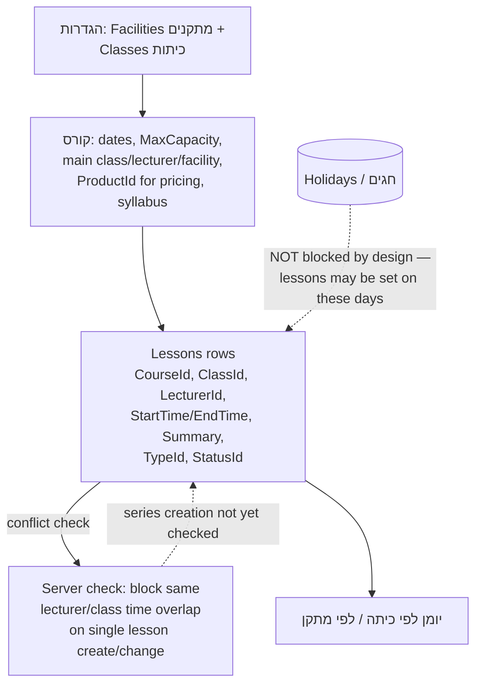
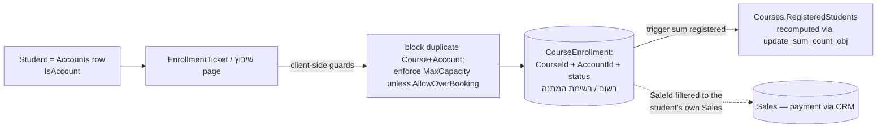
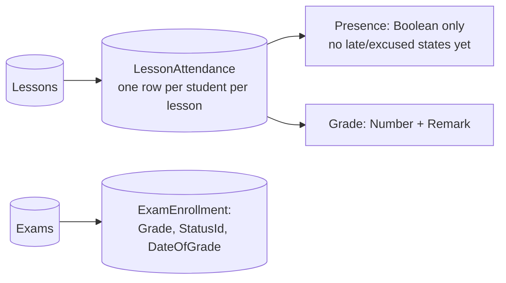

# MyCollege — Courses & Training Module

> **Purpose:** Reference for MyCollege (apps/mycollege/): courses, enrollment (שיבוץ), lessons (שיעורים), attendance (נוכחות), exams (בחינות), students, lecturer/student portals — covering both the **2026-06 reworked product** and the **legacy install** an implementer may still meet at existing customers.
> **Last updated:** 2026-06-23 · **Status:** reworked 2026-06 (architecture verified live; backlog tracked in §8)

## 0. What changed in the 2026-06 rework (read first)

The audited legacy module reused core tables for everything and shipped **zero** module automations. The 2026-06 round of improvements changed the foundations. Verified live:

- **Lessons are now a dedicated table.** `Lessons` (+ `LessonTypes`, `LessonStatuses`) replaces the old "a lesson is an `Activities` row" reuse. `Activities` on the reworked install carries **no** college fields anymore. The dedicated `Lessons.Summary` field fixes the long-standing "lesson summary lost on save" bug.
- **Attendance is now a dedicated table.** `LessonAttendance` (→`Lessons`, →`Accounts`) replaces `ActivityAdditionalAccounts`. `Presence` is still **Boolean only** — multi-state attendance was *not* built (see §8 open items).
- **A real module trigger ships:** `CourseEnrollment` → "sum registered" (HTTP to the GCP `update_sum_count_obj` rollup helper) maintains the `Courses.RegisteredStudents` counter on enrollment create/update.
- **Capacity + duplicate-enrollment are enforced** (client-side in the שיבוץ/enrollment page JS), and **server-side scheduling-conflict** checks (same lecturer/class overlap) run in a cloud function for single-lesson create/change.
- **Dedicated roles ship:** `Lecturer`, `Student Portal`, `College Admin`. `Lecturers.SelectionLocked` (Boolean) was added to auto-block a lecturer from further selection.
- **Dedicated card pages + design-system alignment:** new `Course`, `Lecturer`, `Class`, `Facility` cards; staff lists open records in a side-modal; chrome restyled to the unified design system.

> **Two architectures coexist in the field.** New/updated installs run the dedicated-`Lessons`/`LessonAttendance` model below. **Existing customer colleges may still run the legacy Activities-reuse model** (lessons = `Activities`, attendance = `ActivityAdditionalAccounts`, no triggers). Always confirm against the live tenant which one you are on before fit-gap or support work. Legacy specifics are flagged **[legacy]** throughout.

## 1. What the module does

MyCollege manages **instructor-led training**: courses (קורסים) with scheduled lessons, classrooms (כיתות) and facilities (מתקנים), lecturers (מרצים), student enrollment (שיבוץ לקורסים), per-lesson attendance (נוכחות), exams (בחינות) with grades, holiday/vacation handling, and a **student portal**. It is a market app installed under `apps/mycollege/`.

Design keystone: **students are still core `Accounts`** (the page filters by a hidden `IsAccount` flag), so CRM data — sales, communication, campaigns — is immediately available for students. **Lessons and attendance, however, now live in dedicated tables** (the rework's main structural change), removing the denormalization bugs that the Activities/`ActivityAdditionalAccounts` reuse caused. It remains a scheduling-centric classroom-training product, **not** an e-learning LMS (no video lessons, online quizzes, or per-lesson time tracking — see §9).

## 2. Entity table (live, reworked install)

| Entity | Hebrew UI name | DB table | Purpose / key fields |
|---|---|---|---|
| Course | קורס | `Courses` | `Name`, `Description`, `Color`, `StartDate`/`EndDate`, `NumberOfLessons`, `MaxCapacity`, `AllowOverBooking` (Boolean), `RegisteredStudents` (Number, **now trigger-maintained**, §6), `MainClassId`→Classes, `MainLecturerId`→Lecturers, `FacilityId`→Facilities, `StatusId`→CourseStatuses, `ProductId`→Products (price linkage), `syllabus` (File), `Comments`, `Owner`→_User |
| Course status | סטטוס קורס | `CourseStatuses` | `Name`, `IsOpen` (Boolean) |
| Enrollment | שיבוץ לקורס | `CourseEnrollment` | `CourseId`, `AccountId` (the student), `SaleId`→Sales (payment linkage, **now filtered to the student's own Sales**), `CourseEnrollmentStatusId`→CourseEnrollmentStatus, `Date`, `OwnerId` |
| Enrollment status | סטטוס שיבוץ | `CourseEnrollmentStatus` | `Name`, `IsRegistered` (Boolean). Live seeds: `רשום`, `סיום קורס`, `ביטל`, `רשימת המתנה` |
| Student | סטודנט | **`Accounts` (reused)** | Marked by hidden `IsAccount`; portal link `StudentPortal`→`_User`. (No dedicated Student table — see §8.) |
| **Lesson** | שיעור | **`Lessons` (dedicated — new)** | `Name`, `CourseId`→Courses, `ClassId`→Classes, `LecturerId`→Lecturers, `FacilityId`→Facilities, `StartTime`/`EndTime` (Date), `LessonCount` (Number), `DayOfWeek` (String), `Summary` (String — fixes the summary-loss bug), `TypeId`→LessonTypes, `StatusId`→LessonStatuses, `OwnerId`→_User |
| Lesson type / status | סוג / סטטוס שיעור | `LessonTypes`, `LessonStatuses` | `Name` lookups. `LessonTypes` seed: `שיעור`. `LessonStatuses` ships **unseeded** — seed a lifecycle (נקבעה/בוצעה/בוטלה/נדחתה) per install if status logic is needed (§8). |
| **Attendance** | נוכחות | **`LessonAttendance` (dedicated — new)** | `LessonId`→Lessons, `AccountId`→Accounts, `Presence` (**Boolean only**), `Grade` (Number), `Remark` |
| Class(room) | כיתה | `Classes` | `Name`, `FacilityId`→Facilities, `Location`, `MaxCapacity` (Number, informational), `Comments` |
| Lecturer | מרצה | `Lecturers` | `Name`, `PhoneNumber`, `Email`, `Comments`, `SelectionLocked` (Boolean — new). Still **no login/`_User` link field** (§8) |
| Facility | מתקן | `Facilities` | `Name`, `City`, `Address`, `Email`, `PhoneNumber`, `Comments` |
| Exam | בחינה | `Exams` | `Name`, `CourseId`, `StartTime`/`EndTime`, `Facility`→Facilities, `Class`→Classes, `Note` |
| Exam enrollment | שיבוץ לבחינה | `ExamEnrollment` | `ExamId`, `AccountId`, `Grade` (Number), `StatusId`→ExamEnrollmentsStatus, `DateOfGrade` |
| Exam enrollment status | — | `ExamEnrollmentsStatus` | `Name` lookup — ships **unseeded** (§8) |

**[legacy] superseded tables/fields:** on pre-rework installs lessons are `Activities` rows (extra fields `CourseId`/`ClassId`/`FacilityId`/`LecturerId`/`LessonCount`/`DayOfWeek`), attendance is `ActivityAdditionalAccounts`, `CourseEnrollment` also carried an `updatedByTrigger` guard String, and `Courses` carried `CourseCategory`→`CourseCategoryList`. None are present on the reworked install. ⚠️ A **`Holidays`** table existed on the legacy install but is **absent** on the reworked reference install, even though the חופשות וחגים pages remain — confirm holiday handling per install (§5/§8).

## 3. Page map (live Get-Site-Pages)

### 3.1 Internal (staff) pages

| Page (`apps/mycollege/...`) | Menu label | Notes |
|---|---|---|
| `Master`, `MasterPortal` | — | Masters. ⚠️ No dedicated `MasterTicket` for MyCollege — card "chrome" is approximated via design-system CSS; the clean fix is to create a `MasterTicket` from CRM's. |
| `dashboard` | מבט על | Filter forms; still effectively **no real KPI widgets** (§8) |
| `Courses` (list) + **`Course`** (card) | קורסים | Duplicate `MainClassId` field on the card was removed in the rework |
| `Students` | סטודנטים | Accounts list (hidden `IsAccount`); the student card is the **CRM Account card opened in an iframe** |
| `Enrollment` (list) + `EnrollmentTicket` (card) | שיבוץ לקורסים | AccountId picker filtered to students; SaleId filtered to the student's own Sales |
| **`Lessons`** (list) + `Activity` (card) | שיעורים | List bound to the dedicated `Lessons` table; phantom `Status` filter removed |
| `CoursesCalendar` | יומן לפי כיתה | Hardcoded demo options replaced with data-driven pickers; old **3-class cap removed** |
| `FacilityCalendar` | יומן לפי מתקן | Calendar by facility |
| **`Lecturer`** (card) + `Lecturers` (list) | מרצים | Dedicated lecturer card (Name/Phone/Email/`SelectionLocked`/Comments) |
| **`Class`** (card) + **`Facility`** (card) + `Classes` (list) | הגדרות → כיתות ומתקנים | New dedicated cards for Class and Facility |
| `Exams` (list) + `Exam` (card) | בחינות | Exam list + card |
| `attendance` | (lecturer flow) | Attendance roster; gated `loginOnly:true` (Lecturer/College Admin/Admin) |
| `holidays` + `Holidaysandvacations` | הגדרות → חופשות וחגים | Menu uses `Holidaysandvacations`; `holidays` is a leftover duplicate. ⚠️ Backing table absent on the reference install. |
| `Settings` | הגדרות | Thin/placeholder hub — a real Settings hub is open (§8) |
| `login`, `lecturerLogin` | — | Rework fixed the lecturerLogin double-prefix redirect (404-after-login) and the `סיסימא` typo |
| `ComingSoon` | — | Placeholder |

### 3.2 Student portal pages (master: `MasterPortal`) — **out of scope of the 2026-06 rework**

The portal was excluded from the rework, so audit defects below **still stand**. Roles now exist (`Student Portal`), but page gating is still weak.

| Page | PortalMenu label | Standing defect |
|---|---|---|
| `Portal-MyCourses` | הקורסים שלי | `loginOnly:true` but `allowedRoles:'any'` |
| `Portal-Course` | (course detail) | Debug leftovers `{{{objectid}}}` |
| `Portal-Lessons` | שיעורים קרובים | Debug `{{{objectid}}}` leftover |
| `Portal-Exams` | — (not in menu) | Title wrongly says "שיעורים קרובים"; debug leftover |
| `Portal-PersonalInfo` | פרטים אישיים | Edits the `Accounts` row — shared Account → leaked edits |
| `Portal-Payment` | תשלומים | Debug `{{{objectid}}}` leftover |
| `Portal-Shop` | חנות והטבות | Static content blocks, no data binding |
| `Portal-Contact` | צור קשר | Hardcoded fake contact data; form writes to `Cases` |

**MainMenu (live order):** מבט על → קורסים → סטודנטים → שיבוץ לקורסים → יומן לפי כיתה → יומן לפי מתקן → מרצים → שיעורים → בחינות → הגדרות (כיתות ומתקנים · חופשות וחגים).
**PortalMenu (live):** הקורסים שלי → שיעורים קרובים → פרטים אישיים → תשלומים → חנות והטבות → צור קשר.
**Roles shipped (live):** `College Admin`, `Lecturer`, `Student Portal` (in addition to the CRM core roles).

## 4. Core flows

### 4.1 Course setup & lesson scheduling (reworked)

### 4.2 Enrollment (שיבוץ) and payment (reworked)

### 4.3 Attendance & grading (reworked)

## 5. Configuration points

| Area | Where | Notes |
|---|---|---|
| Classes & facilities | הגדרות → כיתות ומתקנים | Define before courses; class `MaxCapacity` is informational |
| Course statuses | `CourseStatuses` table | `IsOpen` drives open/closed logic |
| Enrollment statuses | `CourseEnrollmentStatus` table | `IsRegistered` flag; seeds: רשום / סיום קורס / ביטל / רשימת המתנה |
| Lesson types / statuses | `LessonTypes` / `LessonStatuses` | `LessonTypes` seed `שיעור`; `LessonStatuses` unseeded — add a lifecycle if cancelled/rescheduled handling is needed |
| Holidays | הגדרות → חופשות וחגים | ⚠️ Backing table absent on reference install; **scheduling is not blocked on holidays by design**. Holiday-aware series + calendar overlay remain open (§8) |
| Capacity / overbooking | `Courses.MaxCapacity` + `AllowOverBooking` | Both exposed and enforced client-side at enrollment; server-side guard still advisable for API/import paths |
| Student portal access | `Accounts.StudentPortal` → `_User`; `Student Portal` role | Per-student portal user; portal page gating still weak (§3.2) |
| Lecturer access | `Lecturer` role; `Lecturers.SelectionLocked` | `lecturerLogin` redirect fixed; lecturer `_User` provisioning from the page still incomplete (§8) |
| Course pricing | `Courses.ProductId` + `CourseEnrollment.SaleId` | Billed as a CRM Sale → MyBooks; SaleId constrained to the student's Sales |
| Calendars | `CoursesCalendar`, `FacilityCalendar` | Demo-user hardcoding removed; 3-class cap removed; per-lecturer / per-course calendars still open (§8) |
| Dashboard | `dashboard` page | No real KPI widgets yet — build per customer (`myb-p-dashboards`) |

## 6. Automation state (live Get-Triggers + rework)

The legacy install shipped **zero** module triggers. The reworked install ships **one** module trigger plus server-side checks:

- ✅ **`CourseEnrollment` → "sum registered"** — HTTP to the GCP `update_sum_count_obj` rollup helper on create/update, watching `CourseEnrollmentStatusId`/`CourseId`; maintains `Courses.RegisteredStudents`. (That rollup helper can fail silently — prefer a live recompute in capacity logic rather than trusting the stored value.)
- ✅ **Scheduling conflict** — a cloud function blocks a single lesson (create/change) that overlaps the same lecturer/class. **Series creation is not yet checked.**
- ✅ **Capacity + duplicate-enrollment** — enforced client-side in the שיבוץ/enrollment page JS.
- ⛔️ **Holiday collision** — intentionally **not** enforced (so lessons can be scheduled on holidays/vacation days).

Still missing (becomes implementation work — and see §8):

- Server-side (authoritative) capacity / duplicate / waiting-list automation; waiting-list auto-promotion when a seat frees.
- Welcome email/SMS/WhatsApp on enrollment; payment-confirmation flow; auto-create/link Sale on enrollment.
- Lesson & exam reminders **to students** (the only scheduled trigger targets staff).
- Multi-state attendance, post-lesson lock/sign, attendance reports, low-attendance alerts.
- Exam pass/fail computation, final-grade rollup to the enrollment, course-completion status transition, certificate generation (no Certificates table exists).
- Lesson lifecycle (cancel cascade, cancelled-lesson rendering, exclude cancelled from attendance).

## 7. Cross-module touchpoints

| Module | Touchpoint |
|---|---|
| CRM Core | Students are `Accounts`; **lessons are no longer `Activities`** (dedicated `Lessons`) so generic Activities automations no longer hit lessons; portal contact form writes `Cases` |
| Sales / MyBooks | `CourseEnrollment.SaleId` + `Courses.ProductId` — tuition billed as a CRM Sale → MyBooks documents; Portal-Payment surfaces payments |
| MyCampaigns | Student communication via groups on Accounts; no native course-group integration ⚠️ |
| TimeSheet | `Facilities` is shared with the Projects/TimeSheet domain — see [06-timesheet.md](06-timesheet.md) |

## 8. Round-of-improvements status (2026-06 "מקצה שיפורים")

The plan classified 70 items across L1 (hygiene/correctness), L2 (deepen existing features), L3 (new LMS-class features); the portal was out of scope.

### ✅ Done / implemented (verified live)

- **Architecture:** dedicated `Lessons`/`LessonTypes`/`LessonStatuses` + `LessonAttendance` tables (lessons/attendance split off `Activities`).
- **Lesson summary saves** (`Lessons.Summary`).
- **Enrollment-counter trigger** maintains `RegisteredStudents`; **capacity + duplicate-enrollment** enforced (client-side); **SaleId** constrained to the student's Sales.
- **Single-lesson scheduling-conflict** check (lecturer/class overlap).
- **Calendars:** demo-user hardcoding removed; **3-class cap removed**.
- **Security/hygiene:** staff pages behind login; status filters de-hardcoded to flag/name (survive a tenant clone); `CourseEnrollmentStatus.IsRegistered` seeded + default-status on enrollment; lecturerLogin 404-redirect fixed; dashboard typo/duplicate-id cleanups; duplicate `MainClassId` removed; copy-paste form-name fixes.
- **Lecturer `SelectionLocked`** added; referential-integrity protection added at DB level for Classes/Facilities/Lecturers.
- **Roles:** `Lecturer`, `Student Portal`, `College Admin` ship.
- **UI:** dedicated `Course`/`Lecturer`/`Class`/`Facility` cards; side-modal record opening; design-system alignment.

### ⏳ Still open (Gap / future work — fit-gap as Custom unless built)

- **Multi-state attendance** (present/absent/late/excused, reason, timestamp, lock/sign) — `Presence` is still Boolean.
- **Flexible lesson-series generator** (twice-a-week, custom interval, end-by-date, holiday-aware with make-up lessons) — legacy fixed 7/14/21/28/42/56-day intervals only.
- **Holiday handling** — no holiday-aware scheduling or calendar overlay; backing table not present on the reference install.
- **Waiting-list auto-promotion**; **server-side** capacity/duplicate guards.
- **Enrollment automations:** welcome communication, payment-on-enrollment / auto-Sale, lesson & exam reminders to students.
- **Self-enrollment** public form (web2lead) and **bulk/group enrollment** with pricing.
- **Exams & grading:** seed `ExamEnrollmentsStatus` + `IsPass`, pass/fail vs `PassingGrade`, final-grade rollup, auto-transition to `סיום קורס`.
- **Certificates** — no `Certificates` table and no auto-issue on completion.
- **Reports & dashboard** — attendance %/roster reports, grade sheet / graduates report, a real courses analytics dashboard.
- **Lesson lifecycle** — seed a `LessonStatuses` lifecycle, cancel cascade, distinct cancelled/rescheduled rendering in calendars.
- **Lecturer login** — `_User` link + provisioning action so `lecturerLogin` is usable; lecturer/portal page set + permissions need full speccing.
- **Course materials** repository (multi-file per course/lesson) — only `Courses.syllabus` single file today.
- **Settings hub** — unified lookup/policy management page.
- **Student discriminator** — students are any `IsAccount`; a real `IsStudent`/`AccountType=Student` discriminator (and fencing the cross-cutting Accounts triggers off student rows) is unresolved.

## 9. ⚠️ Source note — the draft guides were partly prescient

Older draft guides described a `Lessons` table and an e-learning LMS (video lessons, auto-graded quizzes, auto-issued certificates, time-on-lesson). The 2026-06 rework **did** introduce a dedicated `Lessons` table, so that part is now real — but the **e-learning** behaviors and tables (`ExamQuestions`, `StudentExams`, `StudentAnswers`, `Certificates`, etc.) still **do not exist**. MyCollege remains scheduling-centric classroom training, not an LMS.

## Limitations & gotchas

1. **Confirm the architecture first.** New installs use dedicated `Lessons`/`LessonAttendance`; **legacy installs still reuse `Activities`/`ActivityAdditionalAccounts`** with zero triggers. Everything below assumes the reworked model unless marked **[legacy]**.
2. **Students = Accounts.** Accounts-wide automation (lead scoring, campaigns, the shipped account-status triggers) also hits students — fence triggers with `IsAccount` / a student discriminator.
3. **Attendance Boolean ceiling.** `LessonAttendance.Presence` is Boolean; multi-state attendance needs an `AttendanceStatuses` table + fields — recurring paid customization.
4. **Holidays are not enforced** (and the backing table may be absent) — holiday-aware scheduling and a calendar overlay are not built.
5. **The enrollment counter trusts a GCP rollup** that can fail silently — capacity logic should recompute live, not read the stored `RegisteredStudents`.
6. **Capacity/duplicate guards are client-side** — API/import/web2* paths bypass them; add a server-side `beforeSave` if those paths are in use.
7. **Lecturer login is half-wired** — role + login page + redirect fix exist, but provisioning a lecturer `_User` from the page does not.
8. **Portal still carries audit defects** (debug `{{{objectid}}}` leftovers, `allowedRoles:'any'`, Portal-Contact fake data writing Cases, shared-Account edit leaks) — the rework excluded the portal.
9. **Per-install hygiene** — duplicate `holidays`/`Holidaysandvacations` pages, `ComingSoon` placeholder, no MyCollege `MasterTicket` (card chrome is CSS-approximated).
10. Module menus use MongoDB-format `_id`s — menu edits must respect the "menu items use MongoDB-format IDs" rule.
