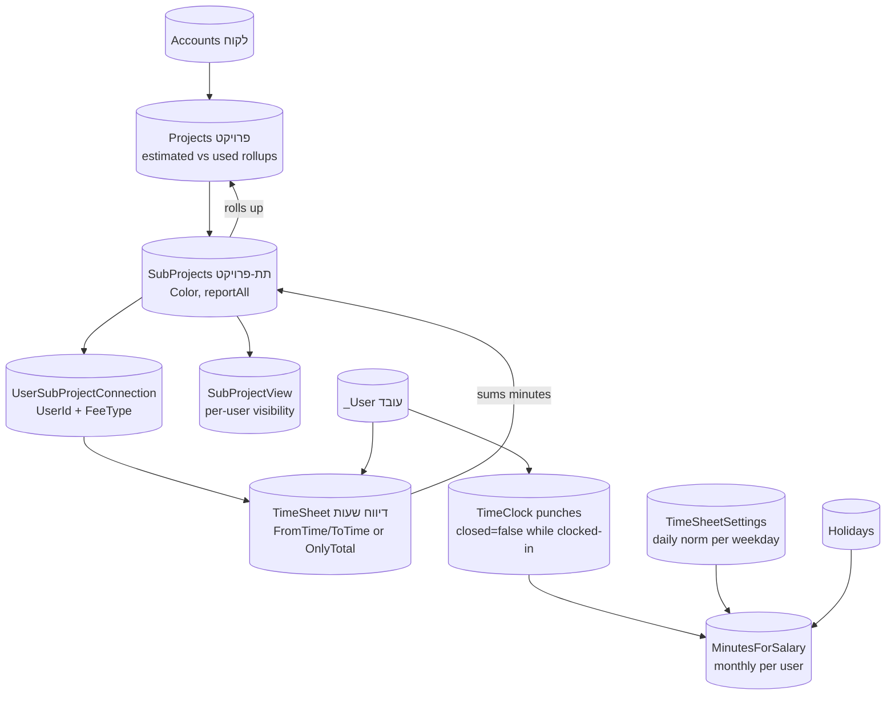
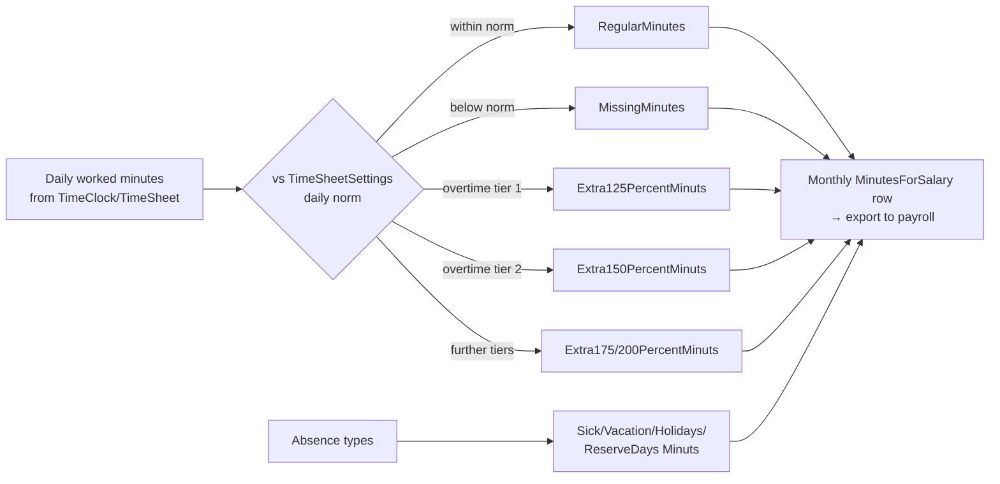

# TimeSheet — Projects, Time Tracking & Salary Module

> **Purpose:** Reference for the TimeSheet module (apps/timesheet/): projects/sub-projects, time reporting, attendance clock, and monthly salary-minutes calculation.
> **Last updated:** 2026-06-10 · **Status:** draft

## 1. What the module does

TimeSheet ("מעקב שעות עבודה וניהול זמן" per the system-tour draft) covers three connected jobs:

1. **Project time tracking** — customers (לקוחות) own projects (פרויקטים) broken into sub-projects (תתי-פרויקטים); users report worked time against sub-projects; estimated-vs-used hour totals roll up.
2. **Attendance clock** (שעון נוכחות) — clock-in/out punches per user/day (`TimeClock`).
3. **Salary preparation** — monthly per-user aggregation into Israeli-payroll buckets: base hours, 125%/150%/175%/200% overtime, sick/vacation/holiday/reserve-duty (מילואים) minutes (`MinutesForSalary`).

⚠️ **Module not present in the demo environment**: `Get-Site-Pages` returns **no `apps/timesheet/` pages** on app <appId>, and there is no `install-timesheet` page. The URL path `apps/timesheet/` comes from the project module list in `CLAUDE.md`. All 12 tables exist in the shared schema (they ship in the platform DB), so the data model below is verified; **page-level flows are not** and are marked accordingly. To document the UI, audit a customer environment that licenses the module (e.g., שינדלר uses attendance + TimeSheet per the MyCollege audit).

## 2. Entity table

| Entity | Hebrew name | DB table | Purpose / key fields |
|---|---|---|---|
| Project | פרויקט | `Projects` (16 fields) | `Name`, `AccountId`→Accounts (the paying customer), `ProjectType`→ProjectTypes, `comment`; rollups: `TotalHoursEstimated`/`TotalHoursUsed`/`totalHoursDiff` (display **Strings**) + `TotalHoursEstimatedMinutes`/`TotalHoursUsedMinutes`/`totalHoursDiffMinutes` (Numbers) |
| Project type | סוג פרויקט | `ProjectTypes` (9 fields) | `Name`, `Time` (Number), `EstimatedTime` (String) — default estimate per type ⚠️ semantics inferred from names, UNVERIFIED |
| Sub-project | תת-פרויקט | `SubProjects` (18 fields) | `Name`, `ProjectId`, `AccountId`, `Color`, `comment`, `reportAll` (Boolean), same dual String+Minutes hour rollups as Projects |
| Sub-project visibility | — | `SubProjectView` (8 fields) | Pure junction `SubProjectId` + `UserId` — which users see/report on which sub-project ⚠️ exact UI meaning UNVERIFIED |
| User↔sub-project assignment | שיוך עובד | `UserSubProjectConnection` (11 fields) | `UserId`, `AccountId`, `ProjectId`, `SubProjectId`, `FeeType`→FeeType — assignment incl. billing-fee type (FeeType is a Financial-domain lookup) |
| Time report | דיווח שעות | `TimeSheet` (14 fields) | `UserId`, `SubProjectsId`→SubProjects (note the field-name plural), `FromTime`/`ToTime` (Dates), `TotalTime`/`TotalMinutes` (Numbers), `OnlyTotal` (Boolean — report a total without from/to times), `Description` |
| Attendance punch | שעון נוכחות | `TimeClock` (14 fields) | `UserId`, `FromTime`/`ToTime`, `TotalMinutes`, `closed` (Boolean — open punch = clocked-in), `AccountId`→Accounts, `DayOfWeek`→DayOfWeekList, `Comment` |
| Weekday norms | — | `TimeSheetSettings` (13 fields) | One Number per weekday `Sunday`…`Saturday` — expected base work minutes/hours per day used as the overtime threshold ⚠️ unit & exact use UNVERIFIED |
| Monthly salary roll-up | דוח לשכר | `MinutesForSalary` (21 fields) | Per `UserId` + `Date`: `BaseWorkMinutes`, `RegularMinutes`, `Extra125PercentMinuts`, `Extra150PercentMinuts`, `Extra175PercentMinuts`, `Extra200PercentMinuts` (sic — "Minuts" typo is the real field spelling), `MissingMinutes`, `TotalWorkMinuts`, `TotalSickDaysMinuts`, `TotalVacationMinuts`, `TotalHolidaysMinuts`, `TotalReserveDaysMinuts`, `Comment` |
| Weekday lookup | — | `DayOfWeekList` (8 fields) | `Name`, `Order` — shared with MyCollege lesson scheduling |
| (Shared) | חגים / מתקנים | `Holidays`, `Facilities` | Grouped in the same Projects domain by the metadata catalog; used by salary holiday-minutes and by MyCollege |

## 3. Data-model flow

### Salary bucket calculation (Israeli payroll model)

⚠️ The tier thresholds (e.g., first 2 overtime hours at 125%, then 150%) follow Israeli labor-law convention implied by the field names; the computing code (cloud function/trigger) was not inspected — UNVERIFIED.

## 4. Page map

No live pages available (module not installed on demo). Expected path pattern: `https://<numericId>.mbapps.co.il/apps/timesheet/<pageName>` per the platform convention. ⚠️ Page names UNVERIFIED — to be filled from a licensed customer environment. JIRA ticket "טיימשיט - הצגת שעות בדשבורד הבסיסי" (MYBP) confirms a basic dashboard page exists in the shipped app.

## 5. Configuration points

| Area | Mechanism | Notes |
|---|---|---|
| Project taxonomy | `ProjectTypes` lookup | Per-type default time estimates |
| Daily work norms | `TimeSheetSettings` (per-weekday numbers) | Drives overtime/missing-minutes split; one global record set ⚠️ scoping (global vs per-user) UNVERIFIED |
| Worker assignment | `UserSubProjectConnection` (+`FeeType`) | Determines who may report on what and at which fee class |
| Sub-project visibility | `SubProjectView`, `SubProjects.reportAll` | `reportAll=true` likely opens the sub-project to all reporters ⚠️ UNVERIFIED |
| Holidays | `Holidays` table | Feeds `TotalHolidaysMinuts` salary bucket; shared with MyCollege |
| Absence types | Sick/Vacation/Holiday/Reserve buckets on `MinutesForSalary` | How absences are *entered* (UI vs trigger) ⚠️ UNVERIFIED |

## 6. Cross-module touchpoints

| Module | Touchpoint |
|---|---|
| CRM Core | `Projects.AccountId`, `SubProjects.AccountId`, `TimeClock.AccountId` → customer-billable time; users are `_User` rows. JIRA "דיווח שעות מתוך פניה" (MYPROJ) = recurring request to report time **from a Case card** — not native (gap) |
| MyBooks | `FeeType` (Financial domain) on assignments implies billing-rate classes; invoicing reported hours to the customer happens via Sales/MyBooks documents — no direct automation found ⚠️ |
| MyCollege | Shares `DayOfWeekList`, `Holidays`, `Facilities` (same metadata domain); customer שינדלר combines MyCollege attendance with TimeSheet |
| Reports | Salary export = query on `MinutesForSalary` ("דוח לשכר" JIRA); hour-balance dashboards built with standard report/dashboard tooling |

## 7. Real-world issue themes (JIRA grep)

- "דיווח שעות תחת פרוייקט דרך כניסה ויציאה" (MYPROJ) — punch-style reporting per project (TimeClock↔TimeSheet hybrid demand).
- "דיווח שעות מתוך פניה" (MYPROJ) — report hours from a Case; module has no Case linkage on `TimeSheet` (only sub-project).
- "שינדלר (ובכללי) - נוכחות - דיווח שעות עבודה לא נסכם" — worked-hours not summing (rollup/trigger fragility).
- "שינדלר - דיווח שעות מעדי לערן איטי מאוד ונתקע" — performance complaints on the reporting UI.
- "תקלה בתצוגת שעות בדיווח שעות" — hour-display defects.
- "קישור לקוחות נוספים לדיווח שעות" — need to link additional customers to a time report (single `AccountId` limitation).
- "TimeSheet and projects extensions" (MYBP, ×2) + "TimeSheet - הדרכה" (×2) — ongoing extension work and customer training engagements.
- "דוח לשכר" — salary-report requests.

## Limitations & gotchas

1. **Not installed by default** — TimeSheet is a separately-licensed market app; the demo lacks it entirely. Never promise UI behavior without checking the customer's environment.
2. **Dual hour storage**: Projects/SubProjects keep totals both as display Strings (`TotalHoursUsed`) and as Numbers (`...Minutes`). Reports and triggers must use the `*Minutes` fields; the Strings are formatted artifacts and unsortable.
3. **Denormalized rollups**: estimated/used/diff totals on Projects/SubProjects are maintained values; JIRA shows them going un-summed. Verify the maintaining automation per customer before trusting the numbers.
4. **Real field-name traps** (exact spellings): `TimeSheet.SubProjectsId` (plural "s"), `Extra125PercentMinuts`/`TotalWorkMinuts` etc. ("Minuts" typo), lowercase `comment`/`totalHoursDiff` next to PascalCase siblings. Copy names from `Get-Schema`, never from memory.
5. **`OnlyTotal` mode** lets users report a total without from/to times — time-overlap validations can't apply to such rows.
6. **Open punches**: `TimeClock.closed=false` rows are in-progress; salary aggregation that ignores them undercounts the current day.
7. **No native Case/Task time tracking** — time attaches to sub-projects only; "hours per פנייה" is custom work.
8. **Salary tiers are computed, not stored rules**: there is no visible settings table for the 125/150/175/200 thresholds; assume server-side logic and test with a known month before payroll cutover. ⚠️ UNVERIFIED.
9. `TimeSheetSettings` keys are weekday names (Sunday…Saturday) with numeric values and no documented unit — calibrate against a known employee before relying on Missing/Extra splits.
