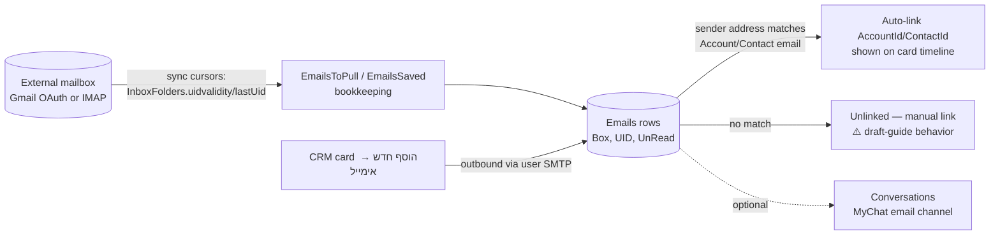

# MyInbox & Miscellaneous Apps (Commerce, Portal, Installers)

> **Purpose:** Reference for MyInbox (email management — minimal module) plus a catalog of every other app path found live that the sibling module docs don't cover: ecommerce/mycommerce storefronts, top-level store pages, customer portal, app installers.
> **Last updated:** 2026-06-10 · **Status:** draft

---

## Part A — MyInbox (ניהול דוא"ל)

### A.1 Module status: minimal, data-layer-first

- The official support site has a **MyInbox category with zero published guides** (taxonomy_index.md) — consistent with the the project reference description "MyInbox: Email management (minimal)".
- The demo environment has **no `apps/myinbox/` pages**; only the installer page `apps/mybusiness/install-myinbox` exists (live Get-Site-Pages). ⚠️ The installed app's own page map is therefore UNVERIFIED — document from a customer environment that has it installed.
- What *is* solid: the **email data layer is fully present in every environment** and is shared by CRM core (manual emails from cards, page `apps/mybusiness/Email`), MyChat email channels, and triggers.

### A.2 Entity table (verified schema)

| Entity | Hebrew name | DB table | Purpose / key fields |
|---|---|---|---|
| Email | אימייל | `Emails` (38 fields) | One message, inbound or outbound. Addressing: `MailFrom`, `MailTo`, `CC`, `BCC`, `Subject`, `Body` (HTML), `Text`, `SentToName`, `HasAttachments`. Sending: `SendAt`, `SendStatus`, `ErrorMessage`, `SMTPId`→SMTP. Threading: `MessageId`, `InReplyTo`, `References` (Array), `xgmmsgid` (Gmail message id). Mailbox sync: `Box`, `FolderId`→InboxFolders, `UID`, `UnRead`, `DeletedAt`. CRM links: `AccountId`, `ContactId`, `SaleId`, `CaseId`, `TaskId`, `ActivityId`, `ConversationId`, `UserId`, `GeneralLogId`. Search: `SearchField` |
| Mail account | חשבון דוא"ל | `SMTP` (referenced as `targetClass` by `Emails.SMTPId`, `InboxFolders.SmtpId`, `EmailsToPull`, `EmailsSaved`) | The connected mailbox (SMTP+IMAP credentials). ⚠️ Not listed in the 196-table catalog (internal/hidden class); enumerate via MCP `Get-SMTP-Accounts` — returns `[]` on the demo |
| Inbox folder | תיקייה | `InboxFolders` (10 fields) | `Name`, `SmtpId`, `uidvalidity`, `lastUid` — IMAP folder sync cursors |
| Pull queue | — | `EmailsToPull` (8 fields) | `Emails` (Array) + `SMTPId` — fetch bookkeeping |
| Saved marker | — | `EmailsSaved` (8 fields) | `SMTPId` + `EmailNumber` — highest synced message marker |
| Email template | תבנית מייל | `EmailTemplate` (10 fields) | `Name`, `HTML`, `UserId` — shared with MyCampaigns and chatbot email steps |

### A.3 Flow — mailbox to CRM timeline

Setup paths (per draft guides + corroborating live pages `apps/mychat/gmail-oauth`, `apps/mychat/settings-imap`, `apps/mychat/email-settings`):
- **Gmail**: OAuth consent flow (no password stored) — ⚠️ draft; the live `gmail-oauth` page confirms the mechanism exists at least for MyChat.
- **IMAP**: server/port 993/SSL + username/password (app password under 2FA), plus SMTP for outbound (see SMTP guide 5498 — verified, published).
- Guide 7542 (verified, published): mailboxes already connected "דרך מודול MyInbox" are offered in MyChat for channel binding ("שייך לערוץ") — MyInbox accounts and MyChat email channels are the same underlying SMTP records.

### A.4 Cross-module touchpoints

| Module | Touchpoint |
|---|---|
| CRM Core | `apps/mybusiness/Email` page; manual email from any card (הוסף חדש → אימייל) sends via the user's SMTP and logs to `Emails` + timeline (`_Timeline`) |
| MyChat | Email channels reuse MyInbox-connected accounts; `Emails.ConversationId` ties messages to MyChat threads — see [04-mychat.md](04-mychat.md) |
| MyCampaigns | Shares `EmailTemplate`; bulk sends bypass `Emails` and log to `CampaignSentLog`/`_syslogCampaignEmails` instead — see [03-mycampaigns.md](03-mycampaigns.md) |
| Triggers | Email trigger-actions depend on the same per-user SMTP configuration |

### A.5 MyInbox limitations & gotchas

1. **Whole-module ⚠️**: no published guides, no demo install — UI claims (folders view, manual link button, search/filters) come from *draft* docs only.
2. `Emails` carries **six parallel CRM link pointers** (Account/Contact/Sale/Case/Task/Activity) — when building queries ("all mail for this customer") filter on AccountId, but remember mail may be linked only at Contact or Case level.
3. Auto-link is by exact email-address match (draft + MyChat-analogous behavior); aliased/forwarded addresses won't match.
4. `SMTP` is not a user-visible table; audits must go through `Get-SMTP-Accounts` (and remember it returns secrets-adjacent config — never copy into docs).
5. Deleting mail in the external mailbox vs in CRM: `DeletedAt` exists on `Emails`, but sync-back semantics are ⚠️ UNVERIFIED.

---

## Part B — Miscellaneous app paths discovered via Get-Site-Pages

The live demo exposes these app families beyond the documented modules ([01-crm-core](01-crm-core.md), [02-mybooks](02-mybooks.md), [03-mycampaigns](03-mycampaigns.md), [04-mychat](04-mychat.md), [05-mycollege](05-mycollege.md), [06-timesheet](06-timesheet.md)):

### B.1 Commerce apps — `apps/ecommerce/` (21 pages) and `apps/mycommerce/` (22 pages)

Two near-identical storefront-management app installs (mycommerce adds `LoginOld`; page sets otherwise mirror each other):

| Page group | Pages | Role |
|---|---|---|
| Catalog | `Products`, `Edit-Product`, `Categories`, `StoreItems`, `Variants-Settings` | Product/category/variant management |
| Orders | `Orders`, `Edit-Order` | Order processing |
| Promotions | `Coupons`, `Edit-Coupons` | Coupon management |
| Customers | `Accounts`, `Edit-Account` | Store-side customer view |
| Commerce settings | `General-Settings`, `Settings`, `Payment-Settings`, `Tax-Settings`, `Tax-Rule`, `Shipping-Settings`, `Shipping-Rule` | Payment/tax/shipping rules |
| Shell | `Dashboard`, `Master`, `Login` (+`LoginOld` in mycommerce) | App frame |

Distinct menu records exist per app (live Get-Menus: `Menu-3` marketApp `5a65edf2507c5c001a3905b2`; `Menu-1` marketApp `589aeb41f638f9a6253e4403`). ⚠️ Which of the two apps is the current offering, and whether both ship to customers, is UNVERIFIED — they look like an old/new generation pair. The installer `apps/mybusiness/install-mycommerce` exists; CLAUDE.md's module list does not mention commerce at all, suggesting it is not part of the core ~84-customer offering.

### B.2 Top-level storefront pages (no `apps/` prefix)

`cart` ×4, `checkout` ×4, `Product` ×4, `success` ×4, `terms` ×4, `portal` ×1 — duplicated page sets at site root, evidently instantiated per store template/storefront. ⚠️ Inferred: these are the public shop pages that pair with the commerce apps. The single `portal` page is the public entry for the customer portal.

### B.3 App-market installers (inside `apps/mybusiness/`)

`install-mybooks`, `install-mycampaigns`, `install-mycommerce`, `install-myinbox` — in-CRM installer pages for adding market apps to a tenant. Every menu row carries a `marketApp` id (Get-Menus), confirming the platform's app-market packaging: CRM core `5a8ebcecca2341001a722188`, MyBooks `5ae0552aad77ff001aa5ef26`, MyCampaigns `5ca9b4dccf8069001219d348`, MyChat `6720b21485f25376c1c59567`, MyCollege `5cc6e5e7311b390019d59ed6`. Notably there is **no install-mychat / install-mycollege / install-timesheet page** — those are provisioned by the vendor, not self-served. ⚠️ provisioning process UNVERIFIED.

### B.4 Customer portal & integration pages (inside `apps/mybusiness/`)

| Page | Role |
|---|---|
| `PortalLogin`, `PortalMaster`, `PortalOrders` | B2B/customer portal: login, master frame, "my orders" view (the MyCollege student portal is a separate master — see [05-mycollege.md](05-mycollege.md)) |
| `GoogleCalendar` | Google Calendar integration surface |
| `SwitchBoard` | PBX/מרכזייה integration page (KB category "התממשקות למרכזייה") |
| `export-to-hashavshevet` (also `apps/mybooks/ExportToHashavshevet`) | Export to חשבשבת accounting software |
| `System-credit`, `System-SMS`, `System-hours-in/out` | Credit purchase, SMS admin, business-hours systems pages |

### B.5 Sandbox artifacts (this Playground tenant only — not product)

`apps/mybusiness/_test_bug_1..4`, `_old_DashboardAffiliates`, `_old_DashboardSuppliers`, `_v2_Dashboard*`, `_test_dash_copy`, `PlaygroundTables`, `DashboardSuppliers2`, `Affiliate(s)`, `Supplier(s)` — experiment pages created in this sandbox (the Playground is an MCP experimentation env per project memory). Exclude from any product documentation or fit-gap baseline.

## Limitations & gotchas

1. **MyInbox is the least-documented module** — zero published guides; rely on schema + the published SMTP guide (5498) + MyChat email-channel guide (7542); flag everything else as draft-derived.
2. **Don't confuse the three "email senders"**: per-user SMTP (manual + trigger emails → `Emails`), MyCampaigns bulk (→ `CampaignSentLog`), MyChat email channel (→ `Conversations`/`ConversationMessages` + `Emails.ConversationId`). Deliverability problems must be diagnosed in the right pipeline.
3. **Commerce duplication** (`ecommerce` vs `mycommerce`, plus 4× top-level store page sets) makes page-name collisions likely; always address pages by `_id`, not by bare name (`cart` is ambiguous ×4).
4. A page existing in `Get-Site-Pages` ≠ module licensed/usable — installers and vendor provisioning gate real availability (TimeSheet/MyChat/MyCollege absent from self-serve installers).
5. This page inventory reflects the **demo/Playground tenant on 2026-06-10**; customer tenants will differ (apps installed, custom pages, deleted leftovers). Re-run `Get-Site-Pages` per customer before any fit-gap statement.
