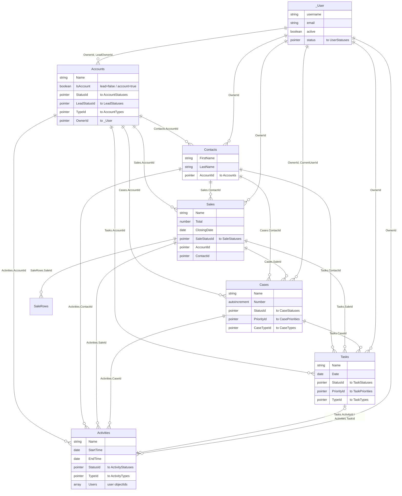

# Data Model Overview

> **Purpose:** Top-level map of the MyBusiness CRM database — size, domain layout, hub topology, and the core entity cluster — so a developer/implementer who has never seen the product can orient before discovery (אפיון) or fit-gap work.
> **Last updated:** 2026-06-10 · **Status:** draft

---

## 1. What the database is

MyBusiness CRM runs on a **Parse Server** backend (`api.mbapps.co.il`) built by the **Simbla** no-code platform. Every tenant (customer) has its **own application** (own `X-Parse-Application-Id`, own class set). There is no single fixed schema: each app starts from the MyBusiness product baseline and is then customized — fields and whole tables are added per customer through the UI or the `Add-Field-to-Table` / `Create-Table` MCP tools.

Consequences for implementers:

- **Always run `Get-Schema` against the target tenant before any data work.** The numbers and field lists below describe the reference demo environment; a real customer will differ.
- Schema **counts are tenant-specific**. Reference points observed:

| Environment | Classes | Evidence |
|---|---|---|
| Demo environment (metadata dump, 2026-02-06) | **196 tables · 2,592 fields · 766 pointer relationships** | `schema_summary.md` overview table |
| Same demo app, raw `/schemas` export | **204 classes** (the 196 + 8 excluded from the dump: `_Role`, `_Session`, `SMTP`, `AccountTokens`, `Config`, `OAuthTokens`, `Office365Subscription`, `SlaConfig`) | `a production schema export` |
| Playground sandbox app (live, 2026-06-10) | **148 tables** (newer baseline + sandbox experiments; lacks the demo's vertical add-ons) | `Get-Schema(tablesNameOnly:true)` |

- Every table carries the same **6 system fields** (`objectId`, `createdAt`, `updatedAt`, `ACL`, `createdBy`, `updatedBy`), so a "7-field" lookup table really has 1 business field (`Name`). The 766 pointer edges split into **392 system edges** (`createdBy`/`updatedBy` → `_User` on each of the 196 tables) and **374 business pointer edges** (computed from `relationships_map.json`).
- Field-level details, wire formats, and naming conventions: see [05-field-types-and-conventions.md](05-field-types-and-conventions.md).

## 2. Domain map (which tables belong to which module)

Domain assignment below follows `tables_by_domain.json` (demo dump). The module URL paths (apps/mybusiness, apps/mybooks, …) are the UI-level grouping; the database itself is one flat namespace shared by all modules.

| Domain (dump) | Tables | Maps to product module | Representative tables |
|---|---|---|---|
| Core CRM | 32 | CRM Core — apps/mybusiness/ | `Accounts`, `Contacts`, `Sales`, `SaleRows`, `Cases`, `Tasks`, `Activities`, `Notes`, `Files` + their status/type lookups, `SLASettings`, `CaseFile`, `AccountRelation` |
| Financial | 40 | MyBooks — apps/mybooks/ (+ products & price quotes used by CRM) | `Products`, `PriceQuotes`, `PDFTemplate`, `Retainers`, `RetainerRows`, `AccountingHeaders`, `AccountingInvoiceLines`, `AccountingReceiptLines`, `PaymentsLog`, `InventoryLog`, `Currencies`, `Banks` |
| Communication | 28 | MyChat — apps/mychat/, MyCampaigns — apps/mycampaigns/, MyInbox — apps/myinbox/, SMS | `Channels`, `Conversations`, `ConversationMessages`, `ChatBots`, `Campaigns`, `CampaignSentLog`, `LandingPages`, `Emails`, `SMS`, `CallRecords`, `BusinessHours` |
| Projects | 12 | TimeSheet — apps/timesheet/ | `Projects`, `SubProjects`, `TimeSheet`, `TimeClock`, `MinutesForSalary`, `UserSubProjectConnection`, `Holidays`, `Facilities` |
| System/Internal | 21 | Platform plumbing (all modules) | `_User`, `_Timeline`, `_Notification`, `_syslog*`, `_DynamicQueries`, `_AutoIncrementValues`, `_Dictionary`, `_Workflow`, `UserStatuses`, `UserParameters`, `UsersAssignments` |
| Status/Lookup | 44 | Dropdown value tables for all modules | `Area`, `LeadStatuses`, `YesOrNo`, `Rating`, `CityList`, `Gender`, `Technician`, … (pattern: ~1 business field `Name`) |
| Education | 9 | MyCollege — apps/mycollege/ | `Courses`, `CourseEnrollment`, `Classes`, `Exams`, `ExamEnrollment` + statuses |
| Lost & Found | 7 | Customer-vertical add-on (demo) | `LostAndFounds` + 6 lookups |
| Satisfaction | 1 | Survey add-on | `SatisfactionSurveys` |
| Custom/Other | 2 | Tenant experiments | tenant-specific lookup/test tables |

Additional classes seen only in the raw export / live apps (not in the dump's 196):

| Table | Module/role |
|---|---|
| `SMTP`, `OAuthTokens`, `Office365Subscription` | Email accounts & mail-provider auth (MyInbox) — excluded from the dump because they hold credentials |
| `AccountTokens` | Stored credit-card tokens (MyBooks billing) |
| `Config`, `SlaConfig` | Name/Value system configuration |
| `_Role`, `_Session` | Parse built-ins: roles & login sessions |
| `Triggers`, `TriggerActions`, `QuickResponses`, `Languages`, `Tags`, `Interests`, `SalesDepartments`/`SalesChannels`/`SalesSubDepartments`/`SalesSubChannels`, `Affiliates`/`Suppliers`/`Orders`/`StoreItems` clusters, `CaseSLAProcess` | Present in the live Playground app — a mix of newer platform tables (`Triggers`, `TriggerActions`) and sandbox custom entities. ⚠️ UNVERIFIED which of these exist in any given customer app — check per tenant. |

Per-table details: core entities in [02-core-tables.md](02-core-tables.md), module tables in [03-module-tables.md](03-module-tables.md), system/log tables in [04-system-tables-and-logs.md](04-system-tables-and-logs.md).

## 3. Hub topology — Accounts at the center

Computed from `relationships_map.json` (business pointers only, `createdBy`/`updatedBy` excluded):

| Hub table | Incoming business pointer fields | From distinct tables | Meaning |
|---|---|---|---|
| `_User` | 51 (+392 system) | 32 | Ownership/assignment: nearly every entity has `OwnerId` and audit pointers |
| `Accounts` לקוחות | **38** | **36** | The business hub: customer & lead in one table; everything links back to it |
| `Sales` מכירות | 11 | 11 | Deal context for rows, tasks, comms, enrollment |
| `Contacts` אנשי קשר | 11 | 11 | Person-level link on the same activity tables |
| `Products` מוצרים | 10 | 10 | Line items, billing lines, interest fields |
| `Cases` פניות | 9 | 9 | Service context |
| `Conversations` שיחות | 9 | 9 | Chat context |
| `Tasks` משימות | 8 | 8 | |
| `AccountingHeaders` מסמכים חשבונאיים | 8 | 5 | Billing documents |
| `Activities` פעילויות | 7 | 7 | |

(A larger/newer schema count puts this even higher ("Accounts referenced by 46+ tables"); this dump shows 36 distinct tables / 38 fields. Order of magnitude agrees: **Accounts is the hub**.)

Topology pattern — a classic **hub-and-spoke**:

1. **`Accounts` is both Lead and Customer.** The boolean `IsAccount` separates leads (`false`) from accounts (`true`); lead-specific pointers (`LeadStatusId`, `LeadOwnerId`, `LeadSourceId`) and account pointers (`StatusId`, `TypeId`, `OwnerId`) coexist on the one table. Conversion = flipping `IsAccount` + `ConversionDate`/`LeadConversionDate`.
2. **Work-item tables all point at the same context set.** `Tasks`, `Activities`, `Notes`, `Emails`, `SMS`, `Conversations` each carry the pointer bundle `AccountId` / `ContactId` / `SaleId` / `CaseId` (+ `TaskId`/`ActivityId` cross-links), so any communication or to-do can be attached at any level.
3. **Status/type lookups hang off every entity** as `<X>Statuses` / `<X>Types` tables with a `Name` field; some statuses also point to a meta-state table (`CaseStatuses.StateId → CaseStates`, `LeadStatuses.StateId → AccountStatusesStates`, `ConversationStatuses.StateId → ConversationStates`) which gives the platform a fixed open/closed semantics behind customizable status labels.
4. **`_Timeline` mirrors everything.** It points at all the core entities and denormalizes display values (`AccountName`, `SaleTotal`, …) — see [04-system-tables-and-logs.md](04-system-tables-and-logs.md).

## 4. Core cluster ERD

Business pointers between core entities (field names on the edges; lookups and `_Timeline` collapsed for readability). Verified live on the Playground app, 2026-06-10.

Satellite tables of the cluster (not drawn): `Notes`, `Emails`, `SMS`, `Conversations`, `Files`, `PriceQuotes` each point into 4–7 of the entities above; `_Timeline` points into all of them.

## 5. How to read the rest of this section

| File | Content |
|---|---|
| [02-core-tables.md](02-core-tables.md) | Field-level reference for `Accounts`, `Contacts`, `Sales`, `Cases`, `Tasks`, `Activities`, `_User` |
| [03-module-tables.md](03-module-tables.md) | MyBooks, MyCampaigns, MyChat, MyCollege, TimeSheet, products/price-quotes — key fields & relations |
| [04-system-tables-and-logs.md](04-system-tables-and-logs.md) | `_Timeline`, `_syslog*`, `_Role`, `_Session`, config/settings tables, trigger storage |
| [05-field-types-and-conventions.md](05-field-types-and-conventions.md) | Parse types & exact JSON wire formats, naming conventions, multi-select & parent-child conventions, query limits |

## Limitations & gotchas

- **The 196/2,592/766 numbers describe one (heavily customized) demo app**, not the product baseline and not any customer. The live Playground app has 148 tables with materially smaller core tables (e.g., `Sales`: 37 fields live vs 133 in the dump). Treat every field list here as "reference + verify per tenant".
- The dump's domain grouping (`tables_by_domain.json`) is heuristic (generated by `process_schema.js`); e.g., `Products` sits in "Financial" though it serves CRM sales and MyCollege courses, and `BusinessHours` sits in "Communication" though it is used by SLA logic.
- The dump **omits 8 credential/system classes** that do exist (`SMTP`, `AccountTokens`, `OAuthTokens`, `Office365Subscription`, `Config`, `SlaConfig`, `_Role`, `_Session`) — see `a production schema export` for their shapes.
- `Get-Schema` on the live app did **not** return `_Role`/`_Session` (returned `{}`); those must be inspected via `Get-Roles`/REST with master key.
- Mermaid ERD cardinalities are inferred from pointer direction (a pointer is many-to-one); Parse does not enforce referential integrity — deleting a target leaves dangling pointers.
