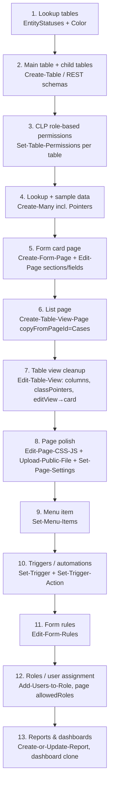

# Customization Overview — The Full Surface Map

> **Purpose:** One-stop map of everything an implementer configures in a MyBusiness CRM implementation — what each customization domain is, whether it is no-code config / custom JS / server code, which MCP tools drive it, and the canonical build order for a new entity/module.
> **Last updated:** 2026-06-10 · **Status:** draft

MyBusiness CRM is built on the **Simbla no-code platform** with a **Parse Server backend**. Everything a customer sees — tables, card pages (דף כרטיס), list pages (דף תצוגת טבלה), dashboards (דשבורד), menus (תפריט), automations (טריגרים) — is data: schema definitions, page documents, and config records. The customization surface is therefore scriptable end-to-end through the MyBusiness MCP server (59 tools) and the Parse REST API, in parallel to the Simbla visual editor UI.

## The customization domains

| # | Domain | Hebrew | What it is | Level | Primary MCP tools | Detail doc |
|---|--------|--------|------------|-------|-------------------|------------|
| 1 | Data schema — tables & fields | טבלאות ושדות | Parse classes + fields; lookup tables drive dropdowns | Config | `Create-Table`, `Add-Field-to-Table`, `Get-Schema` | [02-tables-and-fields.md](02-tables-and-fields.md) |
| 2 | Form (card) pages | דפי כרטיס / דפי טופס | Single-record edit pages: rows, columns, sections, fields, related-record tables, tabs | Config (+JS for special widgets) | `Create-Form-Page`, `Edit-Page`, `Add-Edit-Text-Element`, `Add-Table-View-to-Form-Page`, `Add-Container-to-Page`, `Add-Edit-Tabs-Element` | [03-pages-and-layouts.md](03-pages-and-layouts.md) |
| 3 | List pages & table views | דפי רשימה / טבלאות | Searchable record lists + embedded child-record tables: columns, filters, sort, edit modes, export, conditional formatting | Config | `Create-Table-View-Page`, `Edit-Table-View`, `Get-Optional-Fields` | [04-table-views-and-lists.md](04-table-views-and-lists.md) |
| 4 | Dashboards | דשבורדים | KPI counters, Chart.js charts, embedded tables on a CRMmaster page, date-filter forms | Config (+CSS for card look) | `Add-Edit-Counter-Element`, `Add-Edit-Chart-Element`, `Add-Edit-Tabs-Element`, `Add-Container-to-Page`, `Create-Table-View-Page` (clone) | [05-dashboards-and-reports.md](05-dashboards-and-reports.md) |
| 5 | Reports & queries | דוחות ושאילתות | `_DynamicQueries` records: flat lists, aggregations, pivots, compound reports, scheduled email delivery | Config (compound = REST) | `Create-or-Update-Report`, `Get-Reports`, `Get-Optional-Fields`, `Aggregate-Data` | [05-dashboards-and-reports.md](05-dashboards-and-reports.md) |
| 6 | Menus & navigation | תפריטים | Side-menu + Dashboard Menu items, hierarchy, icons, role visibility | Config | `Get-Menus`, `Get-Menu-Items`, `Set-Menu-Items` | [05-dashboards-and-reports.md](05-dashboards-and-reports.md) §A6 (Dashboard Menu); item shape there applies to all menus |
| 7 | Triggers / automations | טריגרים / אוטומציות | Server-side rules on create/update/schedule: send email/SMS/WhatsApp, create/update records, webhooks, server code | Config → Custom-Server (code actions) | `Get-Triggers`, `Set-Trigger`, `Set-Trigger-Action` | [06-triggers-and-automations.md](06-triggers-and-automations.md) |
| 8 | Form rules | חוקי טופס | Client-side per-page field behavior: hide/require/readonly/fixed-value/dynamic-value/formula/message | Config | `Get-Form-Rules`, `Edit-Form-Rules`, `Set-Form-Rules` | [07-form-rules.md](07-form-rules.md) |
| 9 | Users, roles & permissions | משתמשים והרשאות | `_User`, `_Role`, packages, CLP (Class-Level Permissions) per table, page `allowedRoles` | Config | `Create-or-Update-User`, `Create-Role`, `Add-Users-to-Role`, `Get/Set-Table-Permissions`, `Get-Packages`, `Set-Package-for-User` | [08-users-roles-permissions.md](08-users-roles-permissions.md) |
| 10 | Terminology renaming | התאמת מונחים | Rename entity terms system-wide (e.g. מכירה → פרויקט) via a dictionary + replace pass | Config | `Get/Set-Terminology-Dictionary`, `Replace-Terms` | [09-terminology-localization.md](09-terminology-localization.md) |
| 11 | Price-quote templates | תבניות הצעת מחיר | Branded PDF templates for quotes (logo, colors, columns, dynamic fields) | Config (+HTML/CSS in template) | `Get-Price-Quote-Templates`, `Create-Update-Price-Quote-Template` | [10-price-quotes-documents.md](10-price-quotes-documents.md) |
| 12 | Page CSS / JS | עיצוב וקוד דף | Per-page inline `cssCode`/`jsCode`, per-page external `cssFile`/`jsFile`, and the site-wide `unified-master.css` design system on the master pages | Custom-JS / CSS | `Edit-Page-CSS-JS`, `Get/Set-Page-Settings`, `Upload-Public-File` | [03-pages-and-layouts.md](03-pages-and-layouts.md) §CSS/JS |
| 13 | Server-side functions | פונקציות צד שרת | Parse Cloud Functions (`web2lead`, `web2table`, trigger code actions) | Custom-Server | Parse REST `/functions/*` (not MCP) | [../40-integrations-api/04-cloud-functions.md](../40-integrations-api/04-cloud-functions.md) |
| 14 | Customer portals | פורטלי לקוח | External-audience page sets (parents/schools/examinees/citizens): portal users, gated pages, scoped data, password/OTP auth, in-portal forms & payments | Composite: Native scaffolding + Config + Custom-JS + Custom-Server | Page tools, `Create-or-Update-User`, role/CLP tools, `Set-Page-Settings` (gating); auth functions via REST | [13-customer-portals.md](13-customer-portals.md) |

**Level legend:** *Native* = ships with product, just enable. *Config* = declarative no-code configuration (UI or MCP). *Custom-JS* = page-level JavaScript/CSS. *Custom-Server* = cloud functions / trigger code (dev team).

## The page model in one paragraph

(From `Usage-Guide`, the canonical text.) The site is a flat list of pages (`Get-Site-Pages`). Three kinds exist: regular pages, **master pages** (`isMasterPage: true` — e.g. `CRMmaster`, `MasterTicket`, `NewMaster`), and pages **with a `masterPageId`**. A master page holds a `_dynamicContentArea` placeholder div; a child page's content is an object keyed by that area's ID (`_MPID0` = main content, `_MPID1` = top bar, `_MPID2` = bottom bar). At runtime the child content is merged into the master. Inside a form page: rows are `div.rDivider`, columns are `div.sDivider` on a 12-unit Bootstrap grid; every field lives in its own column. The list/card duality follows a plural/singular naming convention: `apps/mybusiness/Accounts` (list) vs `apps/mybusiness/Account` (card). The page's data binding is the `data-simbla-class` attribute on its form/table element. All `apps/mybusiness/*` pages are the desktop CRM; `Mobile-*` pages exist but most customers do not use them.

## Canonical build order for a new entity (module)

Derived from the `myb-p-create-entity` skill (the proven end-to-end recipe). Order matters: each step depends on artifacts from the previous one.

Why this order:

1. **Tables → fields → lookup data first** — pages refuse fields that are not in the schema (`Get-Schema` check is mandatory before any `Edit-Page add-new-field`), and Pointer dropdowns are empty until the lookup table has records.
2. **CLP immediately after table creation** — tables created via REST start with an empty CLP; `{"*": true}` passes the API but the CRM front-end checks **roles** (`role:CRM`, `role:Admin`, `role:Support`), so use the Cases/Accounts role pattern from day one.
3. **Form page before list page** — `Create-Table-View-Page` takes `editEntityPageName` pointing at the card; the list's sidebar edit (`editView: {openFrom:"modal-left", useIframe:true, page:"apps/mybusiness/<Entity>"}`) needs the card to exist.
4. **Triggers and form rules after pages** — they reference fields and pages; form rules live *on a page* (`pageId`).
5. **Reports/dashboards last** — they only make sense once schema and data shape are final (`Get-Optional-Fields` output is derived from the schema).

## UI vs MCP — what can be done where

| Capability | No-code UI (Simbla editor / siteadmin) | MCP tools | Notes |
|---|---|---|---|
| Create table / fields | ✔ Admin → Tables | ✔ `Create-Table`, `Add-Field-to-Table` | UI also offers AutoIncrement config; MCP field-type enum does not include it |
| Delete table / delete field / rename field | ✔ admin UI | ✖ no MCP tool | REST `schemas` API with master key can delete fields (Parse standard) |
| Build/edit form page grid + fields | ✔ drag-and-drop editor | ✔ `Edit-Page` actions | UI drag reorder is freeform; MCP is action-based |
| Tabs component (simbla-nav) | ✔ editor widget | ✔ `Add-Edit-Tabs-Element` (added ~mid-2026) | Older skill docs say "UI-only" — now outdated |
| Container card wrappers | ✔ editor "Container" | ✔ `Add-Container-to-Page` (added ~mid-2026) | Closes dashboard tooling gap B1 |
| Separator elements (separatorElm) | ✔ editor | ✖ | Use section headers as visual breaks |
| Delete a single page element | ✔ editor | ✖ (only `Edit-Page delete-row`) | Workaround: hide via CSS |
| Delete a page / change a page's master | ✔ editor | ✖ | `Set-Page-Settings` has no `masterPageId`; rename via `name` instead of delete |
| Database Search form widget (`dbFormQuery`) create/edit inputs | ✔ editor | ✖ | Clone a page that has one; fix inputs via page JS |
| List page columns/filters/sort/formatting | ✔ table widget dialog (Database/Columns/Filter/Data options tabs) | ✔ `Edit-Table-View` | MCP is whole-state per field group |
| Reports | ✔ Reports page UI generator | ✔ `Create-or-Update-Report` | Compound reports (`SubqueriesInfo`) — REST only; MCP tool ignores the param |
| Dashboards | ✔ editor | ✔ clone + repoint workflow | From-scratch via MCP now feasible with containers+tabs, still easier to clone |
| Triggers, form rules, users/roles/CLP, terminology, quote templates, menus | ✔ dedicated System-* pages | ✔ dedicated tools | See sibling docs (06–12) |
| Page CSS/JS | ✔ editor code panels | ✔ `Edit-Page-CSS-JS` (inline), `Upload-Public-File` + `Set-Page-Settings` (external files) | External file + stable `codeFile` URL is the production pattern |
| Cloud functions | ✖ (dev deploy) | ✖ (invoke via REST only) | [../40-integrations-api/04-cloud-functions.md](../40-integrations-api/04-cloud-functions.md) |

## Where things live (storage model)

| Artifact | Storage | Read with |
|---|---|---|
| Tables/fields/CLP | Parse schema | `Get-Schema` |
| Pages (HTML, jsCode, cssCode, settings, versions) | Simbla-private page collection (NOT a Parse class) | `Get-Site-Pages`, `Get-Page-Content`, `Get-Page-Settings`, `Get-Page-Versions` |
| Reports & saved queries | `_DynamicQueries` Parse class | `Get-Reports`, `Get-Data` |
| Triggers | trigger store + `_syslogTriggers` log | `Get-Triggers` |
| Form rules | per-page form metadata | `Get-Form-Rules` |
| Menus | menu store (origin IDs stable per install) | `Get-Menus`, `Get-Menu-Items` |
| Terminology dictionary | per-app dictionary | `Get-Terminology-Dictionary` |
| Uploaded JS/CSS/files | S3 (`mb-static-files…` / `static.mbapps.co.il`) | `Upload-Public-File` returns URL |

## Limitations & gotchas

- **Pages are not Parse objects.** You cannot query/patch them via REST `classes/*`; only the page MCP tools (and the Simbla editor) touch them. There is no MCP `Delete-Page`, no master-page reassignment, and no element-level delete — plan page names carefully (`_old_*` clutter accumulates; rename via `Set-Page-Settings(name)`).
- **`Create-Form-Page` always assigns `NewMaster`.** Such cards work inside the list's iframe sidebar for authenticated users, but show empty fields when opened by direct URL. A standalone-URL card (like the built-in Account card on `MasterTicket`) currently requires cloning in the Simbla editor UI.
- **Whole-state writers.** `Edit-Table-View` (per field group), `Edit-Page-CSS-JS`, and `Set-Form-Rules` replace entire arrays/strings. Always read current state first; use `Edit-Form-Rules` for single-rule changes.
- **The MCP tool set evolves fast.** `Add-Container-to-Page` and `Add-Edit-Tabs-Element` exist live (2026-06) but are absent from the 2026-02 tool-guide export and contradicted by April-2026 skill texts. Always trust the live tool schema over docs, including this one.
- **Environment-specific IDs.** Page IDs, menu IDs, report `FormName`s and lookup objectIds differ per customer install. Discover them per environment (`Get-Site-Pages`, `Get-Menus`, `Get-Reports`) — never hardcode from another system.
- This overview intentionally does not duplicate the behavior-side domains (triggers, form rules, permissions, terminology, quote templates, field patterns) — see [06](06-triggers-and-automations.md)–[11](11-field-patterns.md) in this folder. Note from 06: **triggers fire on MCP/API writes too** (live-verified; suppression only via `Create-Many.skipTriggers`) — bulk MCP operations must plan for automation side-effects.
