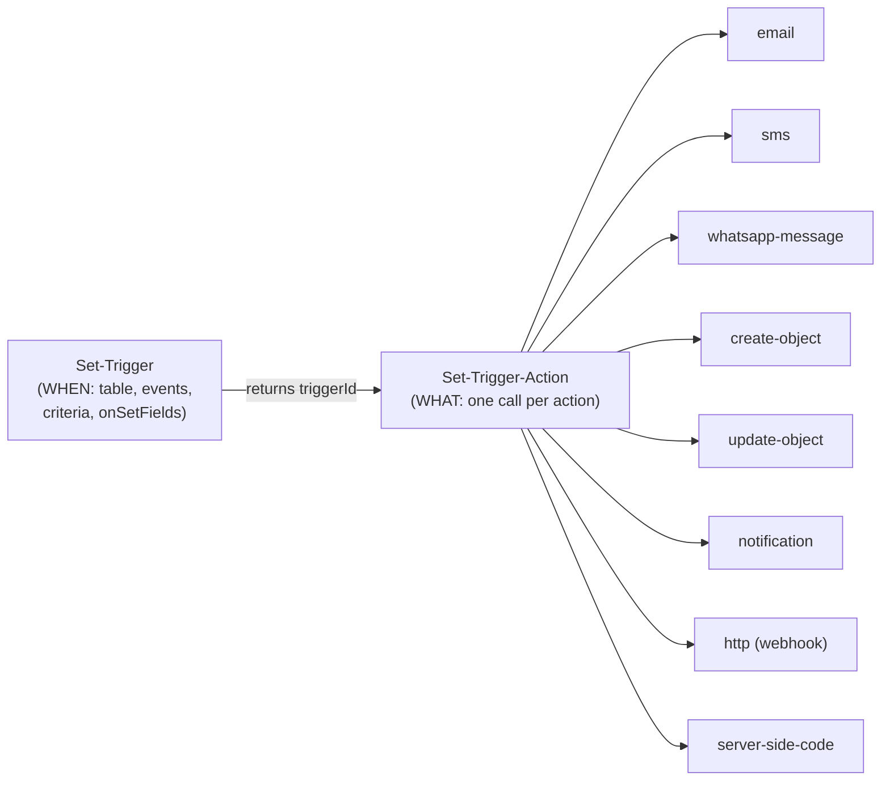

# Triggers & Automations — the Server-Side Automation Engine

> **Purpose:** Complete reference for the trigger engine — טריגר (Trigger) / אוטומציה (Automation) — in MyBusiness CRM: event types, condition formats, all 8 action types, scheduled triggers, dynamic placeholders, chains, logging and debugging. Spec-ready for AI implementers.
> **Last updated:** 2026-06-10 · **Status:** draft

## 1. Architecture — two-step model

A trigger is split into **WHEN** (the trigger itself) and **WHAT** (one or more actions). They are configured by two separate MCP tools, always in this order:



Triggers live **per table** (stored on the class schema; `Get-Triggers` returns them grouped by `className`). Scheduled triggers are stored separately and returned in a `scheduledTriggers` array.

### Trigger types (verified)

| Type (`type` param) | Fires when | Key params |
|---|---|---|
| `"data change"` | A record is created and/or updated | `events: ["create"]` / `["update"]` / `["create","update"]`, `onSetFields`, `criterias`, `oneachupdate` |
| `"scheduled"` | X hours before/after a Date field's value on each matching record | `schedulerField`, `shcedulerHours` (note the typo — it is the real param name), `criterias` |

A third trigger type, **"Add to Timeline"**, exists in the admin UI only — it is not configurable via MCP (per `myb-p-trigger-setup` skill).

## 2. Condition format — CANONICAL (quoted from `Usage-Guide`)

The MCP `Usage-Guide` tool is the canonical source for condition structure. Quoted verbatim (called live 2026-06-10):

> במערכת יש כמה מקומות שאפשר לתת תנאים (conditions).
> המבנה של תנאים הוא מערך של objects עם המאפיינים הבאים:
> ```
> {
>     "field": "field name", - the name of the field to compare
>     "equesition": "equation type", - the type of the comparison (equalTo, greaterThan, lessThan, greaterThanOrEqualTo, lessThanOrEqualTo, notEqualTo, containedIn, notContainedIn, exists, notExist, startsWith, endsWith, contains)
>     "value": "value" - the value to compare to (can be empty string). For pointer field the value is the objectId. In some cases when the pointer is to _User table, the value can be "currentUser". For date field the value can be "year ago", "beginning of this year", "30 days period", "beginning of this month", "today", "end of this month", "end of next month", "end of this year", "year ahead", YYYY-MM-DD, or a number of days to add (can be negative).
>     "visibleVal": "label" - optional, can be a description of the value. For example, for pointer objectId the visibleVal will be the Name property of the object.
> }
> ```
> או שהתנאים יהיו במבנה הבאה:
> ```
> {
>     "F": - field name
>     "C": - condition (equation) type
>     "T": - type of the value
>     "V": - value to compare to
>     "P": - pointer to another object
> }
> ```

Two equivalent shapes exist across the platform:

| Shape | Where used | Keys |
|---|---|---|
| **`equesition` shape** (long-key) | Form rules, report `QueryElems`, some query elements | `field`, `equesition`, `value`, `visibleVal`, `condOr` |
| **`F/C/T/V/P` shape** (short-key) | **Trigger `criterias`** (this doc), table-view filters, counters/charts | `F`, `FText`, `C`, `T`, `V`, `P`, `condOr` |

Note the deliberate spelling **`equesition`** (not "equation"/"condition") — it is the actual stored key.

### 2.1 Trigger criteria object (F/C/T/V/P shape) — field-by-field

```json
{
  "F": "SaleStatusId",
  "FText": "SaleStatusId",
  "C": "equalTo",
  "V": "zrP1MSVBoq",
  "T": "Pointer",
  "P": { "targetClass": "SaleStatuses", "visibleVal": "הושלמה", "multiple": false },
  "condOr": false
}
```

| Key | Required | Meaning |
|---|---|---|
| `F` | yes | Field name. Supports dot notation into pointers, e.g. `OwnerId._User.name` |
| `FText` | recommended | Display label (usually same as `F`) |
| `C` | yes | Operator (see below) |
| `V` | yes (except exists) | Value. Pointer → objectId string; `containedIn` → array of objectIds; Number → number; Boolean → `true`/`false`; Date → keyword/`YYYY-MM-DD`/day-offset number |
| `T` | yes | Value type: `String`, `Number`, `Pointer`, `Boolean`, `Date` (also seen live: `PrivateFile` with `C: "exists"`, `Array`) |
| `P` | for Pointer | `{ "targetClass": "...", "visibleVal": "...", "multiple": false }` — `multiple: true` when `V` is an array (`containedIn`) |
| `condOr` | optional | `true` puts this criterion into the OR group (needs ≥2 OR criteria to matter) |

### 2.2 Operators

| Operator (`C` / `equesition`) | Types | Notes |
|---|---|---|
| `equalTo` / `notEqualTo` | all | Pointer compares objectId |
| `greaterThan` / `lessThan` / `greaterThanOrEqualTo` / `lessThanOrEqualTo` | Number, Date | |
| `contains` / `startsWith` / `endsWith` | String | Verified live: `{"F":"Name","C":"contains","T":"String","V":"בע\"מ"}` |
| `containedIn` / `notContainedIn` | Pointer (array `V`) | `P.multiple: true`; live example with 6 doc-type ids on `AccountingHeaders` |
| `exists` / `notExist` | any | No `V` needed. Live example: `{"F":"File","C":"exists","T":"PrivateFile"}` |

⚠️ Observed in stored form-rule data (not triggers): an `"empty"` operator and a `"equealTo"` typo are tolerated by the runtime — treat stored data as potentially non-canonical when auditing (see `07-form-rules.md`).

### 2.3 AND / OR semantics (hands-on verified)

- Criteria **without** `condOr` are ANDed — all must match.
- Criteria **with** `condOr: true` form one OR group — at least one must match.
- Both can coexist: AND criteria must all hold **and** at least one OR criterion must hold. Verified live (trigger `TEST16`):

```json
"criterias": [
  { "F": "Total", "C": "greaterThan", "T": "Number", "V": 5000 },
  { "F": "SaleStatusId", "C": "equalTo", "T": "Pointer", "V": "zrP1MSVBoq",
    "P": { "targetClass": "SaleStatuses", "visibleVal": "הושלמה" }, "condOr": true },
  { "F": "SaleStatusId", "C": "equalTo", "T": "Pointer", "V": "V0sVNyS45K",
    "P": { "targetClass": "SaleStatuses", "visibleVal": "משא ומתן" }, "condOr": true }
]
```

## 3. `Set-Trigger` — parameter spec

| Parameter | Type | Required | Description |
|---|---|---|---|
| `tableName` | String | yes | Table to monitor |
| `type` | Enum | yes | `"data change"` or `"scheduled"` |
| `active` | Boolean | yes | Enable/disable. ⚠️ In stored data, **absence of the field means active** (verified in the investigation method skill) |
| `name` | String | yes (create) | Descriptive name (Hebrew recommended) |
| `_id` | String | update only | Existing trigger id — pass to update/deactivate |
| `events` | Array | data change | `["create"]`, `["update"]`, `["create","update"]` |
| `onSetFields` | Array | recommended | Fields watched — trigger evaluates only if one of them changed. For `create` events use a field that is always set (convention: `["Name"]`). Empty `[]` = evaluate on ANY change (works, not recommended) |
| `criterias` | Array | no | F/C/T/V/P objects (section 2.1) |
| `oneachupdate` | Boolean | no | `false` (default) = fires once per record, the record is marked processed; `true` = fires on every matching update |
| `schedulerField` | String | scheduled | Date field on the table to schedule from |
| `shcedulerHours` | Number | scheduled | Hours **before** (positive) or **after** (negative) the date. **The typo is the real parameter name.** |

### Return values — two different ID formats (hands-on verified)

| Trigger type | Return | Where the id is |
|---|---|---|
| data change | Full class schema with `triggers` array | Find your trigger by `name`, use its `_id` (Parse-style, e.g. `"9ht1ary5dW"`) |
| scheduled | `{"value":"69df53414167a73a568f34df"}` | Use the `value` (MongoDB ObjectId format) as `triggerId` |

### Scheduled trigger timing

| `shcedulerHours` | Meaning |
|---|---|
| `720` | 30 days before the date |
| `24` | 1 day before |
| `2` | 2 hours before |
| `1` | 1 hour before (**minimum "before"**) |
| `-1` | 1 hour after (**minimum "after"; use for "on/just-after the date"**) |
| `-48` | 2 days after |

⚠️ **`shcedulerHours: 0` is rejected** with `"Scheduler hours is required"` (hands-on verified in the trigger skill and SLA skill). The older `mcp-tool-guides.md` claims `0` = "exactly at the date" — that documentation is outdated; trust the verified behavior. Note: two legacy platform-template scheduled triggers in the playground (`TaskReminder`, `Activity Reminder`) do carry `shcedulerHours: "0"` — they were created by provisioning, not via the MCP path.

Scheduler semantics: the platform scheduler continuously scans records whose `schedulerField` is X hours away, evaluates `criterias` **at fire time** (not creation time), and runs the actions. Expect a few minutes' resolution, not exact-minute delivery. The date field must hold a real future (or recently passed, for negative hours) value.

## 4. `Set-Trigger-Action` — parameter spec

| Parameter | Type | Required | Description |
|---|---|---|---|
| `tableName` | String | yes | Same table as the trigger |
| `triggerId` | String | yes | From Set-Trigger return (see ID formats above) |
| `triggerType` | Enum | yes | `"data change"` / `"scheduled"` — must match the trigger |
| `actionType` | Enum | yes | One of the 8 types below |
| `actionData` | Object | yes | `{ "<actionType>": { ...params } }` — keyed by the action type |
| `actionId` | String | update/delete | Data-change triggers: the action's `_id`; **scheduled triggers: zero-based index as string** (`"0"`, `"1"`) |
| `deleteAction` | Boolean | delete | ⚠️ Even with `deleteAction: true` you MUST send a structurally valid `actionData` — otherwise `"Cannot read properties of undefined"` |

Multiple actions per trigger: call `Set-Trigger-Action` repeatedly with the same `triggerId`; actions append and run in order (verified: notification + http on one trigger).

## 5. The 8 action types (all verified working via MCP)

### 5.1 `email`

Prerequisites: SMTP account objectId (`Get-SMTP-Accounts`), email template objectId (`Get-Data` on `EmailTemplate` — templates must be created in the UI first).

```json
{
  "actionType": "email",
  "actionData": {
    "email": {
      "emailType": "field",
      "emailTarget": "Email",
      "emailSubject": "Subject with {{{Name}}} dynamic content",
      "emailAccount": "<smtpAccountObjectId>",
      "template": "<emailTemplateObjectId>",
      "saveToEmailsTable": true,
      "fieldsValue": [
        { "field": "AccountId", "targetClass": "Accounts", "type": "Pointer",
          "value": "AccountId", "visibleVal": "Account" },
        { "field": "SaleId", "targetClass": "Sales", "type": "Pointer",
          "value": "current", "visibleVal": "Current Object(Sales)" }
      ]
    }
  }
}
```

| Param | Values | Notes |
|---|---|---|
| `emailType` | `"fixed"` / `"field"` | fixed = hardcoded address; field = read from the record |
| `emailTarget` | address or field name | Pointer traversal works: `"OwnerId.email"`, `"AccountId.Accounts.Email"` (verified) |
| `emailSubject` | string | `{{{Field}}}` and `.format(...)` work in subjects too (verified) |
| `saveToEmailsTable` | bool | Saves a copy in `Emails`; `fieldsValue` links pointers on the saved record |

### 5.2 `sms`

```json
{
  "actionType": "sms",
  "actionData": {
    "sms": {
      "toType": "field",
      "to": "PhoneNumber",
      "from": "0501234567",
      "local": "IL",
      "content": "שלום {{{AccountId.Name}}}, הזמנתך #{{{Name}}} בסך {{{Total}}} ש\"ח התקבלה!",
      "useQueue": true
    }
  }
}
```

`toType` fixed/field; `local` is a country code (`"IL"`, `"US"`, can be `""`); `useQueue: true` recommended for bulk.

### 5.3 `whatsapp-message`

Prerequisites: `Send-WhatsApp-Message(getNumbers: true, getTemplates: true)` for the channel `from` value (phone-number ID, **not** an objectId — and per project rules, the `Identity` field from Channels, not `objectId`) and the approved template object.

```json
{
  "actionType": "whatsapp-message",
  "actionData": {
    "whatsapp-message": {
      "toType": "field",
      "to": "PhoneNumber",
      "from": "<channelIdentityId>",
      "waba_id": "<wabaId>",
      "message": "Description text",
      "template": {
        "name": "template_name", "parameter_format": "POSITIONAL",
        "components": [ "...full components from getTemplates..." ],
        "language": "he", "status": "APPROVED", "category": "MARKETING",
        "id": "<templateId>"
      },
      "WATemplateParams": { "BODY": ["{{{AccountId.Name}}}", "{{{Name}}}"] }
    }
  }
}
```

⚠️ **`Get-WhatsApp-Template-Params` is unreliable for templates with 2+ BODY params** (verified test, 2026-04-15): it returns only the FIRST `example.body_text` element. Workaround: count the `{{N}}` placeholders in the template `text` yourself and build `WATemplateParams.BODY` with one entry per placeholder, in order. For an IMAGE header, `WATemplateParams.HEADER` = the image URL.

### 5.4 `create-object`

```json
{
  "actionType": "create-object",
  "actionData": {
    "create-object": {
      "targetClass": "Tasks",
      "fieldsValue": [
        { "field": "Name", "type": "static", "value": "Follow up task" },
        { "field": "SaleId", "type": "dynamic", "value": "currentObject", "targetClass": "Sales" },
        { "field": "AccountId", "type": "dynamic", "value": "AccountId", "targetClass": "Accounts" },
        { "field": "OwnerId", "type": "dynamic", "value": "OwnerId", "targetClass": "_User" },
        { "field": "Date", "type": "dynamic", "value": "updatedAt", "timeGap": 1440 },
        { "field": "StatusId", "type": "static", "value": "<statusObjectId>",
          "targetClass": "TaskStatuses", "visibleVal": "פתוחה" }
      ]
    }
  }
}
```

### 5.5 `update-object` — connection semantics

| `connection` | Meaning | Example |
|---|---|---|
| `"current.objectId"` | Update the triggered record itself (**the only working self-update value** — `self`, `objectId`, `target.objectId`, `source.objectId` all fail with `"missing type or field"`) | Stamp a timestamp field on the same Sale |
| `"source.<PointerField>"` | The triggered record points **to** the target | Trigger on Sales → update the linked Account via `source.AccountId` |
| `"target.<PointerField>"` | Target records point **to** the triggered record (updates ALL of them) | Trigger on Sales → update all SaleRows via `target.SaleId` |

```json
{
  "actionType": "update-object",
  "actionData": {
    "update-object": {
      "targetClass": "Sales",
      "connection": "current.objectId",
      "fieldsValue": [
        { "field": "OwnerSetDate", "type": "dynamic", "value": "updatedAt", "visibleVal": "updatedAt" }
      ]
    }
  }
}
```

Cross-table dot-notation in `fieldsValue` is supported (live example on `SaleRows`): `{ "field": "AccountId", "type": "dynamic", "value": "SaleId.Sales.AccountId", "targetClass": "Accounts" }` — copies the Account pointer from the parent Sale.

### 5.6 `notification` (in-app)

```json
{
  "actionType": "notification",
  "actionData": {
    "notification": {
      "userType": "field",
      "user": "OwnerId",
      "content": "<div>פנייה חדשה: <b>{{{Name}}}</b><br/>לקוח: {{{AccountId.Name}}}</div>",
      "icon": "fa-bell",
      "iconColor": "#4CAF50"
    }
  }
}
```

`userType` `"fixed"` (user objectId) / `"field"` (field pointing to `_User`). Content supports **HTML** (`<div>`, `<b>`, `<br/>` verified). Icons are FontAwesome 3/4-style classes (`fa-bell`, `fa-envelope`, `fa-clock-o`, `fa-trophy`, `fa-exclamation-triangle`, `fa-calendar`…); `iconColor` is hex.

### 5.7 `http` (webhook)

```json
{
  "actionType": "http",
  "actionData": {
    "http": {
      "url": "https://hooks.example.com/webhook/abc?sale={{{objectId}}}&name={{{Name}}}",
      "method": "POST",
      "useQueue": true,
      "headers": [
        { "name": "Content-Type", "value": "application/json" },
        { "name": "X-Trigger-Source", "value": "MyBusiness-CRM" }
      ]
    }
  }
}
```

`method`: `GET` / `POST` / `PUT` / `DELETE` / `AUTO` (AUTO = POST on create, PUT on update). **The request body is automatically the full record JSON.** `{{{Field}}}` placeholders work inside the URL. Platform-internal automations use this action too (live example: inventory update calling `https://apps.simbla.com/functions/src-application-id/inventory-update`).

### 5.8 `server-side-code`

```json
{
  "actionType": "server-side-code",
  "actionData": {
    "server-side-code": { "functionName": "calculateCommission", "useQueue": true }
  }
}
```

Runs a pre-deployed cloud function with the triggered record as context. MCP cannot create cloud functions — the function must already exist (dev-team deliverable). Use for anything beyond declarative actions: business-day math, SLASettings lookups, aggregation/summing, conditional branching.

## 6. Field value types in `fieldsValue` (create-object / update-object)

| `type` | `value` | Notes |
|---|---|---|
| `static` | literal string / number / boolean / objectId | For Pointer targets add `targetClass` + `visibleVal` |
| `dynamic` | field name on the triggered record | For Pointer fields add `targetClass` |

### Special dynamic values

| Value | Meaning |
|---|---|
| `"currentObject"` | Pointer to the record that fired the trigger |
| `"updatedAt"` | Timestamp of the firing moment |
| `"createdAt"` | The record's creation timestamp |
| `"updatedBy"` | The user who made the change (Pointer → `_User`) |
| `"currentUser"` | Currently logged-in user (static type) |

### `timeGap` — date arithmetic in **minutes**

Attach to a `dynamic` Date entry: `{ "field": "DueDate", "type": "dynamic", "value": "updatedAt", "timeGap": 1440 }`.

| Minutes | Duration |
|---|---|
| `60` | 1 hour |
| `1440` | 1 day |
| `2880` | 2 days |
| `10080` | 1 week |
| `43200` | 30 days |
| `-1440` | 1 day back |

`timeGap` adds **calendar** minutes — it does not consult business hours (see SLA blueprint in `12-solution-blueprints.md` for business-day workarounds).

## 7. Dynamic content placeholders (CANONICAL, from `Usage-Guide`)

Quoted verbatim:

> לדוגמא `'Hi {{{Name}}}'` או `'Hi {{{AccountId.Name}}}'` יוחלף בערך של השדה Name או AccountId.Name ברשומת הנתונים.
> לשדה מסוג תאריך ניתן לקבוע את הפורמט של התאריך. לדוגמא `{{{SaleDate.format(date,he-IL,Asia/Jerusalem)}}}`. הערך הראשון בפונקציה פורמט הוא הסוג של התאריך (date, timehm, datetime). הערך השני הוא השפה של התאריך. הערך השלישי הוא האיזור של התאריך.

| Syntax | Result |
|---|---|
| `{{{Name}}}` | Field from the triggered record |
| `{{{AccountId.Name}}}` | One-level pointer traversal |
| `{{{OwnerId.name}}}` | `_User` fields are lowercase (`name`, `email`) |
| `{{{objectId}}}` | Record id |
| `{{{Date.format(date,he-IL,Asia/Jerusalem)}}}` | Date only |
| `{{{Date.format(timehm,he-IL,Asia/Jerusalem)}}}` | Time HH:MM |
| `{{{Date.format(datetime,he-IL,Asia/Jerusalem)}}}` | Date + time |

Usable in: email subjects + bodies, SMS content, notification content, HTTP URLs, WhatsApp `WATemplateParams`. Triple braces are required (`{{{ }}}` — quote-template placeholders in `10-price-quotes-documents.md` use double braces `{{ }}`; do not confuse the two systems).

## 8. Trigger chains

- A trigger action that writes data can fire other triggers. **Maximum chain depth: 3 levels.** Exceeding it logs `"Max trigger depth reached"` in `_syslogTriggers`.
- Self-update loops (trigger on table X updates table X) are bounded by `onSetFields` — make sure the field your action writes is NOT in the trigger's own `onSetFields`.
- Keep escalation/notification actions (email/SMS/notification) at the chain ends — they don't propagate chains.

## 9. Critical execution rule — triggers DO fire on API/Master-key writes (suppression is opt-in)

**Live-verified on the playground, 2026-06-10, all write paths** (test: Cases create-triggers "SLA: הגדרת דד-ליין" + "SLA-Process: שורת מעקב", Sales update-trigger "תיעוד תאריך הגדרת אחראי"):

| Write path (master key, via MCP) | Result |
|---|---|
| `Create-Data` | ✅ Create-triggers fired: `update-object` stamped `SLADeadline` (+2880 min exactly), `create-object` created the `CaseSLAProcess` row ~200 ms after save |
| `Update-Data` | ✅ `onSetFields` update-trigger fired: `OwnerSetDate` stamped with the write's `updatedAt` |
| `Create-Many` (default) | ✅ Create-triggers fired (same SLA effects) |
| `Create-Many` + `skipTriggers: true` | ⛔ All create-triggers suppressed — no stamp, no child row (`updatedAt == createdAt`). AutoIncrement still ran. Master-key-only flag; `skipTimeline: true` similarly suppresses audit entries |

Implications:

1. **Bulk imports fire automations by default** — a 5,000-row import can send 5,000 emails and create 5,000 child rows. Decide per import: suppress with `Create-Many(skipTriggers: true)` and backfill trigger-derived fields in the import, or deliberately let triggers run (e.g., to build SLA tracking rows) after deactivating notification-type actions for the window.
2. **API testing of triggers is valid** — UI and API writes behave the same for data-change triggers. (Client-side **form rules** are a different mechanism and still apply only in the form UI — see `07-form-rules.md`.)
3. **Single-record `Create-Data`/`Update-Data` and REST `/batch` have no skip flag** — only `Create-Many` exposes suppression (see `../40-integrations-api/01-parse-rest-api.md`).

> History note: earlier internal material claimed triggers do not fire on master-key writes; the live test above refutes that as a general rule. If a trigger appears not to fire on an API write, suspect its `criterias` / `onSetFields` (was the watched field actually changed?), `oneachupdate` one-shot semantics, or the 3-level chain cap — and check `_syslogTriggers` / `_Timeline` — before blaming the write path.

## 10. Logging & debugging

### 10.1 `_syslogTriggers` — trigger execution log

```
Get-Data(table: "_syslogTriggers", order: "-createdAt", limit: 10,
         keys: ["triggerId", "triggerName", "error", "status", "createdAt", "tableName"])
// per-record investigation:
Get-Data(table: "_syslogTriggers", where: {"objectIdValue": "<recordId>"}, order: "createdAt")
```

Schema highlights: `objectIdValue`, `triggerId`, `actionId`, `event`, `error`, `data`. Common `error` values:

| Error | Root cause |
|---|---|
| `"missing type or field"` | Wrong `connection` value or field type in update-object (use exactly `current.objectId` for self-update) |
| `"Can not find record"` | `source.`/`target.` connection found no related record |
| `"Max trigger depth reached"` | Chain exceeded 3 levels |

⚠️ Not all environments persist `_syslogTriggers`. An empty result does **not** prove the trigger didn't run — fall back to `_Timeline`.

### 10.2 `_Timeline` — ground truth (from the investigation method skill)

```
Get-Data(table: "_Timeline",
  where: { "objectIdValue": "<recordObjectId>", "objectClass": "Cases" },
  keys: ["createdAt", "event", "data", "user"], order: "createdAt", limit: 50)
```

| Timeline field | Reading |
|---|---|
| `event` | `"create"` / `"update"` |
| `data` | The changed fields + new values |
| `user.objectId === "Master"` | Change made by a trigger / cloud function / API |
| `user.objectId === "<userId>"` | Manual change by that user |
| `data.updatedByTrigger` | objectId of the specific trigger that caused the change (not always present) |

Timestamps are UTC; Israel = UTC+2 (winter) / UTC+3 (summer).

### 10.3 Investigation playbook ("the automation didn't run")

1. Fetch the record (`Get-Data`) — verify it is the record/date the customer means.
2. `_Timeline` for the record — what actually happened, in order, by whom.
3. `_syslogTriggers` for the record — errors (absence ≠ proof).
4. `Get-Triggers(tableName)` — check `active` (absence of the key = active), `events`, `criterias` vs the record's actual values at event time, `onSetFields` vs which field changed, `oneachupdate` (false + already fired once = won't fire again).
5. If `server-side-code` — read the function source; look for early-exit guards (`if (req.body.X) throw ...`) and hardcoded objectId lists.
6. If `http` — identify the cloud function from the URL; some (e.g. `update_sum_count_obj`) are configured via the restricted `Config` table (`UpdateSumCountOnCls_<Table>` rows) reachable only via Parse REST with Master Key.

### Trigger not firing — quick table

| Symptom | Likely cause |
|---|---|
| Never fires | inactive; criteria mismatch (wrong objectId/type); changed field not in `onSetFields`; record was written with `Create-Many(skipTriggers: true)` |
| Fired once, never again | `oneachupdate: false` |
| Email not sent | wrong SMTP/template objectId |
| WhatsApp not sent | `from` is an objectId instead of channel Identity; template not APPROVED |
| Scheduled never fires | `schedulerField` empty/past; `shcedulerHours: 0` rejected at creation |
| Action create failed | `actionData` key doesn't match `actionType`; `triggerType` mismatch; wrong id format for scheduled triggers |

## 11. Worked examples (live, from playground `Get-Triggers`)

### 11.1 New-case notification to owner (create event)

```json
{
  "name": "פנייה חדשה - התראה לאחראי",
  "events": ["create"], "criterias": [], "active": true, "onSetFields": ["Name"],
  "actions": [{
    "type": "notification", "userType": "field", "user": "OwnerId",
    "content": "<div>פנייה חדשה: <b>{{{Name}}}</b><br/>לקוח: {{{AccountId.Name}}}<br/>טלפון: {{{PhoneNumber}}}</div>",
    "icon": "fa-envelope", "iconColor": "#2196F3"
  }]
}
```

### 11.2 Timestamp-on-owner-change (the timestamp pattern, see `11-field-patterns.md`)

```json
{
  "name": "תיעוד תאריך הגדרת אחראי",
  "events": ["create", "update"], "criterias": [], "oneachupdate": true,
  "onSetFields": ["OwnerId"],
  "actions": [{
    "type": "update-object", "targetClass": "Sales", "connection": "current.objectId",
    "fieldsValue": [{ "field": "OwnerSetDate", "type": "dynamic", "value": "updatedAt" }]
  }]
}
```

### 11.3 Cross-table update via `target.` (task completion closes the case)

```json
{
  "name": "משימה הושלמה - עדכון פנייה",
  "events": ["update"], "onSetFields": ["StatusId"], "oneachupdate": false,
  "criterias": [{ "F": "StatusId", "C": "equalTo", "T": "Pointer", "V": "czzdnGDqgJ",
                  "P": { "targetClass": "TaskStatuses", "visibleVal": "בוצעה" } }],
  "actions": [{
    "type": "update-object", "targetClass": "Cases", "connection": "target.TaskId",
    "fieldsValue": [{ "field": "IsClosed", "type": "static", "value": true }]
  }]
}
```

### 11.4 Scheduled reminder 24h before closing date + criteria at fire time

```json
{
  "name": "תזכורת לפני תאריך סגירה", "type": "scheduled",
  "schedulerField": "ClosingDate", "shcedulerHours": "24",
  "criterias": [
    { "F": "IsWon", "C": "notEqualTo", "T": "Boolean", "V": true },
    { "F": "IsLost", "C": "notEqualTo", "T": "Boolean", "V": true }
  ],
  "actions": [{
    "type": "notification", "userType": "field", "user": "OwnerId",
    "content": "תזכורת: המכירה {{{Name}}} אמורה להיסגר מחר. תאריך סגירה: {{{ClosingDate.format(date,he-IL,Asia/Jerusalem)}}}",
    "icon": "fa-clock-o", "iconColor": "#FF9800"
  }]
}
```

### 11.5 Big-deal alert: number criteria + multi-action (notification + webhook)

```json
{
  "name": "Number criteria - עסקה גדולה",
  "events": ["create", "update"], "onSetFields": ["Total"], "oneachupdate": false,
  "criterias": [{ "F": "Total", "C": "greaterThan", "T": "Number", "V": 10000 }],
  "actions": [
    { "type": "notification", "userType": "fixed", "user": "2b0QVKoigE",
      "content": "עסקה גדולה! {{{Name}}} - סכום: {{{Total}}} ש\"ח", "icon": "fa-exclamation", "iconColor": "#ff4444" },
    { "type": "http", "url": "https://httpbin.org/post?sale={{{objectId}}}&name={{{Name}}}",
      "method": "POST", "useQueue": true,
      "headers": [{ "name": "Content-Type", "value": "application/json" }] }
  ]
}
```

### 11.6 Trigger-driven full-stack patterns

End-to-end compositions (SLA deadline stamping, per-status tracking rows, escalation) are catalogued in `12-solution-blueprints.md`. Common one-liners:

| Pattern | Trigger | Action |
|---|---|---|
| Status-change notification | `events:["update"]`, `onSetFields:["StatusId"]`, status criteria | notification / email / sms |
| Welcome email on create | `events:["create"]` | email |
| Auto follow-up task | update + completion criteria | create-object (Tasks), `DueDate = updatedAt + 1440` |
| Field sync between tables | update + `onSetFields` | update-object `source.`/`target.` |
| Lead→customer flag | `IsAccount equalTo true` criteria | update-object `current.objectId` (live: `Account Lead Status`) |
| Webhook to ERP/marketing | create/update | http POST |

## 12. Managing existing triggers

| Operation | How |
|---|---|
| Update trigger | `Set-Trigger` with `_id` + fields to change |
| Deactivate | `Set-Trigger(_id, tableName, type, active: false)` |
| **Delete trigger** | **Not possible via MCP** — only deactivate. Hard delete: Admin UI → Databases → Tables → [Table] → Triggers |
| Update action | `Set-Trigger-Action` with `actionId` + full new `actionData` |
| Delete action | `Set-Trigger-Action` with `actionId`, `deleteAction: true` **and** dummy-but-valid `actionData` |
| List | `Get-Triggers()` (all) / `Get-Triggers(tableName)` |

## Limitations & gotchas

1. **Triggers fire on Master-key/API writes too (live-verified §9)** — bulk writes can storm automations; suppression exists only on `Create-Many` (`skipTriggers`/`skipTimeline`); plan every import's trigger behavior explicitly.
2. **`shcedulerHours`** — the typo is the real param; value `0` rejected (use `1`/`-1`); `mcp-tool-guides.md` claiming `0` works is outdated.
3. **Scheduled triggers return MongoDB-style ids** (`{"value":"..."}`); their `actionId` is a string index, not an objectId; their stored shape nests `data.data` (visible in `Get-Triggers` output) — read carefully when auditing.
4. **Deleting an action requires valid `actionData`** even with `deleteAction: true`.
5. **No trigger deletion via MCP** — deactivate only.
6. **"Add to Timeline" trigger type is UI-only.**
7. **Self-update connection must be exactly `current.objectId`.**
8. **`oneachupdate: false`** marks the record processed forever — re-stamping requires `true` (but `true` + careless criteria = repeated sends).
9. **Chain depth max 3**; `onSetFields` is your loop guard.
10. **`Get-WhatsApp-Template-Params` unreliable for ≥2 params** — count `{{N}}` manually.
11. **Email templates, SMTP accounts, WhatsApp templates cannot be created via MCP** — UI/Meta-approval prerequisites.
12. **`_syslogTriggers` is not guaranteed to be populated** in every environment; `_Timeline` is ground truth.
13. **timeGap is calendar minutes** — business-day SLA math needs `server-side-code`.
14. **`active` key absent = active** when reading stored triggers.
15. Criteria date keywords (`"today"`, `"30 days period"`, …) come from the Usage-Guide condition spec; their evaluation inside *trigger* criteria specifically is ⚠️ UNVERIFIED (verified usages are Pointer/Number/Boolean/String/exists).
