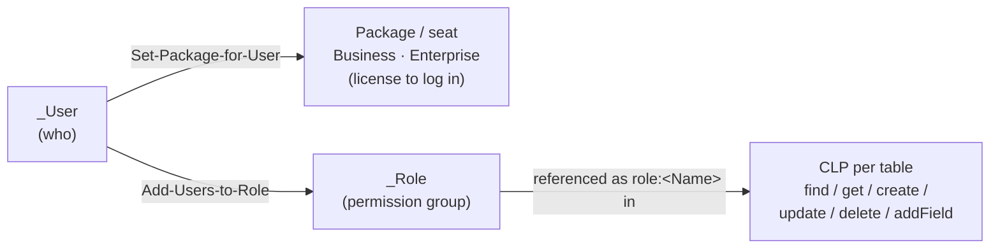

# Users, Roles & Permissions — Access Control Model

> **Purpose:** Reference for the three access-control pillars — משתמשים (Users), תפקידים (Roles) + חבילות (Packages/seats), and הרשאות טבלה (Table Permissions / CLP) — including spec-ready tool parameters, onboarding/offboarding flows, CLP design patterns, portal users and row-level filtering.
> **Last updated:** 2026-06-10 · **Status:** draft

## 1. Mental model — three independent decisions



**A user with no package cannot log in even with a role; a user with no role logs in but sees empty tables.** Nothing is automatic — every onboarding does all three steps. Effective permissions = **union** across all of a user's roles.

Backend note: this is Parse Server — `_User`, `_Role`, and Class-Level Permissions are native Parse concepts (cross-ref `../20-data-model/` for the schema and `../40-integrations-api/` for REST-level auth).

## 2. Toolkit

| Tool | Purpose |
|---|---|
| `Get-all-Users` | List users (⚠️ first **100** only — search via Parse REST `/users` with regex for more) |
| `Get-Current-User` | Identity check of the session (Master key → synthetic `"Master"` record) |
| `Create-or-Update-User` | Create (omit `objectId`) or update (pass `objectId`) |
| `Get-Packages` | Packages + seat occupancy |
| `Set-Package-for-User` | Attach/detach a seat |
| `Get-Roles` / `Create-Role` / `Get-Role-Users` | Role catalog / create custom / membership |
| `Add-Users-to-Role` / `Remove-Users-from-Role` | Membership management (array-based, idempotent-ish) |
| `Get-Table-Permissions` / `Set-Table-Permissions` | Read / **REPLACE** a table's CLP |

## 3. Users (`_User`)

### `Create-or-Update-User` — parameters

| Field | Type | Required | Notes |
|---|---|---|---|
| `objectId` | string | update only | Presence switches create→update; only passed fields change |
| `name` | string | — | Display name (Hebrew OK) |
| `username` | string | create | **Login identifier — must equal the email** |
| `password` | string | create | Policy below |
| `job` | string | — | Job title |
| `phone` / `extension` | string | — | |
| `active` | boolean | — | `false` = blocked login (the "delete" substitute) |
| `isPortalUser` | boolean | — | External customer-portal user (default `false`) |
| `emailVerified` | boolean | — | Default `true` |

Returns (create): `{ "objectId": "...", "createdAt": "...", "sessionToken": "r:..." }`; (update): `{ "objectId": "...", "updatedAt": "..." }`.

### Password policy (server-enforced)

- Minimum **8 characters**, at least **1 lowercase + 1 uppercase + 1 digit**.
- Violation → `"Password must be at least 8 characters long"`.
- `username` uniqueness enforced by Parse (duplicate → error).
- Failed logins tracked in `_failed_login_count`; lockout timer surfaces via `_account_lockout_expires_at` (visible in `Get-all-Users` — useful when debugging "user can't log in").
- Admin password reset = update with a new `password`.

### Deactivate, don't delete

There is **no delete-user tool**. The idiom: `Create-or-Update-User({ objectId, active: false })`. Preserves `createdBy`, record ownership and timeline references (hard delete would orphan hundreds of pointers). Reinstating = flip back to `true`.

### Portal users

`isPortalUser: true` marks an external self-service user (e.g., a customer viewing only their invoices, a student portal account). They authenticate differently and do not occupy a regular seat — live playground confirms a portal user with `relatedPackages: []`. Pair with a dedicated role (live example: `Student Portal`) and a narrow CLP.

## 4. Packages (seats / licenses)

`Get-Packages` returns `packages` + `users` (live shape, playground 2026-06-10):

```json
{
  "packages": [
    { "_id": "69bfd8149cbf3f5ed63463bb",
      "resellerPackageId": "5ae5986c9a2e78001af81715",
      "numberOfUsers": 8, "validUntil": "2027-04-05T00:00:00.000Z",
      "resellerPackageIdData": { "name": "Enterprise" } },
    { "_id": "69e9c3c716a957a23fa0183a",
      "resellerPackageId": "<businessPackageId>",
      "numberOfUsers": 7,
      "resellerPackageIdData": { "name": "Business" } }
  ],
  "users": [
    { "parseId": "2b0QVKoigE", "email": "…", "relatedPackages": ["5ae5986c9a2e78001af81715"] }
  ]
}
```

| Rule | Detail |
|---|---|
| **ID distinction (critical)** | `Set-Package-for-User` takes **`resellerPackageId`** — NOT the package's `_id`. The two look similar; the wrong one fails |
| Capacity | `numberOfUsers` is the hard seat cap. Free seats = `numberOfUsers − count(users whose relatedPackages includes the id)` — check before bulk onboarding |
| Validity | `validUntil` — expired packages are a login-failure cause to check |
| Package tiers | `Business`, `Enterprise` seen in demo; tier names come from the reseller catalog (per-customer variance expected) |

`Set-Package-for-User({ userId, resellerPackageId, action: "add" | "remove" })` → returns `"OK"`. Moving between packages: `remove` old **then** `add` new (avoid double-seat consumption).

## 5. Roles (`_Role`)

### System roles (provisioned with every app) + live extras

Live `Get-Roles` (playground) returns the 10 system roles plus environment-specific custom ones:

| Role | Color | Audience (typical) |
|---|---|---|
| `Admin` | red | Full DB admin — appears in nearly every CLP |
| `CRM` | purple | Generic CRM user — core tables |
| `Sales` | azure | Sales reps — Accounts, Contacts, Sales, Tasks, Activities |
| `Support` | green | Support agents — Cases, Tasks, Activities |
| `Lead Admin` | red | Lead-management supervisors |
| `Report Admin` | orange | Reports & analytics |
| `MyBooks Admin` | orange | Finance/bookkeeping module |
| `Campaign Manager` | green | MyCampaigns module |
| `MyChatAdmin` / `MyChatUser` | red / azure | MyChat module admin / agent |
| *(custom, examples live)* `Managers`, `Field Agents`, `Finance`, `E-commerce Admin`, `Lecturer`, `College Admin`, `Student Portal` | — | Customer-specific groupings (College roles ship with the MyCollege module) |

Mapping job titles → roles (from `system-roles.md`): מנהל מכירות → Sales (+Lead Admin) · נציג תמיכה → Support · רו"ח → MyBooks Admin · מנהל שיווק → Campaign Manager · אנליסט → Report Admin · מנהל CRM → CRM + Admin · מוקדן צ'אט → MyChatUser.

**Never rename system roles.** Their names are the literal keys in every CLP (`role:Admin`); renaming orphans the references, and no MCP rename tool exists (by design). For label-only needs use the terminology dictionary (`09-terminology-localization.md`); for real restructuring create a parallel custom role and migrate CLPs.

### Creating custom roles

```json
Create-Role({ "name": "Field Agents", "description": "נציגי שדה — מכירות ותמיכה", "color": "green" })
```

`color` ∈ `green | red | yellow | orange | azure | purple`. **A new role grants NOTHING** until (a) users are added and (b) the role appears in at least one table's CLP. When to create custom: a subset-access group (Finance read-only), a cross-department grouping (Managers), or industry-specific staffing that doesn't map to the ten.

### Membership

```json
Add-Users-to-Role({ "roleId": "RGgGEH4iIZ", "userIds": ["6uWdJUouOg","d56ft3TglJ"] })
Remove-Users-from-Role({ "roleId": "slOOdR6Dyh", "userIds": ["6uWdJUouOg"] })
Get-Role-Users({ "roleId": "RGgGEH4iIZ" })   // → [{objectId, name, email, username}]
```

Array-based — batch one call per role. Re-adding an existing member / removing a non-member is safe. A user may hold any number of roles. Note: `Get-Schema("_Role")` returns `{}` — _Role is a fixed Parse system class.

## 6. Table permissions — CLP (Class-Level Permissions)

Each table carries six actions; each action maps **who → `true`**. Live read of Accounts (playground):

```json
{
  "classLevelPermissions": {
    "find":   { "role:Admin": true, "role:CRM": true, "role:Support": true, "role:Sales": true },
    "get":    { "role:Admin": true, "role:CRM": true, "role:Support": true, "role:Sales": true },
    "create": { "role:Admin": true, "role:CRM": true, "role:Support": true, "role:Sales": true },
    "update": { "role:Admin": true, "role:CRM": true, "role:Support": true, "role:Sales": true },
    "delete": { "role:Admin": true, "role:CRM": true, "role:Support": true, "role:Sales": true },
    "addField": {}
  }
}
```

### Semantics

| Action | Meaning |
|---|---|
| `find` | List/query (the grid) |
| `get` | Single record by objectId (opening a card) — **keep identical to `find`** except deliberate audit splits |
| `create` / `update` / `delete` | Writes |
| `addField` | Schema-level field addition via client — virtually always `{}` |

| Key pattern | Grants to |
|---|---|
| `"role:<RoleName>"` | All members of that role — **exact, case-sensitive role name** (spaces allowed: `role:Report Admin`) |
| `"<userObjectId>"` | One specific user (exception mechanism — keep rare) |
| `"requiresAuthentication"` | Any logged-in user |
| `"*"` | Public/anonymous — only for deliberately internet-exposed tables |

Values are **always `true`** — there is no `false`; absence = no grant. `{}` on an action = nobody via the normal API (only Master Key / MCP).

### ⚠️ THE replace-all gotcha

`Set-Table-Permissions` **replaces the entire CLP** — there is no patch endpoint. All six keys must be present; omitting one (people forget `addField`) **silently revokes it**. Canonical workflow:

```
1. snapshot = Get-Table-Permissions({ table })
2. modified = deep-copy snapshot.classLevelPermissions; add/remove keys
3. Set-Table-Permissions({ table, classLevelPermissions: modified })
4. Get-Table-Permissions({ table })   // verify readback
```

### CLP design patterns (from `clp-patterns.md`)

| # | Pattern | Shape |
|---|---|---|
| 1 | Default CRM table | CRM+Admin+Sales+Support on all 5 actions, `addField: {}` (= live Accounts above) — **use as the default for new custom tables** |
| 2 | Sales-only table | Drop `role:Support` everywhere |
| 3 | Support-only table | Drop `role:Sales` everywhere |
| 4 | Read-only viewer | Viewer role in `find`+`get` only |
| 5 | Collaborator without delete | Role in find/get/create/update, NOT delete (forces "Lost/Cancelled" instead of hard delete) |
| 6 | Single-user exception | `"update": { "role:Support": true, "EkeJaH4t4W": true }` |
| 7 | Admin-only lockdown | Only `role:Admin` on all actions (config/audit tables) |
| 8 | Locked table (trigger-driven) | Reads for roles; `create`/`update`/`delete` all `{}` — only Master key writes |
| 9 | Authenticated-anyone | `find`/`get`: `requiresAuthentication`; writes Admin-only (utility lookups) |
| 10 | Public read | `"*"` in find/get — landing-page catalogs only; confirm with customer |

Example — read-only Finance viewer:

```json
{
  "find":   { "role:Admin": true, "role:Finance": true },
  "get":    { "role:Admin": true, "role:Finance": true },
  "create": { "role:Admin": true },
  "update": { "role:Admin": true },
  "delete": { "role:Admin": true },
  "addField": {}
}
```

### CLP vs the CRM front-end (verified platform bug)

Parse-level `{"*": true}` passes API calls, **but the CRM UI additionally checks role membership** — users still get "no permissions" errors on pages backed by a `*`-CLP table (Bug 5 in `myb-p-create-entity`). Always use role-based CLP matching the Cases/Accounts pattern on new tables. Tables created via raw REST start with an **empty CLP** — call `Set-Table-Permissions` on every new table.

## 7. Row-level filtering — הרשאות מתקדמות (Advanced Permissions)

A separate, **UI-configured** layer (Admin Panel → Tables → [table] → הרשאות מתקדמות) that filters *which records* a user sees, on top of CLP which controls *which operations* are allowed (source: `guide_advanced_permissions.md`):

- Filter by a Pointer field — most commonly `OwnerId` → `_User` ("each rep sees only their own deals"); any Pointer can drive it (branch, team).
- **Role-based exemptions** — e.g., Admin and Sales-manager roles see everything.
- Applies universally: table views, reports, dashboards, charts, search.
- Pair with a form rule `OwnerId = currentUser` default (`07-form-rules.md` §5.7) so new records always carry the filter field.

⚠️ **No MCP tool exposes advanced-permissions configuration** — discovery/audit must go through the UI (or page-level settings review). Mark in fit-gap as Config-via-UI.

Related page-level control: `Get-Page-Settings`/`Set-Page-Settings` expose `loginOnly` and `allowedRoles` per page — a coarse "who can open this page" gate that complements CLP.

## 8. Standard workflows

### Onboarding (the canonical 3 steps)

```
1. Create-or-Update-User({ name, username: email, password, job, phone, active: true })  → userId
2. Get-Packages() → pick resellerPackageId; Set-Package-for-User({ userId, resellerPackageId, action: "add" })
3. Get-Roles() → roleId; Add-Users-to-Role({ roleId, userIds: [userId] })
```

Bulk: fetch packages+roles once; create users in sequence; group the role step into one `Add-Users-to-Role` per role with the full array.

### Offboarding

```
1. Create-or-Update-User({ objectId, active: false })    // block login (never delete)
2. Remove-Users-from-Role(...) per role                   // optional hygiene
3. Set-Package-for-User({ userId, resellerPackageId, action: "remove" })  // free the seat
```

### Promotion / role change

`Remove-Users-from-Role(old)` + `Add-Users-to-Role(new)` → verify both with `Get-Role-Users`.

### Restrict a table to one department

`Get-Table-Permissions` → rebuild with only the department role + Admin on all actions → `Set-Table-Permissions` → readback.

### Verification checklist (after any change)

- User created? → in `Get-all-Users`.
- Seat set? → `Get-Packages().users[*].relatedPackages`.
- Role membership? → `Get-Role-Users`.
- CLP? → `Get-Table-Permissions` readback — never trust the write's "OK" alone.

## Limitations & gotchas

1. **`Set-Table-Permissions` replaces all six actions** — read-modify-write or you silently revoke grants.
2. **`resellerPackageId` ≠ `_id`** — only the former works in `Set-Package-for-User`.
3. **Seat caps enforced** (`numberOfUsers`) — count free seats before bulk onboarding.
4. **No user deletion** — `active: false` is the supported path; preserves pointer integrity.
5. **New custom roles grant nothing** until added to CLPs; membership alone has no effect.
6. **`username` must equal the email** — it is the login identifier.
7. **Union semantics** — unexpected broad access usually means a forgotten extra role.
8. **Role ≠ seat** — both are required for a working login.
9. **System role names are immutable keys** — never rename; CLP `role:` keys are case- and space-sensitive (typo = silent no-grant).
10. **`Get-all-Users` caps at 100** — for larger orgs query Parse REST `/users` directly.
11. **`*` CLP fails at the CRM UI layer** — use role-based CLP; REST-created tables start with empty CLP.
12. **Row-level "advanced permissions" are UI-only** — no MCP read/write; audit manually.
13. **Portal users** consume no standard seat but still need role+CLP design; their auth flow differs (⚠️ exact portal auth mechanics UNVERIFIED in examined sources).
14. **CLP has no field-level granularity** — hiding specific fields per role requires separate pages/forms (or row-filtering), not CLP.
