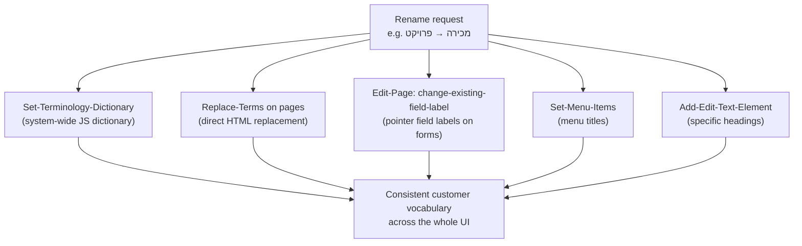

# Terminology & Localization — Renaming Entities to the Customer's Language

> **Purpose:** Reference for adapting CRM entity labels to a customer's domain language — שינוי מונחים (Replace Terms) — covering the terminology dictionary, page-HTML replacement, field labels, menus, what gets renamed where, industry examples, and the hard limits of renaming.
> **Last updated:** 2026-06-10 · **Status:** draft

## 1. Why this exists

The CRM ships Hebrew-first with fixed entity vocabulary (מכירה, לקוח, פנייה…). Verticals speak differently: an NGO calls customers משתתפים (participants), a project firm calls sales פרויקטים (projects), a service bureau calls cases קריאות (service calls). Renaming is **display-layer only** — table names, field names, and ids never change; reports, APIs, and triggers keep using `Sales`, `Accounts`, `Cases`.



**Principle (from the skill): native tools only — no JS overrides.** All five mechanisms modify stored HTML/dictionaries permanently — immediate, no flash-of-old-text. `Edit-Page-CSS-JS` text-replacement hacks are a last resort requiring explicit user approval.

## 2. Default term mapping (what you are renaming from)

| Entity | Class name (never changes) | Singular | Plural |
|---|---|---|---|
| Sale | `Sales` | מכירה | מכירות |
| Account | `Accounts` | לקוח | לקוחות |
| Case | `Cases` | פנייה | פניות |
| Task | `Tasks` | משימה | משימות |
| Activity | `Activities` | פעילות | פעילויות |
| Contact | `Contacts` | איש קשר | אנשי קשר |
| Lead | `Accounts` with `IsAccount: false` | ליד | לידים |

Industry-vertical examples: מכירה→פרויקט (project company), לקוח→משתתף (NGO), פנייה→קריאה (service bureau), מכירה→תיק (law office), לקוח→סטודנט (college).

## 3. The five tools

### 3.1 `Set-Terminology-Dictionary` — the system-wide foundation

A key→value map consumed by the CRM's JavaScript runtime for dynamically generated labels (reports, queries, runtime strings). **Always `Get-Terminology-Dictionary` first**, change only the target terms, keep the rest.

Live state (playground, 2026-06-10) — an active Sale→Project rename:

```json
{
  "success": true,
  "dictionary": {
    "מכירה": "פרויקט", "מכירות": "פרויקטים",
    "פנייה": "פנייה", "פניות": "פניות",
    "משימה": "משימה", "משימות": "משימות",
    "פעילות": "פעילות", "פעילויות": "פעילויות",
    "לקוח": "לקוח", "לקוחות": "לקוחות",
    "ליד": "ליד", "לידים": "לידים"
  }
}
```

Spec shape: `Set-Terminology-Dictionary(terminology: { "<oldTerm>": "<newTerm>", ...all other terms unchanged })` — identity mappings (`"לקוח": "לקוח"`) are how "unchanged" is expressed; the write replaces the whole dictionary.

### 3.2 `Replace-Terms` — direct HTML replacement per page (the workhorse)

```json
Replace-Terms({ "pageId": "<pageId>", "terms": { "מכירה": "פרויקט", "מכירות": "פרויקטים" } })
```

- Edits the **stored server-side HTML** — permanent; returns a per-term replacement count (`changes: []` = term absent, harmless).
- Handles headings, button text ("מכירה חדשה"→"פרויקט חדש"), chart/counter titles, modal headers, column headers, filter labels, settings card descriptions.
- Multiple term pairs per call; **idempotent** (re-running finds nothing left to replace).
- Two special pages are **mandatory** in every rename: **`CRMmaster`** (the master dictionary embedded across all pages) and **`Timeline`** (hardcoded entity names inside event templates).
- ⚠️ Risk: it is a literal text replacement — terms that collide with CSS class names, data attributes, or unrelated words can break markup or over-replace. Review the term pair for ambiguity before running (e.g., a term that is also a substring of another word).

### 3.3 `Edit-Page` action `change-existing-field-label` — pointer field labels

Form pages label pointer fields with the entity term (e.g., "משויך למכירה" on the PriceQuote card). Per page:

```json
Edit-Page({ "pageId": "<pageId>", "actions": [
  { "actionType": "change-existing-field-label", "fieldName": "SaleId", "label": "משויך לפרויקט" }
]})
```

Find candidates by reading each form page with `Get-Page-Content(minimal: true)` and scanning labels for the old term.

### 3.4 `Set-Menu-Items` — menus

Side menu, settings menu, and entity-specific sub-menus (e.g., `settings-sales`). Flow: `Get-Menus()` → `Get-Menu-Items(menuId)` → `Set-Menu-Items` with updated titles. **Every item must round-trip all required fields: `_id`, `title`, `type`, `page`, `order`, `icon`** (copy from the Get response and change only `title`). Menu item `_id`s are MongoDB-format ids (project rule #8).

### 3.5 `Add-Edit-Text-Element` — surgical text edits

For a specific heading/paragraph that `Replace-Terms` can't safely target:

```json
Add-Edit-Text-Element({ "pageId": "<pageId>", "elemId": "P62", "elemType": "P",
                        "html": "הכנסות מפרויקטים בתאריכים הנבחרים" })
```

## 4. What gets renamed where — coverage map

| UI surface | Mechanism |
|---|---|
| Dynamic/runtime labels (reports, queries) | Terminology dictionary |
| Page titles, buttons, table headers, dashboards | `Replace-Terms` per page |
| Master dictionary used by all pages | `Replace-Terms` on `CRMmaster` (mandatory) |
| Timeline event titles ("מכירה עודכנה") | `Replace-Terms` on `Timeline` (mandatory) + gender verb fixes |
| "Add new" modal tabs | `Replace-Terms` on `MasterTicket` |
| Entity tabs/sections on the Account card | `Replace-Terms` on `Account` |
| Settings module cards | `Replace-Terms` on `settings` + entity System-Tables pages |
| Form field labels (`SaleId` → "משויך לפרויקט") | `Edit-Page` change-existing-field-label |
| Side menu / settings menus | `Set-Menu-Items` |
| Browser tab title (SEO) | `Set-Page-Settings(pageId, title)` |

## 5. Full procedure (8 steps, from the skill)

1. **Discover affected pages** — two complementary strategies:
   - *Page-name search:* `Get-Site-Pages()`, filter names containing the class name. For Sales: `Sale`, `Sales`, `SaleRows`, `Pipeline`, `DashboardSales`, `DashboardSalesManager`, `DashboardSalesRep`, `System-Tables-Sale-Statuses`, `Mobile-Sale`, `Mobile-Sales`. Plus the fixed set: `CRMmaster`, `Timeline`, `MasterTicket`, `Account`, `settings`, `DashboardLeads`.
   - *Schema-driven search:* `Get-Schema()` → tables with Pointer fields targeting the entity → their pages may carry the term in labels/sections.
2. **Update the terminology dictionary** (Get → modify → Set, preserving all other terms).
3. **`Replace-Terms` on `CRMmaster`** — most important single step.
4. **`Replace-Terms` on `Timeline`** — separately mandatory.
5. **`Replace-Terms` on every discovered page** (parallel calls are fine).
6. **Field labels** on form pages via `Edit-Page`.
7. **Menus** via `Get-Menus` / `Get-Menu-Items` / `Set-Menu-Items`.
8. **Verify**: hard refresh (Ctrl+F5), walk: side menu → list page (title/button/columns) → form page (headline/labels) → Pipeline (for Sales) → Account card tabs → Timeline filter+events → "add new" modal → dashboards → settings. Report a table of pages × replacement counts.

### Gender handling (Hebrew-specific)

When grammatical gender flips (מכירה fem. → פרויקט masc.), Timeline event verbs must follow — **on the Timeline page only**:

```json
Replace-Terms({ "pageId": "<TimelineId>", "terms": {
  "מכירה": "פרויקט", "מכירות": "פרויקטים",
  "עודכנה": "עודכן", "נוצרה": "נוצר"
}})
```

Do not apply verb replacements on other pages — the same verbs appear in unrelated contexts.

### Rollback

Reverse mapping through the same four mechanisms: dictionary back to identity, `Replace-Terms` with `{"פרויקט": "מכירה", ...}` on all touched pages, menus and field labels restored. (This works because Replace-Terms is symmetric text replacement.)

## 6. Limits of renaming — what does NOT change

| Layer | Behavior |
|---|---|
| **Schema** — table names (`Sales`), field names (`SaleStatusId`), `targetClass` | Never touched. All API/MCP/trigger/report definitions keep English internals |
| **CSS classes, data attributes, page paths** (`apps/mybusiness/Sales`) | Unchanged — URLs still say `Sales` |
| **Role names** (`role:Sales`) | Never rename — CLP keys break (`08-users-roles-permissions.md`) |
| **Field-level Hebrew labels in the schema dictionary** (`_Dictionary` / field `dictionary` attribute) | Separate mechanism: per-field labels are set via `Add-Field-to-Table` `label` or `_Dictionary` rows (see the SLA skill's dictionary-setup) — a page rename does not retro-label schema fields |
| **Email/WhatsApp template contents** | Stored separately (EmailTemplate table, Meta templates) — review manually |
| **Mobile pages** | Must be discovered and replaced like any page (`Mobile-Sale`, `Mobile-Sales`) |
| **New pages created after the rename** | Copied templates may reintroduce old terms — re-run Replace-Terms after major page additions |

## Limitations & gotchas

1. **CRMmaster + Timeline are mandatory stops** — skipping either leaves old terms in shared dictionaries/event labels.
2. **Replace-Terms is literal text replacement** — ambiguous/substring terms can corrupt markup or over-replace; review pairs first; never replace English internal identifiers.
3. **The dictionary write is a full replace** — always Get first and preserve unchanged terms as identity mappings.
4. **Set-Menu-Items requires the complete item objects** (`_id`, `title`, `type`, `page`, `order`, `icon`) — partial payloads drop data; ids are MongoDB-format.
5. **Gender verb fixes belong to Timeline only.**
6. **No JS overrides without explicit user approval** — exhaust the five native tools first.
7. **Renaming is cosmetic** — discovery documents and specs must keep speaking schema language (`Sales`) with the customer term in parentheses, or implementers will look for tables that don't exist.
8. **Idempotency helps recovery** — re-running a partial rename is safe; the reverse mapping is the rollback.
9. **Per-page count returns are your audit trail** — record them; `changes: []` everywhere usually means you targeted the wrong page id.
10. ⚠️ UNVERIFIED: whether `Replace-Terms` on `CRMmaster` alone propagates to every page at runtime (the skill still mandates per-page passes — follow the skill).
