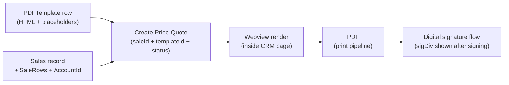

# Price Quotes & PDF Documents — הצעות מחיר

> **Purpose:** Reference for the quote/document subsystem: PDF templates (תבניות הצעת מחיר), the generation pipeline from a Sale, dynamic placeholders vs static blocks, branding/logo handling, digital signature block, and the hard rendering gotchas.
> **Last updated:** 2026-06-10 · **Status:** draft

## 1. Architecture

A quote template is a **complete HTML document with `{{...}}` placeholders**, stored as the `HTML` field of a row in the **`PDFTemplate`** table. Generating a quote merges a `Sales` record (+ its `SaleRows` + the pointed `Accounts` record) into the template, renders it in a webview inside the CRM page, and produces a PDF for sending/signature.



The webview/print pipeline imposes the three hard rules in §3. Quote placeholders use **double braces `{{ }}`** — distinct from trigger/notification placeholders (`{{{ }}}`, `06-triggers-and-automations.md` §7).

## 2. Tools

| Tool | Parameters | Notes |
|---|---|---|
| `Get-Price-Quote-Templates` | none | Returns `[{ objectId, Name }]`. Live (playground): 12 templates incl. "הצעת מחיר כולל מע\"מ", "תבנית קלאסית-מקצועית", "תבנית מודרנית-צבעונית" |
| `Get-Data(table: "PDFTemplate", objectId)` | **no `keys` param** | Fetches the full row incl. the large `HTML` field — specifying `keys` can drop `HTML` |
| `Create-Update-Price-Quote-Template` | `templateName` (req), `templateContent` (req, full HTML), `objectId` (update only) | Omit `objectId` to create (returns new objectId), pass it to update. Duplicating = read HTML → create under a new name |
| `Create-Price-Quote` | `saleId` (req), `templateId` (req), `status` (req, enum below), `includeVAT` (opt, default `true`) | The Sale must exist **with SaleRows** |

### `Create-Price-Quote` status enum (exact strings)

| Value | Meaning |
|---|---|
| `"טיוטה"` | Draft |
| `"נשלחה - בהמתנה לאישור"` | Sent — awaiting approval |
| `"בוטלהמושהית"` | Cancelled/on-hold (sic — one token, as documented) |
| `"אושרה"` | Approved |

## 3. Mandatory HTML skeleton — three hard rules

```html
<div id="windowDiv" class="rtl" style="height: auto; padding: 0;
     -webkit-print-color-adjust: exact; font-family: 'Noto Sans Hebrew', sans-serif;
     direction: rtl;">

  <!-- ... all content ... -->

  <!-- digital signature block — EXACTLY this structure -->
  <div id="sigDiv" style="text-align: center; margin-top: 30px;">
    <div id="Signature">חתימה</div>
    <div id="SignatureName">שם חתום</div>
    <div id="SignatureDate">תאריך חתימה</div>
  </div>
</div>
```

### Rule 1 — NO `<script>` tags, ever

Any `<script>` tag (formatters, listeners, anything) **breaks the Parse connection** with `"XMLHttpRequest failed: Unable to connect to the Parse API"` and disables the whole template. All logic must be CSS-only. Consequences: no number formatting with thousands separators, no conditional show/hide, no computations inside the template.

### Rule 2 — the signature block is system-managed

- Wrapper must be exactly `id="sigDiv"`, containing exactly `id="Signature"`, `id="SignatureName"`, `id="SignatureDate"`.
- The system hides `sigDiv` before signing and reveals it after — **do not** hide it with CSS (`display:none` fails) and do not rename the ids (block becomes visible to the customer prematurely).

### Rule 3 — PDF background colors need `@media print` + `!important`

Browsers strip background colors in print/PDF by default. Every colored element needs **both** an inline style (web view) **and** a print class (PDF):

```html
<style>
@media print {
  * { -webkit-print-color-adjust: exact !important; print-color-adjust: exact !important; }
  .brand-header { background-color: #1F2732 !important; color: #fff !important; }
  .brand-thead  { background-color: #2D3A49 !important; color: #fff !important; }
  .brand-light  { background-color: #F8F8F8 !important; }
}
</style>
<td class="brand-header" style="background-color: #1F2732; color: #fff;">…</td>
```

## 4. Placeholders — dynamic vs static

### Quote-level placeholders (always populated — safe)

| Placeholder | Value |
|---|---|
| `{{number}}` | Quote number |
| `{{date}}` | Creation date |
| `{{totalIncludingVat}}` | Grand total incl. VAT |
| `{{Vat}}` | VAT percentage |

### Sale / Account placeholders (safe set)

| Placeholder | Value |
|---|---|
| `{{Sales.AccountId.Name}}` | Customer name |
| `{{Sales.AccountId.PhoneNumber}}` / `{{Sales.AccountId.Email}}` / `{{Sales.AccountId.Address}}` | Contact details |
| `{{Sales.TotalBeforeDiscount}}` | Subtotal before discount |
| `{{Sales.DiscountValue}}` | Discount amount |
| `{{Sales.Total}}` | After discount, before VAT |

### Repeating product rows — `data-repeat`

`data-repeat="SaleRows"` goes **on the `<tr>`** (not `<table>`, not `<td>`); the row duplicates per SaleRow:

```html
<table>
  <tr class="brand-thead"><td>מוצר</td><td>תיאור</td><td>כמות</td><td>מחיר ליחידה</td><td>סה"כ</td></tr>
  <tr data-repeat="SaleRows">
    <td>{{SaleRows.ProductId.Name}}</td>
    <td>{{SaleRows.Description}}</td>
    <td>{{SaleRows.Quantity}}</td>
    <td>{{SaleRows.PricePerUnit}} &#8362;</td>
    <td>{{SaleRows.Total}} &#8362;</td>
  </tr>
</table>
```

### Empty-placeholder hazard + customer-facing hygiene

- **An empty field renders the placeholder as raw text** (`{{SaleRows.Discount}}` literally printed in the PDF). Rule: if a placeholder can be empty, leave it out (per-row `Discount` and sometimes `Description` are the classic offenders; show the total discount via `{{Sales.DiscountValue}}` in the summary instead).
- **Never put internal fields on a customer document**: `{{Sales.Probability}}`, `{{Sales.ReasonForLost}}`, `{{Sales.NextStepDate}}`, `{{Sales.IsWon}}`/`{{Sales.IsLost}}`.

### Dynamic vs static block map (intake checklist for new templates)

| Dynamic (from CRM data) | Static (authored in the template) |
|---|---|
| Customer name/phone/email, quote number, date | Brand marketing copy |
| Product names, descriptions, quantities | General terms (כולל / לא כולל) |
| Prices, totals, discounts, VAT | Delivery times, company details (address/phone) |
| Signer name display | Standard product dimensions, footer |

### Input fields (fill-in-by-customer) — partially understood

`<input name="Accounts.Address">` / `<input name="Sales.Notes">` are documented to write values back to the database on submission; **do not** set `value="{{...}}"` on an input (prevents saving). ⚠️ The price-quote skill marks this feature as still under investigation — behavior varies by environment; clone a working example from the specific customer before relying on it. (The playground contains several `ניסוי` experiment templates for exactly this.)

## 5. Branding & logo handling

| Topic | Rule |
|---|---|
| RTL layout | First `<td>` in a row renders on the **right** — logo in the first cell for right placement |
| Recommended header | Two-cell table: logo 40% right, company details 60% left, brand background on both |
| Fonts | Google-fonts `@import` (e.g., `Noto Sans Hebrew`) + `* { font-family: ... !important }` |
| Logo size | Use `width: 240px; height: auto` — **never `max-width` / `max-height`** (renders tiny when the PNG has transparent padding) |
| Logo file | PNGs usually carry huge transparent margins — crop to the alpha-channel bounding box (Jimp script in the skill: scan `alpha > 10`, crop + 10px padding) before uploading |
| Upload | `Upload-Public-File` (base64) with customer credentials, or the customer uploads via CRM media and supplies the URL |
| Versioning | Never modify the customer's chosen template in place — duplicate (`Get-Data` → create with new name) and edit the copy; build 3–5 meaningfully different variants when the customer asks for options |

## 6. Troubleshooting cheat sheet (from `common-errors.md`)

| Symptom | First check |
|---|---|
| `XMLHttpRequest failed: Unable to connect to the Parse API` | Search the template HTML for `<script` — remove all |
| Signature block visible before signing | `id="sigDiv"` + the 3 inner ids exactly |
| PDF loses colors (web OK) | `@media print` block with `!important` per color |
| Colors missing even on web | Inline `style` missing (need class **and** inline) |
| Logo tiny / header too tall | Un-cropped PNG → crop by alpha; use fixed `width` |
| Only one product row shows | `data-repeat="SaleRows"` not on the `<tr>` |
| Raw `{{...}}` printed | Typo in placeholder path / field empty on the record / wrong braces |
| `Get-Data` returns no HTML | Drop the `keys` parameter |

## 7. Spec-ready workflow (new branded template)

```
1. Intake: brand identity (logo file, colors, language), quote structure, dynamic-vs-static decisions
2. Get-Price-Quote-Templates → check existing; Get-Data on a similar template for reference HTML
3. Crop logo (alpha-channel) → Upload-Public-File → URL
4. Author HTML: windowDiv + rtl + header/info-bar/customer-box/product-table/totals/terms/sigDiv/footer
   (boilerplate with all required blocks is embedded in the price-quote skill)
5. Create-Update-Price-Quote-Template(templateName, templateContent) → objectId
6. Create-Price-Quote(saleId: <test sale with rows>, templateId, status: "טיוטה")
7. Visual check in CRM + print-to-PDF check (colors!), then hand over
```

Checklist before saving: `windowDiv` ✓ · no `<script>` ✓ · `@media print !important` per color ✓ · `sigDiv`+3 ids ✓ · `data-repeat` on `<tr>` ✓ · logo cropped ✓ · all placeholders `{{...}}` valid for this customer's schema ✓.

## Limitations & gotchas

1. **No JavaScript at all** in templates — CSS-only logic; no client-side number formatting or conditionals.
2. **Empty placeholders print literally** — omit any field that may be blank.
3. **`sigDiv` contract is exact** — wrong ids leak the signature block or break the signing flow.
4. **Print colors require dual styling** (inline + `@media print !important`).
5. **Status strings are Hebrew enums** — pass them exactly (incl. `"בוטלהמושהית"`).
6. **`Create-Price-Quote` needs a real Sale with SaleRows** — empty sales make empty product tables.
7. **Read templates without `keys`** or the `HTML` field may be omitted.
8. **Input-field write-back is environment-dependent** (⚠️ under investigation) — verify against a working template in the same environment.
9. **Template edits are global** — every future quote from that template changes; duplicate before experimenting.
10. **VAT**: `includeVAT` default `true`; `{{Vat}}`/`{{totalIncludingVat}}` come from the pipeline — don't hand-compute totals in static HTML.
11. Other document types (invoices/receipts in MyBooks) are a **separate** subsystem — this doc covers `PDFTemplate` quote documents only (⚠️ MyBooks document templating UNVERIFIED here; see the MyBooks module docs).
