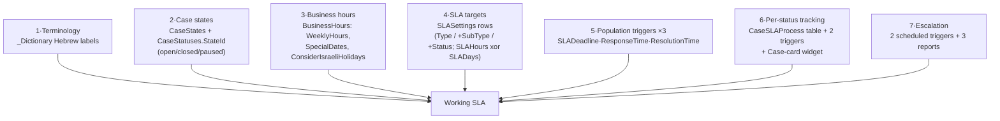

# Solution Blueprints — Proven End-to-End Patterns

> **Purpose:** Catalog of field-proven, end-to-end solution patterns for fit-gap analysis and implementation planning. Each blueprint: problem → solution shape → components touched → effort class (S = hours, M = ~1 day, L = multi-day/dev involvement) → source skill. Detail lives in the linked skills and sibling docs; this file is the index an implementer scopes from.
> **Last updated:** 2026-06-10 · **Status:** draft

## Index

| # | Blueprint | Effort | Source skill |
|---|---|---|---|
| 1 | SLA mechanism for Cases | **L** | `myb-p-sla-configuration` |
| 2 | Bulk data import from Excel/CSV | M | `myb-p-data-import` |
| 3 | Web2Lead / Web2Table external form intake | S–M | `myb-p-web2lead-web2table` |
| 4 | Timestamp audit fields | S | `myb-p-timestamp-field` |
| 5 | Cascading dropdowns (parent-child) | S | `myb-p-parent-child-fields` |
| 6 | Multi-select fields | S | `myb-p-multi-select-field` |
| 7 | Full-stack custom entity (module) | M–L | `myb-p-create-entity` |
| 8 | Analytical dashboards | M | `myb-p-dashboards` → see `05-dashboards-and-reports.md` (sibling doc) |
| 9 | Vertical terminology adaptation | S–M | `myb-p-rename-terms` |
| 10 | Status-change automation pack | S | `myb-p-trigger-setup` |
| 11 | Customer-facing portal | **L–XL** | no skill yet — [13-customer-portals.md](13-customer-portals.md) is the source (proven across multiple production portal builds) |

---

## 1. SLA mechanism for Cases — מנגנון SLA לפניות (effort: L)

**Problem.** Service teams need deadlines per case (זמן תקן לטיפול), per-status time budgets, escalation before/after breach, and SLA reports — and the platform's SLA admin screens alone do not deliver it.

**The critical platform fact (verified empirically):** `SLASettings` and `BusinessHours` are **configuration shells** — no runtime engine reads them to stamp `SLADeadline` / `ResponseTime` / `ResolutionTime` onto cases. The platform fields exist on the `Cases` schema (also `EstimatedResolution`, `IsEscalated`, `EscalationLevel`, `EscalatedTo`), but **triggers must be built** to populate them. A customer who "has SLA" with `Count-Data(Cases where SLADeadline exists) == 0` has the shells without the engine.

**Solution shape — 7 moving parts (all required):**

**Components & spec anchors:**

| Part | Shape |
|---|---|
| Taxonomy | `CaseTypes`, `CaseSubTypes(TypeId)`, `CaseStatuses(StateId→CaseStates)`; every status must map to a state — null `StateId` = clock runs forever. UI: הגדרות מערכת → הגדרות פניות |
| `BusinessHours` (single row) | `{ Name, WeeklyHours: [{day, active, from, to}×7], SpecialDates: [{date, name, closed}], ConsiderIsraeliHolidays: true }` — one window only; multi-shift unsupported |
| `SLASettings` (one row per rule) | `{ CaseTypeId, CaseSubTypeId?, CaseStatusId?, SLAHours xor SLADays }`; precedence most-specific-wins (Type+SubType+Status > Type+SubType > Type) |
| Trigger 1 — deadline on create | `events:["create"]`, criteria StatusId=פתוח, action `update-object current.objectId` → `SLADeadline = createdAt + timeGap` (2880 = 2 days) |
| Trigger 2 — first response | `events:["update"]`, `onSetFields:["StatusId"]`, **`oneachupdate:false`**, criteria StatusId ≠ פתוח → `ResponseTime = updatedAt` (false is critical — true would re-stamp and destroy the metric) |
| Trigger 3 — resolution | criteria StatusId = סגור → `ResolutionTime = updatedAt` + `IsClosed = true` (static) |
| `CaseSLAProcess` table | `{ Name, CaseId→Cases, StatusId→CaseStatuses, StatusEnteredAt, StatusExitedAt, DeadlineForStatus, SLAHoursAllowed, SLADaysAllowed, IsCurrent, IsBreached, IsPaused }` + 2 `create-object` triggers (initial row on create; new row on every status change with `oneachupdate:true`); the `CaseId` pointer makes the Case-card widget auto-filter. Widget via the `myb-p-page-tables` skill (aggrField per column, `insertAfterRow` placement, `Edit-Table-View` finalization) |
| Escalation | Scheduled triggers on `schedulerField: "SLADeadline"`: `shcedulerHours: 2` (warning, owner) and `-1` (breach, manager — `userType: fixed` or `ManagerId` field); criteria evaluated at fire time so handled cases don't alert |
| Reports ×3 | דוח SLA כללי · חריגות פניות פתוחות (`IsClosed=false`, sort `SLADeadline` asc) · חריגות פניות סגורות (`IsClosed=true`, sort `-ResolutionTime`); optional `CalculatedFields` `{name:"פיגור", fieldA:"ResponseTime", fieldB:"SLADeadline", action:"Minus"}`; daily digest via `ScheduleSendAt/ScheduleSendTo` |

**Known gaps to set expectations on:** `timeGap` adds **calendar** time — honoring `BusinessHours`/holidays/pause states requires a `server-side-code` cloud function (dev deliverable: look up most-specific `SLASettings` row, walk business days); per-type durations need either N triggers or that function; the simple tracking triggers never flip `IsCurrent`/`IsBreached`/`StatusExitedAt` on previous rows (history is sort-by-date). Audit-first on existing customers: `Get-Data` on the 4 config tables + `Get-Triggers("Cases")` + the two `Count-Data` probes.

Cross-refs: triggers `06-…`; reports `05-…` (sibling).

---

## 2. Bulk data import from Excel/CSV — הקמת נתונים מקובץ (effort: M)

**Problem.** Customer hands over a spreadsheet ("תקים לידים/מכירות מהקובץ") — rows must become Accounts/Sales/Cases linked to the right existing records, without duplicates.

**Solution shape (7-step pipeline):** READ (Node `xlsx`) → ANALYZE columns (identifier vs CRM field vs metadata; Hebrew header mapping: מייל→`Email`, טלפון→`PhoneNumber`, סטטוס→lookup, אחראי→`_User`) → RESOLVE lookups to objectIds → MATCH accounts → DEDUPLICATE → CREATE via `Create-Many` (batches ≤50; objectIds return **in input order** → positional mapping for two-phase lead+sale creation) → REPORT (created/skipped/not-found/errors).

**Identification strategy ladder:** objectId (perfect) → Email (high) → normalized phone regex (medium-high; strip to the 9-digit Israeli core) → name (last resort — false-positive prone: "בן חיים" matches "אבן חיים") → none = create new leads (`IsAccount: false` + `LeadStatusId`, `C_LeadSource`, `LeadOwnerId`).

**Components:** `Get-Schema`, `Get-Data` (lookups), `Create-Many`, Node.js scripting; Parse REST `/batch` for 500+ rows.

**Hard-won pitfalls (from production imports):** `$in` **silent truncation** — one common value (e.g. `info@…` on 100+ accounts) consumes the limit and drops the rest: always compare found-count vs searched-count; `Get-all-Users` caps at 100 — regex-search `/users` via REST; phone unicode direction markers; DD/MM vs MM/DD; pointer/date payloads must use canonical Parse shapes (`{"__type":"Pointer",...}`, `{"__type":"Date","iso":...}`).

**Interaction warning:** API-created records **fire triggers by default** (`06-…` §9, live-verified) — a bulk import can mass-send welcome emails and mass-create child rows. Either import with `Create-Many(skipTriggers: true)` and backfill trigger-derived fields (timestamps, SLA stamps) in the import itself, or deactivate notification-type triggers for the import window and let data-integrity triggers run deliberately.

---

## 3. Web2Lead / Web2Table — external form intake (effort: S–M)

**Problem.** Landing-page / website forms must create CRM records (lead, sale, case, enrollment) — "קליטת לידים מטופס".

**Solution shape (summary — full spec in `../40-integrations-api/03-web2lead-web2table.md`):** POST JSON to `https://api.mbapps.co.il/functions/{appId}/web2lead` (Accounts-only lead, `IsAccount:false`) or `…/web2table` (any target table + auto-account linking). Header `X-Parse-Application-Id` only — the appId is intentionally browser-safe (not the master key). Server-side duplicate detection by phone (multi-format) and email. `web2sale`/`web2case` are **not separate endpoints** — they are `web2table` with `table: "Sales"`/`"Cases"`.

**One-time prerequisite:** the `Config` table row `AcceptWebLeads` = `{ "AcceptWebLeads": true }` — otherwise both endpoints return **403**. `Config` is MCP-restricted; toggle via CRM settings UI or Parse REST with Master Key.

**Mandatory pre-code workflow:** `Get-Schema` on Accounts + target table, `Get-Data` on every Pointer's target for the value→objectId map — field names are per-customer; guessing produces 200-OK-wrong-data.

**Components:** cloud functions (platform-provided), customer-side HTML/JS/PHP/etc., `Config` row, schema lookups. Effort S for a standard lead form, M with captcha/server proxy/multi-record logic.

---

## 4. Timestamp audit fields — תיעוד תאריך שינוי (effort: S)

**Problem.** "מתי שונה הסטטוס? מתי הוקצה אחראי?" — point-in-time audit of one field.

**Solution shape:** Date field + data-change trigger (`onSetFields: [monitored]`, `oneachupdate: true` for every-change / `false` for first-time) + `update-object` on `current.objectId` setting `value: "updatedAt"`. Optional `updatedBy` companion field. Full spec: `11-field-patterns.md` §3.

**Components:** `Add-Field-to-Table`, `Set-Trigger`, `Set-Trigger-Action`. ~15 minutes per tracked field. Remember: UI-write coverage only (no API writes), test via UI.

---

## 5. Cascading dropdowns — שדה אב ושדה בן (effort: S)

**Problem.** "הצג רק סטטוסים של הסוג שנבחר" — dependent picklists.

**Solution shape:** parent + child lookup tables (child rows tagged with a single parent Pointer), two host-table Pointers, child field placed on the form with `subclassDepend: "<ParentTable>"`. Fully MCP-scriptable since 2026-05-19. Full spec: `11-field-patterns.md` §2.

**Components:** `Create-Table`/`Add-Field-to-Table`, `Create-Many`/`Update-Data` (tagging), `Edit-Page(add-new-field …, subclassDepend)`. Use **before** considering form rules (can't filter options) or custom JS.

---

## 6. Multi-select fields — שדה בחירה מרובה (effort: S)

**Problem.** Tags / interests / multiple categories per record.

**Solution shape:** `Array`-type field named `array_<purpose>_Pointer_<LookupTable>` + seeded lookup table; the Simbla runtime renders a Select2 multi-pick from the name alone. Full spec: `11-field-patterns.md` §1.

**Components:** `Create-Table` + `Create-Many` (lookup), `Add-Field-to-Table`, **manual page-editor binding** (the one non-MCP step — flag it in the plan). Queries: `containedIn` + `T:"Array"` only.

---

## 7. Full-stack custom entity — ישות/מודול חדש (effort: M–L)

**Problem.** A business concept the CRM doesn't ship (Suppliers, Affiliates, Vehicles, Projects…) needs tables, card page, list page, menu, permissions, sample data.

**Solution shape (phases):** Plan (names, fields, statuses+colors, relations, icon) → Tables via **Parse REST** (`Create-Table` MCP has a known `"missing user"` bug) + role-based CLP on every new table → sample data (`Create-Many`; REST for complex pointers) + record ACLs → form (card) page (`Create-Form-Page` → NewMaster-based; works in iframe sidebar, **not** via direct URL) + `Edit-Page` field rows → list page (`Create-Table-View-Page` copying the Cases template) → clean inherited Cases artifacts (JS file, `data-simbla-class`, modal labels, hidden add-button) via custom JS uploaded with `Upload-Public-File` + `Set-Page-Settings(jsFile, title)` → `Edit-Table-View` (columns with `type:"String"` + 3-segment `aggrField` for pointer displays; `editView: {openFrom:"modal-left", useIframe:true, page:<card>}`) → menu item.

**Key constraints baked into the blueprint:** CLP `{"*":true}` fails at the CRM UI layer — always role-based (`08-…` §6); pointer-display columns must be `type:"String"` (else rows don't render); relative links on list pages must not re-prefix `apps/mybusiness/`; page-version recovery via `Get-Page-Versions`/`Set-Page-Version` if table HTML is clobbered.

**Components:** REST schemas, `Set-Table-Permissions`, `Create-Form-Page`, `Create-Table-View-Page`, `Edit-Page`, `Edit-Table-View`, `Edit-Page-CSS-JS`, `Upload-Public-File`, `Set-Page-Settings`, `Set-Menu-Items`. Effort M for a simple entity, L with related child tables + dashboards.

---

## 8. Analytical dashboards (effort: M)

**Problem.** "תקים דשבורד למכירות/פניות/ישות חדשה" — KPI counters, charts, embedded tables, wired into the Dashboard Menu.

**Solution shape:** owned by the sibling doc `05-dashboards-and-reports.md` (and the `myb-p-dashboards` skill, currently DRAFT with documented tooling gaps). Stack: `Create-Table-View-Page` (copy from an existing dashboard) + `Add-Edit-Counter-Element` + `Add-Edit-Chart-Element` + `Add-Edit-Text-Element` + menu integration. Counters/charts use the same F/C/T/V/P criteria shape as triggers (`06-…` §2). Listed here for catalog completeness — scope and gaps per the sibling doc.

---

## 9. Vertical terminology adaptation — התאמת מונחים (effort: S–M)

**Problem.** The customer's industry says פרויקטים not מכירות, משתתפים not לקוחות — every screen should speak their language.

**Solution shape:** the 8-step rename procedure — terminology dictionary + `Replace-Terms` (CRMmaster + Timeline mandatory + all entity pages) + field labels + menus + gender verb fixes. Display-layer only; schema/API names never change. Full spec: `09-terminology-localization.md`.

**Components:** `Get/Set-Terminology-Dictionary`, `Replace-Terms`, `Edit-Page(change-existing-field-label)`, `Get-Menus`/`Get-Menu-Items`/`Set-Menu-Items`, `Add-Edit-Text-Element`. Effort S for one entity, M for a multi-entity vertical re-skin.

---

## 10. Status-change automation pack (effort: S)

**Problem.** The most-requested automation bundle: when a record hits status X — notify, create a follow-up, stamp, sync, and/or call a webhook.

**Solution shape:** one `Set-Trigger` (`events:["update"]`, `onSetFields:["StatusId"]`, Pointer criteria, `oneachupdate:false` for once-per-record) + N `Set-Trigger-Action` calls on the same triggerId, picked from the 8 action types (`06-…` §5). Canonical combos (all verified live in the playground): owner notification + manager email; follow-up Task with `DueDate = updatedAt + 1440`; account flag via `source.AccountId`; webhook with `{{{objectId}}}` in the URL; WhatsApp template message.

**Components:** `Set-Trigger`, `Set-Trigger-Action`, `Get-SMTP-Accounts`/EmailTemplate lookup (email), Channels Identity + approved template (WhatsApp). Budget S — triggers fire on API writes too (`06-…` §9), so an MCP write is a valid end-to-end test; verify recipients/conditions carefully **before** any bulk operation, and reserve time for `_syslogTriggers`/`_Timeline` debugging (`06-…` §10).

---

## Composition notes — combining blueprints

- **New entity (7) + dashboards (8) + automation pack (10)** is the standard "new module" engagement; add terminology (9) when the vertical demands it.
- **Import (2) × automations (10/1) — decide explicitly:** imports fire triggers by default. Either run the import with `Create-Many(skipTriggers: true)` and backfill computed fields (then history lacks stamps unless backfilled), or sequence the import before enabling notification-type automations and let data-integrity triggers build stamps/child rows during the load. Never bulk-import with notification triggers active.
- **SLA (1) presumes taxonomy hygiene** — run its prerequisites audit before quoting effort; missing `StateId` wiring is the most common pre-existing defect.
- **Anything requiring business-day math, SLASettings lookups, aggregation/summing, or pause/resume clocks** crosses into `server-side-code` cloud functions = dev-team dependency — classify as L and call it out in the spec.

## Limitations & gotchas

1. **Effort classes assume the playground-verified happy path** — customer customizations (renamed pages, missing taxonomy, >100 users, restricted tables) push each blueprint up a class.
2. **Triggers fire on API/Master-key writes (suppression opt-in via `Create-Many.skipTriggers` only)** — affects blueprints 1, 2, 4, 10: imports and bulk MCP fixes set off automations unless deliberately suppressed; single-record writes have no skip flag.
3. **SLA is not turnkey** — the admin screens without the trigger layer give configuration without behavior (a known platform gap); always probe with `Count-Data` before believing "we have SLA".
4. **Two manual steps survive in otherwise-scriptable blueprints:** multi-select page binding (6) and the `AcceptWebLeads` toggle when only the UI path is available (3).
5. **Server-side code is a hard dependency boundary** — MCP cannot create cloud functions; anything needing them requires the platform dev team and redeployment rights.
6. **Blueprint sources are skills, not product docs** — when a skill and live platform behavior diverge, re-verify on the target environment; skills carry "as of" dates (e.g., `subclassDepend` MCP support landed 2026-05-19).
7. **Dashboards blueprint (8) is DRAFT upstream** — `myb-p-dashboards` documents unresolved tooling gaps; scope conservatively.
8. ⚠️ UNVERIFIED: cross-customer portability of objectIds shown in examples — every status/user/template objectId must be re-resolved per environment (`Get-Data` first, always).
