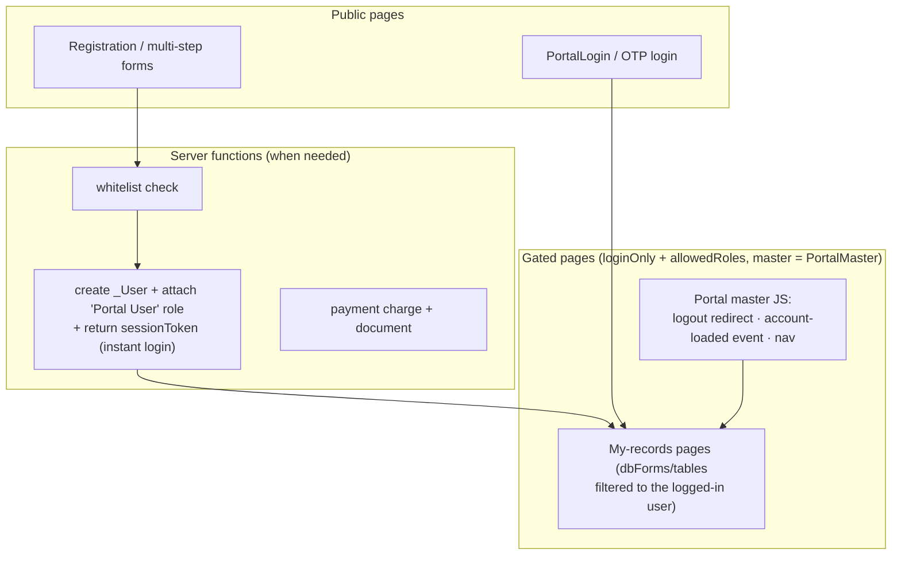

# Customer Portals (Public Edition) — פורטלי לקוח

> **Purpose:** How customer-facing portals are built on MyBusiness CRM — external users (parents, students, examinees, citizens, clients) logging into dedicated page sets with their own data scope.
> **Last updated:** 2026-07-10 (OTP contract, built-in OTP element, four-layer scoping model, PrivateFile, impersonation, isolation test) · **Status:** draft (public tier; examples anonymized to vertical archetypes)

## 1. What a portal is

A **portal** is a set of pages inside your app served to **external** `_User` accounts, not staff. The platform ships scaffolding in every app: `PortalLogin` (public), `PortalMaster` (master page), and a gated example page (`loginOnly: true`, `allowedRoles: "loggedOnly, Portal User"`). Everything beyond the skeleton is assembled per customer from pages + roles + triggers + page JS + (optionally) server functions.

**The commercial hook:** portal users consume **no license seat** — production portals run thousands of external users on a handful of staff seats.

**The scope fork (price it early):** an external *form* (web2lead/web2table — no login) and a *portal* (login + per-user data scoping + session lifecycle) differ by an order of magnitude of effort. Pin down which one the customer means before quoting.

## 2. Proven portal archetypes (field-verified)

| Archetype | Audience | Auth | Characteristic components |
|---|---|---|---|
| Exam/licensing registration portal | thousands of citizens | OTP SMS (`/otp/register`, `/otp/login`) over a whitelist table | registration pages, personal-area pages (my registrations/cases/appeals), in-portal payment + invoice |
| School/institution data-collection portal | institution contacts | institution code + password (password field on the Account copied to `_User` by a trigger — zero server code) | multi-step form flows, process-status state machine that gates login stages, per-year page sets |
| Parent portal (education/camps) | parents | email+password self-signup; on-create trigger links `_User` → Account | bilingual page pairs, child forms, document/passport upload, in-portal payments, saved cards |
| Student portal | students | staff-created portal users | ships with the MyCollege module (productized) |

## 3. Architecture

Key mechanics:
- **Portal user model:** regular `_User` rows flagged as portal users, holding no seat; linked to an `Accounts` record by Pointer (single or dual-parent patterns). The portal flag column name varies per tenant — check the schema before writing triggers/JS against it.
- **Auth options** (cheapest first): password copied from an Account field by trigger (Config only) → email+password self-signup with a linking trigger/function → OTP SMS via the platform OTP endpoints (built-in `loginOTPForm` element, or called from a server function for custom orchestration).
- **Page gating:** `loginOnly` + `allowedRoles` (by role *name*) in page settings; portal pages use their own master page so back-office chrome never leaks. Note: `allowedRoles` requires actual membership in the named role — `loggedOnly` alone in the list does not admit a logged-in non-member, and triggers cannot add users to roles (attach separately).
- **Data scoping — four stacked layers, know which are security and which are UX:** (1) page gating — UI only; (2) **CLP** per table — a hard fence but *table-wide*, it never filters rows; (3) **server-side row-level scoping ("advanced permissions")** — configured per table in the admin UI only (not readable/writable via API tools), filters rows by a Pointer chain to the logged-in user with staff-role exemptions; per-tenant optional, so never assume it; (4) element criteria + the `criteria-added-to-query` hook — a UX filter, not security. Where layer 3 is absent, use per-row Parse ACLs set at creation or server-function mediation. **Verify with a REST isolation test using a real portal-user session before every go-live.**
- **The OTP service** (`/otp/login`, `/otp/validate`, `/otp/register`, `/otp/resend-sms`, next to `/parse`): 6-digit code, 60s resend throttle, 10-minute expiry, code sent only to a phone already stored on the `_User` (`phone`/`phone2..4`), `active:false` refused, reCAPTCHA expected, WhatsApp fallback when SMS credit fails; `/otp/register` is master-key-only (server functions). Requires tenant-level `enableOTP` configuration. The built-in `PortalLoginOTP` page with the `loginOTPForm` element (inputs `username`+`phone`, `data-next-page` landing, auto-toggled `sms_otp_validate` elements, hookable `otp-*` form events) is **not in the vanilla install** — it arrives with OTP enablement.
- **Self-signup form events:** the register form element fires `simblaobjectbeforesave` (set the portal flag + extra `_User` fields), `simblaobjectaftersave`, and `simblaobjectaftersave-error` (translate the "user exists" and password-policy errors — policy is ≥8 chars, upper+lower+digit, server-enforced); the login form element fires `login-success` (post-login sync + routing).
- **Per-user documents:** store in a **PrivateFile** field on the user's record — the platform authorizes the download against read access to the owning record; fetch with `X-Parse-Session-Token`. Never serve personal documents as public files.
- **Staff impersonation ("login as account"):** staff open a portal page with `?loginAsAccount=<accountId>`; master JS injects the account into every `criteria-added-to-query`, shows a whose-data banner, and skips post-login sync while impersonating. Support sees exactly what the customer sees, without passwords.
- **Master-page JS:** logout-redirect handling (otherwise users land on the staff login), account-loaded event binding, navigation rewiring, canonical-host redirect when the tenant answers on multiple hostnames.

## 4. Build recipe

1. Define the portal audience + their Account linkage (Pointer field(s)) — schema work (Config).
2. Create the `Portal User` role; set CLP on every exposed table (Config).
3. Auth flow: pick from §3; trigger-based password copy is Config; OTP/self-signup need a server function (Custom-Server).
4. Build the gated page set on the portal master: personal area, my-records tables, forms (Config + Custom-JS for scoping/UX).
5. Wire logout-redirect + account-loaded patterns in the master JS (Custom-JS).
6. Payments, document generation, uploads — per need (Custom-Server).
7. Security pass: per-user data isolation test, session/refresh behavior, role-name gating verified.

## 5. Effort & scoping

Portals are **L–XL, phased** engagements: a working v1 (auth + personal area + one core flow) first; payments/appeals/uploads as phase B. New portal *audiences* are new projects, not increments.

## Limitations & gotchas

- **First-load race conditions** are endemic: page JS that runs before the user's record loads renders empty forms/tables intermittently — bind logic to the account-loaded event, never to DOMContentLoaded.
- **Logout lands on the staff login** unless a redirect cookie/handler is set in the portal master JS.
- `allowedRoles` gates by role **name string** — renaming a role silently breaks gating.
- Per-year page-set duplication (common for annual cycles) accumulates debris and forks bugs — plan an inventory hygiene pass.
- No turnkey portal product exists (except the MyCollege student portal) — every portal is assembled; budget accordingly.
