# Runtime App Tour — MyBusiness CRM (End-User Application)

> **Purpose:** Visual walkthrough of the runtime MyBusiness CRM application as an end user sees it — navigation, list pages, record cards, dashboards, reports, settings, and every product module reachable in the Playground tenant.
> **Last updated:** 2026-06-10 · **Status:** draft

---

## 1. Big picture

- **Login portal:** `https://sub.mybusiness.co.il/login/` — one shared login page for all tenants. After login the browser is redirected to the customer's own subdomain.
- **Tenant URL pattern:** `https://<tenant>.mbapps.co.il/apps/<module>/<pageName>`. The Playground tenant is `newdemo2` (tenants can be a numeric id or a name — the docs elsewhere refer to a `<numericId>`; this sandbox uses a named subdomain).
- **UI language/direction:** Hebrew, RTL. The side menu sits on the **right**, user controls on the top-**left**.
- **Modules in this tenant** (top-bar app switcher): eCommerce, MyBooks, MyBusiness (CRM core), MyCampaigns, MyChat, MyCollege, MyCommerce. **TimeSheet and MyInbox are not installed** in the Playground.
- **Terminology is customer-customizable.** This tenant renamed core entities (via the terminology dictionary): Sales → פרויקטים (Projects), Accounts → משתתפים (Participants) in the menu (list page itself is titled לקוחות), Cases → קריאות שירות (Service Calls) in the menu / פניות (Inquiries) as page title. Keep this in mind when matching UI labels to the underlying tables `Sales`, `Accounts`, `Cases`.

### Shared page chrome (every CRM page)

| Area | Contents |
|---|---|
| Top bar (dark navy) | User menu (`avi tests`), app-switcher grid icon, notifications bell with counter, WhatsApp support shortcut, support email icon, product logo |
| Right sidebar | The tenant's main menu (fully customizable, may include custom pages) |
| Content area | The current page (list / form / dashboard) |

---

## 2. Login screen

**URL:** `https://sub.mybusiness.co.il/login/` — Hebrew form: המייל שלך (email), סיסמה (password), היכנס למערכת (login button), שכחת סיסמה? (forgot password), הירשם (sign up link).

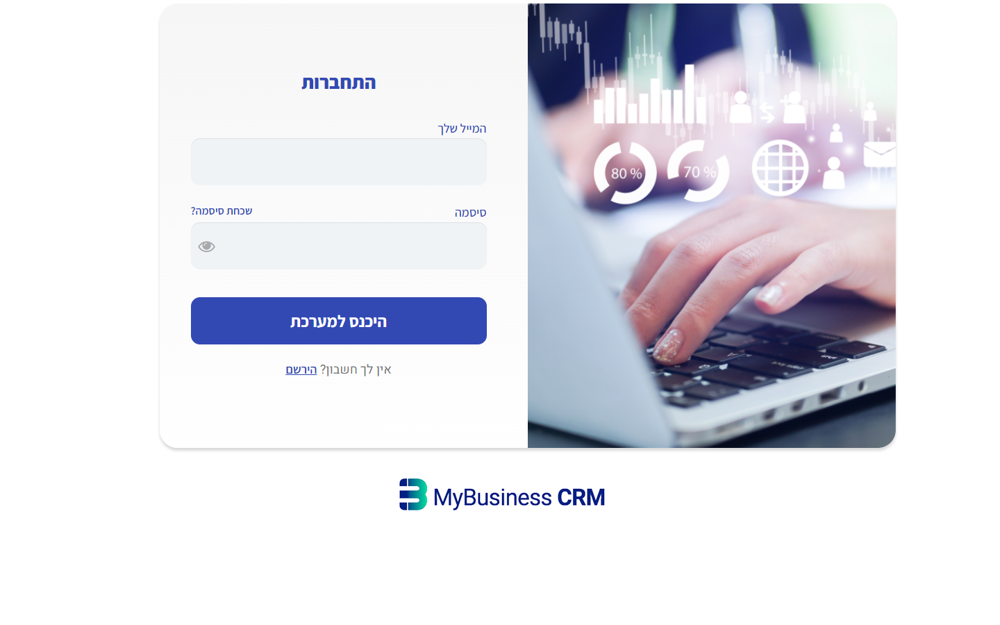

Login redirects straight into the tenant app — landing page in this tenant is the Sales dashboard (`/apps/MyBusiness/dashboardsales`).

---

## 3. Post-login landing — Sales dashboard

**URL:** `/apps/MyBusiness/dashboardsales` · **Menu:** מבט-על (Overview) → דאשבורד פרויקטים

A dashboard page composed of: date-range filter (מתאריך / עד תאריך + הפעל "run" button), KPI counters (revenue in range ₪57,380; deals closed 3), line/bar/pie chart widgets (revenue by month, deals opened by month, deals by user, deals by stage, open cases by priority), an embedded task table (משימות בתאריכים נבחרים), and an **ערוך (Edit)** wrench that jumps into the page editor — visible because this user has builder rights.

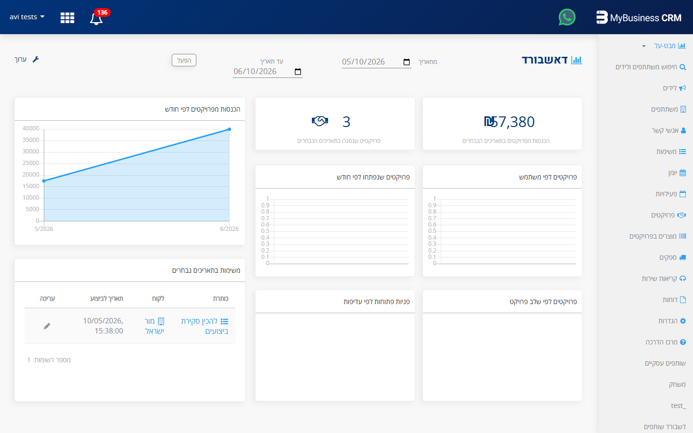

The מבט-על (Overview) menu item expands to 8 role-specific dashboards — per-entity (פרויקטים/לידים/קריאות שירות) and per-audience (מנהל manager / נציג rep):

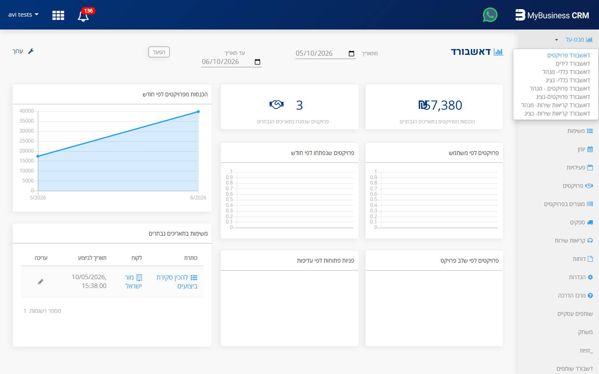

---

## 4. Navigation tree (full main menu of this tenant)

| # | Menu label (HE) | English | URL path | Type |
|---|---|---|---|---|
| 1 | מבט-על | Overview (dashboards dropdown) | — | submenu |
| 1.1 | דאשבורד פרויקטים | Sales dashboard | /apps/mybusiness/dashboardsales | dashboard |
| 1.2 | דאשבורד לידים | Leads dashboard | /apps/mybusiness/dashboardleads | dashboard |
| 1.3 | דאשבורד כללי- מנהל | General – manager | /apps/mybusiness/dashboardgenmanager | dashboard |
| 1.4 | דאשבורד כללי- נציג | General – rep | /apps/mybusiness/dashboardgenrep | dashboard |
| 1.5 | דאשבורד פרויקטים - מנהל | Sales – manager | /apps/mybusiness/dashboardsalesmanager | dashboard |
| 1.6 | דאשבורד פרויקטים-נציג | Sales – rep | /apps/mybusiness/dashboardsalesrep | dashboard |
| 1.7 | דאשבורד קריאות שירות- מנהל | Cases – manager | /apps/mybusiness/dashboardcasemanager | dashboard |
| 1.8 | דאשבורד קריאות שירות- נציג | Cases – rep | /apps/mybusiness/dashboardcaserep | dashboard |
| 2 | חיפוש משתתפים ולידים | Search accounts & leads | /apps/mybusiness/accountsandleads | search page |
| 3 | לידים | Leads | /apps/mybusiness/leads | list |
| 4 | משתתפים | Accounts (renamed) | /apps/mybusiness/accounts | list |
| 5 | אנשי קשר | Contacts | /apps/mybusiness/contacts | list |
| 6 | משימות | Tasks | /apps/mybusiness/tasks | list |
| 7 | יומן | Calendar | /apps/mybusiness/calendar | calendar |
| 8 | פעילויות | Activities | /apps/mybusiness/activities | list |
| 9 | פרויקטים | Sales (renamed) | /apps/mybusiness/pipeline | kanban + list |
| 10 | מוצרים בפרויקטים | Sale rows (products in sales) | /apps/mybusiness/salerows | list |
| 11 | ספקים | Suppliers (custom entity) | /apps/mybusiness/suppliers | list |
| 12 | קריאות שירות | Cases (renamed) | /apps/mybusiness/cases | list |
| 13 | דוחות | Reports | /apps/mybusiness/reports | report runner |
| 14 | הגדרות | Settings | /apps/mybusiness/settings | settings hub |
| 15 | מרכז הדרכה | Training center | external: mybusiness.co.il/supportVideoSearch | link |
| 16 | שותפים עסקיים | Affiliates (custom entity) | /apps/mybusiness/affiliates | list |
| 17 | משחק | Playground (test page) | /apps/mybusiness/playgroundtables | custom |
| 18 | _test | test page | /apps/mybusiness/_old_testdashcopy | custom |
| 19–23 | דשבורד שותפים / דשבורד ספקים (×4, incl. `_v2_` variants) | custom dashboards | /apps/mybusiness/dashboardaffiliates etc. | dashboards |

Items 16–23 demonstrate that the menu is fully editable — custom entities and leftover test pages appear alongside core items.

### Top-bar module switcher

The grid icon opens the cross-module switcher. Each module opens **in a new browser tab** with its own branding and side menu.

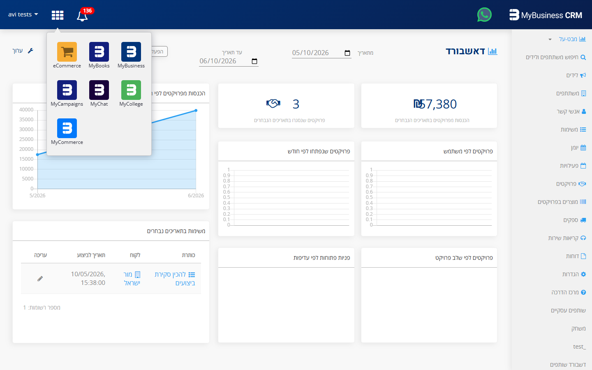

### User menu

סביבת פיתוח (Development environment → opens the admin/builder at `siteadmin.mbapps.co.il`, see Tour 2), פתח מיישם AI (Open AI implementer), החלף סיסמא (Change password), התנתק (Logout).

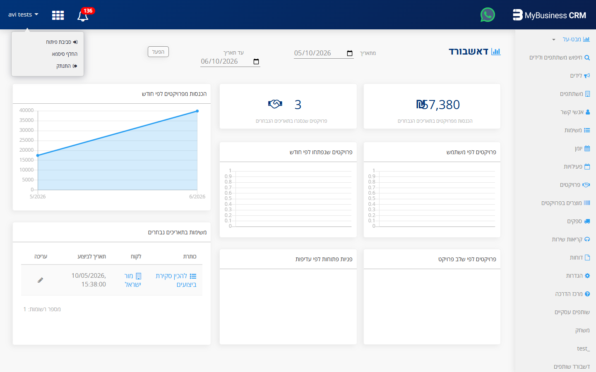

---

## 5. CRM core screens

### 5.1 Accounts list — לקוחות

**URL:** `/apps/mybusiness/accounts` · **Menu:** משתתפים

List-page anatomy (this is the standard pattern for all list pages):
- Title + entity icon, **+ לקוח חדש** (new record) button.
- Collapsible search panel (חיפוש לקוחות) with field-level filters: שם מכיל (name contains), אימייל מכיל, טלפון מכיל, סטטוס מכיל, date ranges (נוצר בתאריך גדול/קטן מ/שווה ל, conversion-date range) + חפש (search).
- **Add new row** button = inline row creation directly in the table.
- Data table with sortable columns: שם, אימייל, מספר טלפון, סטטוס לקוח, מנהל לקוח - שם (pointer display field), נוצר בתאריך, תאריך המרת ליד ללקוח; per-row pencil (edit) and trash (delete) icons; "&hellip;" column menu (export etc.).

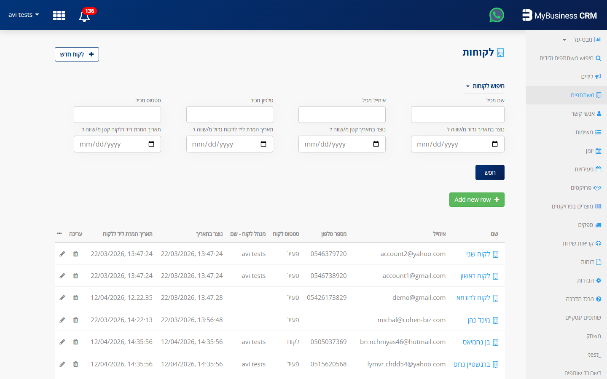

### 5.2 Account card (360° view)

Clicking a record name opens the card **as a slide-in side modal** hosting an iframe. The iframe URL pattern is the real card page: `/apps/mybusiness/Account?oid=<objectId>&cls=Accounts&Mode=Ticket` — it can also be opened full-page directly.

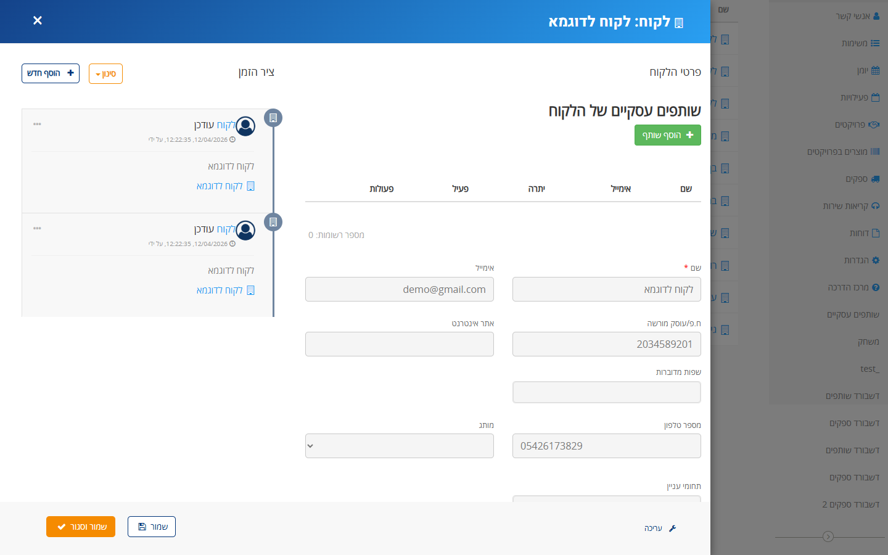

Card anatomy (two columns):
- **Right column:** פרטי הלקוח (record details) — form fields (שם*, אימייל, ת.פ/עוסק מורשה, אתר אינטרנט, שפות מדוברות multi-select, מספר טלפון, מותג dropdown, תחומי עניין) plus an embedded related table שותפים עסקיים של הלקוח (this customer's affiliates) with its own + הוסף שותף add button.
- **Left column:** ציר הזמן (Timeline) — chronological feed of record events (ליד עודכן / לקוח עודכן entries) with סינון (filter) and הוסף חדש (add note/event).
- **Bottom bar:** שמור וסגור (save & close), שמור (save), המר ליד ללקוח (convert lead → customer; appears in some modes), עריכה wrench (jump to page editor).

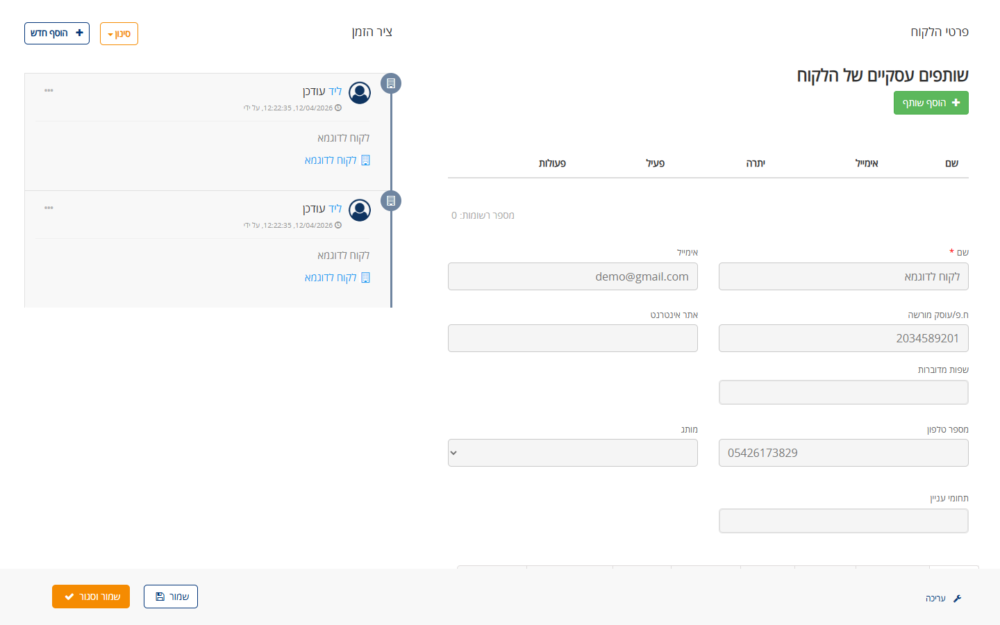

Below the fields sits a **tab strip** of related data: כתובת (Address), פרטים נוספים (More details), אנשי קשר (Contacts), מסמכים (Documents), ריכוז אירועים (Events summary), חשבוניות (Invoices), קשרים בין לקוחות (Account relationships), רישום שיחות (Call log). The Events tab aggregates child records with type checkboxes (פרויקטים, פניות, משימות, פעילויות, הערות, מיילים, MyChat):

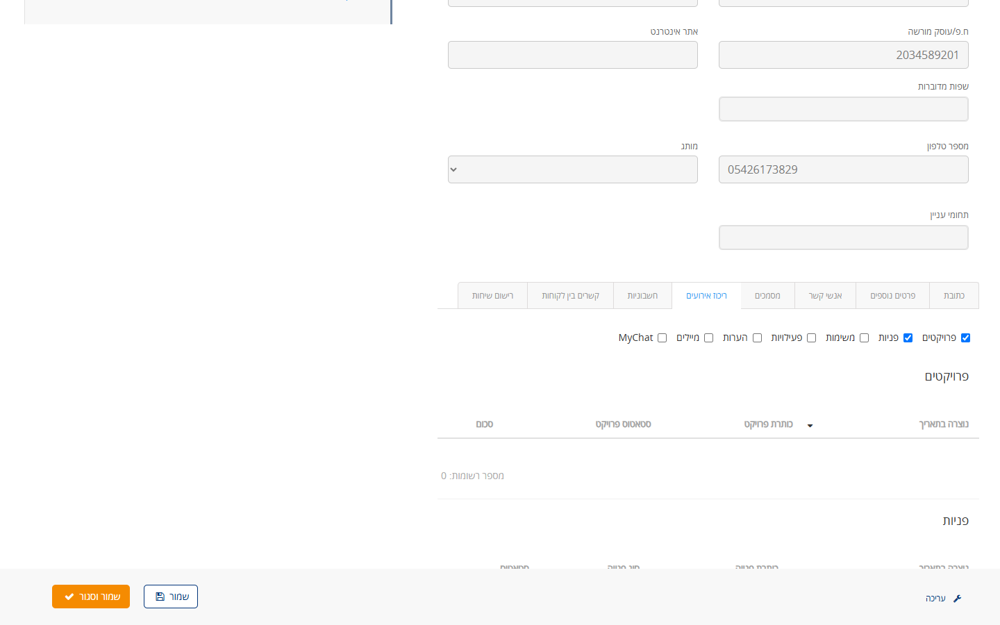

### 5.3 Sales — pipeline (kanban) and table views

**URL:** `/apps/mybusiness/pipeline` (kanban) and `/apps/mybusiness/sales` (table) · **Menu:** פרויקטים

Toggle buttons פייפליין / טבלה switch between the two pages. The kanban shows one column per stage — חדש (New), שיחת היכרות (Intro call), פגישת מצגת (Presentation), הצעת מחיר (Quote) — with per-column **sum and expected-revenue totals**, deal cards (title, amount, next-contact date, account link), and arrow buttons that move a deal to the next stage. Top controls: פילטר (filter) and + פרויקט חדשה (new deal).

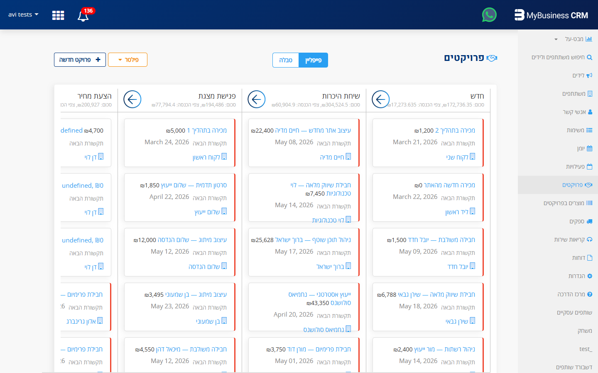

Table view columns: כותרת, ללקוח - שם, סטאטוס פרויקט - שם, תאריך התקשרות הבאה, איש קשר - שם, אחראי פרויקט - שם, סכום + edit/delete:

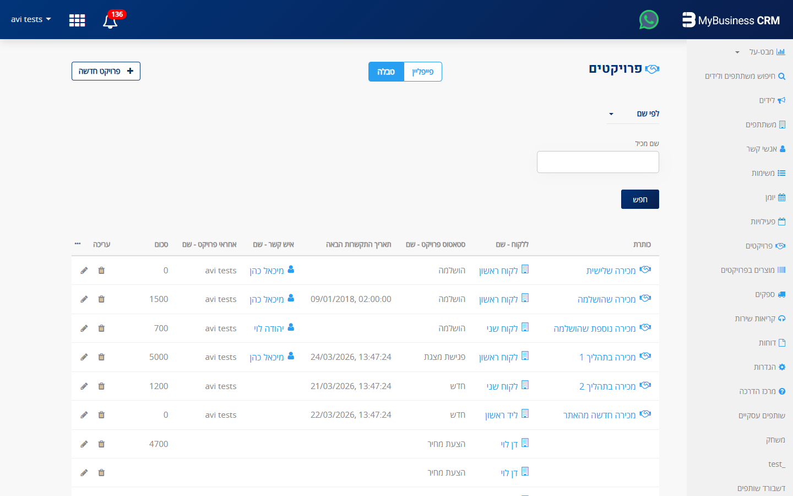

### 5.4 Sale card

Opens as a side modal like the account card. Distinctive elements:
- **Stage progress bar** (milestone dots): חדש → שיחת היכרות → פגישת מצגת → הצעת מחיר → משא ומתן, current stage checked.
- **Won / Lost buttons** (green thumbs-up / red thumbs-down) for closing the deal.
- Summary line: סכום, אחראי, לקוח.
- Sections: deal fields (כותרת*, משויך ללקוח*, משויך לאיש קשר, סטטוס*) and פרטים נוספים (תאריך סגירה, מקור הגעה, תאריך התקשרות הבאה, סיבה לכשלון, אחראי).
- Timeline on the left shows quote events — הצעת מחיר אושרה (quote approved) entries with quote numbers.

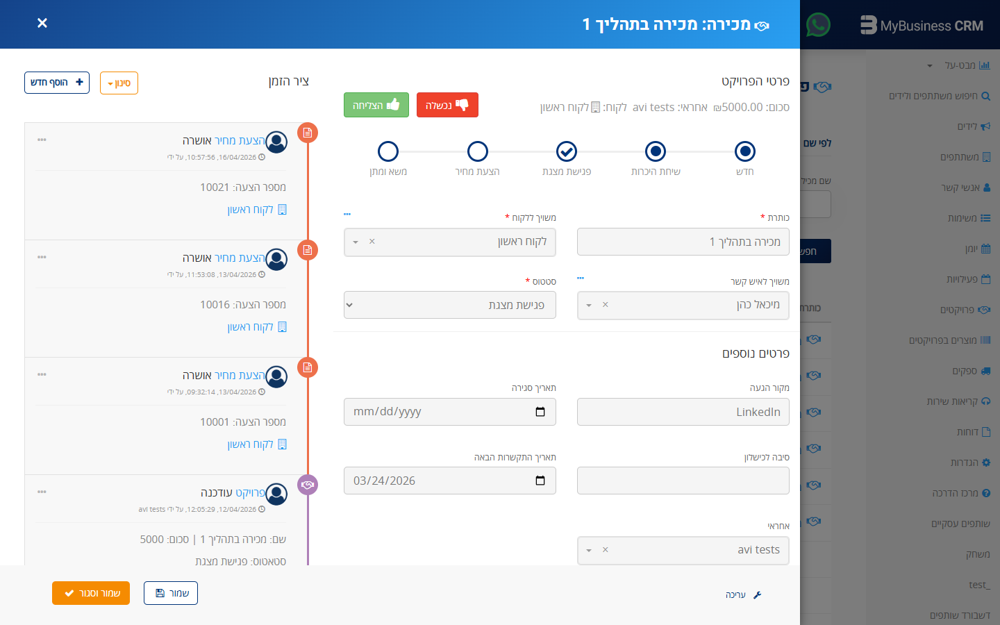

### 5.5 Cases list — פניות

**URL:** `/apps/mybusiness/cases` · **Menu:** קריאות שירות

Same list pattern. Columns: # פניה (case number), כותרת, מספר טלפון, לקוח - שם, אחראי פנייה - שם, סטאטוס פנייה - שם, סוג פנייה - שם, עדיפות פנייה - שם. Note the **conditional formatting**: priority values render as colored badges (green נמוך, red גבוהה).

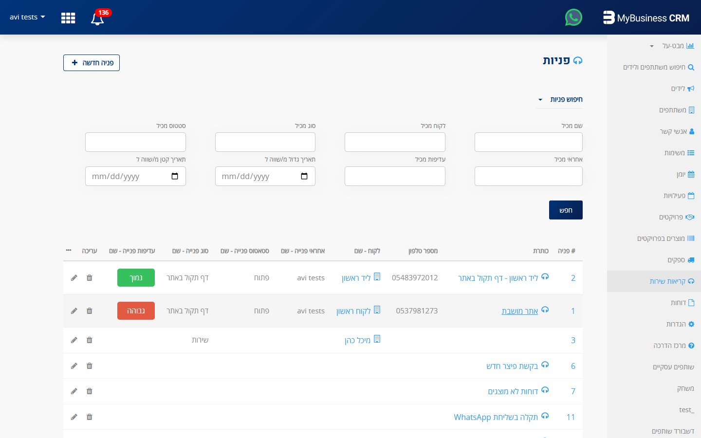

### 5.6 Case card

Section-based form (section headers are a page-builder feature): פרטי קריאת שירות (number, title, channel, type, sub-type, date), פרטי לקוח (account, contact, VIP checkbox, email, phone, related sale), סיווג וניהול (status*, priority*, owner). Timeline on the left.

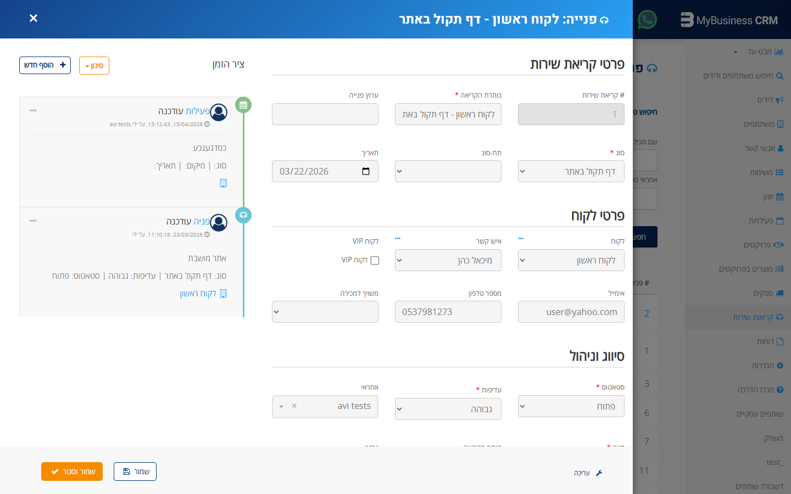

### 5.7 Tasks — משימות

**URL:** `/apps/mybusiness/tasks`. Columns: כותרת, לקוח - שם, אחראי משימה - שם, תאריך ביצוע, עדיפות - שם.

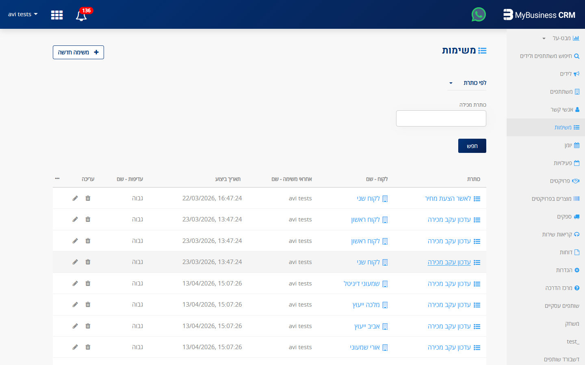

### 5.8 Calendar — יומן

**URL:** `/apps/mybusiness/calendar`. FullCalendar-style RTL calendar: יום / שבוע / חודש (day/week/month) views, היום (today), prev/next arrows, **+ משתמש** button to overlay additional users' calendars with a color legend.

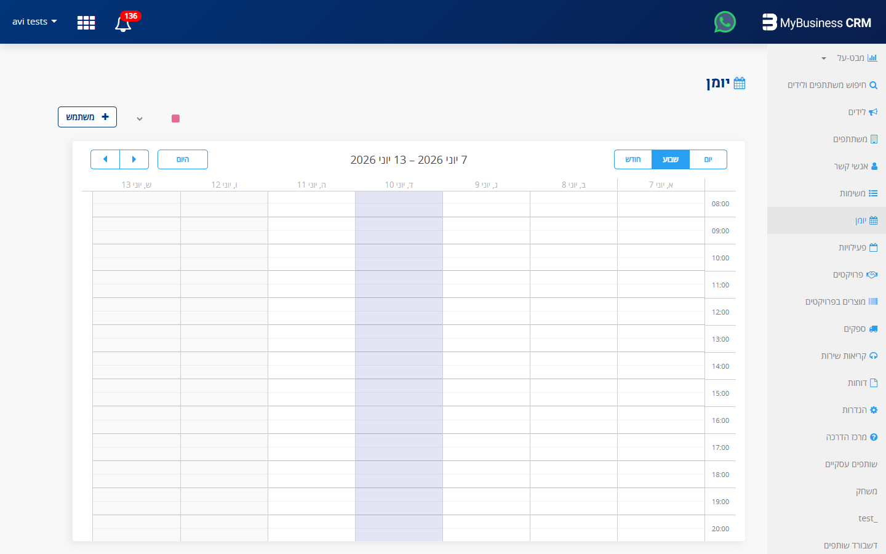

### 5.9 Activities — פעילויות

**URL:** `/apps/mybusiness/activities`. Columns: כותרת, לקוח - שם, אחראי, סוג (פגישה / שיחת טלפון / פגישת זום / שיחת ועידה), סטטוס (נקבעה / בוצעה / בוטלה), זמן התחלה.

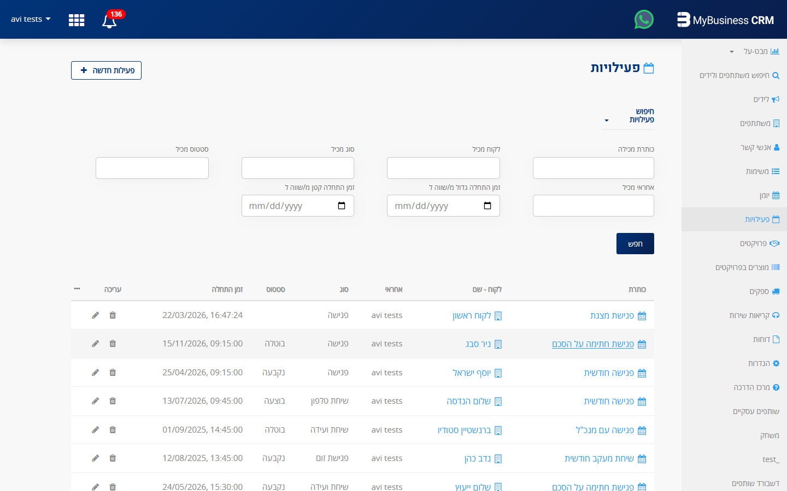

### 5.10 Leads — לידים

**URL:** `/apps/mybusiness/leads`. Note two list-page features not seen on the other lists: a **saved-view dropdown** (כל הלידים) above the filters, and a **bulk-select checkbox column** for multi-row operations. Columns: שם, מספר טלפון, אימייל, מקור (source), סטאטוס ליד - שם, נוצר בתאריך.

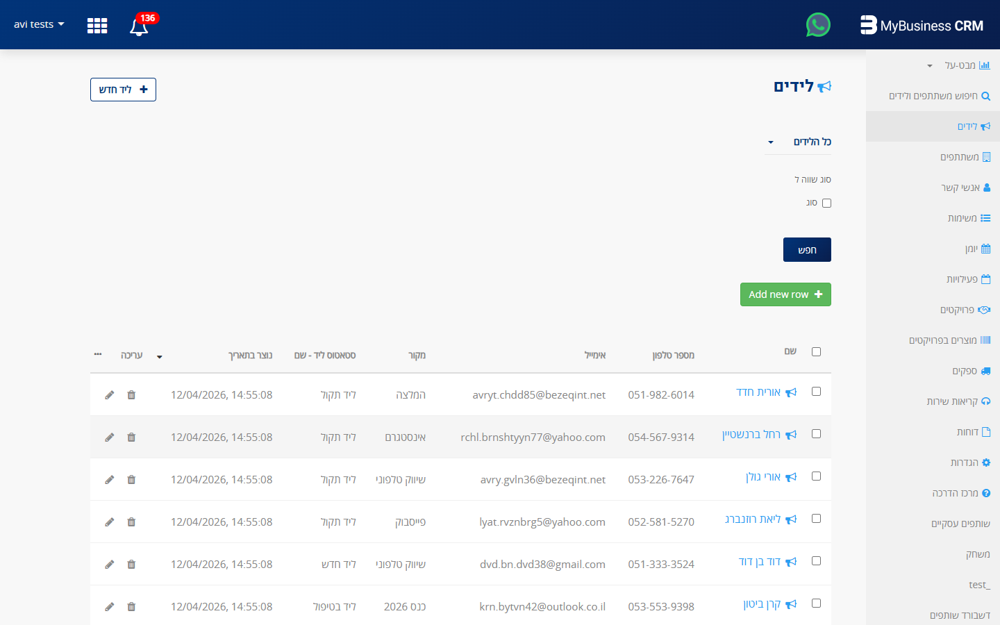

### 5.11 Custom entity example — Suppliers ספקים

**URL:** `/apps/mybusiness/suppliers`. A fully custom entity built with the same building blocks: filter panel (שם הספק מכיל, קוד ספק, עיר, קטגוריה, סטטוס), columns שם הספק, קוד (SUP-001…), איש קשר, טלפון, דוא"ל, עיר, קטגוריה, סטטוס, דירוג, מסגרת אשראי — with **cell-level conditional formatting** on the status column (green פעיל, yellow ממתין לאישור, red). Demonstrates that custom modules are indistinguishable from core ones.

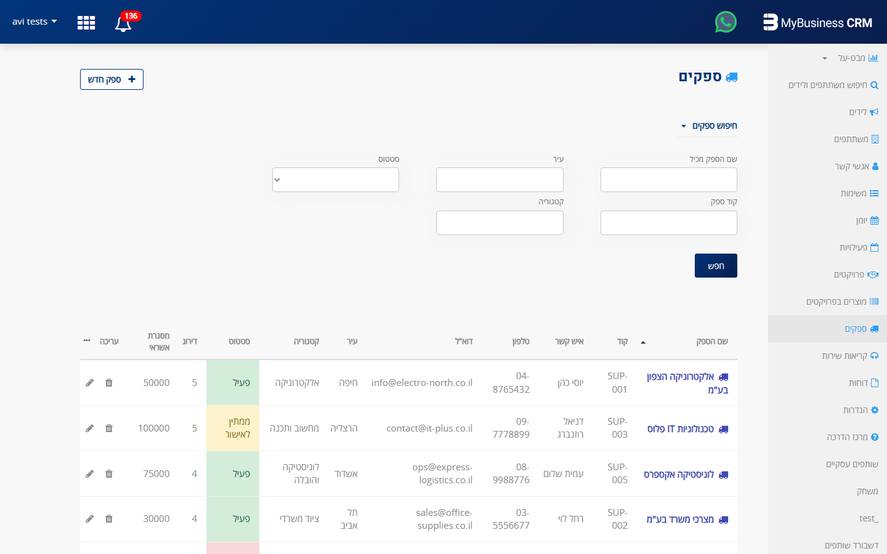

---

## 6. Reports — דוחות

**URL:** `/apps/mybusiness/reports`. The page is a **report runner**: a שם הדו"ח (report name) dropdown lists saved reports under הדוחות שלי (my reports) — leads reports, sales reports (weekly, quarterly aggregate, discount/profit), quotes report, sent-emails report, open-tasks report, scheduled morning reports, etc. Reports themselves are defined via MCP/API (`Create-or-Update-Report`) or by the vendor; the runtime page only runs them.

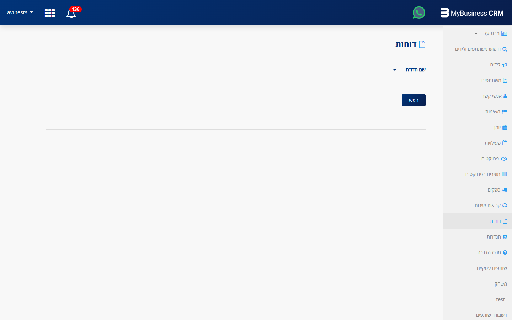
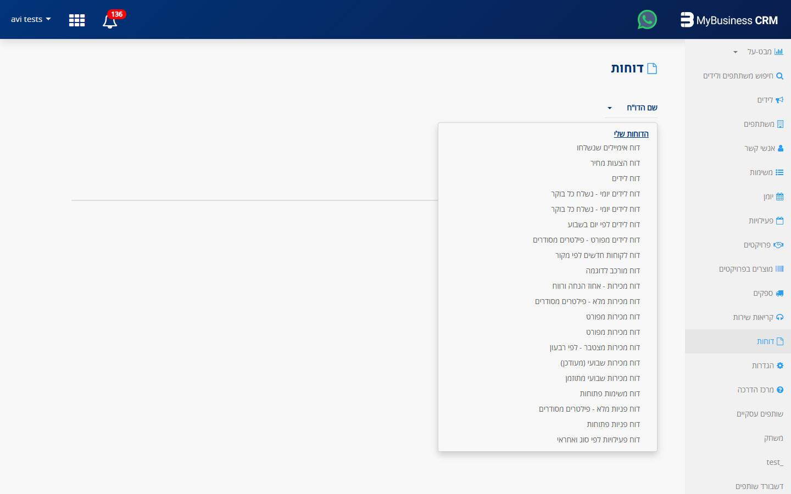

Selecting a report renders its **parameter form** (per-field filters defined in the report) and a results table below; the "&hellip;" table menu exposes export:

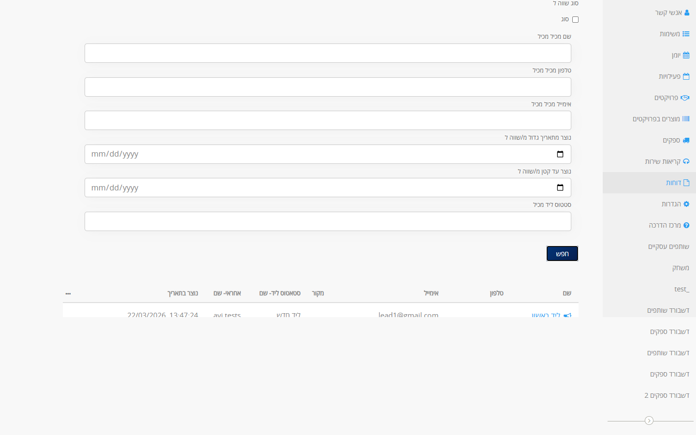

---

## 7. Settings hub — הגדרות מערכת

**URL:** `/apps/mybusiness/settings`. A tile hub with three sections:

1. **Configuration tiles:** לקוחות ולידים (customers & leads tables + file import), פניות ושירות (cases tables), פרויקטים (sales/products tables), משימות ופעילויות (tasks & activities tables), משתמשים (users), תפקידים (roles/permissions), תבניות (email & quote templates), כללים ותהליכים עסקיים (business rules & processes).
2. **מודלים נוספים (more modules):** marketing tiles for Mycampaigns, MyBooks, MyInbox, MyCommerce, WebsiteBuilder ואיזור אישי.
3. **שירותים נוספים (services):** דו"ח הודעות SMS (SMS log), רכישת קרדיט SMS ודיוור (buy credit), רכישת שעות הדרכה (buy training hours).

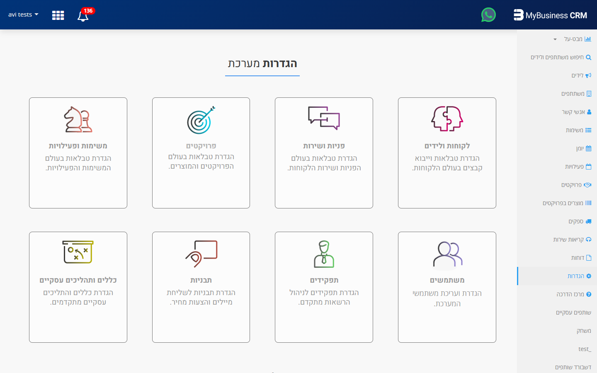

### 7.1 Example — Customers & Leads settings

**URL:** `/apps/mybusiness/system-account-upload`. Inner tab menu: ייבוא לקוחות מקובץ (import customers from file), ייבוא לידים מקובץ, סטטוסי לקוחות (customer statuses), סוגי לקוח (types), מותגי לקוח (brands), סטאטוסי לידים, מקורות לידים (lead sources). End users manage **lookup tables and file imports here without builder access**.

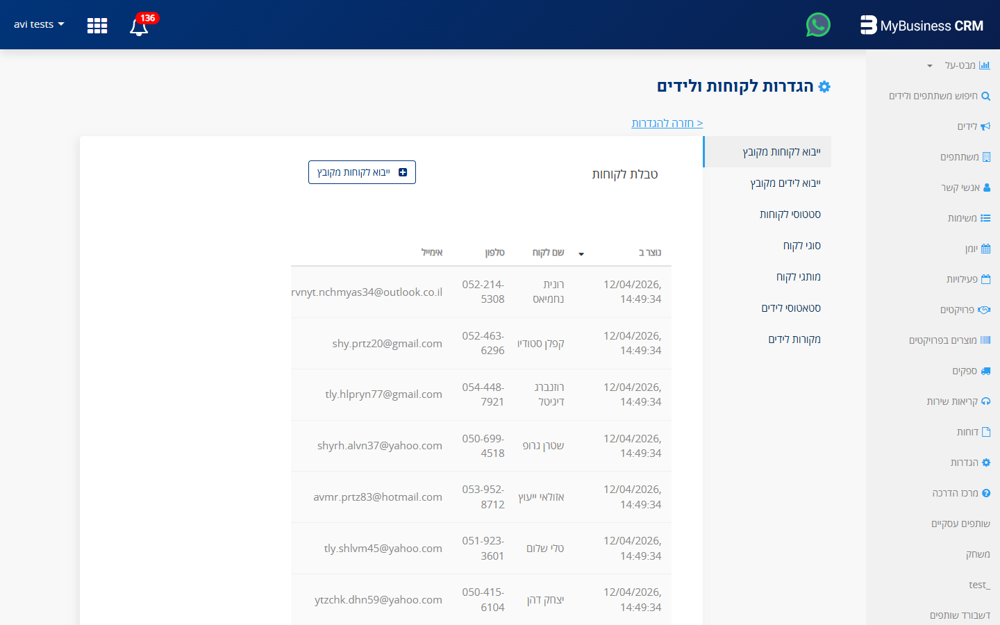

### 7.2 Business rules — כללים ותהליכים עסקיים

**URL:** `/apps/mybusiness/System-triggers`. Embeds the **same trigger management UI as the admin environment** (English: #Id, Trigger class, Trigger name, Every update, Active, edit/info actions) inside the runtime app — power users can inspect/edit automations without entering the builder.

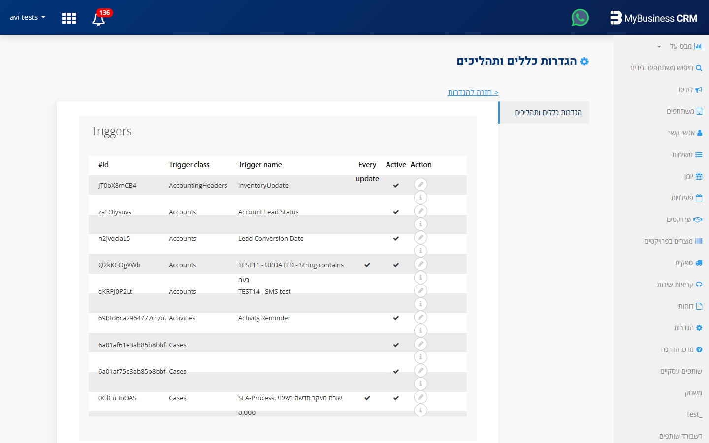

---

## 8. Other modules (main page of each)

### 8.1 MyBooks (bookkeeping)

**URL:** `/apps/MyBooks/Dashboard` — own logo and menu: מבט על, לקוחות, מסמכי הנהח"ש (accounting documents), גבייה (collections), חיוב ריטיינר (retainer billing), דפי תשלום (payment pages), דוחות, הגדרות, עזרה, שיווק. Dashboard: date-range KPIs (revenue excl. VAT, receipts), charts, recent invoices/receipts tables.

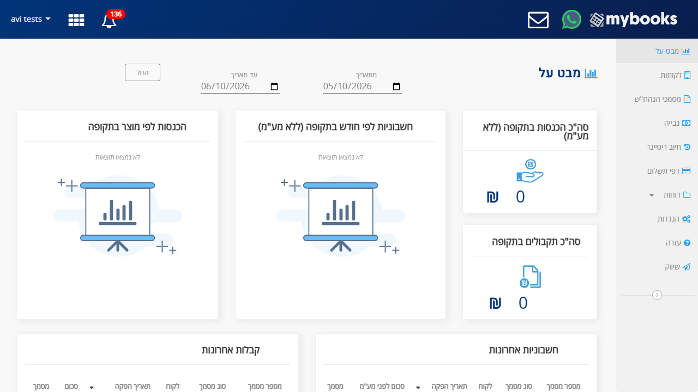

Documents list (`/apps/mybooks/documents`): tabs מסמכים / טיוטות (documents/drafts), הוסף מסמך (create document), search; columns מספר מסמך, סוג מסמך, שם לקוח, אימייל, תאריך הפקה, סכום, מספר הקצאה. Empty in the Playground (no synthetic accounting data) — shows a tutorial-video link.

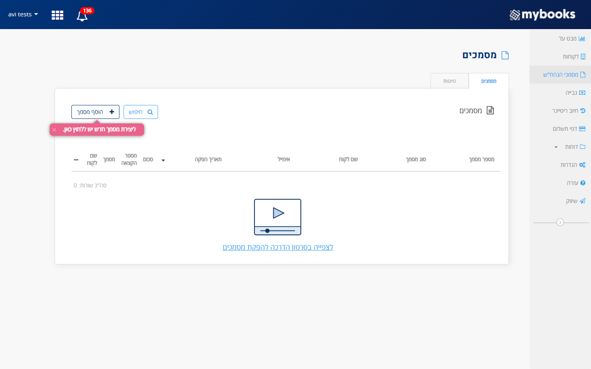

### 8.2 MyCampaigns (marketing)

**URL:** `/apps/MyCampaigns/Dashboard` — menu: מבט-על, לידים, לקוחות, קבוצות (groups), דיוורים (mailings), דפי נחיתה (landing pages), תבניות לווטסאפ (WhatsApp templates), הגדרות. Dashboard: sent-message KPIs per channel (campaigns, WhatsApp, SMS, email), credit balance, email quota by package (10,000 left), and a pricing panel (מחיר למייל / מחיר ל-SMS, רכישת קרדיט).

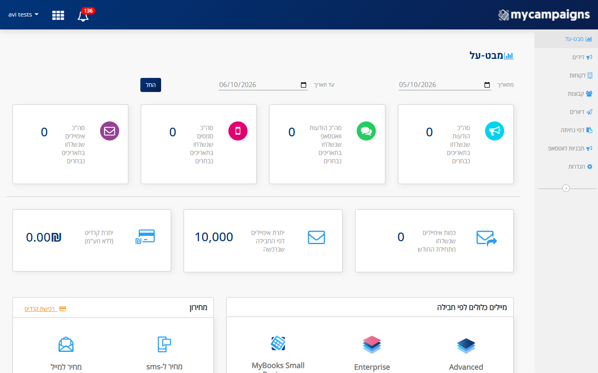

### 8.3 MyChat (omnichannel inbox)

**URL:** `/apps/MyChat/conversations` — a 4-pane chat workspace, different visual language (dark right rail): מבט על, השיחות שלי (my conversations), שיחות ממתינות בתור (queued), שיחות שטרם הוקצו (unassigned), כל השיחות, לקוחות, הגדרות. Conversation list with channel/status filters and bulk update; message pane with rich-text composer, attachments, quick replies; context pane with פרטי לקוח, פתיחת תהליך מערכת (create a פניה/מכירה directly from the chat) and ריכוז אירועים. Top-left shows agent presence (מחובר).

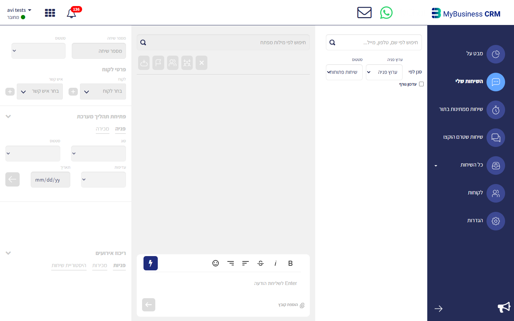

### 8.4 MyCollege (course management)

**URL:** `/apps/MyCollege/dashboard` — menu: מבט על, קורסים (courses), סטודנטים (students), שיבוץ לקורסים (enrollment), יומן לפי כיתה (calendar by class), יומן לפי מתקן (by facility), מרצים (lecturers), שיעורים (lessons), בחינות (exams), הגדרות. Dashboard: student KPIs, revenue-by-month chart, today's lessons/exams tabs with filters.

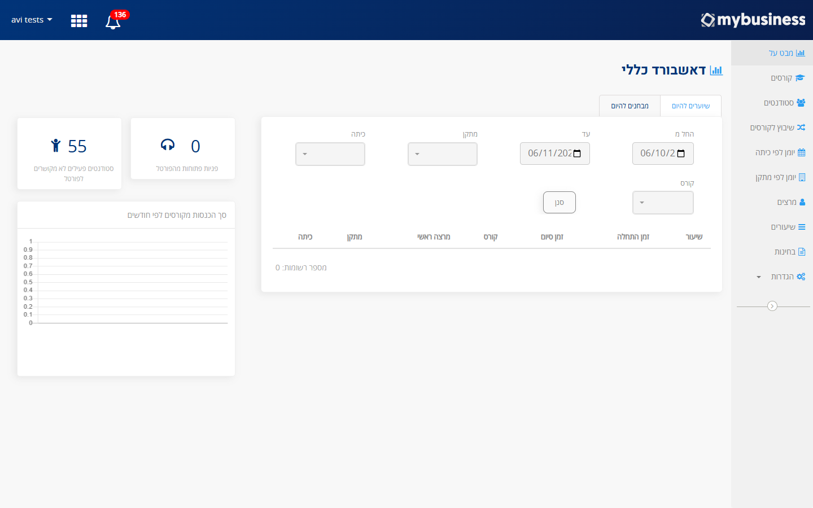

---

## Limitations & gotchas

- **Tenant-specific everything.** Menu items, page names, terminology, dashboards and custom entities shown here are the Playground configuration; every customer tenant differs. Use `Get-Site-Pages` / `Get-Menus` / `Get-Terminology-Dictionary` (MCP) to map a real tenant before relying on labels.
- **Renamed terminology masks table names.** פרויקטים is the `Sales` table; משתתפים is `Accounts`; קריאות שירות is `Cases`. Page titles and menu labels can disagree (menu משתתפים vs page title לקוחות; menu קריאות שירות vs page title פניות).
- **Record links are JS, not hrefs.** List-row name links are `href="#"` with `data-ticket="Account?oid=…&cls=…&Mode=Ticket"`; the card opens in a side-modal iframe (`#SideModalTicket` / `iframeModalTicket`). For deep links or automation, open the iframe URL directly.
- **Card pages need both `oid` and `cls` query params** — with only `oid` the form renders empty (observed).
- **Module switcher opens new tabs**, and each new tab starts at a default viewport (not the one you set) — relevant for automation/screenshots.
- **Dashboards may render empty charts** when widget queries return no data in range (several Playground widgets show bare axes); this is data emptiness, not breakage.
- **Mixed-language UI:** runtime is Hebrew, but some embedded admin-grade widgets (trigger list in System-triggers, "Add new row" buttons) are English.
- **TimeSheet and MyInbox** are not installed in this tenant, so they are not toured; MyInbox appears only as a marketing tile under Settings.
- **Notification bell count (136)** persisted with text "אין התראות חדשות" (no new notifications) — counter and text can disagree.
- **Strictly read-only tour:** no record was saved/deleted; win/loss, save, convert and delete controls were observed but never clicked.
