# Admin / Builder Tour — MyBusiness CRM (Simbla Development Environment)

> **Purpose:** Visual walkthrough of the administration & no-code builder environment that sits behind every MyBusiness CRM tenant — project admin, page editor, database manager, triggers, users/roles/permissions, security, integrations and templates — and a map of what implementers can do in this UI vs. what requires MCP/API.
> **Last updated:** 2026-06-10 · **Status:** draft

---

## 1. How you get in & what it is

From the runtime app, the user menu (top-left) → **סביבת פיתוח (Development environment)** opens `https://siteadmin.mbapps.co.il/` in a new tab, titled **"MyBusiness Administration"**. This is the white-labeled **Simbla** no-code platform admin. Unlike the Hebrew RTL runtime, the admin is **English and LTR**.

The environment is organized around three left-sidebar sections:

| Section | What it holds |
|---|---|
| **Projects** | Websites/projects. The CRM runtime is one project: "SITE for MyBusiness" with Pages, plan/quota, publish controls |
| **Applications** | Installed app modules (MyBusiness, MyBooks, MyCampaigns, MyChat, MyCollege, eCommerce, MyCommerce), each versioned and wired to a database + website |
| **Databases** | The Parse-backed database ("DB for MyBusiness"): users, roles, tables, triggers, workflows, templates, security, integrations |

### Navigation map of the admin environment

```
siteadmin.mbapps.co.il
├── Projects
│   └── SITE for MyBusiness  (plan, quotas, publish ⬆ / settings ⚙ / delete 🗑)
│       └── Pages  → "Pages & Menus" modal
│           ├── Pages (free site pages, "unconnected pages")
│           ├── Apps Pages (per-module page trees under master pages, e.g. apps/mybusiness/CRMmaster)
│           ├── Reusable Elements
│           └── Menus
│               └── (per page: double-click / ✏ → WebsiteDesign page editor)
│                   ├── Element palette: Grid · Text · Multimedia · Menus · Form · Other ·
│                   │                    Database Widgets · Applications Widgets
│                   ├── Page menu: Preview in new tab · Page Settings · Versions ·
│                   │              Developers: JavaScript · CSS · Media queries
│                   ├── Project menu · Help menu · Edit/Preview · Save · Publish
│                   └── DB shortcut: Current Database → "Go to Database"
├── Applications  ("My Business environment", Add application)
└── Databases → DB For MyBusiness   (#database=<applicationId> in URL)
    ├── Users          (user cards + role dots, Create new User)
    ├── Roles          (role cards, Create new Role)
    ├── Tables         (table cards, Create new Table)
    │   └── <table> data browser (Import/Export, Add row, Delete rows, More)
    │       └── Table settings modal: Details · Fields · Permissions (CLP) · Triggers
    ├── Workflows      (empty in Playground, Create new Workflow)
    ├── Triggers       (all automations; per-trigger editor)
    ├── Templates      (PDF templates: quotes, invoices, receipts)
    ├── Security       (event log, IP/country restriction, enforced 2FA)
    ├── Integrations   (Mailgun, Plivo, Twilio credentials)
    └── Settings       (database-level settings)
```

---

## 2. Project admin (Home / Projects)

The home screen lists the tenant's projects. The CRM runtime is the project **"SITE for MyBusiness"** (Free plan in the Playground) with usage dials — Page Views, Storage used, Traffic used — plus publish / settings / delete icons and hover buttons **Pages** and **Preview** (Preview = the runtime URL `https://<your-app>.mbapps.co.il/`).

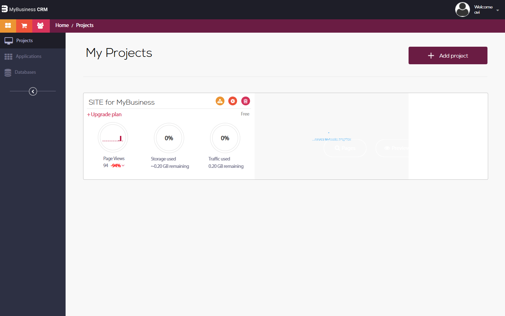

### Pages & Menus modal

The **Pages** button opens a modal with four tabs — this is the gateway to every page in the tenant:

- **Pages** — standalone site pages ("unconnected pages", e.g. leftover cart/checkout pages). Hovering a row reveals ✏ edit, ⚙ page settings, ⧉ duplicate, 🗑 delete and the hint "Double click to edit".
- **Apps Pages** — the application pages, grouped as **page trees under master pages**. The CRM pages all live under `apps/mybusiness/CRMmaster` (Masterpage): Accounts, AccountsAndLeads, Activities, Affiliates, Calendar, Cases… Master pages carry the shared chrome (top bar + side menu); child pages inherit it.
- **Reusable Elements** — shared element library.
- **Menus** — menu definitions.
- **Create page / Create master** buttons + search.

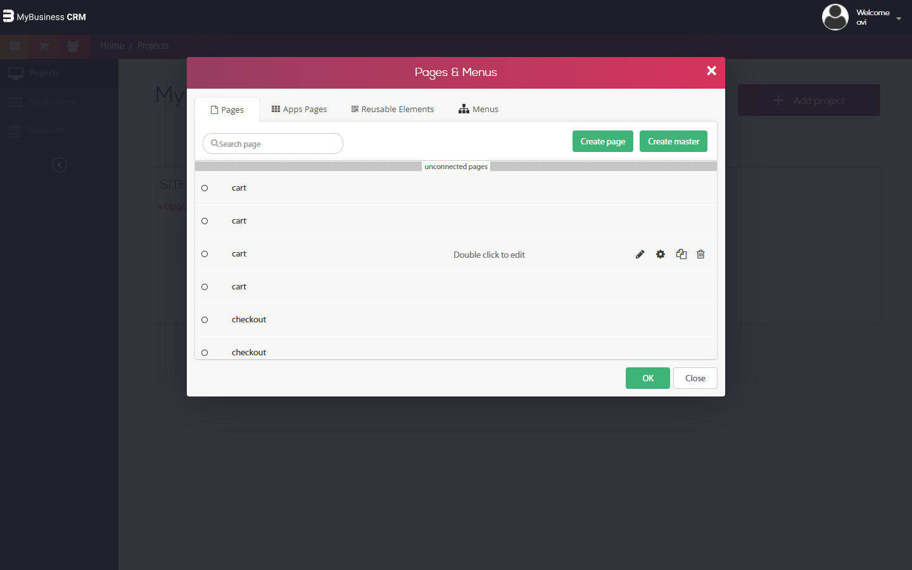
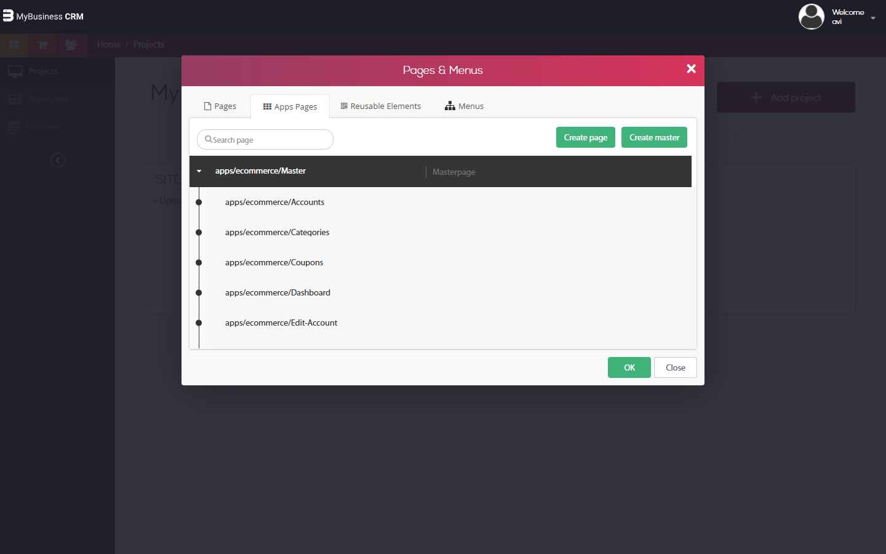

---

## 3. Page editor (WebsiteDesign) — the no-code builder

Editing a page opens `siteadmin.mbapps.co.il/WebsiteDesign` ("MyBusiness Website Builder") in a new tab. First entry shows a Simbla quick-tour **Welcome overlay** (Exit / Next).

Editor anatomy:

- **Top bar:** project name, DB shortcut, apps shortcut, **Project / Page / Help** menus, current page selector (`…/mybusiness/Accounts`), undo/redo, plan badge (Pro), **Edit / Preview** toggle, **Save**, **Publish**.
- **Element palette** (categories): Grid (Divider, Container, Tabs), Text, Multimedia, Menus, Form, Other, **Database Widgets**, **Applications Widgets** — drag onto the canvas.
- **Canvas:** the actual page with labeled structural outlines — `Wrapper > Container > Row > Column` grid, each element tagged (e.g. `HTML`, `DynamicQueryTable` — the search-form + data-table widget that powers list pages). Masterpage regions are overlaid "Masterpage area, double click to edit" and are not editable from a child page.
- **Left edge:** floating theme/style quick-access ("Customize theme").

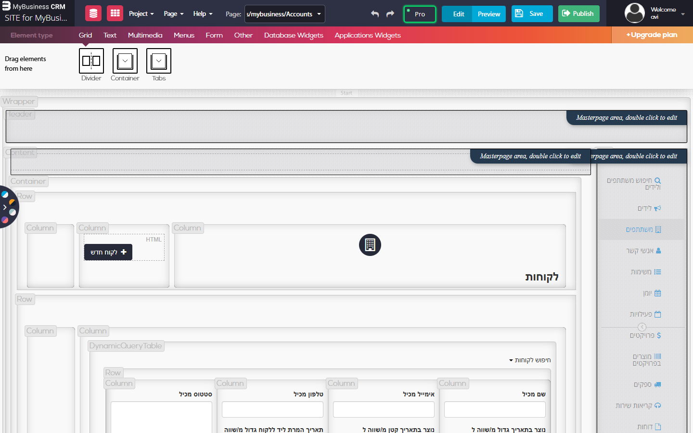

**Database Widgets palette** — the data-bound building blocks: Login, Register, OTP Login, OTP Register, User Profile, User Password, Logout, Pref. Menu, **Form to Database**, **Search Form**, **Data Table**, **Dynamic Table**, Data Gallery, **Chart**, **Counter**, Dynamic List, **Reports**:

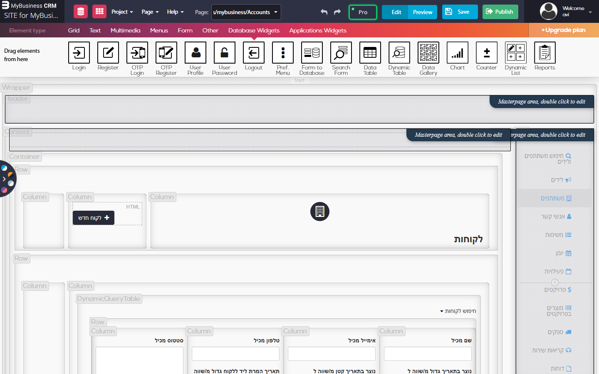

**Applications Widgets palette** — only Store widgets (eCommerce) in this tenant:

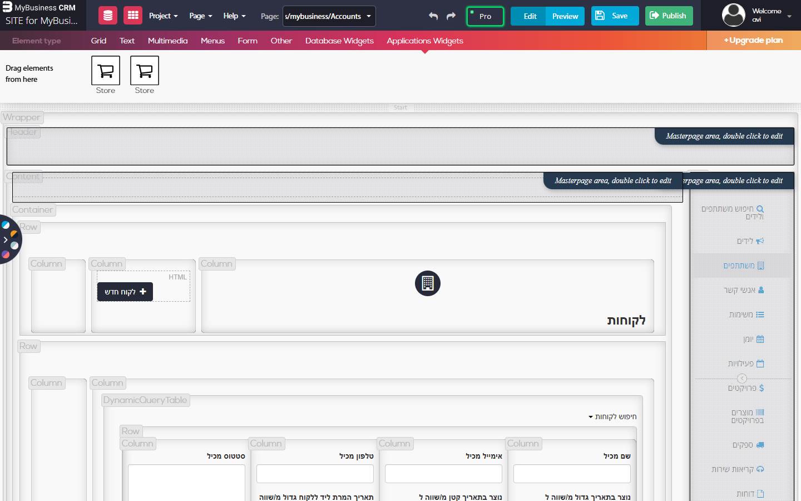

**Page menu** — Preview in new tab, **Page Settings**, **Versions** (page version history), and a Developers section: **JavaScript**, **CSS**, **Media queries** (per-page custom code):

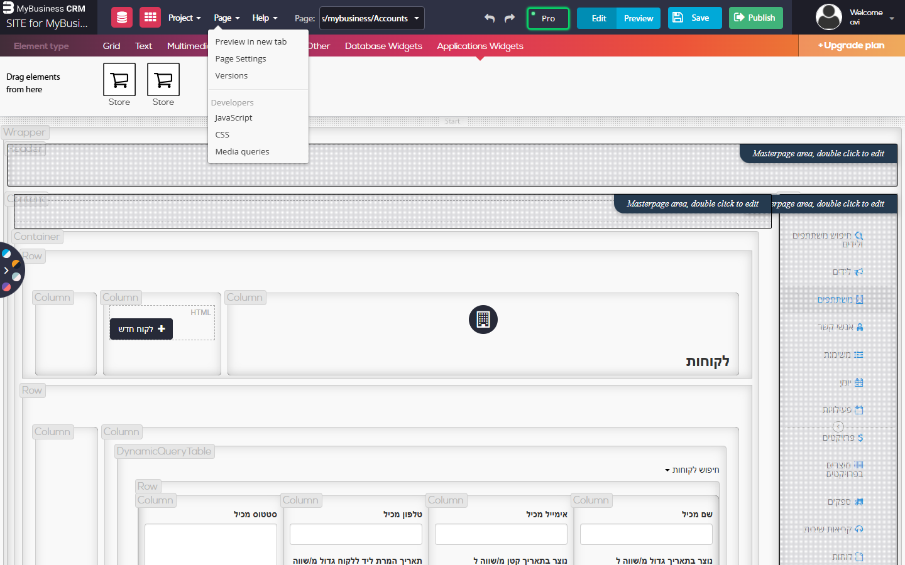

### Page Settings dialog

Tabs **General / Database / Advanced**:

- **General:** page URL (`apps/mybusiness/Accounts`), SEO title/keywords/description, meta tags, set-as-homepage.
- **Database:** **access control & data binding** — "Visible to logged in users only", "Allow access to the following roles" (role picker), "Redirect non login users to page" (login page), and **Dynamic pages** (page-per-record: based-on table + URL field).

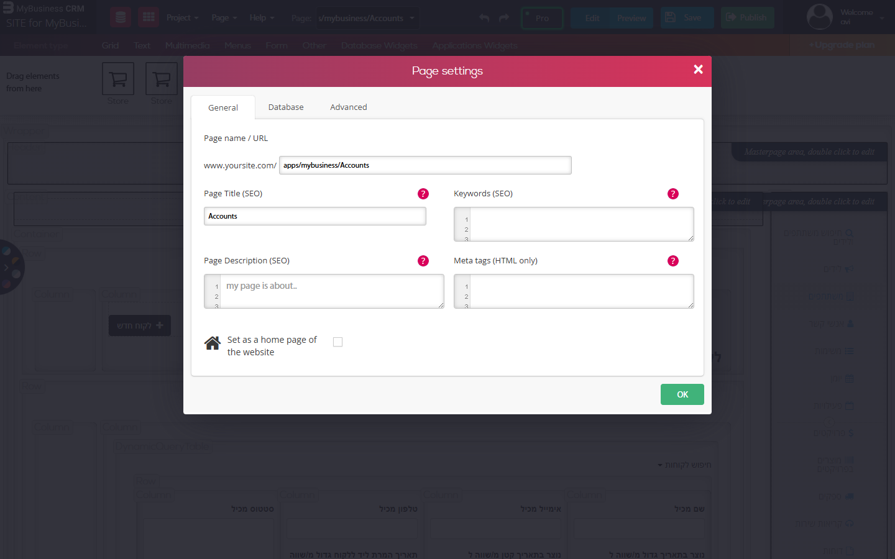
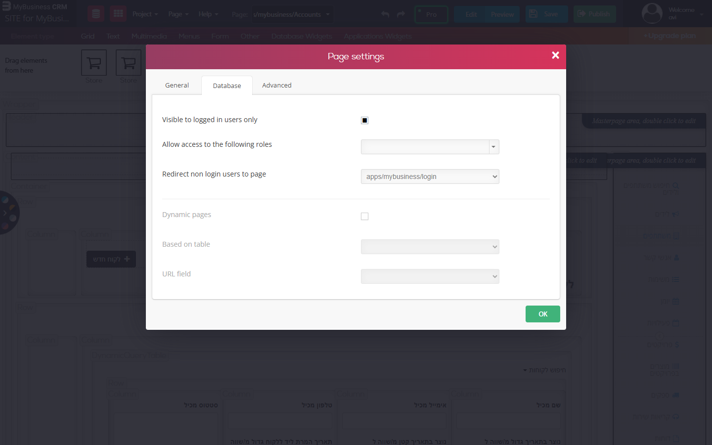

---

## 4. Database manager (Databases → DB For MyBusiness)

Reachable from the sidebar or the editor's DB icon → "Go to Database". URL carries the Parse application id: `siteadmin.mbapps.co.il/#database=<applicationId>`. Top tab bar: **Users · Roles · Tables · Workflows · Triggers · Templates · Security · Integrations · Settings**.

### 4.1 Users

User cards (name, role title, email, phone) with **colored role dots**; legend at the bottom maps colors to roles (Admin, Campaign Manager, College Admin, CRM, E-commerce Admin, Field Agents, Finance, Lead Admin, Lecturer, Managers, MyBooks Admin, MyChatAdmin, MyChatUser, Report Admin, Sales, Student Portal, Support). Search + "Active only" filter + **Create new User**. A special **Public** card represents the unauthenticated role.

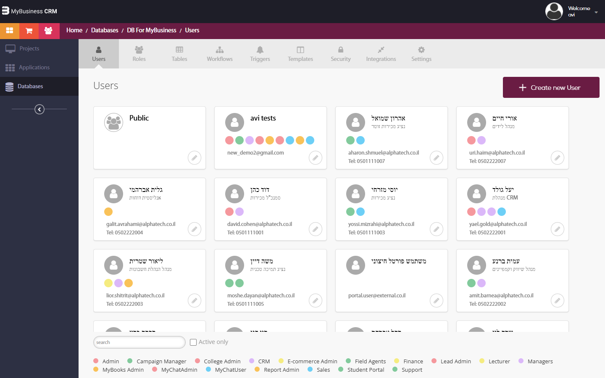

### 4.2 Roles

Card per role with color stripe, description (Hebrew or English) and ⚙ / 🗑. **Create new Role**. The Playground defines 17 roles spanning all modules.

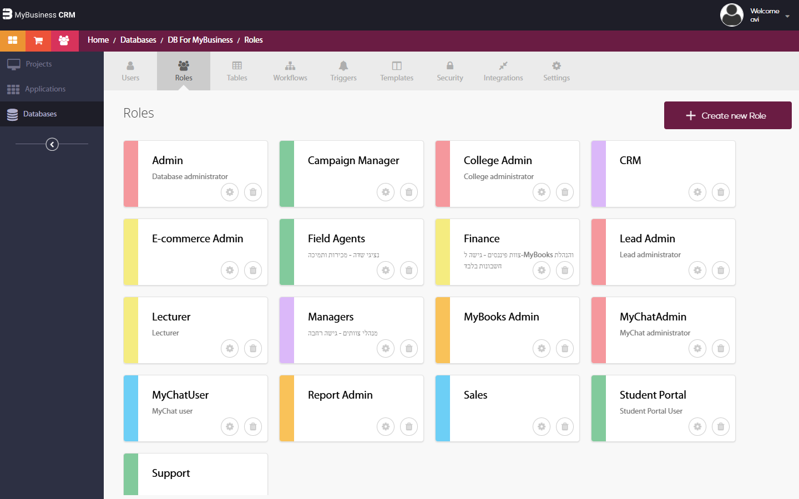

### 4.3 Tables

Card grid of **all** Parse classes — system tables (prefixed `_`: _User, _Role, _Timeline, _Dictionary, _DynamicQueries, _Notification, _syslogTriggers, _syslogEvents, _syslogSMS, _syslogCampaign*…) and business tables (Accounts, AccountingHeaders, …). Each card: ✏ open data browser, ⚙ table settings, 🗑 delete. **Create new Table**.

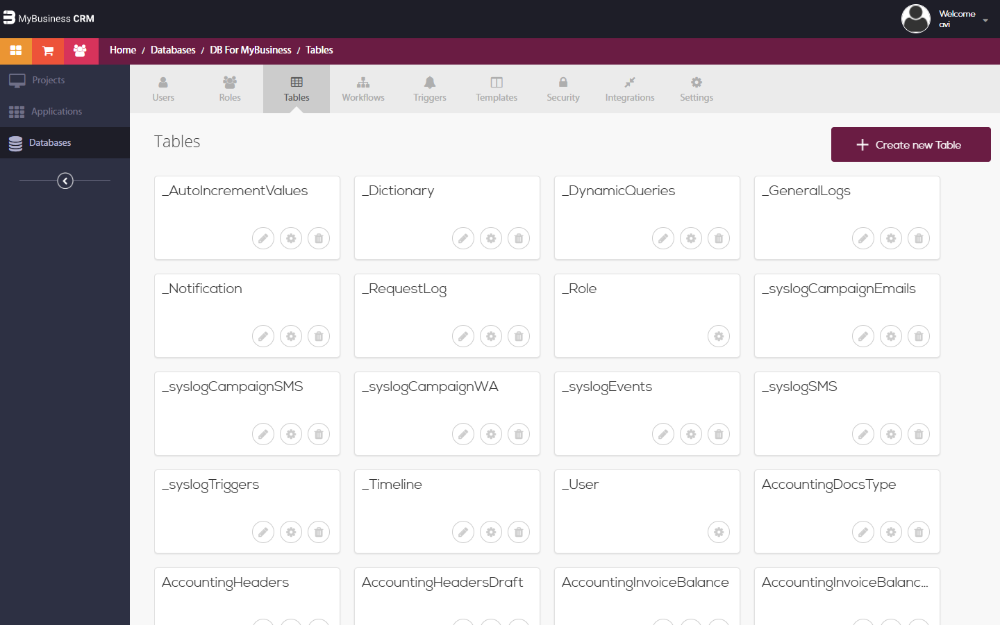

**Table data browser** (e.g. Tables > Accounts): spreadsheet-style grid with raw field columns (Id, createdAt, updatedAt, createdBy(_User), Email, F_name…), toolbar — Refresh, **Settings**, **Add row**, **Delete rows**, More, row count (240 rows), id lookup — plus **Import / Export** buttons and page size up to **2000** rows.

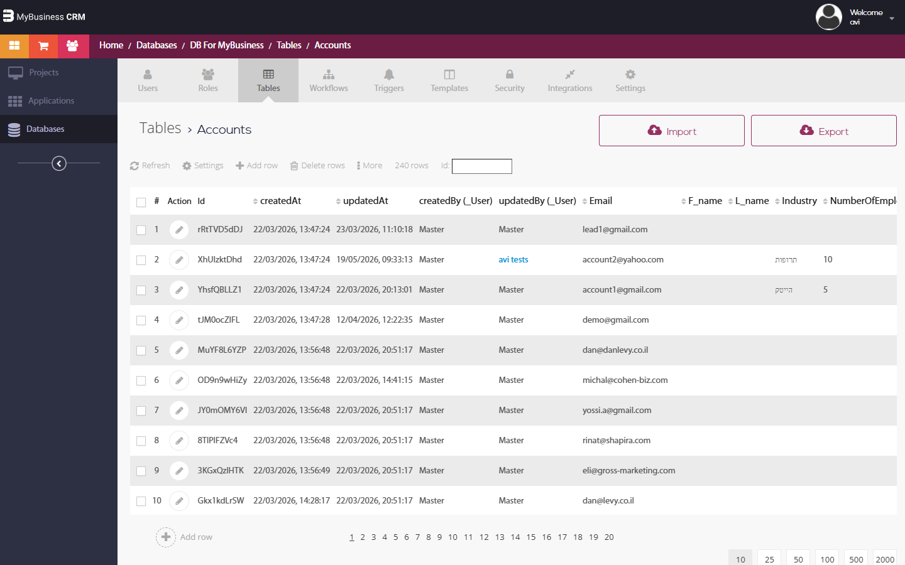

**Table settings modal** — tabs **Details / Fields / Permissions / Triggers**:

- **Fields:** add field (name, type dropdown, label = "translation in `_Dictionary` table" — this is where the Hebrew UI labels live) and the full field list with types: Boolean, String, Array, Array(Languages) — note the multi-select convention `array_languages_Pointer_Languages`, Pointer(Brands), HTML/XML…

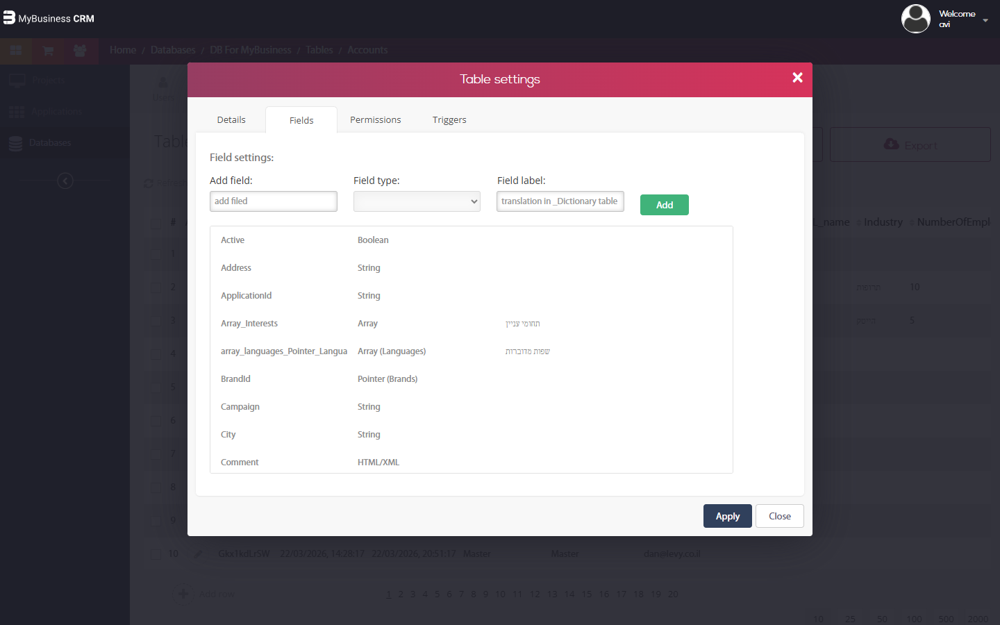

- **Permissions (CLP):** matrix of roles (or users — Roles/Users toggle) × operations **Find / Get / Create / Update / Delete / Advanced**, plus an **Advanced Permission** button. In the Playground only Admin and CRM have full access to Accounts.

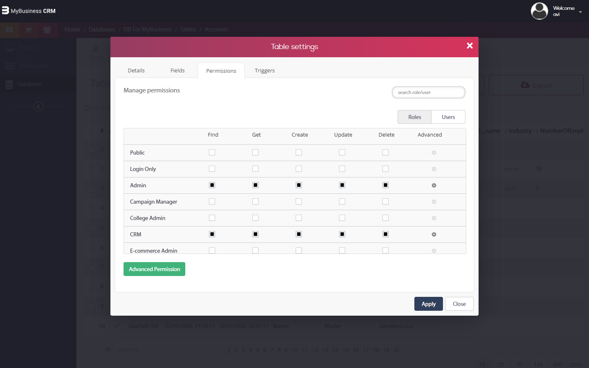

### 4.4 Triggers

Flat list of all automations: #Id, **Trigger class** (table), **Trigger name**, "Every update" flag, **Active** flag, edit/info actions. The Playground includes business triggers (Account Lead Status, Lead Conversion Date, Activity Reminder, inventoryUpdate), an SLA pack on Cases (SLA-Process rows), and test triggers incl. "server-side-code test".

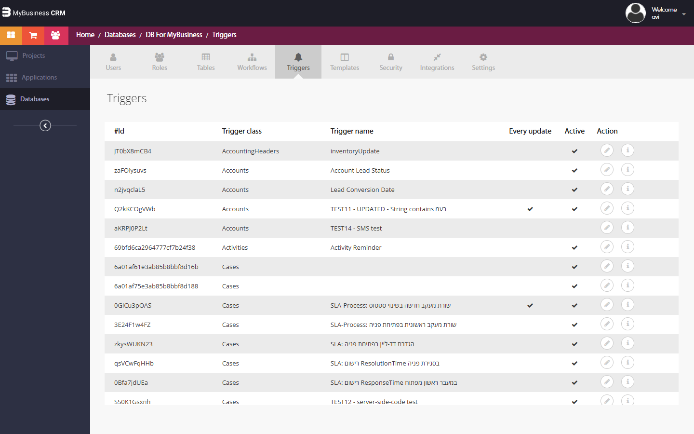

**Trigger editor:** Table, Id, Name, Active, **Event** (Create/Update), Execute "Every update", **On fields set** (field watch list), **Criterias** (condition rows, e.g. `IsAccount equal to true`), **Actions** list (typed actions, e.g. "Update Object – Accounts: LeadStatusId") with Add new criteria / Add new action.

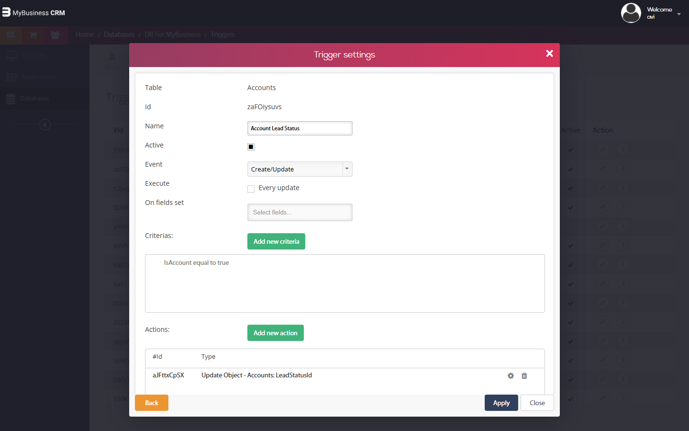

### 4.5 Workflows

Multi-step workflow feature (#Id, Name, Steps) — present but **empty** in the Playground.


### 4.6 Templates

PDF template list (quote templates incl. Hebrew-branded ones, Invoice / Invoice-EN / Invoice-Receipt / Receipt / Receipt-EN, plus design experiments) with **Create new Template**. These are the documents used by price quotes and MyBooks.

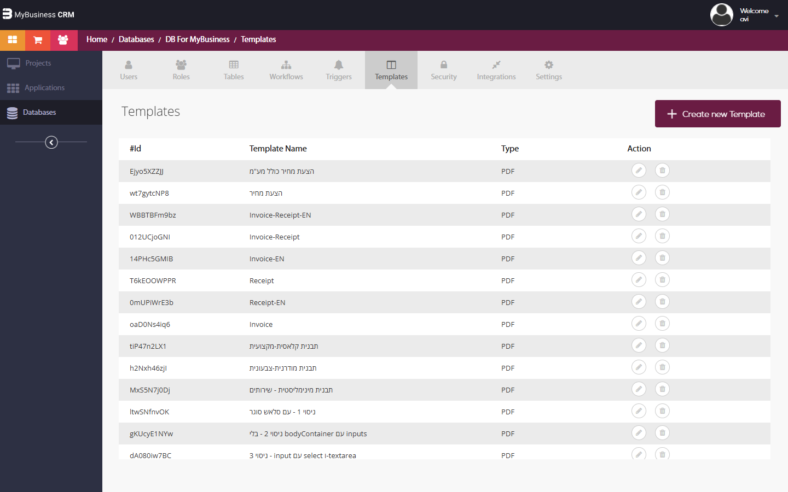

### 4.7 Security

Database-level security: **Log security events to database** (+ Event log dashboard link), **Restrict login by IP ranges**, **Restrict login by location** (country list), **2-factor authentication** (enforce toggle + SMS verification message template).

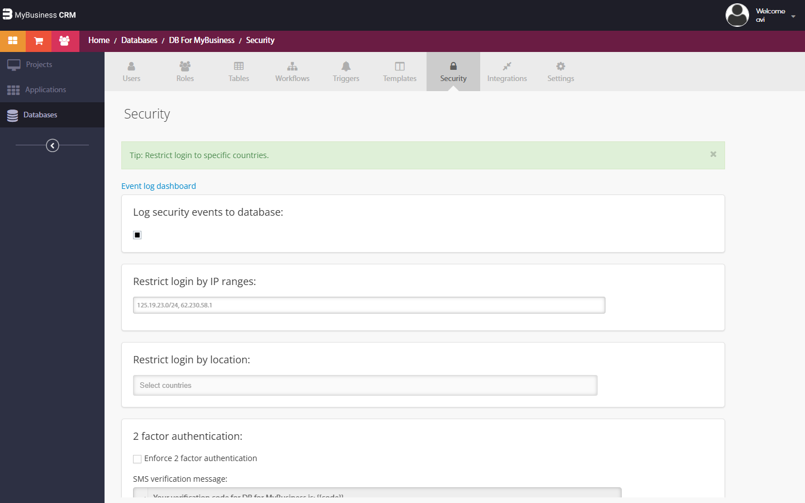

### 4.8 Integrations

Provider credential forms: **Mailgun** (email), **Plivo** (SMS), **Twilio** — set at database level.

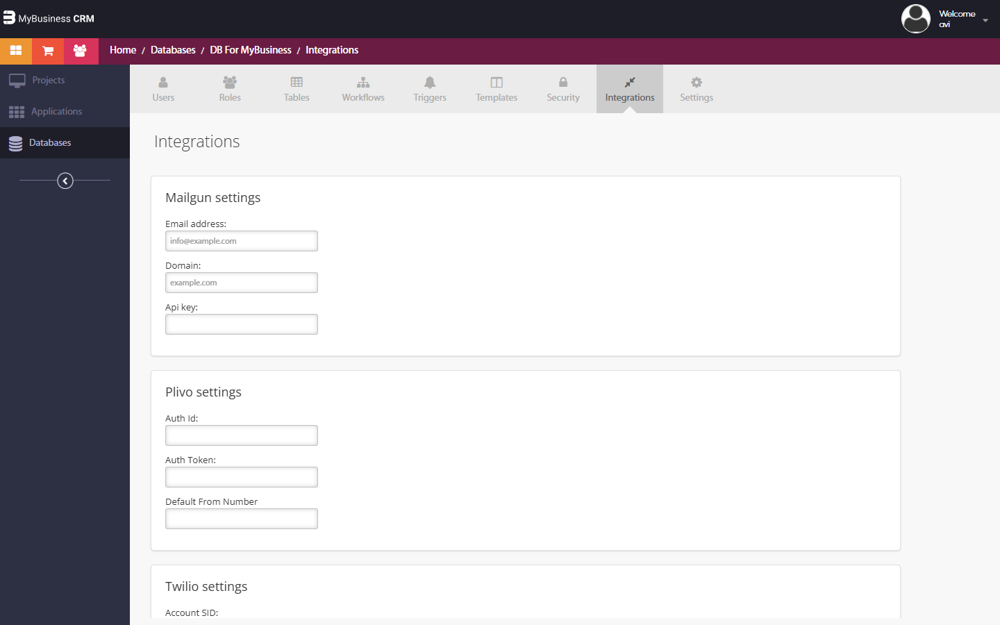

---

## 5. Applications screen

"My Business environment" — one card per installed module showing **version** (MyBusiness 4.4, mybooks 4.11, my campaing 1.11 — vendor naming as-is) and its wiring: *Connected Database: DB for MyBusiness, Connected Website: SITE for MyBusiness*. Cards for eCommerce, MyBooks, MyBusiness, MyCampaigns (+ MyChat, MyCollege, MyCommerce below the fold). **Add application** installs further modules. This screen is the clearest visualization of the architecture: **apps are versioned packages plugged into one shared database and one website project.**

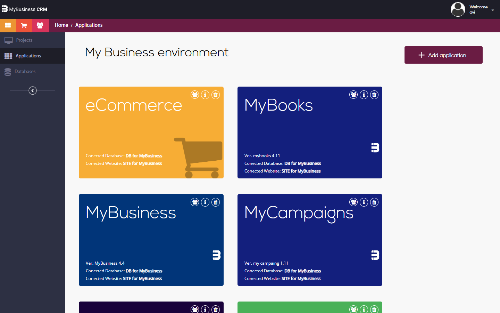

---

## 6. What implementers do in this UI vs. MCP/API

| Task | Admin/Builder UI | MCP / REST API |
|---|---|---|
| Page layout, sections, widgets | WebsiteDesign editor (drag & drop) + Save/Publish | `Edit-Page`, `Create-Form-Page`, `Create-Table-View-Page`, `Add-*-Element` |
| Per-page JS/CSS | Page menu → JavaScript / CSS | `Edit-Page-CSS-JS` |
| Page versions | Page menu → Versions | `Get-Page-Versions`, `Set-Page-Version` |
| Page access (roles, login-only, dynamic pages) | Page Settings → Database tab | `Set-Page-Settings` |
| Tables & fields | Tables → Table settings → Fields | `Create-Table`, `Add-Field-to-Table` |
| Field labels (Hebrew) | Fields tab ("translation in _Dictionary") | `Get/Set-Terminology-Dictionary`, `Replace-Terms` |
| CLP permissions | Table settings → Permissions | `Get/Set-Table-Permissions` |
| Data browse/import/export | Table data browser (Import/Export, up to 2000 rows/page) | `Get-Data`, `Create-Many`, `Update-Data`, Parse REST |
| Triggers | Triggers tab + editor (also embedded in runtime System-triggers page) | `Get-Triggers`, `Set-Trigger`, `Set-Trigger-Action` |
| Users & roles | Users / Roles tabs | `Create-or-Update-User`, `Create-Role`, `Add-Users-to-Role`, `Get-Packages`/`Set-Package-for-User` |
| Email/SMS provider keys | Integrations tab | `Get-SMTP-Accounts` (read) |
| PDF templates | Templates tab | `Create-Update-Price-Quote-Template` |
| **Form rules** (client-side field behavior) | **No dedicated UI found in this tour** (likely buried per-element in the editor) | `Get/Set/Edit-Form-Rules` — treat MCP as the canonical interface |
| **Reports definitions** | No report designer seen in admin; runtime page only runs reports | `Get-Reports`, `Create-or-Update-Report` |
| Menus | Pages & Menus → Menus tab | `Get-Menus`, `Get/Set-Menu-Items` |

---

## Limitations & gotchas

- **View-only discipline:** Save / Publish / Apply / OK were never pressed; dialogs were closed via X or Close. Screens marked "empty" (Workflows) reflect the Playground, not the product limit.
- **The builder opens tabs aggressively** — Pages → editor → database each spawn a new browser tab; the admin and the builder are separate SPAs (`siteadmin.mbapps.co.il/` vs `/WebsiteDesign`).
- **First entry to the editor shows a Welcome quick-tour overlay** that blocks the canvas until exited; automation must dismiss it.
- **Editing is locked to one concurrent editor per page** in practice (the runtime ערוך wrench and the builder hit the same editor) — back out without saving if a lock/warning appears. No lock was hit during this tour.
- **Masterpage regions are not editable from child pages** — you must open the master (`apps/mybusiness/CRMmaster`) itself; child pages show "Masterpage area, double click to edit" overlays.
- **Page Settings → OK applies immediately;** there is no separate save. Use X/Close to exit without changes (this tour did).
- **The page list mixes live and junk pages** (cart/checkout "unconnected pages", `_old_*`, `_test_*`, `_v2_*` copies) — page hygiene is the implementer's job; nothing prevents publishing a menu item to a test page.
- **Apps Pages tree ≠ menu** — pages exist independently of menu items; a page can be orphaned (no menu entry) but still publicly routable subject to its access settings.
- **Field labels are translations** stored in the `_Dictionary` table, not field names; renaming a label does not rename the underlying field — schema work must use field names (English) while the UI shows Hebrew.
- **Trigger list shows some unnamed triggers** (empty Trigger name on Cases rows) — name hygiene matters for supportability.
- **The admin is English-only** while the product is Hebrew-first; implementers must context-switch (and some vendor strings contain typos, e.g. "Conected Database", "my campaing").
- **Plan quotas are visible on the project card** (page views, storage, traffic) — the Playground runs on the Free plan; production behavior under quota pressure was not observed.
- **Could not verify** the Databases→Settings tab content and deeper Integrations entries (below Twilio) — not captured; and no dedicated form-rules UI was located anywhere in the admin during this tour.
