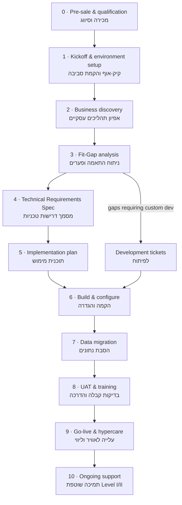

# Implementation Lifecycle — מחזור חיים של הטמעת לקוח

> **Purpose:** The end-to-end process for taking a new MyBusiness CRM customer from signed deal to stable production, with named deliverables, owners, and entry/exit criteria per phase.
> **Audience:** Implementers, developers, and AI agents who run pre-implementation and implementation work.
> **Last updated:** 2026-07-06 · **Status:** draft

---

## 1. Context: how MyBusiness implementations differ from enterprise CRM projects

MyBusiness CRM serves Israeli SMB customers with a compact vendor team plus AI agents. Implementations are measured in **days to a few weeks**, not months. The methodology below is deliberately lightweight: every phase produces exactly one named deliverable, and the technical spec is written so that most of it can be **executed directly via MCP tools** (no-code configuration) by a human or AI implementer, with only the custom-development residue going to developers via your implementation tracker (מערכת ניהול המשימות של הצוות).

**The four pre-implementation deliverables** (the subject of this methodology section):

| # | Deliverable (HE) | Deliverable (EN) | Template | Guide |
|---|---|---|---|---|
| 1 | מסמך אפיון תהליכים עסקיים | Business Discovery Document | [templates/discovery-questionnaire.he.md](templates/discovery-questionnaire.he.md) | [02-discovery-and-process-mapping.md](02-discovery-and-process-mapping.md) |
| 2 | ניתוח התאמה ופערים | Fit-Gap Analysis | [templates/fit-gap-template.csv](templates/fit-gap-template.csv) | [03-fit-gap-analysis.md](03-fit-gap-analysis.md) |
| 3 | מסמך דרישות טכניות | Technical Requirements Specification (TRS) | [templates/technical-spec-template.md](templates/technical-spec-template.md) | [04-technical-requirements-spec.md](04-technical-requirements-spec.md) |
| 4 | תוכנית מימוש | Implementation Plan | [templates/implementation-plan-template.md](templates/implementation-plan-template.md) | [05-implementation-plan.md](05-implementation-plan.md) |

---

## 2. Lifecycle overview

Phases 2–5 are the **pre-implementation block**; everything downstream consumes their outputs. In small (Low-complexity) deals, phases 3–5 can be merged into a single combined document, but all three questions must still be answered explicitly: *what fits, what gaps, who builds what, in what order*.

---

## 3. Phase reference

### Phase 0 — Pre-sale & qualification (מכירה וסיווג)
- **Owner:** CEO / sales.
- **Activities:** demo, understanding the vertical, package sizing (Business/Enterprise, user count), identifying decision maker and the **approver** (גורם מאשר — the person who must approve paid developments; record this early, it's used for the rest of the customer's life).
- **Output:** signed deal, selected package, named contacts.
- **Exit criteria:** package + user count known; primary contact + approver identified.

### Phase 1 — Kickoff & environment setup (קיק-אוף והקמת סביבה)
- **Owner:** implementer.
- **Activities:**
  - The vendor provisions the customer tenant (a new app, or a clone of a base/vertical template) — see [../00-overview/04-environments-and-access.md](../00-overview/04-environments-and-access.md).
  - Assign package and seats; create initial admin users.
  - Open the customer's ledger in your implementation tracker (מערכת ניהול המשימות של הצוות), titled with the customer name; contacts and approver go in its description (team convention — this ledger tracks the customer's developments for their whole lifetime).
  - Create the **customer folder** in the standard layout (`docs/` + `tasks/` + `profile/`) so support and AI agents can operate from day one. Credentials are provided to the session at runtime (never stored in files); the vendor provisions tenant access.
  - Schedule the discovery meeting.
- **Output:** working environment + verified access + tracker ledger + customer folder.
- **Exit criteria:** implementer can log in to the customer app; MCP access verified (`Get-Current-User`, `Get-Packages`).

### Phase 2 — Business discovery (אפיון תהליכים עסקיים)
- **Owner:** implementer (with AI support). Customer side: process owners per department.
- **Activities:** structured discovery meeting(s) using the [Hebrew questionnaire](templates/discovery-questionnaire.he.md); collect current tools, spreadsheets, sample documents; map processes; capture terminology preferences; identify data-migration sources.
- **Output:** **Business Discovery Document** — see [02-discovery-and-process-mapping.md](02-discovery-and-process-mapping.md) for method and required content.
- **Exit criteria:** customer validates the discovery document ("כן, ככה אנחנו עובדים"). Every core process has: actors, steps, entities, statuses, communications, and reports identified.

### Phase 3 — Fit-Gap analysis (ניתוח התאמה ופערים)
- **Owner:** implementer; developer consulted for anything tending toward custom code.
- **Activities:** map every discovery requirement against the [capability matrix](../80-capability-matrix/01-capability-matrix.md); classify each as Native / Config / Custom-JS / Custom-Server / External / Gap; sketch the solution per requirement; estimate effort class (see [06-estimation-guide.md](06-estimation-guide.md)); agree scope with the customer (including explicit deferrals).
- **Output:** **Fit-Gap workbook** (CSV/spreadsheet) + scope decision.
- **Exit criteria:** every requirement has a classification and effort class; customer (and approver, for paid items) signed off on scope.

### Phase 4 — Technical Requirements Specification (מסמך דרישות טכניות)
- **Owner:** implementer authors; developer reviews Custom-Server items; customer approves.
- **Activities:** translate every in-scope fit-gap line into an **executable spec**: tables/fields with exact types, pages with section layouts, table views with columns/filters, triggers with event-condition-action JSON, form rules, roles/permissions, terminology replacements, reports/dashboards, integrations, migration mapping. Each item carries acceptance criteria.
- **Output:** **TRS** — see [04-technical-requirements-spec.md](04-technical-requirements-spec.md).
- **Exit criteria:** an implementer (or AI agent) who never attended the meetings can build the system from the TRS alone; custom-dev items have tickets drafted in your implementation tracker.

### Phase 5 — Implementation plan (תוכנית מימוש)
- **Owner:** implementer.
- **Activities:** order the TRS items along the **canonical build order** (see [../30-customization/01-customization-overview.md](../30-customization/01-customization-overview.md)); assign owners (implementer / developer / AI agent); set milestones; define the test plan, training plan, migration window, and go-live checklist.
- **Output:** **Implementation Plan** — see [05-implementation-plan.md](05-implementation-plan.md).
- **Exit criteria:** dated milestones; every TRS item has an owner; customer knows what is expected from them (data files, approvals, training attendance).

### Phase 6 — Build & configure (הקמה והגדרה)
- **Owner:** implementer + AI agents (config), developers (custom).
- **Activities:** execute the TRS in build order, mostly via MCP tools; custom server functions developed in the `server-side-code` repo and wired through triggers; design/branding applied (quote templates, CSS); QA checklist generated and executed (the team has a QA-task generation practice — turn the TRS acceptance criteria into QA tasks).
- **Verification:** after each domain, re-query state (`Get-Schema`, `Get-Triggers`, `Get-Form-Rules`, `Get-Site-Pages`) and tick the TRS item.
- **Exit criteria:** all TRS items built and self-verified; custom-dev tickets in QA/Done.

### Phase 7 — Data migration (הסבת נתונים)
- **Owner:** implementer.
- **Activities:** per the TRS migration mapping: clean source files, import (bulk-import patterns — see [../30-customization/12-solution-blueprints.md](../30-customization/12-solution-blueprints.md)), link pointers, then **validate with counts** (`Count-Data` per table vs source row counts) and spot-check records.
- **Exit criteria:** counts match (or discrepancies explained and accepted in writing); customer spot-checked a sample.

### Phase 8 — UAT & training (בדיקות קבלה והדרכה)
- **Owner:** implementer; customer process owners execute.
- **Activities:** customer walks each core process end-to-end against the TRS acceptance criteria; defects triaged (config fix now vs dev ticket); role-based training sessions; admin training for the customer's power user.
- **Exit criteria:** acceptance criteria signed; users created with correct roles; training done.

### Phase 9 — Go-live & hypercare (עלייה לאוויר וליווי)
- **Owner:** implementer with developer on call.
- **Activities:** go-live checklist (see plan template): real comms channels switched on (SMTP senders, WhatsApp channel, web2lead endpoints pointed at production), scheduled triggers verified, first-day monitoring of `_syslogTriggers` / `_syslogEvents`, daily check-ins for the first week.
- **Exit criteria:** one full business cycle (e.g., lead → sale → invoice) completed in production without intervention.

### Phase 10 — Ongoing support (תמיכה שוטפת)
- **Owner:** support (Level I/II, increasingly AI-assisted).
- **Activities:** build/refresh the **customer profile** document so support agents have full context; change requests enter as mini fit-gap → spec → build cycles; developments tracked in the customer's tracker ledger.
- **Note:** the customer profile produced here is the long-term memory of the implementation — keep it current after every significant change.

---

## 4. Complexity tiers (and how they scale the process)

The team classifies customers by automation/integration complexity (a standing team convention):

| Tier | Definition | Process implications |
|---|---|---|
| **Low** | Internal triggers only (update/create-object, email/SMS) | Phases 3–5 may be one combined doc; ~days of work |
| **Medium** | + HTTP calls to mbapps services (Parse cloud functions) | Full 4 deliverables, light versions |
| **High** | + custom `server-side-code` functions | Developer joins phases 3–4; dev tickets mandatory |
| **Enterprise** | + external integrations (Make/Zapier, GCP services, external systems) | Full process, integration design section in TRS, staged go-live |

Real (anonymized) example of an Enterprise-tier configuration — לקוח Enterprise (סוכנות שיווק): campaign-source-based lead-routing triggers, a multi-department sale split into a child table, Zapier webhooks, cloud counting functions — all of which began life as discovery findings.

---

## 5. RACI snapshot

| Deliverable / activity | Implementer | Developer | CEO/Sales | Customer | AI agent |
|---|---|---|---|---|---|
| Discovery document | **R/A** | — | C | C (validates) | R (drafting, prep) |
| Fit-Gap | **R/A** | C (custom items) | I | C (scope sign-off) | R (matrix lookup) |
| TRS | **R/A** | R (custom sections) | I | A (approval) | R (spec drafting) |
| Implementation plan | **R/A** | C | I | I | R |
| Build (config) | **R** | — | — | — | **R** (MCP execution) |
| Build (custom) | C | **R/A** | — | — | C |
| Migration | **R/A** | C | — | R (source data) | R |
| UAT | C | C | — | **R** | C (QA task generation) |
| Go-live | **R/A** | C (on call) | I | R | C (monitoring) |

---

## 6. The deployed AI skill pipeline

This documentation package is the knowledge base for the **deployed** pre-implementation pipeline. Each stage consumes the previous stage's artifacts through fixed file contracts — the canonical artifact layout, filenames, and machine-readable state live in [07-pipeline-contract.md](07-pipeline-contract.md):

| Deployed skill | Phase | Role | Key docs it consumes |
|---|---|---|---|
| `business-discovery` | 2 | Produces the BRD + `req-register.csv` | 02 + questionnaire template, [10-modules](../10-modules/01-crm-core.md) |
| `myb-p-fit-gap` | 3 | Classifies every requirement against the capability matrix → fit-gap report + `fit-gap.csv` | 03 + [80-capability-matrix](../80-capability-matrix/01-capability-matrix.md), [80 known limitations](../80-capability-matrix/02-known-limitations.md), internal implementation evidence |
| `functional-spec` | 4–5 | Executable functional/technical spec + work plan + UAT checklist | 04 + 05 + spec template, [20-data-model](../20-data-model/01-data-model-overview.md), [30-customization](../30-customization/01-customization-overview.md), [40-integrations-api](../40-integrations-api/02-mcp-tools-catalog.md), [06-estimation-guide.md](06-estimation-guide.md) |
| `plan-summary-for-approval` | approval gate | Distills the pre-implementation deliverables into one executive approval summary; emits `approval.json` | all upstream deliverables, [07-pipeline-contract.md](07-pipeline-contract.md) |
| `build` | 6 | Executes the approved spec in the live tenant; **checks `approval.json` before its first write** | the spec set + [07-pipeline-contract.md](07-pipeline-contract.md) |

## Limitations & gotchas

- Durations per phase are intentionally not prescribed here — calibrate per complexity tier with the team; see [06-estimation-guide.md](06-estimation-guide.md).
- ⚠️ UNVERIFIED: the exact current division of labor between the human implementer and AI agents evolves quickly; the RACI shows the intended steady state.
- The approver (גורם מאשר) convention matters: paid developments approved by anyone else have historically caused friction — always capture the approver in the customer's tracker ledger and in the customer folder.
