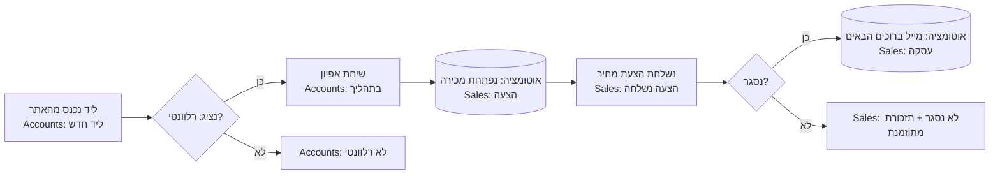

# Business Discovery & Process Mapping — אפיון תהליכים עסקיים

> **Purpose:** How to run discovery with a new customer and produce a Business Discovery Document that maps cleanly onto MyBusiness CRM constructs.
> **Audience:** Implementers and AI agents running phase 2 of the [implementation lifecycle](01-implementation-lifecycle.md).
> **Last updated:** 2026-06-10 · **Status:** draft

---

## 1. The goal, stated precisely

Discovery succeeds when you can answer, in writing, for each core business process:

1. **Who** acts (roles, departments, branch structure)?
2. **What** entities flow through the process (in the customer's own words — their nouns)?
3. **What states** does each entity pass through (statuses, pipeline stages), and what moves it between states?
4. **What happens automatically** vs manually at each transition (notifications, record creation, assignments)?
5. **What documents and communications** are produced (quotes, invoices, emails, WhatsApp, SMS)?
6. **What numbers** does management look at (KPIs, reports, dashboards)?
7. **What other systems** are involved (current tools, integrations, data sources to migrate)?
8. **What words** does the customer use (terminology — because the CRM will be renamed to match: מכירה→פרויקט etc.)?

Everything in the document must be phrased so that the next phase (fit-gap) can mechanically consume it.

## 2. Method

### 2.1 Before the meeting (preparation — largely automatable)

- Research the customer: website, domain, vertical. Identify the likely vertical pattern and pre-select the matching question pack.
- Review what similar customers configured (same file — verticals list named examples and their typical entity mappings).
- If the customer already has a partially configured app (migration from trial, or an existing customer expanding): run a mini-profile first — `Get-Schema` on Accounts, `Get-Site-Pages`, `Get-Triggers`, `Get-all-Users`, `Get-Packages` — so the meeting discusses deltas, not basics.
- Prepare the questionnaire: [templates/discovery-questionnaire.he.md](templates/discovery-questionnaire.he.md), pruned to the vertical.

### 2.2 The discovery meeting(s)

Run in Hebrew. One meeting (60–90 min) for Low/Medium customers; two for High/Enterprise (second one for integrations/edge cases with the technical contact). Structure:

| Segment | Time | What you extract |
|---|---|---|
| Business overview | 10 min | What they sell, to whom, team size, branches |
| Core flow walkthrough ("ספרו לי על לקוח מהרגע שהוא מגיע") | 25 min | The primary process end-to-end, in their words — capture nouns, verbs, statuses |
| Secondary flows | 15 min | Service/support, billing, marketing, operations |
| People & permissions | 10 min | Who sees what, manager-vs-rep boundaries, sensitive data |
| Communications & documents | 10 min | What gets sent, when, on which channel; sample documents collected |
| Reporting | 10 min | "What do you check every morning / every month?" |
| Systems & data | 10 min | Current tools, spreadsheets to migrate, integrations they expect |

**Interview discipline:**
- Always ask for **volumes** (how many leads/month, how many open cases at once, how many users). Volumes drive design choices (views, dashboards, archiving) and package sizing.
- Always ask for **exceptions** ("ומה קורה אם הלקוח לא משלם / מבטל / לא מגיע?") — exceptions become statuses, triggers, and scheduled reminders.
- Collect **artifacts**: current spreadsheets, a sample quote/invoice, an example WhatsApp message they send today. Artifacts beat answers.
- When the customer describes a wish ("הייתי רוצה שכל ליד מהאתר ייכנס לבד"), record it as a **requirement** with their priority (must/nice), not as a promise.

### 2.3 Synthesis: translate to CRM constructs

This is the core skill. Every discovery fact lands in one of these buckets, using this mapping table:

| The customer says... | CRM construct | Where it goes in the TRS later |
|---|---|---|
| A noun that flows through a process ("תלמיד", "תיק", "פרויקט") | **Entity** → existing table (Accounts/Sales/Cases/...) possibly **renamed**, or a **custom table** | Schema §, Terminology § |
| A property of a noun ("לכל תיק יש שופט") | **Field** (typed: text/number/date/pointer/boolean/multi-select) | Schema § |
| "X belongs to Y" / "לכל לקוח כמה תיקים" | **Pointer** relationship (+ related-records widget on the parent card) | Schema §, Pages § |
| Stages a noun passes through ("ליד → שיחה → פגישה → עסקה") | **Status field / pipeline stages** (lookup table) | Schema §, Pages §, possibly parent-child statuses |
| "When X happens, Y should happen" | **Trigger** (event + conditions + actions) | Automations § |
| "Remind us if nothing happened for N days" | **Scheduled trigger** on a date field | Automations § |
| "This field is only relevant when..." / "must be filled" | **Form rule** (hidden/required/readonly/fixed-value...) | Form rules § |
| "Only managers may see/edit..." | **Role + CLP table permissions** | Permissions § |
| "We send the customer a..." | **Email/SMS/WhatsApp action** (trigger or campaign) + template | Automations §, Messaging § |
| "We issue a quote/invoice/receipt" | **Price-quote template / MyBooks document type** | Documents § |
| "Leads arrive from our website/landing pages" | **web2lead / web2table** endpoint | Integrations § |
| "We need to see, every morning..." | **Dashboard counter/chart** or **report** | Reports § |
| "We work with system X" | **Integration** (webhook out, cloud function, Make/Zapier, or gap) | Integrations § |
| "Today it's all in this Excel" | **Migration source** (file → table mapping) | Migration § |
| Their word for a CRM concept | **Terminology replacement** (Replace-Terms) | Terminology § |

Two practical rules learned from real implementations:

- **Prefer renaming standard entities over creating custom tables.** The standard entities (Accounts, Sales, Cases, Tasks, Activities) carry module behavior (pipeline, timeline, calendar, billing links) that custom tables don't get for free. A "פרויקט" is usually a renamed Sale; a "משתתף" is usually a renamed Account. Create a custom table only when the noun is genuinely a different shape (e.g., apartments, vehicles, courses sessions) — see [../30-customization/02-tables-and-fields.md](../30-customization/02-tables-and-fields.md).
- **Statuses are lookup tables, not free text.** Capture the exact stage list and their order in the meeting; ask which stages are "terminal" (closed-won/lost equivalents) — triggers and reports hang off these.

### 2.4 Process mapping notation

Use one mermaid flowchart per core process in the Discovery Document. Convention: rectangles = manual steps, rounded = automatic steps, diamonds = decisions; annotate the entity+status in each node.

### 2.5 Validation

Send the customer the document (or walk through it on a short call) and get explicit confirmation per process map. Unconfirmed discovery is the #1 source of rework in phase 6.

## 3. Required content of the Business Discovery Document

Use this checklist; the [questionnaire template](templates/discovery-questionnaire.he.md) collects the raw answers in the same order.

1. **פרטי הלקוח** — business, vertical, team, branches, contacts incl. גורם מאשר.
2. **מילון מונחים של הלקוח** — their words → CRM entities (seed of the terminology plan).
3. **ישויות ונתונים** — entity list with: name (HE), maps-to (standard table renamed / custom table), key fields, relationships, expected volumes.
4. **תהליכי ליבה** — per process: mermaid map + narrative + actors + status list + automation wishes.
5. **משתמשים והרשאות** — user list with roles; visibility rules; sensitive fields.
6. **תקשורת ומסמכים** — outbound messages (channel, trigger moment, sample text), documents issued (with samples collected), sender accounts (SMTP/WhatsApp availability).
7. **דוחות ומדדים** — daily/weekly/monthly KPIs, per audience (rep/manager/CEO).
8. **מערכות ואינטגרציות** — current stack, what stays, what's replaced, expected integrations + direction of data flow.
9. **הסבת נתונים** — sources, formats, volumes, owner on customer side, data-quality notes.
10. **אילוצים והעדפות** — branding (for quote templates), language, working hours (relevant for SLA/scheduled triggers), regulatory constraints.
11. **רשימת דרישות ממוספרת** — every requirement extracted above, numbered `REQ-001...`, each with priority (must/should/nice) and source (who said it). **This numbered list is the direct input to fit-gap.**

## 4. Worked micro-example (marketing agency, abridged)

Discovery findings → constructs (real pattern from the installed base):

| Finding | Construct |
|---|---|
| "כל ליד מגיע מקמפיין עם UTM ושייך למחלקה" | Fields on Accounts: `UTMSource` (Pointer), `UTMCampeign`, `UTMDepartment` (Pointer); trigger: route/assign by UTMDepartment |
| "מכירה נוגעת בכמה מחלקות במקביל" | Child table `SaleDepartments`, auto-created rows per department on sale creation (trigger), rollup booleans on Accounts |
| "כשנסגרת עסקה — מייל פנימי + מייל ברוכים הבאים" | Trigger on Sales: condition SaleStatus=עסקה, actions: email ×2 |
| "ליד שלא טופל 48 שעות — התראה למנהל" | Scheduled trigger on Accounts.updatedAt +48h, condition status="ליד חדש" |
| "מסנכרנים נתוני קמפיינים לכלי BI חיצוני" | Webhook (Zapier) on status change — External integration class |

## Limitations & gotchas

- Discovery documents written in English get rejected by Israeli SMB customers — the customer-facing document is **Hebrew**; only the internal construct annotations are English.
- Don't promise solution shapes during discovery (that's fit-gap's job) — record needs, not designs, even when the design seems obvious.
- Watch for the "Excel mirror" trap: customers often ask to replicate their spreadsheet 1:1. Capture the spreadsheet as a migration source and a field inventory, but model the *process*, not the sheet.
- If the customer can't articulate statuses, derive a draft from their examples and validate — never leave a core entity without a status model.
