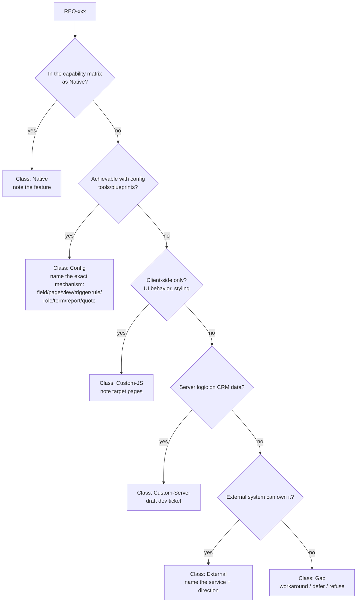

# Fit-Gap Analysis — ניתוח התאמה ופערים

> **Purpose:** How to classify every discovery requirement against MyBusiness CRM capabilities and produce a fit-gap workbook that drives scope, effort, and the technical spec.
> **Audience:** Implementers and AI agents running phase 3 of the [implementation lifecycle](01-implementation-lifecycle.md).
> **Last updated:** 2026-07-06 · **Status:** draft

---

## 1. Inputs and output

**Input:** the numbered requirement list (`REQ-001...`) from the [Business Discovery Document](02-discovery-and-process-mapping.md), each with priority (must/should/nice).

**Output:** the **fit-gap workbook** — one row per requirement, fully classified — plus a one-page scope summary the customer signs. Template: [templates/fit-gap-template.csv](templates/fit-gap-template.csv).

## 2. The classification ladder

Every requirement gets exactly one **solution class**. The ladder is ordered by cost/risk — always try to satisfy a requirement at the *highest* (cheapest) rung that genuinely works:

| Class | Definition | Who builds | Typical effort | Examples |
|---|---|---|---|---|
| **Native** | Works out of the box; at most flip a setting | — | minutes | Pipeline view on Sales; calendar on Activities; case timeline; Excel export from a view |
| **Config** | No-code configuration via UI/MCP tools: fields, pages, views, dashboards, reports, triggers, form rules, roles/CLP, terminology, quote templates, menus | Implementer / AI agent | minutes–hours per item | Custom fields; renamed entities (מכירה→פרויקט); status-change email trigger; manager-only field via CLP; SLA blueprint |
| **Custom-JS** | Page-level JavaScript/CSS (`Edit-Page-CSS-JS`) — client-side behavior beyond form rules, custom widgets, styling | Implementer with dev review | hours | Custom validation across fields; computed UI elements; branded page styling |
| **Custom-Server** | A server-side function in the `server-side-code` repo, wired via trigger (`server-side-code` action or HTTP to `api.mbapps.co.il/functions/<appId>/<fn>`) | Developer (dev ticket) | days | Complex calculations across tables; payment-gateway calls; dedup logic; CDR/telephony ingestion |
| **External** | Outside service does the work: Make/Zapier scenario, GCP function, external system reached by webhook | Developer/implementer + external tool | days, plus running costs | BI sync via Zapier; AI lead-scoring on GCP; sync with a government registry |
| **Gap** | Cannot be satisfied acceptably today | — | n/a — needs workaround, deferral, or product roadmap item | See [known limitations](../80-capability-matrix/02-known-limitations.md) |

The class maps directly to the customer **complexity tier** (Low = nothing below Config; Medium = + mbapps HTTP functions; High = + Custom-Server; Enterprise = + External), which in turn scales the rest of the process.

## 3. Classification procedure (per requirement)

Procedure notes:

1. **Look it up, don't guess.** Check the [capability matrix](../80-capability-matrix/01-capability-matrix.md) first, then the relevant detail doc. If the matrix lacks the row, check [solution blueprints](../30-customization/12-solution-blueprints.md) — many "hard" asks (SLA, cascading dropdowns, multi-select, timestamp audit, web2lead) are solved patterns.
2. **Check the limitation list before promising Config.** Several mechanisms have sharp edges that change the class (e.g., trigger chains max 3 levels; `Set-Form-Rules` replaces all rules; aggregate groupby must be String; Get-Data caps). See [known limitations](../80-capability-matrix/02-known-limitations.md).
3. **Solution sketch is mandatory** for Config and below: one line naming the exact mechanism ("scheduled trigger on Cases.NextStepDate +6h → email to OwnerId"), not "we'll automate it". If you can't write that line, you haven't classified it.
4. **Custom-Server and External require a developer's nod** during this phase — a 5-minute consult prevents a mis-sold week.
5. **Gaps get one of three resolutions, in writing:** workaround (describe it + its cost in friction), deferral (parked, revisit date), or descoped (customer informed). A gap without a resolution line is an unmanaged risk.

## 4. Workbook columns

The authoritative schema is `myb-p-fit-gap` `references/output-spec.md` §2; this doc is method background. The CSV template carries these 17 columns — keep them all, they feed later phases mechanically:

| Column | Content | Consumed by |
|---|---|---|
| `REQ ID` | from discovery | traceability |
| `Process` | which core process it belongs to | TRS grouping |
| `Requirement (HE)` | customer-language statement | customer sign-off |
| `Priority` | Must / Should / Nice | scope negotiation |
| `Class` | Native / Config / Custom-JS / Custom-Server / External / Gap | tiering, plan |
| `Disposition` | empty, or Process-change / Defer(date) / Workaround / Descope | gap register, scope summary |
| `Solution sketch` | exact mechanism, one line | TRS authoring |
| `Evidence (matrix/blueprint/demo)` | the citation backing the class — matrix row title, blueprint #, or "demo: works-as-is"; **mandatory, no exceptions** | review, audit |
| `Components` | tables/pages/triggers/... touched | build order, plan |
| `Effort` | S / M / L / XL (see [estimation guide](06-estimation-guide.md)) | plan, quote |
| `Owner` | Implementer / AI / Dev / External | plan |
| `Dev-consult` | whether a developer consult/approval is required for this row | review |
| `Risk/Limitations` | limitation references, open questions | review |
| `Decision` | In scope / Phase 2 / Workaround / Out | scope summary |
| `Phase` | delivery phase for in-scope items | plan |
| `Actual effort` | empty at authoring — filled at build completion (per-REQ rollup) | estimation calibration |
| `Variance note` | explanation when actual effort diverges from the estimate | estimation calibration |

## 5. Worked example rows

| REQ | Requirement (HE) | Priority | Class | Solution sketch | Components | Effort | Owner |
|---|---|---|---|---|---|---|---|
| REQ-004 | ליד מהאתר נכנס אוטומטית למערכת | Must | Config | web2lead endpoint + field mapping from the site form | web2lead, Accounts fields | S | Implementer |
| REQ-007 | מכירה בסטטוס "עסקה" שולחת מייל ברוכים הבאים | Must | Config | Trigger on Sales update, condition SaleStatus=עסקה, action email (template) | Trigger, SMTP | S | Implementer/AI |
| REQ-011 | לכל סוג פנייה סטטוסים משלו | Should | Config | Parent-child pointer fields (Define Parent) on Cases | CaseTypes, CaseStatuses tables, Cases form | S | Implementer |
| REQ-015 | זמן תקן לטיפול בפנייה לפי שעות עבודה וחגים | Must | Config (blueprint) | SLA blueprint: SLASettings/BusinessHours/CaseStates + triggers + card widget + 3 reports | per blueprint | L | Implementer + AI |
| REQ-019 | חישוב עמלות סוכנים לפי מדרגות | Must | Custom-Server | Server function computing tiered commissions on sale close; trigger-invoked | server-side-code fn, Sales fields | XL | Dev (ticket) |
| REQ-022 | סנכרון נתוני מכירות ל-Power BI | Nice | External | Zapier/Make webhook on Sales status change → BI dataset | Trigger (http), Zapier | M | Dev + external |
| REQ-025 | עריכת מסמך Word בתוך המערכת | Nice | Gap | Not supported in-product; workaround: generate via quote templates/PDF or external editing | — | — | — (workaround documented) |

## 6. Scope negotiation

Plot Priority × Effort. The conversation with the customer follows three default rules:

- **Must + (S/M)** → in scope, phase 1.
- **Must + (L/XL)** → in scope but challenge the requirement first: can a blueprint or a leaner variant satisfy the underlying need? This is where most over-engineering is born.
- **Should/Nice + (L/XL)** → propose Phase 2 (post-go-live), recorded in the workbook with a revisit date — not silently dropped.

Paid custom development (Custom-Server, External) must be approved by the customer's **גורם מאשר** explicitly, item by item — this is a standing team convention.

## 7. Exit criteria

- Every REQ row has Class, Evidence, Solution sketch (where applicable), Effort, Owner, Decision.
- Gap rows have a written resolution.
- The scope summary (counts per class + total effort + phase split) is acknowledged by the customer.
- Custom-Server/External rows have draft tickets in the customer's ledger in your implementation tracker.

## Limitations & gotchas

- The capability matrix is a living document — when you discover a capability or limitation not listed, **update the matrix in the same sitting**; the next fit-gap inherits your findings.
- Beware "Config in theory, Custom in practice": a requirement satisfiable by 14 interlocking triggers is usually better served by one server function — judge by maintainability, not only by class.
- Trigger-heavy designs must respect the **3-level chain limit** and idempotency (one-time flags pattern) — see [../30-customization/06-triggers-and-automations.md](../30-customization/06-triggers-and-automations.md).
