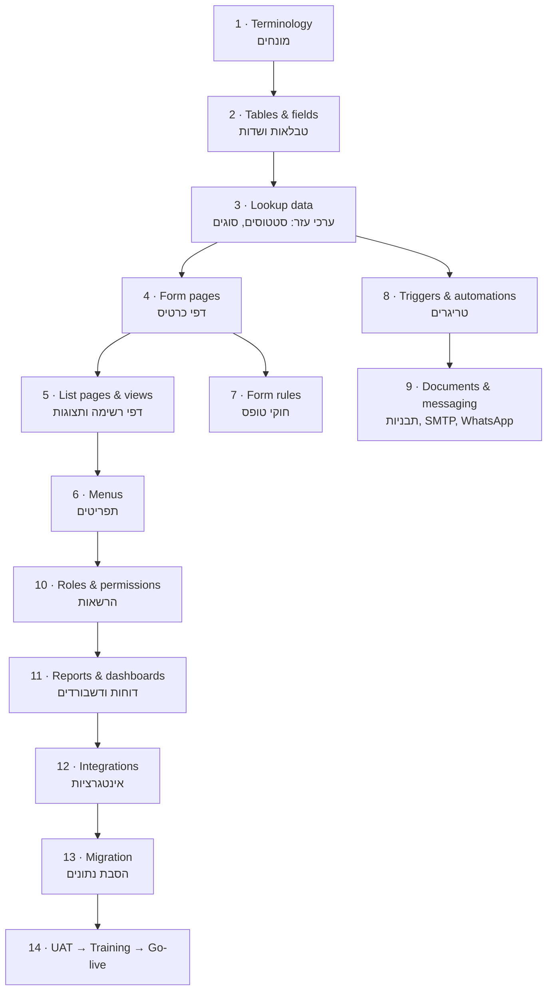

# Implementation Plan — תוכנית מימוש

> **Purpose:** How to convert an approved TRS into a sequenced, owned, verifiable build plan through go-live.
> **Audience:** Implementers and AI agents running phase 5 of the [implementation lifecycle](01-implementation-lifecycle.md); developers for their work packages.
> **Last updated:** 2026-06-10 · **Status:** draft

---

## 1. The canonical build order (and why it matters)

Dependencies in MyBusiness are real: pages bind to tables, views reference fields, triggers reference fields/templates/users, form rules reference fields on pages, dashboards reference views/reports, menus reference pages. Build out of order and you build twice. The canonical order:

Practical notes on the order:

- **Terminology first** — so every page, view, and message you create already displays the customer's language; retro-renaming costs a full review pass.
- **Lookup data before pages and triggers** — status/type tables must contain their final values (with stable objectIds) because triggers and form-rule conditions reference those objectIds.
- **Triggers after pages; decide each import's trigger behavior explicitly** — verified platform behavior (live test 2026-06-10): **triggers fire on API/master-key writes too**, so a bulk import fires automations by default — a thousand-row load can mass-send emails and mass-create child rows. Per import choose one: (a) run with `Create-Many(skipTriggers: true)` and compute trigger-derived fields (timestamps, counters, child rows, SLA stamps) inside the import per the TRS migration mapping, or (b) deliberately let triggers run (e.g., to build SLA tracking rows) after deactivating notification-type triggers for the window. Re-verify trigger state after migration either way.
- **Permissions late but before UAT** — building under admin rights is faster; UAT must run under real role permissions.
- **Custom-Server functions develop in parallel** from day 1 (longest lead time) and integrate at step 12.

## 2. Plan structure

Use the [plan template](templates/implementation-plan-template.md). A plan has:

1. **Work packages** — TRS items grouped by build-order step, each package with: items (TRS IDs), owner (Implementer / AI / Dev / External), prerequisite packages, effort roll-up, verification step.
2. **Milestones** — typically: M1 environment+schema ready · M2 pages/views navigable (clickable system) · M3 automations live · M4 migration done · M5 UAT passed · M6 go-live. Date each.
3. **Customer dependencies** — data files, logo/branding, WhatsApp business approval, DNS/SMTP records, approver availability — each with a due date; these are the most common slip cause.
4. **Test plan** — the TRS acceptance criteria, grouped into QA tasks (generate the QA checklist from ACs; the team practice is to hand QA tasks as a detailed list).
5. **Training plan** — sessions per role (reps, managers, admin), each mapped to the processes that role runs.
6. **Go-live checklist** — see §4.
7. **Risk register** — short: dependency risks, data-quality risks, custom-dev schedule risk, each with mitigation.

## 3. Environment strategy

- **Default:** build directly in the customer's app (it's pre-production until go-live). Single environment keeps objectIds stable for triggers/conditions.
- **Risky experiments** (novel mechanisms, heavy JS, anything you might need to throw away): prototype in the Playground app first, then re-create cleanly in the customer app. Page/trigger configs do not "merge" across apps — treat the prototype as a spec, not as portable artifacts.
- **Existing live customers** (expansion projects): never develop on live data during business hours for anything touching triggers or permissions; use a cloned app (the tenant-clone op) for destructive rehearsal, especially migration rehearsal.

## 4. Go-live checklist (baseline — extend per customer)

- [ ] All TRS items verified (each AC ticked, by whom, when)
- [ ] Real users created, roles assigned, passwords delivered securely; seats match package
- [ ] SMTP sender(s) verified (test email received); SPF/DKIM guidance given if custom domain
- [ ] WhatsApp channel connected and template(s) approved; test message exchanged (remember `Identity`, not objectId)
- [ ] web2lead/web2table endpoints switched to production form(s) and a test lead arrived end-to-end
- [ ] Scheduled triggers reviewed: correct date fields, offsets, and recipients; no leftover test recipients
- [ ] Notification triggers re-enabled after migration; one-time flags reset where used
- [ ] Migration counts signed (`Count-Data` vs source counts, per table)
- [ ] Dashboards/reports show sane numbers on real data
- [ ] Support handoff: customer profile built (`the client-profile step` flow), CLAUDE.md + folder updated, Jira epic groomed
- [ ] Hypercare window scheduled (daily check-ins week 1; monitor `_syslogTriggers`/`_syslogEvents` for errors)

## 5. Verification discipline during build

After every package: **query state, don't trust memory** — `Get-Schema` after schema work, `Get-Triggers` after automations, `Get-Form-Rules` after rules, `Get-Site-Pages`/`Get-Page-Content` after pages, then tick TRS items with a timestamp. The tick-list lives in the plan document and is the single source of build truth — it is also what makes a mid-project handoff (human↔AI) possible.

## Limitations & gotchas

- Plans fail on customer dependencies more than on build effort — chase the dependency list from day 1, not at the milestone.
- Don't schedule UAT immediately after migration; leave a buffer day for count reconciliation and trigger re-enablement.
- Training before UAT (not after) increases UAT quality — users who know the system find real defects instead of usability questions.
- For Enterprise-tier customers, stage go-live per module (CRM core first, billing/integrations second) rather than big-bang.
